# Paper Study Notes

A repository for organizing and summarizing papers I have read.

---

## Paper List

<details>
<summary><b>1. Dynamic Self-Righting of Planar-Based Objects on Dual Supports and its Implications for Robotic Object Placement</b></summary>

## Basic Information

- **Title**: Dynamic Self-Righting of Planar-Based Objects on Dual Supports and its Implications for Robotic Object Placement
- **Authors**: Seunghwa Oh, Woosung Lim, Joonyoung Kim, Taewoon Kang, Seung-Joon Yi, Jungwon Seo
- **Conference / Journal**: IEEE Robotics and Automation Letters (RA-L)
- **Year**: 2025

---

## One-line Summary

- 로봇의 센서 제어나 동작보다는 로봇이 잡았다 놓으려는 물체가 어떠한 특성(곡률, 무게중심)을 가지고 있느냐에 따라 물체가 바로 서냐 안 서냐를 탐구한 논문임. 소프트웨어적인 조작이나 제어보다는 각 물체의 특성을 고려하고 제작하여 실제 실험과 추후 시뮬레이션을 진행하였음. 논문에서는 로봇의 제어보다는 물체의 특성을 고려하여 '내가 생각한 로봇 제어'와는 거리가 다소 있겠으나, 동역학적인 내용임에도 불구하고 큰 거부감은 없었고, 로봇 제어의 객체를 분석하는 연구도 필요성은 있다고 생각이 들었음.
- 난이도: 중

---

</details>

<details>
<summary><b>2. Dynamic RDMM: Scalable, Controllable Dataset Generation for Instruction-Grounded Robot Learning</b></summary>

## Basic Information

- **Title**: Dynamic RDMM: Scalable, Controllable Dataset Generation for Instruction-Grounded Robot Learning
- **Authors**: Shady Nasrat, Minseong Jo, Seonil Lee, Seung-Joon Yi
- **Conference / Journal**:  2025 IEEE-RAS 24th International Conference on Humanoid Robots (Humanoids)
- **Year**: 2025

---

## One-line Summary

- 기존의 로봇 데이터셋의 경우 현실적인 어려움이 많았다. 그런데 RDMM 데이터셋을 오픈 소스 LLM에 학습시켰을 때 성능 테스트를 로보컵에서 입증하였다. RDMM으로 생성된 데이터셋으로 학습한 언어 모델은 구조적 행동 시퀀스 정확도 측면에서 기존 프롬프트 기반 방법보다 더 안정적이고 일관된 성능을 보였다.
- 난이도: 중상

---

</details>

<details>
<summary><b>3. ANUBIS: a Compact, Low-Cost, Compliant Humanoid Mobile Manipulation Robot</b></summary>

## Basic Information

- **Title**: ANUBIS: a Compact, Low-Cost, Compliant Humanoid Mobile Manipulation Robot
- **Authors**: Taewoong Kang, Joonyoung Kim, Shady Nasrat, Dongwoon Song, Gijae Ahn, Minseong Jo
- **Conference / Journal**: 2025 IEEE-RAS 24th International Conference on Humanoid Robots (Humanoids)
- **Year**: 2025

---

## One-line Summary

- 아누비스라는 로봇 발명품에 대한 전반적으로 설명하는 논문이다. 6-DOF-arm 형태로 각 관절의 역할에 맞게 감속비와 같은 특성을 맞춤 고려하여 최적의 로봇 행동을 구현하였다. 또한 인간과 상호작용하기 위한 객체인식과 소통 인식을 하기 위한 기능을 설계하였고, 다양한 실험 환경에서 성능을 입증하였다. 연구의 목적을 둔 논문보다는 발명품 소개에 가까운 논문이었다. 앞선 2개의 논문들보다 읽기 쉬웠고, 로봇 제작에 관한 글과 영상들을 동시에 보다보니 재미가 크게 들었다.
- 난이도: 하

---

</details>

<details>
<summary><b>4. Dexterous Ungrasping Manipulation in Three Dimensions</b></summary>

## Basic Information

- **Title**: Dexterous Ungrasping Manipulation in Three Dimensions
- **Authors**: Taewoong Kang, Joonyoung Kim, Seunghwa Oh, Woosung Lim
- **Conference / Journal**: 2025 IEEE International Conference on Robotics and Automation (ICRA)
- **Year**: 2025

---

## One-line Summary

- 이 논문은 기존의 파지 이론으로는 불안정하다고 여겨졌던 공선(collinear)·슬라이딩 접촉 조건에서도, 정교한 ungrasping 과정에서 3차원 안정성이 성립할 수 있음을 보이고, 이를 기반으로 3차원 ungrasping을 2차원 문제로 환원하는 계획 및 제어 구조를 제안한다. 이를 토대로, antipodal grasp를 이용해 조작 평면을 안정적으로 고정하고, 해당 평면에서 기존의 2차원 ungrasping 방법을 적용한 뒤 실제 로봇은 3차원으로 실행하는 방법을 제시하였다. 마지막으로, 실제 로봇 실험을 통해 얇고 미끄럽거나 취성인 물체에 대해서도 안정적인 ungrasping과 정밀 배치가 가능함을 보였으며, 퍼즐 타일링과 같은 연속 작업에서도 높은 성공률을 통해 제안한 접근법의 실효성과 강인성을 검증하였다
- 난이도: 중상(처음 이론 부분이 어려웠고, 실험부터는 읽을만함.)

---

## Understanding the Structure

### I. Introduction

- 가늘고 긴 3차원 물체를 놓는(ungrasping) 기법을 소개함.
- 또한 ungrasping을 수행하기 위한 planning 및 control 방법을 다룸.
- 이를 통해 기존 grasping 중심 조작을 넘어, 새로운 pick-and-place 능력을 구현하고자 함.

### II. Stability in Three-Dimensional Ungrasping with Degenerate Contact Wrenches

- 기존 grasping 이론에서는 안정적인 파지를 위해 충분한 접촉 힘과 force closure 조건이 중요하다고 가정함.
- 하지만 본 논문에서는 접촉이 공선(collinear) 상태이거나 일부 접촉에서 미끄러짐이 발생하더라도 물체가 안정적으로 유지될 수 있음을 보임.
- 즉 기존 grasp stability 규칙이 완전히 만족되지 않는 상황에서도, 특정 조건에서는 안정적인 ungrasping이 가능함을 설명함.
- 현재 이해한 핵심:

  - 기존 grasping은 “완전히 안정적으로 잡기”에 초점이 있음.
  - 반면 이 논문은 일부러 접촉을 느슨하게 만들고 미끄러지게 하면서도 물체를 제어하는 방향임.
  - 따라서 grasp stability를 유지하는 것이 아니라, controlled instability를 활용하는 접근으로 볼 수 있음.
- 질문:

  - 왜 미끄러져도 안정하다고 말할 수 있는가?
    - 물체 전체가 떨어지거나 uncontrolled motion을 하지 않고, 원하는 방향으로 제한된 움직임만 발생하기 때문으로 보임.
    - 즉 완전 고정이 아니라, 의도된 자유도만 허용하는 상태로 이해할 수 있음.

### III. Planning and Control for Spatial Dexterous Ungrasping

- 먼저 manipulation plane(xz-plane)을 고정함.
- 이후 antipodal grasp를 활용하여 원래의 3차원 문제를 2차원 문제로 단순화함.
- 이를 통해 planning과 control 계산을 더 단순하게 수행함.
- 다만 실제 로봇은 최종적으로 3차원 공간에서 움직이며, 2차원 기반 계획을 실제 3차원 motion으로 확장하여 적용함.
- 핵심 아이디어:

  - 실제 문제는 3D이지만, 직접 3D planning을 수행하면 계산이 복잡해짐.
  - 따라서 특정 평면으로 문제를 제한하여 reduced-order problem처럼 다룸.
  - 이후 실제 로봇 motion은 다시 3D로 실행함.

### IV. Experiment

- 제안한 ungrasping 구조를 실제 로봇 시스템에 구현하여 실험함.
- 접촉 면이 점(point)이 아니라 선(edge)인 경우를 다룸.
- 특히 엄지 접촉 부분에서만 미끄러짐이 발생하도록 설계하면서도, 물체를 안정적으로 ungrasping할 수 있음을 보임.
- 정밀 배치 실험과 퍼즐 타일링 실험을 수행함.
- 실험 결과 높은 성공률을 기록함.
- 실험의 핵심 의미:

  - 단순히 물체를 놓는 수준이 아니라,
  - 미끄러짐을 의도적으로 활용하여 정밀하게 배치할 수 있음을 보여줌.
  - 즉 grasp 유지보다 dexterous release 자체를 manipulation skill로 사용함.

### V. Conclusion and Future Directions

- 정교한 ungrasping을 위한 planning 및 control 방법을 제안함.
- 실제 로봇 실험을 통해 이를 검증함.
- 향후에는 기존 picking 방식과 논문에서 제안한 placing 방식을 결합하여, 더욱 일반적인 pick-and-place manipulation 능력을 달성하고자 함.
- 현재 논문의 방향성:

  - 기존 연구:
    - “어떻게 안정적으로 잡을 것인가?”
  - 본 논문:
    - “어떻게 의도적으로 안정성을 풀면서 정밀하게 놓을 것인가?”

---

</details>

<details>
<summary><b>5. PICaSo: A Collaborative Robotics System for Inpainting on Physical Canvas using Marker and Erase</b></summary>

## Basic Information

- **Title**: PICaSo: A Collaborative Robotics System for Inpainting on Physical Canvas using Marker and Erase
- **Authors**: Shady Nasrat, Jae-Bong Yi, Minseong Jo, Seung-joon Yi
- **Conference / Journal**: 2024 IEEE/RSJ International Conference on Intelligent Robots and Systems (IROS)
- **Year**: 2024

---

## One-line Summary

- 본 논문은 자연어 입력과 사용자 지정 마스크를 기반으로, 로봇이 실제 캔버스 위에서 그림을 생성하고 특정 영역을 선택적으로 지우고 다시 그릴 수 있는 협업형 물리적 인페인팅 시스템 PICaSo를 제안한다. 텍스트-이미지 생성 모델을 로봇 드로잉에 적합한 스타일로 미세 조정하고, 이미지에서 웨이포인트를 추출해 실제 로봇 동작으로 변환함으로써, 다중 사용자가 하나의 캔버스에서 순차적으로 편집·창작할 수 있는 환경을 구현하였다. 실험과 사용자 평가를 통해 제안한 시스템이 기존 모델 대비 의미 보존, 미적 품질, 협업 확장성 측면에서 우수함을 보였으며, 이를 통해 인간–로봇 협업 기반의 새로운 예술 창작 가능성을 제시한다.
- 난이도: 중

---

## Understanding the Structure

### I. Introduction

- 인간과 로봇이 협력하여 그림을 수정하는 robotic inpainting 시스템을 소개함.
- 기존 로봇 드로잉 연구와 달리, 단순히 그림을 그리는 것뿐만 아니라 지우기 과정까지 포함한 새로운 방법을 제안함.
- 시스템은 마커, 지우개, 화이트보드를 활용하여 실제 물리적 캔버스 위에서 그림을 그리고 수정함.
- 드로잉 과정에서는 pixel-to-pixel line extraction 알고리즘을 활용하여 생성된 이미지를 로봇이 따라갈 수 있는 선 형태로 변환함.

### II. Related Work

- 기존 연구들은 주로 로봇이 그림을 그리는 과정에 초점을 맞췄음.
- 본 논문은 전용 erasing process를 처음으로 다룬 시스템이라는 점에서 차별성을 가짐.
- 자연어 처리를 활용하여 사용자가 복잡한 명령 없이 드로잉 협업을 수행할 수 있도록 함.
- 또한 공유 캔버스에서 여러 사용자가 함께 작업할 수 있도록 설계함.

### III. Method

- Text-to-drawing 방식으로 참고 그림을 생성함.
  - 생성 모델로 SDXL 1.0을 사용함.
- 웨이포인트 생성을 위해 색상, 굵은 선, 음영 영역이 없는 이미지 40장으로 데이터셋을 구성함.
- 로봇 팔이 원하는 경로를 정확히 따라갈 수 있도록 가까운 선들을 clustering함.
- 병합된 선들은 pixel 좌표로 변환한 뒤, 로봇이 사용할 수 있는 Cartesian coordinate로 변환함.
  - 이 과정이 waypoint generation에 해당함.
- 드로잉과 지우기 동작은 모두 waypoint를 따라 interpolation 방식으로 수행됨.
  - 이를 통해 로봇이 자연스러운 드로잉 동작을 구현함.
- 지우기 과정에서는 사용자가 지정한 mask를 활용함.
  - 마스크에 해당하는 영역의 waypoint를 다시 방문하여 해당 부분을 지움.

### IV. Experiment

- Text-to-drawing 기능과 inpainting 기능을 benchmark score를 통해 비교함.
- 실험 결과, 논문에서 제안한 fine-tuned version이 가장 좋은 성능을 보임.
- 이를 통해 기존 pretrained model을 그대로 사용하는 것보다, 로봇 드로잉 환경에 맞게 fine-tuning하는 것이 효과적임을 보임.

### V. Results

- Text-to-drawing과 inpainting 기능에 대한 성능을 제시함.
- 제안한 시스템은 생성된 이미지를 실제 로봇 드로잉 경로로 변환하고, 사용자의 수정 요구에 따라 특정 영역을 지운 뒤 다시 그릴 수 있음을 보임.
- 이를 통해 물리적 캔버스 환경에서도 생성형 AI 기반 드로잉과 수정이 가능함을 확인함.

### VI. Discussion

- PICaSo는 물리적 캔버스에서 다중 사용자가 협업하여 그림을 지우고 다시 그릴 수 있는 robotic inpainting 시스템임.
- 미세 조정된 생성 모델과 지우기 알고리즘을 활용하여 기존 pretrained model의 한계를 보완함.
- 실제 로봇 드로잉 환경에서 안정적이고 확장 가능한 협업 인페인팅이 가능함을 보임.

### VII. Conclusion

- 본 논문은 로봇이 단순히 그림을 그리는 것을 넘어, 사용자의 피드백에 따라 일부 영역을 지우고 다시 그릴 수 있는 PICaSo 시스템을 제안함.
- text-to-drawing, inpainting, erasing process, waypoint generation을 통합하여 물리적 캔버스 기반의 인간-로봇 협업 드로잉 시스템을 구현함.
- 다중 사용자 실험을 통해 시스템의 실효성을 검증함.

---

</details>

<details>
<summary><b>6. LIPCPM_A_Novel_Model_for_Anti-Sloshing_and_Stable_Bipedal_Robot_Locomotion</b></summary>

## Basic Information

- **Title**: LIPCPM_A_Novel_Model_for_Anti-Sloshing_and_Stable_Bipedal_Robot_Locomotion
- **Authors**: Hosun Kang, Jaehyung Park, Dongyoung Lee, Jungmin Lee
- **Conference / Journal**: IEEE Access
- **Year**: 2025

---

## One-line Summary

- 액체카트를 운반하는 이족로봇의 새로운 모델을 제안하였음. 기존의 이족 로봇 모델의 경우보다 액체의 움직임을 병합한 모델을 통해 액체 카트의 오차를 크게 감소시켰다. 액체 카트를 스프링-댐퍼모델로 이론화시키고 k,c를 새로운 방식으로 산출하여 실험모델(엑체카트)를 구현하였음. 이족 로봇의 오차는 늘어나긴 했으나, 다양한 경우에서 비슷한 양상을 보이고 액체 카트의 오차가 크게 감소하였기에 득이 더 많은 모델임을 보여주었다
- 난이도: 중

---

## Understanding the Structure

### I. Introduction

- 본 논문은 액체 용기를 운반하는 다리형 로봇에서 발생하는 sloshing 문제를 다룸.
- 액체는 보행 중 관성과 질량중심이 변하기 때문에 로봇의 안정적인 보행을 방해할 수 있음.
- 이를 해결하기 위해 로봇 동역학과 슬로싱 동역학을 함께 고려한 LIPCPM 모델을 제안함.
- 제안 모델은 슬로싱을 mass-spring-damper model로 단순화하고, 실제 실험 기반으로 스프링 계수 `k`와 감쇠 계수 `c`를 추정함.
- 시뮬레이션 결과, 로봇 위치 오차는 일부 증가했지만 액체 카트의 위치 오차가 감소하여 anti-sloshing 성능이 개선됨.
- 향후에는 실제 액체 용기를 운반하는 다족 로봇 시스템에 적용하는 것을 목표로 함.

### II. Related Work

- 본 시스템과 관련된 기존 연구를 검토함.
- 슬로싱 동역학은 다리형 로봇에게 필수적인 요소임.
- 기존의 슬로싱 동역학과 로봇 동역학을 바탕으로, 슬로싱 동역학과 로봇 동역학을 함께 모델링하고 제어하는 방법을 연구함.

### III. LIPCPM System Model

- LIPCPM에 대한 로봇 동역학을 설명함.
- 다음 절에서는 슬로싱 동역학에서 사용되는 스프링 계수 `k`와 감쇠 계수 `c`에 대해 설명함.

### IV. Parameter Estimation

- 실제 실험을 기반으로 스프링 계수 `k`와 감쇠 계수 `c`를 추정하는 방법을 설명함.
- 이를 통해 시뮬레이션 검증의 신뢰성을 향상시킴.
- 제안한 방식으로 변경한 `c`, `k` 값이 실제 실험과 시뮬레이션 결과에 잘 맞으며, 적절하다는 것을 설명함.

### V. Model-Based Control

- 액체 용기를 탑재한 다리형 로봇의 보행을 위한 모델 기반 제어 방법을 제시함.
- 로봇 위치 오차는 증가하였지만, 액체 카트의 위치 오차가 줄어듦.
- 이를 통해 anti-sloshing을 달성하였고, 제안 모델의 지표가 기존 모델보다 개선되었음을 보임.

### VI. Simulation Results

- 시뮬레이션 결과를 논의함.

### VII. Conclusion

- 논문의 결론을 제시함.
- 향후 연구에서는 실제 액체 용기를 운반하는 다족 로봇 시스템에 모델을 적용할 예정임.

---

</details>

<details>
<summary><b>7. AI and Digital Twin Federation based Flexible Safety Control for Human-Robot Collaborative Work Cell</b></summary>

## Basic Information

- **Title**: AI and Digital Twin Federation based Flexible Safety Control for Human-Robot Collaborative Work Cell
- **Authors**: Ji Dong Choi, Seung-Hwan Choi, Min Young Kim, Inho Lee
- **Conference / Journal**: IEEE Access
- **Year**: 2025

---

## One-line Summary

- 디지털 트윈 방식을 통해 실시간으로 작업자와 로봇의 위치를 계산해내는 시스템 모델을 제안함. 기존 모델은 사람을 아예 배제하는 방식으로 하지만 이는 사람과 로봇이 협동할 때 고려해야 하는 사전 충돌 방지 방법을 제시하였다.
- 난이도: 상

---

</details>

<details>
<summary><b>8. Artificial neural network-based ground reaction force estimation and learning for dynamic-legged robot systems</b></summary>

## Basic Information

- **Title**: Artificial neural network-based ground reaction force estimation and learning for dynamic-legged robot systems
- **Authors**: Jaehoon An, Inho Lee
- **Conference / Journal**: PeerJ Computer Science
- **Year**: 2023

---

## One-line Summary

- 이 논문은 벨트–풀리 구동으로 인해 모델 불확실성이 큰 다리형 로봇에서 지면반력(GRF)을 정확히 추정하기 위해, 시뮬레이션과 실제 환경을 잇는 두 단계 MLP 기반 학습 방법을 제안한다. 먼저 시뮬레이션 데이터로 학습된 MLP가 GRF의 기본 패턴을 추정하고, 이어서 실제 로봇에서 로드셀로 수집한 데이터를 이용해 두 번째 MLP가 시뮬레이션–현실 간 도메인 갭을 보정한다. 이 방식은 관측기 기반 방법보다 높은 정확도와 강인성을 보였으며, 비학습 궤적에서도 안정적인 성능을 유지함을 실험으로 검증하였다.
- 난이도: 중하

---

## Understanding the Structure

### I. Introduction

- 보행 로봇의 GRF를 추정하기 위한 Sim2Real 접근법을 제시함.
- 시뮬레이션과 실제 물리 세계 사이의 domain gap을 줄이고, 학습 시간을 단축하기 위해 2단계 MLP 접근법을 제안함.
- 특히 벨트 장력 변화의 영향이 큰 belt-pulley 구동 보행 로봇에서도 신뢰할 수 있는 GRF 추정 성능을 보임.

### II. Related Work

- MLP는 비선형성이 높은 활성화 함수를 사용할 경우, 데이터의 복잡한 패턴을 효과적으로 포착할 수 있음.
- 다만 모델 구조나 입력 조건에 따라 계산 속도가 상대적으로 느려질 수 있음.
- Sim2Real은 domain randomization 등을 통해 시뮬레이션과 현실의 domain gap을 줄이고, 모델이 실제 물리 세계로 일반화될 수 있도록 하는 접근법임.

### III. System Overview

- 본 시스템은 hip과 knee joint를 belt-pulley 방식으로 연결하여, hip motor의 힘을 knee joint로 전달함.
- 발바닥 쪽에는 load cell을 사용하여 실제 물리 세계의 GRF를 측정함.
- 제안한 GRF 추정 방법은 센서 노이즈뿐 아니라 belt-pulley 구조에서 발생하는 domain gap을 고려해야 함.
- belt tension, friction, backlash 등이 주요 domain gap 요인임.
- 본 연구는 이러한 gap을 줄이고 실제 환경에서도 안정적인 GRF 추정을 수행하는 것을 목표로 함.

### IV. Training in the Simulation

- 시뮬레이션 환경에서 GRF 추정을 위한 dataset을 수집함.
- 데이터셋 수집 조건, MLP 모델 선정 이유, 모델별 결과를 설명함.
- 최종 선정된 모델은 swish 활성화 함수, hidden layer 9개, 각 layer당 node 32개를 가진 Model 15임.
- 시뮬레이션에서 서로 다른 cubic motion 조건으로 GRF 추정을 수행함.
- 모든 경우에서 RMSE가 0.1N 이하로 나타나 만족스러운 추정 성능을 보임.

### V. Transfer to the Physical World

- 실제 측정 GRF와 시뮬레이션 기반 추정 GRF 사이에는 비선형적인 offset 차이가 크게 나타남.
- 그러나 두 그래프의 전체적인 형상과 경향은 유사하게 나타남.
- 이 offset 차이를 줄이기 위해 load cell을 통해 실제 데이터를 수집함.
- 이후 최적의 MLP 모델 학습 결과를 바탕으로 Sim2Real 연결 모델을 구성함.
- 최종적으로 시간 이력 개수 20개, 시간 간격 20ms인 모델을 Sim2Real 연결 모델로 선택함.

### VI. Process for GRF Estimation

- 앞서 학습한 모델을 활용하여 실제 환경에서 GRF를 추정하는 과정을 제시함.
- 기존 관측기(observer) 기반 방법과 비교 평가를 수행함.
- 비교 결과, 제안한 모델이 더 우수한 GRF 추정 성능을 보임.

### VII. Conclusion and Future Work

- 본 논문은 모델 불확실성이 큰 belt-pulley 구동 보행 로봇을 대상으로 2단계 MLP 기반 GRF 추정 방법을 제안함.
- 제안 방법은 데이터 수집 시간이 짧고, 로봇 하드웨어에 주는 부담이 적어 비용 효율적임.
- 다만 현재 방법은 평면 발 로봇에 적용되는 한계를 가짐.
- 향후에는 다족 로봇 및 floating-base robot에 적용하여 제안 방법의 실현 가능성을 검증할 계획임.

---

</details>

<details>
<summary><b>9. Detecting Usable Planar Regions for Legged Robot Locomotion</b></summary>

## Basic Information

- **Title**: Detecting Usable Planar Regions for Legged Robot Locomotion
- **Authors**: Sylvain Bertrand, Inho Lee, Bhavyansh Mishra, Duncan Calvert, Jerry Pratt, Robert Griffin
- **Conference / Journal**: 2020 IEEE/RSJ International Conference on Intelligent Robots and Systems (IROS)
- **Year**: 2020

---

## One-line Summary

- 본 논문은 다리형 로봇이 거친 지형에서도 안정적으로 보행할 수 있도록, 3차원 포인트 클라우드로부터 로봇의 발을 디딜 수 있는 평면 영역을 자동으로 검출하는 환경 인지 알고리즘을 제안한다. 이를 위해 LIDAR 등으로 획득한 포인트 클라우드를 OctoMap 기반 옥트리 구조로 압축한 뒤, 최근접 이웃 탐색과 법선 벡터 유사도를 이용해 평면 영역을 분할하고, 알파-셰이프를 통해 오목 껍질을 계산한 후 볼록 다각형으로 분해하여 발 디딤 계획에 적합한 표현을 생성한다. 제안한 방법은 센서 노이즈와 동적 환경에 강인하도록 설계되었으며, 계단, 시멘트 블록, 거친 지형 등 다양한 실제 환경에서 유효한 보행 가능 영역을 안정적으로 검출함을 보였다. 또한 본 알고리즘을 기존 발 디딤 계획기와 결합하여 휴머노이드 로봇 Atlas의 자율 보행에 적용함으로써, 실제 로봇 보행 문제에서의 실용성과 신뢰성을 입증하였다.
- 난이도: 중상

---

</details>

<details>
<summary><b>10. Implementation of a Gait Phase Informed Sensorless Collision Detector for Legged Robots</b></summary>

## Basic Information

- **Title**: Implementation of a Gait Phase Informed Sensorless Collision Detector for Legged Robots
- **Authors**: Hyeonje Cha, Inho Lee
- **Conference / Journal**: 2023 20th International Conference on Ubiquitous Robots (UR)
- **Year**: 2023

---

## One-line Summary

- 사족 보행 로봇에서 추가 센서 없이 충돌을 감지하기 위해 일반화 모멘텀 관측기(momentum observer) 와 보행 위상(gait phase) 정보를 결합한 센서리스 충돌 검출 방법을 제안하며, 관절에 발생하는 비정상 토크를 잔차(residual)로 계산해 충돌 여부를 판단하고, 각 다리를 독립적인 3자유도 체인(hip roll, hip pitch, knee pitch)으로 단순화하여 어느 다리·어느 링크에서 충돌이 발생했는지까지 식별할 수 있도록 설계하였다; 특히 스윙 구간과 지면 접촉 구간을 구분해 접촉력과 장애물 충돌을 구별하는 것이 핵심이며, 시뮬레이션과 실제 Canine 로봇 실험을 통해 충돌 검출 가능성을 검증했지만, 실제 환경에서는 마찰·구동계 관성·모델 불일치로 인해 잔차 노이즈와 관절 간 결합 현상이 나타나 향후 모델 개선과 추가 정보 활용의 필요성을 제시한다.
- 난이도: 중

---

## Understanding the Structure

### I. Introduction

- 일반 운동량 관측기(generalized momentum observer)를 이용해 사족 로봇의 무센서 충돌 감지 방법을 제시함.
- 별도의 외부 충돌 센서 없이, 장애물이 로봇 다리를 타격하거나 지면과의 상호작용으로 발생하는 충돌을 감지하는 것을 목표로 함.

### II. System Modeling

- 운동량 관측기의 기본 수식을 정리함.
- 사족 로봇의 동역학 수식을 정리함.
- 모델 단순화를 위해 충돌 감지기를 각 다리에 부착한 형태로 문제를 구성함.

### III. Collision Detector

- 잔차 기반 충돌 신호를 다리 단위로 분리함.
- 해당 다리가 현재 swing phase인지 contact phase인지 보행 위상 정보를 함께 사용함.
- 이를 통해 지면 접촉으로 인한 힘과 장애물 충돌로 인한 힘을 구분함.

### IV. Implementation Results

- 시뮬레이션에서는 잔차 그래프를 통해 종아리와 허벅지 중 어느 부위에서 충돌이 발생했는지 확인할 수 있었음.
- 실제 실험에서는 무릎 쪽 결함으로 인해 허벅지 충돌 실험만 수행함.
- 실험에서도 충돌 발생 시 잔차가 크게 증가하는 것을 확인함.
- 다만 충돌이 없음에도 잔차, 즉 노이즈가 지속적으로 검출되는 문제가 있었음.
- 또한 hip pitch와 knee pitch가 마치 하나의 관절처럼 유사한 그래프 파형을 보임.
- 따라서 hip 충돌인지 knee 충돌인지는 정확히 구분하기 어렵지만, 다리 전체 수준에서 충돌 발생 여부는 감지할 수 있었음.

### V. Conclusion

- 본 논문은 충돌로 인한 외부 토크를 검출하기 위해 momentum observer를 사용함.
- 또한 지면 접촉과 충돌을 구분하기 위해 gait table을 결합함.
- 실제 환경에서는 모델링되지 않은 요소들로 인해 큰 오차가 발생함.
- 특히 hip-knee pitch가 하나의 관절처럼 나타나는 현상은 추가적인 분석이 필요함.
- 그럼에도 별도의 충돌 센서 없이 충돌 토크를 검출할 수 있다는 점이 중요한 의미를 가짐.

---

</details>

<details>
<summary><b>11. Learning-Based Force Control of Twisted String Actuators Using a Neural Network-Based Inverse Model</b></summary>

## Basic Information

- **Title**: Learning-Based Force Control of Twisted String Actuators Using a Neural Network-Based Inverse Model
- **Authors**: Hyeokjun Kwon, Sung-Woo Kim, Hyun-Min Joe
- **Conference / Journal**: IEEE Robotics and Automation Letters (RA-L)
- **Year**: 2024

---

## One-line Summary

- 본 논문에서는 신경망 기반 역모델과 직접 제어 방식을 이용한 TSA의 학습 기반 힘 제어기를 제안하였다. 학습 기반 힘 제어기를 설계하기 위해 역모델의 입력과 출력을 선정하였다. 또한 학습 기반 힘 제어기의 성능에 영향을 미치는 TSA 입력을 제안하고, 각 입력에 대한 데이터 수집 방법을 설명하였다. 수집된 입력 및 출력 데이터를 사용하여 학습 기반 힘 제어기를 설계하고 실험 시스템에 구현하였다. 이후 각 입력에 대해 학습된 DNN 기반 역모델의 학습 결과 및 제어 성능을 비교하였다. 그 결과, 가장 낮은 비용 함수 값과 가장 높은 힘 추종 성능을 보이는 입력 형태를 도출하였다. 해당 입력으로 수집된 데이터로 학습된 학습 기반 힘 제어기는 PID 제어 및 피드백 선형화 방식보다 우수한 힘 추종 성능을 실험적으로 입증하였다.
- 난이도: 중하

---

## Understanding the Structure

### I. Introduction

- 신경망 기반 inverse model의 입력과 출력을 설계하고, TSA 하드웨어에서 수집한 데이터로 학습한 모델을 힘 제어기로 직접 사용함.
- 복잡한 동역학 모델 없이도 입력-출력 데이터만으로 시스템의 비선형성을 모델링할 수 있음을 보임.

### II. Learning-Based Force Control of TSAs

- 직접 제어 방식으로 사용하는 힘 제어기, 즉 신경망 기반 inverse model을 설명함.
- 제어 성능 향상을 위해 세 가지 입력 데이터 유형을 제안함.
- 첫 번째 유형:

  - 입력: 전기 모터 전압
  - 출력: 꼬인 끈의 힘 `F`
  - 매개변수: 모터 각도 `θ`
  - 이 세 요소를 상태방정식 형태로 표현함.
- 두 번째 유형:

  - 심층 신경망(DNN)을 이용하여 inverse model을 학습함.
- 세 번째 유형:

  - step 함수, sine 함수, linear 함수 기반으로 데이터를 수집함.
- 최종 inverse model의 구조:

  - 입력: 회전 각도, 힘
  - 출력: 모터 전압

### III. Force Controller Design

- 실험 하드웨어 구성을 설명함.
- 함수 유형에 따른 데이터 수집 결과를 비교함.
- linear 함수 기반 데이터가 cost function과 RMSE 측면에서 가장 우수한 결과를 보임.

### IV. Experimental Results

- 입력 함수 유형별 학습 성능을 비교함.
- linear 함수 기반 데이터로 학습한 힘 제어기가 sine wave tracking 실험에서 가장 우수한 성능을 보임.
- 첫 번째 실험:

  - 0.1Hz 및 0.5Hz sine wave 힘 추종 성능 테스트를 수행함.
  - linear 함수 기반 데이터가 가장 좋은 성능을 보임.
- 두 번째 실험:

  - PID 제어기 및 feedback linearization 방식과 비교함.
  - step response 실험과 sine wave force tracking 실험을 수행함.
  - linear 방식이 가장 작은 RMSE를 보이며 가장 우수한 성능을 나타냄.
- 추가적으로 안정성 조건도 만족함을 확인함.

### V. Discussion

- linear 함수는 짧은 시간 구간에서는 빠르게 변화하므로 step 함수와 유사한 특성을 가짐.
- 반대로 긴 시간 구간에서는 부드럽게 변화하므로 sine 함수와 유사한 특성을 가짐.
- 기준 sine wave의 주파수가 높을 경우:

  - 진폭 변화율이 커짐.
  - 따라서 sine 함수보다 step 함수 기반 학습이 더 유리함.
- 기준 sine wave의 주파수가 낮을 경우:

  - 진폭 변화율이 작아짐.
  - 따라서 step 함수보다 sine 함수 기반 학습이 더 유리함.
- 결과적으로:

  - step, sine, linear 함수 중 linear 함수 기반 데이터가 가장 낮은 RMSE를 보임.
  - 즉 제어 성능이 가장 우수함.
- 또한 학습 기반 힘 제어기는 PID 및 feedback linearization 방식보다:

  - 더 빠른 힘 제어 성능을 보였고,
  - 더 작은 RMSE를 기록함.
- 따라서 가장 우수한 force tracking 성능을 보였음.
- 다만 학습 기반 제어에서는 고품질 데이터셋 구축이 매우 중요함.

---

</details>

<details>
<summary><b>12. Design of Humanoid Robot Foot to Absorb Ground Reaction Force by Mimicking Longitudinal Arch and Transverse Arch of Human Foot</b></summary>

## Basic Information

- **Title**: Design of Humanoid Robot Foot to Absorb Ground Reaction Force by Mimicking Longitudinal Arch and Transverse Arch of Human Foot
- **Authors**: Jindeok Lee, Hyun-Min Joe
- **Conference / Journal**: International Journal of Control, Automation and Systems
- **Year**: 2023

---

## One-line Summary

- 이 논문은 휴머노이드 로봇이 불균일 지면을 보행할 때 발생하는 과도한 지면 반력(GRF)으로부터 발에 장착된 힘/토크(F/T) 센서를 보호하고 보행 안정성을 향상시키기 위해, 인간 발의 종아치(longitudinal arch) 와 횡아치(transverse arch) 구조를 모사한 이중 아치 로봇 발 DARFT-1을 제안한다.  실험에서는 DARFT-1을 휴머노이드 로봇 DRC-HUBO+에 장착하여 전방 및 측면 장애물 환경에서 GRF와 ZMP를 측정하였으며, 기존 발 대비 GRF를 평균 약 10% 감소시키고 GRF 변화율을 줄여 기계적 필터로서의 효과를 확인하였다. 또한 ZMP 최대 오차가 크게 감소하여 보행 안정성이 향상됨을 실험적으로 검증하였고, 이를 통해 DARFT-1이 불균일 지면에서 휴머노이드 로봇의 안정적인 보행을 위한 효과적인 발 구조임을 입증하였다.
- 난이도: 하

---

## Understanding the Structure

### I. Introduction

- 로봇의 발 구조에는 다양한 방식이 존재함.
- 본 논문은 새로운 로봇 발 구조인 DARFT-1을 제안함.
- DARFT-1은 인간 발의 종아치와 횡아치 움직임을 모사한 단일 발바닥 구조임.
- 이 구조를 통해 지면 반력을 흡수하고, 비평탄 지면에서도 안정적으로 보행할 수 있도록 설계함.
- 기존 발 구조와의 안정성 비교는 로봇의 ZMP를 측정하여 평가함.

### II. Foot Design

- DARFT-1은 인간 발의 횡아치와 종아치 특성을 반영하여 설계됨.
- 발 구조는 8개의 스프링으로 구성됨.
- 각 스프링은 서로 다른 강성 계수를 가짐.
- 횡아치의 강성은 종아치의 1.5배로 설정함.
- 아치의 최대 수직 동작 범위는 15mm로 설정함.
- 이를 통해 지면과의 충격을 흡수하도록 설계함.

### III. Experiment

- GRF 측정 실험에서는 기존 발에 무게추를 추가하여 DARFT-1과 무게를 맞춘 뒤 비교함.
- 전방 및 측면 장애물 조건에서 DARFT-1은 GRF를 약 10% 감소시킴.
- 이를 통해 DARFT-1이 기계적 필터로서 충격을 완화하는 효과가 있음을 확인함.
- ZMP 측정 실험에서는 고정 장치를 모두 제거한 상태에서 측정함.
- 전방 및 측면에 장애물을 배치하고, DSP에서 SSP로 전환될 때 ZMP를 측정함.
- DARFT-1에서 ZMP 오차가 더 작게 나타남.
- 이를 통해 DARFT-1이 로봇 안정화에 효과적임을 확인함.

### IV. Discussion

- 로봇 발 설계에서 소프트웨어 필터는 급격히 변화하는 외부 환경에 대해 제어 지연이 발생할 수 있음.
- 반면 DARFT-1은 기계적 필터 역할을 하므로 외란에 대해 더 빠르게 로봇을 안정화할 수 있음.
- 향후 연구에서는 댐퍼 요소를 추가할 계획임.

### V. Conclusion

- DARFT-1은 인간 발의 종아치와 횡아치를 모사한 로봇 발 구조임.
- 실험을 통해 GRF가 약 10% 감소하고, ZMP 오차도 감소함을 확인함.
- 이를 통해 DARFT-1의 기계적 필터 효과와 로봇 안정화 성능을 입증함.
- 향후에는 댐퍼를 추가하여 진동을 억제하는 방향으로 확장할 계획임.

---

</details>

<details>
<summary><b>13. CusADi: A GPU Parallelization Framework for Symbolic Expressions and Optimal Control</b></summary>

## Basic Information

- **Title**: CusADi: A GPU Parallelization Framework for Symbolic Expressions and Optimal Control
- **Authors**: Se Hwan Jeon, Seungwoo Hong, Ho Jae Lee, Charles Khazoom, Sangbae Kim
- **Conference / Journal**: arXiv (Robotics / Distributed, Parallel, and Cluster Computing)
- **Year**: 2024

---

## One-line Summary

- CusADi 논문은 CasADi 기반의 기호적(symbolic) 수식과 최적제어 문제를 GPU에서 대규모 병렬로 계산할 수 있게 하는 프레임워크를 제안한다. 기존 CasADi는 CPU에서만 동작하여 수천 개 환경을 동시에 다루는 강화학습(RL)이나 병렬 시뮬레이션에 한계가 있었는데, 이 논문은 CasADi의 기호 표현 그래프를 CUDA 커널로 코드 생성하여 임의의 닫힌형식(closed-form) 수식을 GPU에서 SIMD 방식으로 병렬 평가할 수 있도록 확장한다. 또한 분기 없는 고정 연산 수의 최적제어 문제(OCP 근사 해법)를 제안해, MPC를 수천 개 환경에서 동시에 실행 가능하게 하였고, 이를 통해 휴머노이드 로봇의 MPC 병렬 실행, centroidal momentum 기반 RL 학습 보조, 쿼드콥터의 흡인 영역·민감도 분석 등 다양한 로보틱스 응용에서 CPU 대비 수십~수백 배의 속도 향상을 보였다. 결과적으로 CusADi는 모델 기반 최적제어와 강화학습을 GPU 상에서 효율적으로 결합할 수 있는 핵심 연결 도구임을 입증한다
- 난이도: 상

---

## Understanding the Structure

### I. Introduction

- RL 응용에서는 CPU보다 GPU 기반 병렬 계산이 훨씬 효율적임.
- 본 논문은 CasADi 심볼릭 프레임워크를 GPU에서 활용할 수 있도록 확장한 CusADi를 제안함.
- CusADi는 IsaacGym 학습, 동적 물리량 계산, 평면 쿼드콥터 시스템의 민감도 및 안정 영역 분석을 효율적으로 처리할 수 있도록 설계됨.

### II. Background

- CasADi는 크게 SX, MX, Opti stack으로 구성됨.
- SX는 단항 또는 이항 연산을 표현하는 기본 symbolic expression 구조임.
- MX는 SX의 일반화된 형태로, SX만으로 표현하기 어려운 연산 시퀀스를 다룰 수 있음.
- Opti stack은 최적 제어 문제에서 변수와 파라미터를 쉽게 정의할 수 있도록 도와줌.
- CasADi는 기존 로보틱스 툴박스와 이미 많이 호환되어 있음.
- GPU 병렬 계산은 SIMD, 즉 single instruction multiple data 구조를 통해 동일한 연산을 여러 데이터에 동시에 적용함.
- 이를 통해 대규모 batch 연산에서 계산 효율이 크게 증가함.
- 본 논문은 optimal control과 SQP를 활용하여 표준 비선형 계획 문제(NLP)를 GPU에서 병렬화할 수 있는 방향을 제시함.

### III. CusADi

- CusADi는 CUDA kernel과 CasADi function을 결합한 프레임워크임.
- 임의의 symbolic expression을 CUDA 기반으로 병렬 계산할 수 있도록 함.
- 기존 CasADi의 원자적 연산 시퀀스를 스칼라 단위가 아니라 벡터화된 방식으로 처리할 수 있음.
- CasADi function의 중간 계산값은 work vector에 저장되며, 함수는 여러 instruction, 즉 연산 시퀀스로 구성됨.
- 일반 CasADi는 연산의 종류, 입력, 출력을 순회하면서 각각의 연산을 수행함.
- 반면 CusADi는 단순히 순회하는 대신, 각 반복마다 해당 연산에 대응하는 CUDA code string을 생성함.
- 이를 위해 CUDA kernel과 CasADi function 사이의 mapping을 정의함.
- 생성된 라이브러리는 CUDA를 지원하는 환경에서 호출할 수 있으며, 저수준 CUDA kernel 수준의 빠른 실행 속도를 제공함.
- 생성된 CUDA kernel을 관리하기 위해 PyTorch를 interface로 사용함.
- PyTorch를 사용하면 GPU memory 위의 데이터 할당과 관리가 용이함.

### IV. Benchmarking

- 양의 정부호 선형 시스템에 대해 LDLT 분해를 사용하여 해를 계산함.
- batch size가 증가할수록 GPU 병렬화 효과가 커져 CusADi가 더 빠른 성능을 보임.
- 강화학습 응용에서는 일반적으로 batch size가 크기 때문에, CPU 기반 순차 계산보다 CusADi가 더 좋은 성능을 보임.

### V. Application

#### A. MPC Parallelization for MIT Humanoid

- MIT humanoid를 위한 MPC 병렬화에 CusADi를 적용함.
- 기존에는 RL에서 MPC 계산이 느려 직접 활용하기 어려웠음.
- CusADi를 통해 MPC 계산을 닫힌 형태의 수식으로 근사하고 병렬화하여 계산 속도를 높임.

#### B. RL Training with Centroidal Momentum

- 강화학습 보상에 로봇의 물리량, 특히 각운동량을 직접 포함할 수 있도록 함.
- 예를 들어 각운동량을 줄이는 reward를 추가하면, 로봇이 팔을 자연스럽게 흔드는 행동을 학습함.
- 팔 흔들기는 몸통의 회전 운동량을 상쇄하는 데 도움이 됨.
- 이는 RL이 물리적으로 유리한 행동을 스스로 발견한 사례로 볼 수 있음.

#### C. System Analysis through Parallel Rollouts

- 1만 개의 시뮬레이션을 GPU에서 병렬 계산하여 평면 쿼드콥터의 region of attraction을 시각화함.
- Region of Attraction은 특정 초기 상태에서 시작했을 때 시스템이 안정 상태로 수렴할 수 있는 초기 상태들의 집합임.
- CusADi는 대규모 병렬 rollout을 통해 이러한 시스템 분석을 효율적으로 수행할 수 있게 함.

### VI. Conclusion

- 본 논문은 CasADi symbolic expression과 CUDA kernel을 결합하여 GPU 병렬 계산을 가능하게 하는 CusADi를 제안함.
- 이를 통해 대규모 병렬 MPC를 위한 최적 제어 문제(OCP)의 닫힌 형태 근사식을 구성할 수 있었음.
- 향후에는 병렬화된 MPC를 활용하여 residual policy와 value function을 학습할 계획임.
- 학습된 value function은 MPC의 terminal cost로도 활용될 수 있음.

---

</details>

<details>
<summary><b>14. Residual MPC: Blending Reinforcement Learning with GPU-Parallelized Model Predictive Control</b></summary>

## Basic Information

- **Title**: Residual MPC: Blending Reinforcement Learning with GPU-Parallelized Model Predictive Control
- **Authors**: Se Hwan Jeon, Ho Jae Lee, Seungwoo Hong, Sangbae Kim
- **Conference / Journal**: arXiv (Robotics)
- **Year**: 2025

---

## One-line Summary

- 이 논문은 모델 예측 제어(MPC)의 해석 가능성과 물리적 제약 처리 능력에 강화학습(RL)의 강건성과 적응성을 결합하기 위해, GPU 병렬화된 MPC 위에 잔차(residual) 정책을 토크 수준에서 결합하는 제어 아키텍처(Residual MPC)를 제안합니다. 핵심은 MPC를 “모방 대상”이 아니라 강력한 제어 기준선(prior)으로 두고, RL 정책이 모델 불일치·접촉 불확실성·비미분/희소 제약 등 MPC가 다루기 어려운 요소만 국소적으로 보정하도록 학습시키는 것입니다. 이를 위해 MPC를 GPU에서 대규모 병렬로 고주파(100 Hz) 평가하여 RL 루프 안에 직접 포함시키고, 잔차 정책은 MPC 출력에 작은 토크 보정을 더해 성능을 향상시킵니다. 실험 결과, 제안 방식은 순수 MPC나 종단 간 RL 대비 샘플 효율과 최종 성능이 우수하며, 보상 설계 부담을 줄이면서도 더 넓은 속도 명령 범위, 미학습 보행/지형에 대한 제로샷 적응, 그리고 하드웨어 전이 가능성을 입증합니다
- 난이도: 최상

---

## Understanding the Structure

### I. Introduction

- 본 논문은 MPC의 해석 가능성, 조절 가능성, 예측적 보상 구조를 RL의 강건성 및 적응성과 결합하려는 연구임.
- MPC와 RL의 각각의 특성을 설명하고, 두 방법을 결합해야 하는 근거를 제시함.
- MPC를 RL 환경에 통합하는 방법을 다룸.
- 또한 MPC 제어 기준선과 MPC 매개변수 변화가 residual policy에 어떤 영향을 주는지 분석함.
- 최종적으로 MIT Humanoid를 통해 제안 방법의 실제 성능을 검증함.

### II. Background

- MPC와 residual policy learning의 기본 특성을 설명함.
- MPC는 빠르게 변화하는 동역학에 대응하기 위해 real-time iteration 방식을 사용함.
- 이 과정에서 최적성을 일부 희생하더라도 빠른 반응성을 확보함.
- residual policy는 MPC가 생성한 제어 입력을 기준으로 추가 보정값을 학습함.
- 즉 MPC의 출력을 그대로 대체하는 것이 아니라, MPC 위에 residual action을 더해 성능을 개선하는 구조임.

### III. MPC Formulation and Parallelization

- floating-base kinematic optimization을 정식화하기 위한 수식을 제시함.
- MPC가 계산해야 하는 최적화 문제를 formulation함.
- 병렬화 단계에서는 CusADi를 사용함.
- 최적화를 위해 필요한 formulation 계산 이후, 나머지 연산은 GPU kernel에서 병렬로 수행함.
- 이를 통해 MPC 계산을 RL 학습 환경에서 사용할 수 있을 정도로 빠르게 처리함.

### IV. Residual Architecture

#### Reward Design

- MPC가 전체 시스템에서 주된 제어 기준선 역할을 하도록 설계함.
- 따라서 MPC를 정책이 단순히 모방해야 할 expert로 보기보다는, 정책을 물리적으로 유리한 상태로 유도하는 prior로 사용함.
- 보상 함수는 RL이 보완해야 할 영역에 초점을 둠.
- 특히 MPC가 직접 다루기 어려운 비미분 항이나 희소한 제약 조건을 reward에 포함함.

#### Blending Strategy

- residual policy는 학습 초기에는 기준 제어기인 MPC에 거의 영향을 주지 않는 것이 중요함.
- 이를 위해 MPC 출력과 residual policy 출력을 혼합하는 방식을 설계함.
- 세 가지 blending 수식을 비교하여, 각 방식에서 residual policy가 어떤 특성을 보이는지 분석함.

#### Training Procedure

- MPC 병렬 환경 수는 2048개로 제한함.
- 정책 학습에는 연속 제어 과제에서 단순하고 효율적인 PPO를 사용함.
- PPO는 정책을 급격하게 바꾸지 않도록 제한하는 보수적인 업데이트 방식을 가짐.
- 따라서 MPC 기반 control prior를 크게 깨지 않으면서 점진적으로 성능을 개선하는 데 적합함.

### V. Results

#### A. GPU-Parallelized MPC

- GPU 병렬화된 MPC를 사용함.
- 학습에는 더 많은 시간이 소요될 수 있지만, 최종 정책은 보상 가중치와 환경 파라미터를 반복적으로 조정하는 방식보다 더 안정적으로 유도될 수 있음.

#### B. Learning

- residual policy는 세 가지 혼합 방식 중 joint-space 기반 residual policy에서 가장 안정적으로 학습됨.
- MPC 단독, end-to-end learning, residual policy를 비교함.
- MPC 단독은 학습 과정이 없기 때문에 성능이 고정됨.
- end-to-end learning은 학습은 가능하지만, residual policy보다 더 느리게 수렴하고 안정성이 낮음.
- residual policy는 end-to-end learning보다 더 빠르게 높은 reward에 도달함.
- end-to-end learning은 발목을 고속 진동시켜 미끄러지듯 이동하는 행동을 보임.
- 이는 시뮬레이션에서는 가능할 수 있지만 실제 하드웨어에서는 위험한 행동임.
- 반면 residual policy는 MPC의 보행 패턴을 유지함.
- 동시에 관절 속도, 토크, 파워, 지면반력 측면에서 더 작고 안정적인 값을 보임.
- UMAP 분석에서 end-to-end policy는 초기 MPC 분포와 다른 영역으로 수렴함.
- 반면 residual policy는 학습 전반에 걸쳐 MPC 분포 근처에 머무름.
- 이는 residual structure가 MPC를 warm start처럼 사용하여, RL이 물리적으로 타당한 제어 공간 안에서 학습하도록 유도함을 보여줌.

#### C. Performance

- residual policy는 무작위로 생성한 선속도 및 각속도 명령에서 MPC baseline보다 향상된 성능을 보임.
- 전진 속도, 측면 속도, yaw angular velocity가 증가함.
- MPC에는 self-collision 항이 없어 큰 회전 명령에서 무릎 충돌이 발생함.
- residual policy는 이러한 무릎 충돌을 완전히 회피함.
- gait에 double support와 flight phase가 포함되도록 변경했을 때, MPC 단독은 실패함.
- 반면 residual policy는 추가 학습 없이 즉시 적용됨.
- 비평탄 지형에서도 residual policy는 안정적으로 주행함.
- 학습은 평지에서만 수행되었지만, 지면 높이 오차가 발생하는 환경에서도 domain randomization이나 fine-tuning 없이 성공함.
- 실제 하드웨어에서는 안전 문제로 실험 범위가 제한되었고, 일부 sim-to-real gap이 존재함.
- 그럼에도 residual structure는 안정적으로 작동함.
- 종합하면 residual policy는 MPC의 물리적 기준선을 유지하면서, MPC가 표현하지 못하는 제약, 환경 변화, 모델 불일치를 학습으로 보완함.
- 이를 통해 더 빠르고 안정적이며 하드웨어에 적합한 보행을 달성함.

#### D. Residual Policy Analysis

- residual의 개입 정도를 `residual / MPC` 비율로 정의함.
- 전진 속도가 빠르거나, 무릎이 안쪽으로 말려 들어가는 회전 상황에서 residual policy의 개입이 커짐.
- 이때 residual policy는 base height를 올리고 swing trajectory를 수정하여 무릎 충돌을 회피함.
- 발이 지면에 닿기 직전에도 residual 비중이 증가함.
- 이는 RL 기반 보행 정책들이 접촉 타이밍 근처에서 강한 이유와 유사한 현상으로 해석할 수 있음.
- residual과 MPC의 유사도를 cosine similarity로 계산함.
- 접촉 전환 근처에서 유사도가 -1에 가까워짐.
- 이는 residual이 MPC의 실수를 상쇄하는 방향으로 작동한다고 볼 수 있음.
- 실제 동작에서도 울퉁불퉁한 지형에서 MPC 단독은 곧바로 보행이 불안정해짐.
- 반면 residual policy를 사용하면 heel-toe contact이 자연스럽게 발생함.
- 이는 residual policy가 보행 안정성을 높이는 데 기여함을 시사함.

### VI. Conclusion

- 본 논문은 MPC와 RL을 통합한 residual policy 구조를 제안함.
- 분석을 통해 MPC prior가 학습 과정을 어떻게 형성하고 유도하는지 보임.
- 또한 residual policy가 불확실한 환경에서 MPC 출력을 어떻게 보정하고 강건성을 향상시키는지 분석함.
- 마지막으로 제안한 보행 제어기를 MIT Humanoid에 적용하여 실제 성능을 검증함.

---

</details>

<details>
<summary><b>15. LAMP: Implicit Language Map for Robot Navigation</b></summary>

## Basic Information

- **Title**: LAMP: Implicit Language Map for Robot Navigation
- **Authors**: Sibaek Lee, Hyeonwoo Yu, Giseop Kim, Sunwook Choi
- **Conference / Journal**: IEEE Robotics and Automation Letters (RA-L)
- **Year**: 2025

---

## One-line Summary

- 본 논문은 RGB 이미지 만을 사용해 대규모 환경에서 제로샷 내비게이션을 수행하는 암묵적 언어 지도 기법 LAMP를 제안한다. LAMP는 언어 정보를 연속적인 신경망 필드로 표현하고 희소한 위상 그래프와 결합하여, 언어 임베딩을 명시적으로 저장하지 않으면서도 메모리 효율적인 전역 경로 탐색과 연속 최적화를 통한 세밀한 목표 도달을 가능하게 한다. 또한 베이지안 불확실성 모델링과 시점 커버리지·의미 민감도를 고려한 노드 샘플링을 통해 대규모 환경에서도 강건한 계획 성능을 달성하며, 시뮬레이션과 실제 로봇 실험에서 기존 격자·노드 기반 방법보다 적은 메모리로 높은 내비게이션 정확도를 보임을 입증한다.
- 난이도: 상

---

## Understanding the Structure

### 0. Abstract

- LAMP는 language-based map을 학습하고, 이를 기반으로 직접 경로를 생성하는 navigation framework임.
- 경로 생성을 위해 language map을 적용한 첫 사례로 제시됨.
- 특히 직접 관측되지 않은 목표 영역을 선택하는 상황에서 효과적임.

### I. Introduction

- 본 논문은 RGB 입력만을 사용하여 언어 정보를 연속 함수로 모델링하는 implicit language map 표현 방법을 제안함.
- 기존 grid-based map은 해상도 한계와 대규모 환경에서의 높은 메모리 사용 문제가 있음.
- 기존 node-based map은 node density에 따라 목표 인식과 정밀한 경로 계획 성능이 제한될 수 있음.
- LAMP는 이러한 한계를 줄이기 위해 공간을 암묵적 함수로 표현하여, 메모리 효율성과 세밀한 지도 표현을 동시에 달성하고자 함.
- 하지만 camera pose에서 language vector로의 mapping은 매우 비선형적임.
- 또한 CLIP vector는 한 장면 안의 여러 객체 정보를 동시에 포함하기 때문에 language embedding에 noise가 섞일 수 있음.
- 이를 해결하기 위해 aleatoric uncertainty를 고려한 Bayesian loss function을 도입함.
- 이를 통해 학습되지 않은 pose에 대한 일반화 성능을 높임.
- 또한 대규모 환경에서 효율적인 node selection을 위해 uncertainty와 gradient 정보를 활용한 graph sampling strategy를 적용함.
- 결과적으로 LAMP는 더 강건한 language-based navigation을 수행할 수 있음.

### II. Related Work

- 전통적인 지도 작성 방법에는 occupancy grid와 landmark-based approach가 있음.
- 그러나 이러한 방식은 저수준 표현에 가깝고, 추가 정보 없이는 사람이 해석하기 어려움.
- 이를 보완하기 위해 semantic label을 추가하여 human-friendly map을 만들려는 시도가 있었음.
- 하지만 학습되지 않은 long-tail object나 새로운 대상에 대해 일반화가 어렵다는 한계가 있음.
- language-based mapping 접근법에서는 자연어 지시, 2D grid, topological graph node 등을 활용하여 목표에 도달하는 방법들이 제안됨.
- 그러나 기존 language-based map은 높은 메모리 요구량 때문에 대규모 환경으로 확장하기 어려움.
- 본 논문은 이러한 문제를 해결하기 위해 메모리 효율적이면서도 세밀한 경로 생성을 가능하게 하는 implicit spatial representation 기반 접근법을 제안함.

### III. Method

#### A. Navigation Problem Definition

- 암묵적 언어 지도 `M`, 시작 위치 `x_init`, 자연어 질의 `Q`가 주어졌을 때의 navigation 문제를 정의함.
- 암묵적 언어 지도 `M`은 신경망 `F`와 위상 그래프 `G`로 구성됨.
- 먼저 navigation은 `G`를 통해 거친 경로 `r_c`를 생성하고, 중간 목표인 `x_c`에 도달함.
- 이후 `F`를 활용해 세밀한 경로 `r_f`로 보정하여 최종 목표 `x_G`까지의 정확한 경로를 얻음.

#### B. Implicit Language Map Construction

- 지도 데이터 `M(x, I)`가 수집되어 있다고 가정함.
  - `x`: 카메라 자세
  - `I`: 해당 자세에서 촬영된 이미지
- 각 위치에서 관측된 이미지의 language embedding을 암묵적으로 인코딩함.
- 이후 `F(x) = z`를 통해 카메라 자세 `x`를 CLIP embedding `z`로 매핑함.
- `z`는 이미지 `I`에서 관측된 언어적 특징을 포착함.
- 이를 통해 `F`는 RGB 입력만으로 환경에 대한 연속적인 언어 표현을 학습함.
- 다만 `F`만 사용하면 국소 최소값에 빠질 수 있음.
- 이를 보완하기 위해 위상 그래프 `G`를 함께 사용하여 경로 탐색의 안정성을 높이고, 저장 공간 사용을 줄임.

#### C. Bayesian Approach for Robust Embedding Prediction

- `(x, I)`와 CLIP embedding에는 noise와 불확실성이 존재함.
- 따라서 강건한 embedding 예측을 위해 불확실성을 고려한 loss function이 필요함.
- 이를 위해 von Mises-Fisher distribution, Bayesian approach, Gamma distribution을 활용함.
- 이 과정을 통해 관측 embedding `z_obs`를 모델링함.
- 결과적으로 `F`의 출력은 noise의 영향을 덜 받게 되고, 미관측 pose나 시나리오에 대한 일반화 성능이 향상됨.
- 이는 최종적으로 경로 계획 성능 향상으로 이어짐.

#### D. Node Optimization in Large-Scale Graphs

- 위상 그래프 `G`의 node 수가 많아지면 graph search 과정에서 계산 비효율이 발생함.
- 이를 해결하기 위해 가장 정보량이 높은 node만 선택하여 sampling함.
- node score는 다음 요소들을 바탕으로 계산됨.
  - 시야 coverage
  - uncertainty
  - semantic sensitivity
- 가장 높은 점수를 가진 node만 `G`에 반영함.
- 이를 통해 계산 비용을 줄이면서도 다음 정보를 보존함.
  - viewpoint coverage
  - embedding reliability
  - semantic diversity

#### E. Coarse-to-Fine Path Planning

##### Coarse Path Planning

- 자연어 질의 `Q`가 주어지면 `z_goal = CLIP(Q)`를 계산함.
- 이후 `F(x)`와 `z_goal` 사이의 cosine similarity를 비교함.
- 가장 높은 유사도를 갖는 위치를 semantic goal 및 초기 자세 `x_c`로 설정함.

##### Fine Path Generation

- 거친 자세 `x_c`는 graph node 해상도의 한계로 인해 추가 보정이 필요함.
- `x_c` 근처의 여러 후보 중에서 `z_goal`과 가장 유사한 `x_best`를 선택함.
- `x_best`는 최적화 유도의 기준점 역할을 함.
- 이후 보정된 자세를 얻어 국소 최소값 문제를 완화함.
- 이를 통해 대규모 경로 계획의 메모리 효율성과 세밀한 language-based path guidance를 동시에 달성함.

### IV. Experiments

#### A. Experimental Setup

##### 1. Dataset Configuration

- 시뮬레이션 환경은 NVIDIA Isaac Sim과 CityTower Demo 3D Models Pack을 사용함.
- 시뮬레이션에서 약 500만 개의 pose-image pair를 수집함.
- 실제 환경에서는 6대의 카메라가 장착된 로봇이 장기간 환경 데이터를 수집함.
- 각 층에서 약 10k~20k개의 pose-image 데이터를 수집함.

##### 2. Implementation Details

- Gamma prior distribution, weight, penalty hyperparameter 등을 설정함.
- 성능 평가지표는 다음을 사용함.
  - Success Rate
  - Success weighted by Path Length
  - Goal Remaining Distance

#### B. Simulation Experiments and Analysis

##### 1. Comparison of Language Mapping Methods

- 암묵적 방법은 grid-based 방법과 node-based 방법보다 메모리를 크게 절약함.
- 세밀한 경로 최적화로 인해 추가 계산이 발생하지만, 전체 계산은 1초 이내에 완료됨.
- Road, Cube, Extinguisher, Boxes 장면에서 세 가지 모델을 비교함.
- 암묵적 방법은 다양한 시나리오 전반에서 높은 성능을 보임.

##### 2. Comparison of Node Selection Methods

- 대규모 그래프에서 계산 복잡도를 줄이면서 구조적 특성을 보존하려면 적절한 node selection이 필수적임.
- 기존 sampling 방법인 RN, RDN, RW, FF와 비교함.
- 제안 방법은 uncertainty score `S_u`를 활용함.
- 이를 통해 최종 목표까지의 거리를 줄이는 성능이 크게 향상됨.

#### C. Real-World Experiments and Analysis

- 실제 대형 건물 환경에서 실험을 수행함.
- 매우 적은 node만 사용하더라도, 목표를 직접 관측하지 않은 경우에도 목표를 찾아갈 수 있음을 보임.
- 이는 implicit language map과 continuous optimization을 통해 가능함.
- 목표를 직접 관측하지 않은 node들도 목표와 유사한 language vector를 가질 수 있음.
- 다만 목표와 비슷한 외형을 가진 다른 객체가 존재하거나, 외형이 모호한 경우에는 잘못된 node를 선택할 수 있음.

### V. Conclusion

- LAMP는 RGB 이미지만을 이용해 대규모 환경에서 zero-shot navigation을 가능하게 하는 implicit language map을 제안함.
- 제안 방법은 메모리 효율을 높이고, 효율적인 graph sampling을 수행함.
- 시뮬레이션과 실제 환경 실험에서 기존 grid-based 및 node-based 방식보다 더 나은 성능을 보임.

---

</details>

<details>
<summary><b>16. LUOR: A Framework for Language Understanding in Object Retrieval and Grasping</b></summary>

## Basic Information

- **Title**: LUOR: A Framework for Language Understanding in Object Retrieval and Grasping
- **Authors**: Dongmin Yoon, Seonghun Cha, Yoonseon Oh
- **Conference / Journal**: International Journal of Control, Automation and Systems
- **Year**: 2025

---

## One-line Summary

- 본 논문은 로봇이 명시적 뿐만 아니라 암묵적 자연어 명령까지 이해하여 적절한 객체를 검색하고 파지할 수 있도록 하는 LUOR(Language Understanding Object Retrieval) 프레임워크를 제안한다. 이를 위해 CLIP의 이미지 인코더는 고정하고 텍스트 인코더만 미세조정하여 객체의 이름뿐 아니라 어포던스 기반 의미를 학습하도록 하였으며, 동사–객체 관계를 포함한 새로운 데이터셋을 구축해 학습·평가를 수행하였다. 또한 YOLOv3 기반 다중 작업 탐지 모듈(MTD)과 통합하여 객체 검출과 파지 자세 추정을 동시에 수행하도록 설계하였고, 실험 결과 LUOR는 기존 CLIP 및 RNN 기반 방법 대비 특히 암묵 명령에서 우수한 검색 성능을 보였으며, 실제 Franka Panda 로봇 실험을 통해 실환경 적용 가능성을 검증하였다.
- 난이도: 중

---

## Understanding the Structure

### I. Introduction

- 본 연구는 사용자가 객체를 직접적으로 말하지 않더라도, 자연어 맥락에 기반해 객체를 추론하고 파지하는 비전-언어 모델을 개발함.

### II. Related Work

- GPT-4를 사용하여 동사-객체 쌍의 데이터셋을 구축하고, 다양한 명령에 대해 다양한 객체를 식별할 수 있도록 함.
- YOLOv3 모델을 클래스 비의존 방식으로 사용하여 객체 탐지와 파지 자세 탐지를 각각 수행함.
- 예:
  “닦을 수 있는 것”
  이 경우:
  class 정보가 결정적이지 않음
  여러 클래스가 후보
  그래서:
  먼저 물체들만 검출
  LUOR가 의미적으로 선택

### III. Method

- 개요: 언어 명령 입력 → MTD가 모든 객체 식별 → 객체 주변 바운딩 박스 생성 → LUOR가 언어 명령에 대응하는 객체 검색 → 검색된 객체에 탐지된 파지 자세로 grasp
- 질문: 객체를 파지하는 부위는 어떻게 결정하는가?
  - 이미지 식별만으로 최적의 grasp 부위를 결정하는 것으로 보이며, 관련 정보는 VMRD 데이터셋에 포함되어 있음.
- 언어 이해: 객체 인식에서 나온 이미지 벡터와 언어 명령에서 나온 텍스트 벡터의 코사인 유사도를 계산하고, 가장 높은 값을 가진 이미지를 선택함.
- MTD: 객체 탐지 결과와 파지 탐지 결과를 매칭함. 객체 바운딩 박스에서 가장 높은 PRGD를 가진 파지 자세 후보를 매칭함.

### IV. Dataset Generation

- ImageNet-C: ILSVRC2012 검증 세트에서 부적합한 데이터를 제외하고, GPT-4를 통해 객체-동사 조합을 구축함.
- ObjectNet-C: ImageNet-C에서 파생된 동사-객체 쌍을 생성함.

### V. Experimental Results

- LUOR의 비교 평가 대상은 RNN, CLIP, CLIP+GPT-4임.
- RNN이 가장 낮은 성능을 보임.
- 명시적 명령에서는 LUOR 외의 방법들도 비교적 좋은 성능을 보임.
- 암묵적 명령에서는 LUOR가 가장 우수한 성능을 보임.

  - 암묵적 명령은 어포던스, 즉 사용 목적만 주어지는 경우가 많음.
  - LUOR는 객체 class 분류 과정을 직접 거치지 않고 의미 기반으로 객체를 선택하기 때문에 암묵적 명령에서 강점을 보임.
- 계산 비용이 낮고, 평균 학습 시간과 추론 속도가 빠름.
- 다양한 학습 세트와 파라미터에 대한 분석을 수행함.

  - 암묵적 언어 명령에서는 V-유형 중심 학습이 가장 지배적임.
  - O-유형 중심 학습은 가장 낮은 성능을 보임.
  - 명시적 언어 명령에서는 V, O 유형 간 차이가 크지 않고 전반적으로 잘 수행됨.
  - 부정 샘플 수는 30개 수준에서 성능이 포화되는 양상을 보임.
- 분류 문제에서 LUOR를 평가했을 때, CLIP과 LUOR의 성능 차이는 매우 작음.

  - 이를 통해 LUOR가 과제 비의존적 특성을 어느 정도 유지한다고 볼 수 있음.
- 실제 로봇 실험에서는 MTD가 탐지한 파지 자세로 목표 객체를 3초 동안 안정적으로 들어 올리면 성공으로 판단함.
- 실험은 검색, 계획, 실행 세 항목으로 나누어 분석함.

  - 검색: 암묵적 명령과 명시적 명령 모두에서 높은 객체 인식 성공률을 보임.
  - 계획: 투명 객체의 깊이 정보 부족으로 실패하는 경우가 있었음.
  - 실행: 미끄러짐, 그리퍼 폭의 한계로 인해 실패하는 경우가 있었음.
- 향후 6자유도 파지 방식을 채택하면 성공률을 향상시킬 수 있을 것으로 예상함.

### VI. Conclusion

- 본 논문은 명시적·암묵적 자연어 명령을 입력받아, 명령에 해당하는 객체를 탐지하고 파지하기 위한 연구임.
- 이를 위해 CLIP의 텍스트 인코더를 미세 조정하고, 새로운 동사-객체 데이터셋을 구축함.
- 또한 객체를 직접 class로 분류하지 않는 MTD 방식을 활용하여, 기존 방법보다 암묵적 명령에서 객체 식별 및 파지 성능이 향상됨을 4자유도 로봇 실험을 통해 입증함.

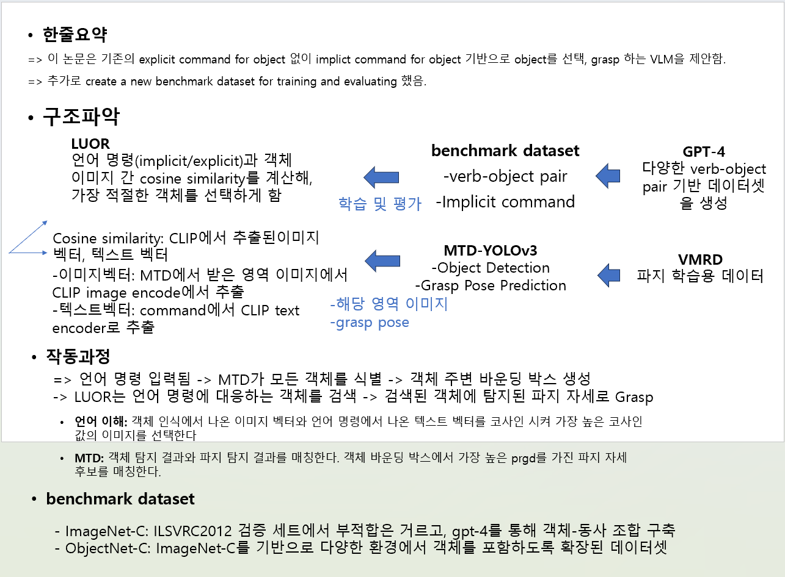

---

## Questions That Came to Mind

### Object Selection in Usage-Based Retrieval

- 같은 용도의 물체이지만 속성이 다르다면 모델은 어떤 객체를 선택해야 하는가?
- 예를 들어:

  - 플라스틱 숟가락 vs 쇠숟가락
  - 빈 물통 vs 물이 가득 찬 물통

  처럼 affordance는 유사하지만 물리적 상태나 속성이 다른 경우, 어떤 기준으로 객체를 선택하는가?

---

### Affordance and Current Object State

- 언어 명령이 주어졌을 때, 객체의 affordance뿐만 아니라 현재 상태까지 반영하여 task에 적합한 객체를 선택할 수 있는가?
- 또한 명령에 직접 명시되지 않은 객체 속성까지 추론하여 객체 선택 과정에 반영할 수 있는가?
- 예를 들어 다음과 같은 속성들:

  - material
  - fill-level
  - weight
  - cleanliness

  이 retrieval 과정에 함께 고려될 수 있는지 궁금했다.

---

</details>

<details>
<summary><b>17. Task-Aware Semantic Map++: Cost-Efficient Task Assignment With Advanced Benchmark</b></summary>

## Basic Information

- **Title**: Task-Aware Semantic Map++: Cost-Efficient Task Assignment With Advanced Benchmark
- **Authors**: Daewon Choi, Soeun Hwang, Yoonseon Oh
- **Conference / Journal**: IEEE Robotics and Automation Letters (RA-L)
- **Year**: 2026

---

## One-line Summary

- 이 논문은 로봇이 가정 환경에서 객체의 상태와 주변 문맥을 고려하여 적절한 작업을 할당할 수 있도록 하는 Task-Aware Semantic Map++ (TASMap++) 프레임워크를 제안한다. 기존 장면 표현 방식은 객체 라벨이나 시각 정보와 같은 정적 특징에 의존하여 문맥 기반 행동을 추론하는 데 한계가 있었으며, 기존 TASMap 역시 단일 프레임 분석으로 인해 객체 상태를 충분히 반영하지 못하고 계산 비용이 증가하는 문제가 있었다. 이를 해결하기 위해 TASMap++은 다중 시점(multi-view) 정보를 통합하여 객체 상태를 더 정확히 파악하고 MM-LLM을 통해 객체별 작업을 할당하는 방식을 사용하며, 또한 여러 사람의 주석을 기반으로 한 새로운 task-assignment 벤치마크를 구축하여 평가 편향을 줄였다. 실험 결과 TASMap++은 기존 방법들보다 더 높은 작업 할당 성능과 계산 효율을 보였으며, 추가적으로 문맥 인식 객체 그라운딩(context-aware grounding) 문제를 제시하고 TASMap++을 활용하여 이를 효과적으로 해결할 수 있음을 보였다.
- 난이도: 상

---

## Understanding the Structure

### 0. Abstract

- 기존의 장면 표현 방식은 정적 특징에 의존하기 때문에, 로봇이 문맥 인식 기반 동작을 추론하는 데 한계가 있었음.
- TASMap++는 객체의 전체 맥락을 고려하여, 각 객체에 적합한 task를 배정하는 map을 생성함.
- 기존 방법은 single-frame 분석에 의존했기 때문에 높은 연산 비용과 부정확성 문제가 있었음.
- TASMap++는 multi-view analysis pipeline을 통해 이 문제를 해결함.
- TASMap++ 평가의 편향을 줄이기 위해 새로운 benchmark를 구축함.
- 마지막으로 context-aware grounding을 소개함.

  - 이는 기존 방식이 visual attribute와 spatial attribute에 의존하던 한계를 보완함.
  - 이를 입증하기 위해 실제 세계를 포함한 3D 실내 데이터셋에서 실험을 수행함.
- 질문: 왜 benchmark를 만들었다는 점을 강조하는가?

  - 기존 평가 방식에 편향이 있거나, task-aware scene representation을 평가하기 위한 적절한 기준이 부족했기 때문으로 보임.
  - 다만 개인이 만든 benchmark는 객관성 문제가 생길 수 있으므로, 데이터 구성 방식과 평가 기준이 얼마나 공개적이고 재현 가능한지가 중요함.
- 질문: Clio, ScanNet, Replica 같은 데이터셋은 어떻게 저명해졌는가?

  - 데이터 규모, 품질, 공개성, 재현성, 후속 연구에서의 반복 사용이 누적되면서 benchmark로 자리 잡은 것으로 이해할 수 있음.
  - 즉 데이터셋 자체가 유명해지는 것이 아니라, 여러 연구가 동일한 기준으로 비교하기 위해 반복적으로 사용하면서 표준화됨.

### I. Introduction

- 기존 방법은 객체 label이나 room name과 같은 low-level semantic information에 의존했음.
- 이러한 방식은 로봇이 복잡한 context-aware action을 추론하고 수행하는 데 비효율적임.
- 기존 방법들은 명확한 명령에만 의존할 수 있어서, 각 객체의 상태를 추론하고 구체적인 task를 배정하는 능력이 부족했음.
- 기존 TASMap은 명확한 명령이 없어도 task를 배정하도록 설계되었음.
- 하지만 single-image frame 기반 접근에는 두 가지 치명적인 한계가 있음.

  - 첫째, 객체가 부분적으로만 관측되면 부적절한 task가 배정될 수 있음.
  - 둘째, 매 frame을 모두 사용하기 때문에 계산 비용이 증가함.
- 새로 제안된 TASMap++는 물체의 기하학적 구조를 캡처하고, 물체의 전체 상태를 대표할 수 있는 view를 선택함.
- 이를 통해 single-frame 기반 TASMap의 두 가지 한계를 완화함.
- 또한 편향된 평가를 피하기 위해 task assignment benchmark를 새로 구축함.
- TASMap++는 계산 비용을 낮추고 처리 속도를 높이는 성능을 보임.
- TASMap++의 context-aware grounding은 객체의 맥락과 환경을 분석하고, 사용자의 암시적 query를 추론함.
- TASMap++의 정확도를 검증하기 위해 실제 3D 실내 데이터셋에서 실험을 수행함.
- 본 논문의 주요 기여는 다음과 같음.

  - 다양한 환경에서 효율적으로 동작하는 high-level, task-aware scene representation을 제안함.
  - task assignment benchmark를 구축함.
  - 암묵적 명령에서도 context-aware grounding을 수행할 수 있는 TASMap++ 방법을 제안함.

### II. Related Work

- 관련 연구에서는 각 객체에 task를 직접 배정하기보다는, 3D primitives를 조건부 지시에 따라 그룹화하는 방향에 초점이 맞춰져 있음.
- 반면 TASMap++는 적절한 task를 결정하기 위해 각 객체의 문맥적 상태를 분석함.
- 현재 공개 데이터셋에는 객체 상태나 실제 시나리오에서 나타나는 어수선한 분포를 충분히 반영한 데이터셋이 부족함.
- 따라서 기존 데이터셋만으로는 TASMap++의 성능을 평가하기에 적절하지 않음.
- 이를 보완하기 위해 실제 어수선한 장면을 반영한 신뢰 가능한 benchmark를 구축함.
- LLM을 활용하면 3D 장면을 문맥적 표현이나 symbolic representation으로 변환할 수 있음.
- 하지만 기존 LLM 기반 방법들은 객체와 주변 환경의 문맥을 분석하거나, 사용자의 암묵적 의도가 포함된 query를 처리하는 데 한계가 있음.

### III. Task-Aware Semantic Map++: TASMap++

- TASMap++는 집 정리 상황에서 각 객체에 적절한 task를 배정하는 방법임.
- 기존 3D 실내 데이터셋은 지나치게 깔끔하고 정적이어서, 실제 생활공간에서 나타나는 어수선한 패턴을 충분히 반영하지 못함.
- 기존 TASMap에서는 한 명의 주석자가 annotation을 수행했기 때문에 개인의 preference가 반영될 가능성이 있었음.
- TASMap++는 최소 두 명 이상의 주석자를 활용하여 개인 preference를 줄이고, 실제 세계의 상황을 더 잘 반영하고자 함.
- 도표 해석:

  - 각 객체는 평균적으로 약 1.3개의 task를 배정받음.
  - 표준편차는 약 0.5개임.
  - 이는 주석자들이 객체의 상태를 단순히 임의로 해석한 것이 아니라, 객체 표현 간의 구분성과 유사성을 비교적 일관되게 반영했음을 보여줌.
- 세 개의 행렬을 비교했을 때, TASMap++는 사람의 선호에 대해 비교적 견고하고 일관된 결과를 보임.
- 질문: 각 객체에 평균 1.3개의 task가 배정되고 표준편차가 0.5인 것이 왜 현실적이라고 볼 수 있는가?

  - 집 정리 상황에서 하나의 객체는 보통 하나의 주된 task를 가지지만, 상태에 따라 여러 task 후보를 가질 수도 있음.
  - 예를 들어 널브러진 컵은 `Relocate`, `Reorient`, `Dispose`가 모두 후보가 될 수 있음.
  - 비워진 쓰레기통은 `Leave as it is` 또는 `Empty`가 후보가 될 수 있음.
  - 열린 캐비닛은 `Close`, 흘려진 테이블은 `Wipe`처럼 비교적 명확한 task를 가짐.
  - 따라서 객체당 task 수가 너무 많지도 않고, 하나로만 고정되지도 않는 평균 1.3개 수준은 집 정리 맥락에서 어느 정도 현실적인 분포로 해석할 수 있음.
- 다만 이 “현실성”은 절대적인 기준이라기보다, 논문에서 설정한 house tidying task 범위 안에서 타당하다고 보는 것이 적절함.

### IV. TASMap++ Construction

#### A. 3D Instance Segmentation

- 객체의 2D frame 정보를 3D 기하학 구조로 역투영함.
- 이후 영향력이 큰 객체 또는 관측 정보를 내림차순으로 정렬하여, 다음 계산 과정에서 우선적으로 활용함.

#### B. Mask Refinement and View Selection

- 관측된 frame을 바탕으로 객체에 적절한 task를 배정하기 위해 MM-LLM, 즉 OpenAI o4-mini model을 활용함.
- `m_j` 값은 특정 frame이 가시성 조건을 만족하면 1, 만족하지 않으면 0을 반환함.
- `vis`는 객체가 충분히 잘 보이는지를 판단하기 위한 비율값임.
- `occ`는 객체가 작게 보일 때, 이미지를 확대된 객체 중심 view로 잘라내기 위한 기준값임.

#### C. Task Assignment

- single-view 방식은 객체를 바라보는 측면에 따라 객체의 상태가 다르게 보일 수 있음.
- 이를 보완하기 위해 multi-view 방식으로 최상의 8개 frame을 추출함.
- 이 과정은 객체의 localization, 상태 추론, 문맥 추론을 더 쉽게 하기 위한 목적임.
- 8개 frame만으로도 판단이 불충분한 경우에는 `uncertain`으로 응답할 수 있도록 함.
- 이를 통해 TASMap++의 task assignment 구조가 완성됨.

### V. Context-Aware Grounding

#### A. Problem Definition

- 사람과 로봇의 상호작용에서는 사람이 명시적으로 행동을 지시하는 경우보다, 암시적으로 행동을 지시하는 경우가 많음.
- 암시적 명령을 이해하려면 단순히 명령어를 해석하는 것뿐만 아니라, 주변 문맥과 객체의 현재 상태까지 함께 파악해야 함.
- 따라서 이는 기존의 visual grounding이나 spatial grounding task와는 근본적으로 다른 문제임.

#### B. Context-Aware Grounding via TASMap++

- TASMap++에 압축된 semantic 정보와 geometric 정보를 활용하여 context-aware grounding 문제를 다룸.
- TASMap++에서 얻은 context-aware grounding 정보와 사용자의 language query를 함께 LLM에 입력함.
- LLM은 이를 바탕으로 추론을 수행하고, 최종적으로 선택해야 할 객체 또는 task를 나타내는 특정 ID를 반환함.

### VI. Experiments

#### A. Quantitative Evaluation

- 사용한 평가지표는 CP, CR, CF1, OP, OR, OF1, SA, HL, 1-HL, TPI, WT임.
- 비교 기준으로 CG-Task를 도입하고, TASMap, Ours, Ours(batch)를 비교함.
- 실험 결과, Ours(batch)가 CF1, OF1, 1-HL, SA에서 우수한 성능을 보임.
- 제안 방법은 여러 방향에서 관측한 객체 view를 하나의 합성된 이미지로 통합함.
- 이를 통해 비용 효율성을 높이고, WT와 TPI를 줄이며, 전체 runtime을 감소시킬 수 있었음.
- 동시에 기존 방법과 비슷한 수준의 정확도를 유지함.

#### B. Qualitative Evaluation

- 수도꼭지의 상태가 잠겨 있는지, 열려 있는지에 따라 서로 다른 task를 적절하게 배정함.
- 다른 객체의 경우에도 객체의 상태에 따라 적합한 task를 배정함.
- mIoU와 AP 지표를 통해 다른 모델 대비 우수한 성능을 보임.

#### C. Context-Aware Grounding

##### 1. Experimental Setup

- 34개의 명시적 query는 50개의 ground-truth 객체를 대상으로 함.
- 하나의 query는 1~5개의 가시적 item에 대응함.
- 암시적 query는 추상적이고, 의미적 추론이 필요한 문맥 의존적 지시로 구성됨.

##### 2. Baseline

- zero-shot 3D object grounding 방법과 비교함.
- 비교 대상은 사용자의 query에 기반하여 RGB 장면에서 객체를 localization하는 접근법들임.

##### 3. Result

- TASMap++는 multi-view synthesis pipeline을 통해 객체의 상태를 잘 포착함.
- 그 결과, 기준 방법들보다 큰 차이로 우수한 context-aware grounding 성능을 보임.

#### D. Real World Experiments

- 실제 환경에서 성능을 평가하기 위해 vSLAM으로 추정된 pose를 포함하는 RGB 데이터를 활용함.
- context-aware grounding task를 통해 전체 framework를 평가함.
- 명확한 query에서는 객체의 상태에 따라 적절한 task를 부여함.
- 암시적 query에서는 문맥을 바탕으로 객체를 탐지하고, 구분하고, 선택함.

### VII. Conclusion

- TASMap++는 single-frame 분석의 한계를 multi-frame view synthesis와 효율적인 MM-LLM 처리로 극복함.
- 사람이 주석을 단 task assignment benchmark를 구축함.
- 기존 object grounding과 구별되는 query 처리 문제를 context-aware grounding으로 정의하고, TASMap++를 통해 해결하는 방법을 제안함.
- 향후 연구에서는 task-aware semantic map에서 발생하는 후처리 방식의 한계를 극복하고자 함.
- 현재의 heuristic 방식에서 벗어나, 적응적 frame selection을 위한 학습 기반 전략을 개발할 계획임.
- task planning과 TASMap++를 통합하여, 개인화된 task assignment mechanism을 개발하는 방향으로 확장할 수 있음.

## 한장 요약

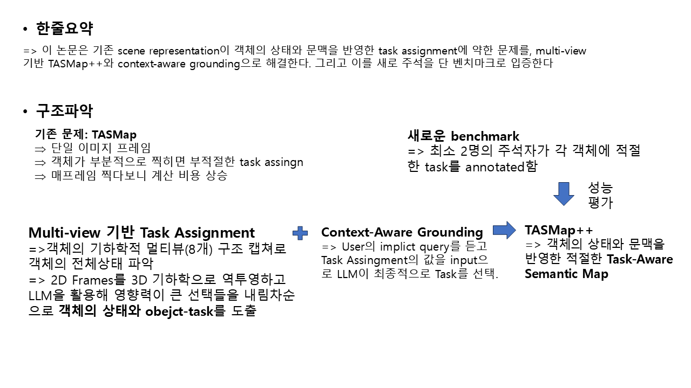

---

## Questions That Came to Mind

### Scene Representation for Task Assignment

- 같은 환경이지만 다른 장소에서도 로봇은 객체를 올바르게 파악할 수 있는가?
- 예를 들어, 기존에 학습된 환경과 비교했을 때 인테리어 또는 물체의 색깔이 바뀐 상황에서도 객체를 올바르게 인식할 수 있는가?

---

### Generalization to Different Environments

- 학습된 데이터와 다른 환경에서도 로봇은 객체를 올바르게 파악하고 업무를 배정할 수 있는가?
- 특히 다음과 같은 변화가 있을 때 객체 인식 및 task assignment 성능은 어떻게 변화하는가?

  - 객체 주변 환경의 색깔 변화
  - 객체 자체의 색깔 변화

---

### Final Question

- 학습된 데이터와는 다른 환경에서 객체의 주변 환경 또는 객체의 색깔이 변화했을 때, 객체 인식 및 task assignment 성능은 어떻게 변화하는가?

---

</details>

<details>
<summary><b>18. Task Planning for Long-Horizon Cooking Tasks Based on Large Language Models</b></summary>

## Basic Information

- **Title**: Task Planning for Long-Horizon Cooking Tasks Based on Large Language Models
- **Authors**: Jungkyoo Shin, Jieun Han, SeungJun Kim, Yoonseon Oh, Eunwoo Kim
- **Conference / Journal**: 2024 IEEE/RSJ International Conference
- **Year**: 2024

---

## One-line Summary

- 이 논문은 요리와 같은 장기 작업에서 기존 symbolic task planner가 unseen object에 약한 문제를, LLM 기반 semantic feature과 encoder-decoder 구조를 이용해 object-oriented subgoal을 생성하는 방식으로 해결한다.
- 난이도: 중

---

## Understanding the Structure

### 1. Introduce Encoder-Decoder Framework

#### A. Problem Statement

- **Task planner**

  - **Input**: target recipe name, 재료명
  - **Output**: generate object-oriented sub-goals
- **3-prediction**

  - Robot action
  - Objects involved action
  - Inter-relationship between objects

---

#### B. Task Planning Framework

- **Three main modules**
  1. Linguistic encoder
  2. Object encoder
  3. Sequential decoder

---

##### 1. Linguistic Encoder

- CLIP, latent embeddings

  - **CLIP**: pretrained text encoder
  - **Latent embeddings**: compose rich semantic feature from annotations
- 재료목록 `r_ing`, 타겟 레시피 `r_tgt`의 토큰을 CLIP 또는 BERT에서 받아와 각 단어를 잠재적 embedding으로 표현함.

---

##### 2. Object Encoder

- `e_tgt` 생성

  - 재료목록 + 레시피가 포괄적으로 표현됨
- LLM 구조를 건드리는 것 같음.

  - 다만 내가 LLM 구조에 약해서 LLM 구조 공부가 필요함.
- Generate a sequence of subgoals with various ingredients

  - Grasp the individual essence of ingredients
  - Understand their synergistic interactions
- Transformer-based encoder에 각 재료의 semantic features와 레시피의 관계가 수식 `r_in`으로 표현됨.
- `E`식은 multi-head attention layer에서 query, key, value inputs를 활용하여 BERT 방식으로 special class token으로 semantic features를 잡아냄.
- Encoder의 마지막 input인 `r_tgt`를 final vector로 채용함.
- 이렇게 나온 `e_tgt`는 재료와 레시피 간의 종합적인 표현을 포함함.

---

##### 3. Sequential Decoder

- `e_tgt`를 input으로 각 환경과 진행상황에 맞는 sub-goals를 생성함.
- 이를 위해 novel transformer인 external memory와 결합함.
- External memory는 과거의 특징과 현재 상태를 고려하여 새로운 특징을 업데이트함.
- Cross-attention으로 표현:

  - `h_t`
  - `m_t`
  - `M_t`
- `h_t`에 MHA를 적용할 때, `e_tgt`와 external memory인 `M_t-1`이 key와 value로 제공됨.
- 특히 previous stage를 활용한 `M_t-1`은 gradient vanishing을 방지해줌.
- 이러한 과정을 통한 축적은 subsequent tasks를 이해하는 데 있어 계산 비효율과 관련 없는 정보를 유발함.
- 이를 해결하기 위해 gating mechanism을 통해 external memory에서 non-essential elements는 지우고, crucial feature만 얻도록 함.
- 결과적으로 external memory에는 indispensable sequential information만 남음.
- Fully connected layer에 action, object, relation별로 각각 sub-goals를 뽑아내기 위해 입력함.
- `y_obj`, `y_act`, `y_rel`은 time step `t`별로 최적의 선택을 하는 가능성을 표현함.
- Planner는 다음 loss를 줄이도록 end-to-end로 훈련됨.

  - Action prediction: binary cross entropy loss
  - Object and relation prediction: log-likelihood loss
- 각 객체에 대해 여러 행동이 발생할 수 있기 때문에 action prediction을 multi-label classification으로 표현함.

---

### 2. Autoregressive LLM을 사용하여 Pseudo Dataset 생성

#### C. LLM-Driven Data Generation

- Propose a strategy to utilize recursive LLM, GPT-3.
- LLM이 real-world natural language descriptions를 object-oriented format으로 바꿔줌.
- 이 방법은 unseen knowledge를 배우게 해주는 pseudo dataset을 생성함.
- 훈련 데이터셋의 사이즈 한계로 인해 unfamiliar recipe를 마주할 수 있기 때문에, 1M+ dataset을 학습함.
- 초기에 저장된 레시피의 제목을 framework를 훈련하는 데 사용함.
- 초기에 저장된 레시피와 1M+ dataset 사이의 semantic similarity를 측정함.
- 이 중 unseen recipes는 predefined threshold 아래의 cosine similarity score를 가진 것들로 식별함.

---

##### Unseen Recipe Description Selection

- 추가로 unseen recipe descriptions를 선택함.
- 선택된 recipes는 robot의 capabilities와 constraints를 반영하는 in-context prompts와 함께 사용됨.
- 이 prompts는 GPT-3가 language를 object-oriented structures로 번역하도록 함.
- 이 중 기준에 맞지 않는 것은 제외됨.

  - Impractical objects
  - Incomplete structure
- Viable output이 얻어질 때까지 unseen recipe 선택과정이 반복됨.
- 이렇게 pseudo dataset을 생성함.

## 한장 요약

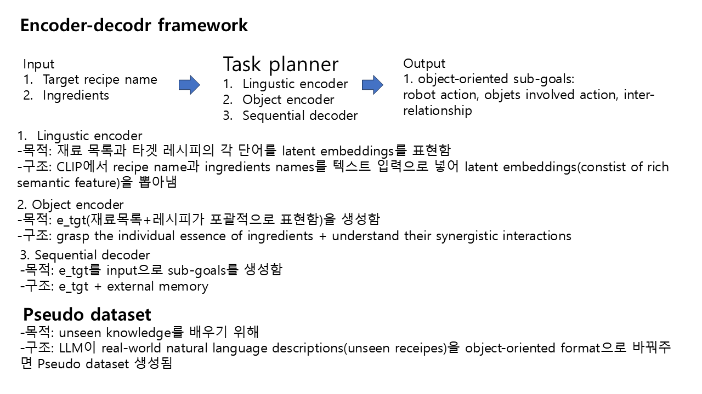

---

## Questions That Came to Mind

### Planner and Object State Change

- 로봇이 동작하는 도중 객체의 상태가 바뀌었을 때 planner는 어떻게 대응할 것인가?
- 예를 들어, 물이 담긴 접시를 옮기다가 접시가 깨지고 물이 쏟아졌다면 기존 subgoal을 유지해야 하는가, 아니면 새로운 subgoal을 생성해야 하는가?

---

### Subgoal Reassignment

- 모델의 동작으로 인해 객체의 상태가 변화했을 때, subgoal은 어떤 과정으로 재배정되어야 하는가?
- 객체가 `a → a-1, a-2`처럼 분리되었을 때:

  - 기존 객체 `a`의 subgoal을 `a-1`, `a-2`에 그대로 이어서 배정할 수 있는가?
  - 아니면 새로운 객체 상태로 인식하고 새로운 subgoal을 생성해야 하는가?
- 예를 들어:

  - 양파처럼 형태를 유지한 채 두 조각으로 나뉜 경우에는 기존 cooking subgoal을 이어서 사용할 수 있을 수 있음.
  - 반면 카레 소스가 담긴 그릇이 엎어진 경우에는 카메라 상에서는 객체가 존재하더라도 실제 task 수행에는 사용할 수 없는 상태가 될 수 있음.
  - 이 경우 planner는 기존 cooking task 대신 `wipe`, `clean`과 같은 새로운 subgoal을 생성해야 하지 않을까?

---

### Affordance and State Transition

- 객체 상태 변화가 발생했을 때, 해당 변화가 task 수행 가능성(affordance)에 미치는 영향을 기반으로:

  - 기존 subgoal을 유지할지,
  - subgoal을 분해할지,
  - 혹은 새로운 goal로 전환할지를

  어떤 기준으로 결정하는가?
- 특히 planner가 객체 상태 변화를 어느 시점에서 인식하고 subgoal을 재구성하는지도 궁금했다.

---

</details>

<details>
<summary><b>19. Do As I Can, Not As I Say: Grounding Language in Robotic Affordances </b></summary>

## Basic Information

- **Title**: Do As I Can, Not As I Say: Grounding Language in Robotic Affordances
- **Authors**: Michael Ahn, Anthony Brohan, Noah Brown, et al.
- **Conference / Journal**: arXiv
- **Year**: 2022

---

## One-line Summary

- 기존 LLM은 real-world task의 절차를 언어적으로 제안할 수 있지만, 로봇의 실제 능력과 현재 환경에 grounded되어 있지 않다. 이 논문은 LLM이 각 skill의 task 적합도를 평가하고, 로봇의 value function이 각 skill의 실행 가능성 affordance를 평가한 뒤, 두 점수를 결합해 실행 가능한 행동 순서를 선택하는 SayCan 방식을 제안한다.

---

## Understanding the Structure

```text
User Instruction
        ↓
Available Skills
        ↓
Say Score from LLM
        +
Can Score from Affordance Function
        ↓
Select Executable Skill
        ↓
Robot Execution
```

---

## Main Idea

- **Say-LLM**

  - Describes the probability that each skill contributes to completing the instruction.
  - 즉, LLM이 현재 명령을 수행하는 데 어떤 skill이 적절한지 판단한다.
- **Can-Affordance Function**

  - Describes the probability that each skill succeeds.
  - 즉, 로봇이 현재 환경에서 해당 skill을 실제로 수행할 수 있는지 판단한다.
- **SayCan**

  - `Say` 점수와 `Can` 점수를 결합하여, 의미적으로 적절하면서도 실제로 실행 가능한 행동을 선택한다.

---

## Method

- A robot’s performance can be improved simply by enhancing the underlying language model.
- LLM은 task completion 관점에서 어떤 skill이 적절한지 평가한다.
- Affordance function은 로봇의 현재 상태와 환경에서 해당 skill이 성공할 수 있는지를 평가한다.
- 최종적으로 두 점수를 결합해 다음 행동을 선택한다.

```text
Score(skill) = Say(skill) × Can(skill)
```

---

## Limitations

1. LLM 학습 데이터에 의존한다.
2. The primary bottleneck of the system is in the range and capabilities of the underlying skills.

---

## Why I Read This Paper

- LLM 기반 로봇 task planning에서 핵심 문제는 언어적으로 그럴듯한 계획이 실제 로봇이 수행 가능한 행동과 다를 수 있다는 점이다. 이 논문은 LLM의 high-level semantic knowledge와 로봇의 affordance/value function을 결합해 실행 가능한 행동을 선택하는 SayCan 방식을 제안한다. 따라서 LLM을 실제 로봇 환경에 grounding하는 대표적인 접근을 이해하기 위해 읽었다.

---

</details>

<details>
<summary><b>20. Robot Object Retrieval with Contextual Natural Language Queries </b></summary>

## Basic Information

- **Title**: Robot Object Retrieval with Contextual Natural Language Queries
- **Authors**: Thao Nguyen, Nakul Gopalan, Roma Patel, et al.
- **Conference / Journal**: arXiv
- **Year**: 2020

---

## One-line Summary

- 이 논문은 기존에 사람이 로봇에게 명령할 때, 자연어 명령으로 객체의 명칭이나 정확한 시각적 묘사가 필요했다. 하지만 이 모델에선 객체의 usage인 verb-command만으로 본 적 없는 객체가 섞여 있는 5개의 후보군에서도 usage에 가장 적절하게 객체를 가져오는 모델을 제안한다.

---

## Why I Read This Paper

- 기존 object retrieval 연구들은  객체 이름이나 시각적 특징(color, shape 등)에 많이 의존했는데, 이 논문은 “cut할 수 있는 물건”처럼 usage 기반의 자연어 명령만으로 객체를 찾는다는 점이 흥미로워 읽었다. 특히 본 적 없는 객체가 포함된 후보군에서도 verb와 object usage 관계를 기반으로 적절한 객체를 선택한다는 점이 인상적이었다.

---

</details>

<details>
<summary><b>21. LightSplat: Fast and Memory-Efficient Open-Vocabulary 3D Scene Understanding in Five Seconds</b></summary>

## Basic Information

- **Title**: LightSplat: Fast and Memory-Efficient Open-Vocabulary 3D Scene Understanding in Five Seconds
- **Authors**: Jaehun Bang, Jinhyeok Kim, Minji Kim, Seungheon Jeong, Kyungdon Joo
- **Conference / Journal**: CVRP
- **Year**: 2026

---

## One-line Summary

- LightSplat은 open-vocabulary 3D scene understanding에서 기존 방법들이 iterative optimization과 dense per-Gaussian feature assignment 때문에 slow, memory-intensive, overly complex하다는 문제를 해결하기 위해 제안된 방법이다. 기존 방식처럼 Gaussian마다 full CLIP feature를 저장하는 대신, multi-view images에서 얻은 2D mask semantics를 2-byte semantic indices 형태로 3D Gaussian에 주입하고 lightweight index-feature mapping을 통해 CLIP feature를 참조한다. 또한 geometric overlap과 semantic similarity를 기반으로 object-level clustering을 수행하여 semantic consistency를 유지한다. 이를 통해 per-Gaussian feature storage를 제거하고 memory/computational overhead를 크게 줄이면서도, fast object-level inference와 efficient open-vocabulary 3D scene understanding을 가능하게 한다.

---

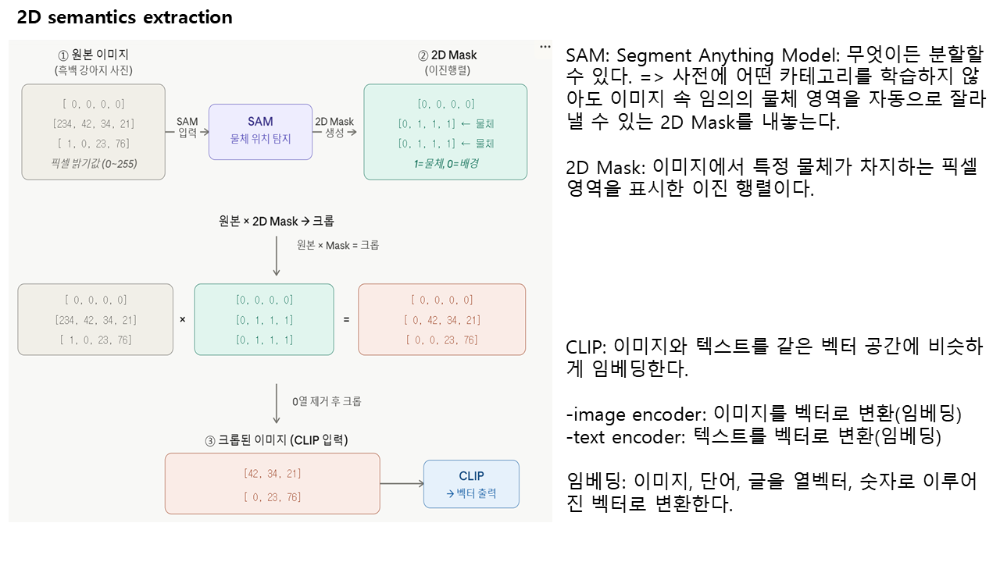

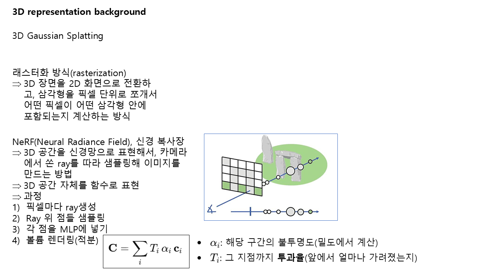

## comment

- 아직 논문에서 나온 전체 개념은 습득하지 못했음.

</details>

<details>
<summary><b>22. Self-Corrective Task Planning by Inverse Prompting with Large Language Models</b></summary>

## Basic Information

- **Title**: Self-Corrective Task Planning by Inverse Prompting with Large Language Models
- **Authors**: Jiho Lee, Hayun Lee, Jonghyeon Kim, Kyungjae Lee, Eunwoo Kim
- **Conference / Journal**: IEEE International Conference on Robotics and Automation (ICRA)
- **Year**: 2025

---

## One-line Summary

- 이 논문에서는 기존의 self-correction에서 불충분한 추론으로 인해 LLM이 정확한 correction을 실패하는 문제를 inverse prompting 방법을 통해 해결한다. 이는 initially generated action으로 만들어진 generated state에 inverse action을 적용해 inverse state를 만들고, 이 inverse state가 initially action 수행 전의 original state로 restore되는지 검증한다. 이를 통해 , 다양한 현실 시나리오에서 더 성공적인 task completion을 해낸다.

---

## PDDL / Task Planning Study

- Blocksworld 예제를 통해 PDDL의 domain/problem 구조를 코랩을 통해 실습함.
- domain.pddl에는 predicate, action, precondition, effect를 정의함.
- problem.pddl에는 object, initial state, goal state를 정의함.
- pyperplan을 사용해 초기 상태에서 목표 상태까지 도달하는 12-step action sequence를 생성함. => problem.pddl.soln 생성
- 이를 통해 LLM-based task planning 논문을 읽을 때 필요한 symbolic state 표현, action sequence, precondition/effect 기반으로 실행 가능성 판단 방식을 이해함.

---

## Task Planning에서 탐색 알고리즘과 휴리스틱이 계획 품질에 어떤 영향을 주는지 알아보자

## PDDL을 BFS, GBF_hFF로 나누어서 결과 학인

- 파일 PDDL, PDDL_GBF_HFF 으로 확인
- BFS는 휴리스틱 없이 가까운 깊이부터 모든 상태를 탐색하기 때문에 탐색 비용은 크지만, unit-cost 조건에서는 더 짧은 plan을 찾을 수 있었다. 반면 GBF_HFF는 hFF 휴리스틱을 사용해 목표에 가까워 보이는 상태를 우선 탐색하므로 탐색 노드 수와 시간이 크게 줄었지만, greedy한 선택 때문에 불필요한 중간 행동이 포함되어 plan length가 증가하였다.

## 자율적으로 움직이는 휴머노이드에 적용해본다면

**BFS는 고도화된 동작을 수행해야 하는 조건에서 쓰이면 좋지 않을까?**

- 컵 쌓기와 같은 한 번 실패했을 때 이전의 동작으로 쌓아온 effect가 무너질 수 있는 상황

**GBF는 짧은 시간에 외부 변수가 빠르게 변화하는 조건에서 쓰이면 좋지 않을까?**

- 로봇이 주변을 걸어다닐 때, 사람이나 주변 객체의 위치가 계속 바뀌는 상황

---

### BFS, Breadth First Search

- 시작 상태에서 가까운 깊이부터 차례대로 모든 상태를 탐색하는 방법

### GBF, Greedy Best-First Search

- 현재 후보들 중에서 목표에 가장 가까워 보이는 상태를 먼저 탐색하는 방법이다.

### hFF, FF(Fast Foward) heuristic

- planning 문제에서 현재 상태로부터 목표까지 가기 위해 필요한 행동 수를 FF 방식으로 추정하는 휴리스틱이다.

## 용어정리

- **PDDL**: Planning Domain Definition Language. planner가 현재 상태에서 목표 상태로 가는 action sequence를 찾을 수 있도록, 행동 규칙과 초기 상태 및 목표 상태를 기호로 표현하는 언어.
- **Predicate**: PDDL에서 상태를 표현할 때 사용할 수 있는 술어의 형식. Ex) on(x, y), handempty()
- **Preconditions**: Action을 적용하기 전에 반드시 만족되어야 하는 조건들
- **Effects**: Action을 적용한 후 환경이 어떻게 변할 것인지에 대한 효과들
- **Symbolic state**: 현실 세계의 상태를 predicate로 표현한 것.
- **Action sequence**: 목표 상태에 도달하기 위해 planner가 만든 행동 순서
- **Plan validation**: 생성된 계획이 각 단계에서 실행 가능한지 확인하는 것. 이번 실습에서는 직접 검증기를 구현한 것은 아니고, pyperplan이 domain.pddl에 적힌 precondition/effect 규칙을 바탕으로 가능한 action만 탐색해서 plan을 생성하였음.
- **Heuristic**: 문제를 정확히 끝까지 풀어보지 않고, 어느 선택이 더 좋아 보이는지 빠르게 판단하기 위한 추정 기준.

 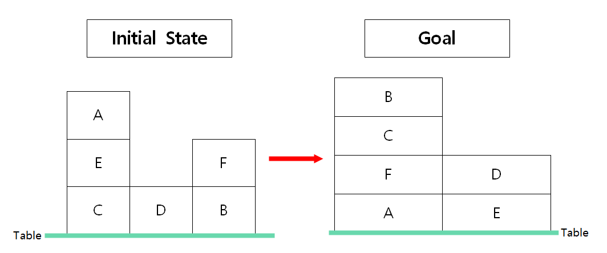

---

## Understanding the Structure

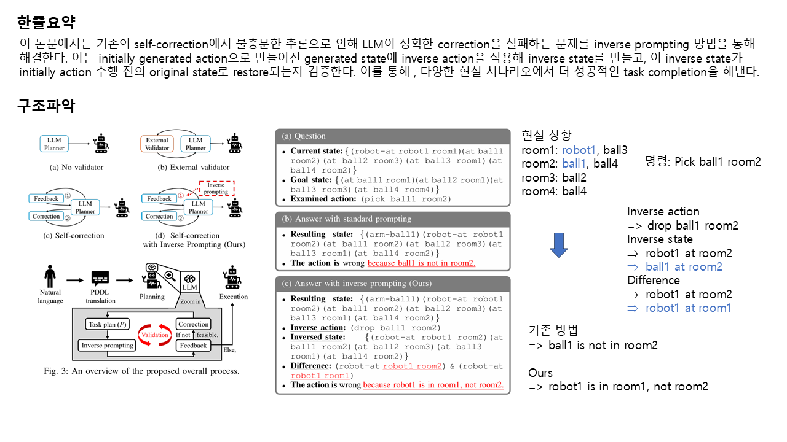

---

</details>

<details>
<summary><b>23. A Survey on Vision-Language-Action Models for Embodied AI</b></summary>

## Basic Information

- **Title**: A Survey on Vision-Language-Action Models for Embodied AI
- **Authors**: Yueen Ma, Zixing Song, Yuzheng Zhuang, Jianye Hao, Irwin King
- **Conference / Journal**: IEEE Transactions on Neural Networks and Learning Systems
- **Year**: 2026

---

## One-line Summary

* 이 논문은 Vision-Language-Action(VLA) 모델을 embodied AI 관점에서 정리한 survey로, VLA를 구성요소, low-level control policy, high-level task planner, datasets/benchmarks, future directions로 나누어 설명한다.

---

## Why I Read This Paper

* VLA 분야의 전체 구조를 파악하기 위해 읽었다.
* 특히 reasoning-centric VLA로 넘어가기 전에, VLA의 taxonomy, data sources, model design, action prediction, evaluation 기준을 잡는 것이 목적이었다.

---
<details>
<summary><b>Written Memo</b></summary>

읽으면서 정리 A Survey on Vision-Language-Action Models for Embodied AI
*taxonomy, data sources, model design, action prediction, evaluation에 집중

O. Abstract

* 기존엔 LLM, VLM이 있다가 새로운 multimodal modes로 VLA가 나왔다. 이는 액션을 생성하기 위해 embodied AI에서 언어 조건의 로봇 업무를 다루기 위해 통합되었다.
* 디테일한 vla의 분류로 세가지를 제안한다

1. individual comonponets of VLA
2. low-level actions에서의 VLA
3. high-level task planners이 long-horizon tasks를 subtask의 sequence로 분해하도록 함. 덕분에 user instructions을 더 잘 따를 수 있음.
4. 그리고 dataset, simulators, benchmark까지 요약을 제공한다
5. 최종적으로 VLA이 직면한 문제와 embodied AI의 미래 방향성을 보여줄 것이다.

I. Introduction

* VLA는 multimodal modes at embodied AI이고 vision, language, action의 정보를 처리한다. language instructions을 이해하고, 시각적으로 환경을 인지하고, 적절한 행동을 생성하고, multimodal capabilties가 필요하다.
* VLA란 용어는 RT-2에 의해서 최근에 명명되었다.
* VLA는 초기의 RL에 비해서 복잡한 환경에서도 versatility, dextreity, generalizability를 가진다. 덕분에 controlled setting 에서 일상에서까지 적합하다.
* 기존의 RL에의 현황을 설명-
* multimodal은 VQA, image coptioning, txet-to-vide generation까지 하고 있다.
* VLA도 LLM과 VLM에서와 마찬가지로 versatile myltitask policies가 필요해졌다.
* 다만 learning a broader set of skills, adapting to diverse environments, 그리고 자연어 명령을 위해서는 language-conditioned robot policies의 개발을 필요하는 intuitive user-rovt interface가 수반된다.
* VLA는 시각정보를 위해 PVR(Pretrained Visual Representations)를 vision encoder를 차용한다.
* III A는 inidividuatl components of VLA: dynamics learning, world models and reasoning
* III B는 low-level control policies: lanauage instructions, visual observations은 control policy(generate low level actions)에 쓰인다. 그래서 control policy의 이상적인 모델로 렌더링한다.
* high-level task planner는 task 분해를 한다(IV). 얘는 long-horizion tasks를 sequece of subtasks로 분해한다. 그래서 high capacity를 가진 hierarchical framework를 채택한다. 왜냐 low-level control policy가 정확도와 스피드에 집중하는 반면에 말이다.

*Taxonomy of VLA into two hierarchies

1. low level control policy: based on specified language commands and the perceived environment
2. high-level task planner: provide guidance to LLCP by decomposing long-horizon tasks into subtasks

*Data sources(Resources)

1. VLA를 훈련하고 평가하기 위한 필수 자원을 요약하였음. including recent datasets and benchmarks in real-world or simulated environments.
2. 그리고 data scarcity and inconsistency에 대한 다양한 접근법을 논의한다.

II. Related Works

* Embodied AI는 다른 AI와 다르게 물리환경과 상호작용한다.
* Embodied AI는 다양한 매체에 속하지만 그 중 로봇이 가장 저명한 매체이다.
* Robot Learning은 강화학습 문제(MDP)로 프레임 씌어져왔다. TD learning and policy gradients도 이 문제이다.
* 보상함수를 정의하기 어려운 경우에는, 모방학습이 action distribution을 모델링 하기 위해  보상이 없는 trajectories를 가지고 활용된다
* 많은 multitask robot modes이 언어를 instructions(p)로 사용한다. 이는 어떤 task나 skill를 실행할지 알아내기 위해서이다. 그리고 이는 언어 조건부 로봇 정책의 개발을 이끌었다.
  => 기존 Robot Learning은 상태를 보고 → 행동을 고르고 → 보상을 받는 문제로 봤다. 그런데 실제 로봇에서는 보상 설계가 어렵고, 사용자는 자연어로 명령한다. 그래서 이제는 언어 명령 + 시각 상태를 보고 → 적절한 행동을 출력하는 모델이 필요해졌다. 그게 VLA로 이어진다.
  => 이 Background는 VLA를 이해하기 위한 robot learning의 기본 틀을 설명한다. 기존 robot learning은 상태, 행동, 보상으로 구성된 MDP/RL 문제로 볼 수 있으며, 정책은 현재 상태를 보고 적절한 행동을 출력한다. 그러나 실제 로봇 환경에서는 상태를 완전히 알기 어렵기 때문에 POMDP 관점이 필요하고, 보상함수를 설계하기 어려운 경우 imitation learning을 통해 사람의 demonstration에서 행동 분포를 학습한다. 이후 multitask robot에서는 어떤 작업을 수행할지 지정하기 위해 language instruction이 policy의 조건으로 들어가며, 이는 Vision과 Language를 입력받아 Action을 출력하는 VLA의 기본 구조로 이어진다.

III. Vision-Language-Action Models

* VLA=CV+NLP+RL

1. Comnpnents of VLA
   RL

* DQN => the need for greater model capacity in end-to-end RL
* RL trajectories => 트랜스포머 구조에 적합한 states, actions, rewards를 모델링 문제로 align한 sequences임. 이건 DT(Decision Transformer), TT(Trajectory Transformer)를 포함함.
* Gato는 이 패러다임을 multimodal, multitask, multiembodient setting으로 확장하여 VLA이 RL로부터 경험을 학습하도록 사용했음.
  => RL은 embodied AI와 robot policy 학습의 기반이다. DQN은 픽셀 입력에서 직접 policy를 학습할 수 있음을 보여주었고, RL trajectory는 state-action-reward의 순서 데이터이므로 Transformer 기반 sequence modeling과 잘 맞는다. 최근에는 RL과 LLM의 결합도 중요해졌는데, RLHF는 사람 피드백을 통해 모델을 선호·안전성에 맞추고, SEED는 sparse reward와 안전성 문제를 다루며, Reflexion은 언어적 피드백을 통해 의사결정을 개선하고, Eureka는 LLM으로 reward function을 설계하는 예시이다. 다만 이 Survey에서 이들은 VLA의 핵심 모델이라기보다 RL과 LLM이 결합되는 배경 사례로 이해하면 된다.

2. PVR: Pretrained Visual Representation

* vision encoder가 VLA의 성능에 직접적인 영향을 준다. 객체 분류, 위치, affordances와 같은 current state를 취급하는 중대한 정보를 제공하기 때문이다.
* CLIP: text-image pair
* R3M: time Constrastive Learning(CL) and video-language alignment
* MVP: Masked AutoEncoder로 CV 에서 robotic dasets로 적용함
* Voltron: a pretraining objective by incorporating langauge conditioning and language generation into the MAE objective. => language and vision modalities의 정렬을 강화해줌
* VC-1:
* DINOv2: teacher-student(encoded images를 가지고 정답을 지수로 올리는자-정답을 선형으로 제출하는자)로 self-supervised training paradigm을 제안함
* I-JEPA: 'primitvie' internal world model 건설. masked patches를 사용
* Theia: fusing diverse visual informaino(segamentation, depth, semantics) and 'less resources, better performance.'

3. Video Representation

* Videos는 이미지의 연속이라 볼 수 있고 이는 PVRs(위에서 언급된것들:CL, MAE)이라고도 볼 수 있다. 근데 이를 넘어서는 NeRF 같은게 있다
* NeRF
* F3RM
* 3D-LLM
* 3D Gaussian Splatting > NeRF
* Audio도 robot policies에서 중요한 단서가 될 수 있음

4. Dynamic Learning

* =Foward + Inverse Dynamics,
* Foward Dynamics: 현재 상태+현재 행동으로 다음 상태를 예측
* Inverse Dynamics: 현재상태와 미래 상태를 비교해서 필요한 행동을 예측
* Vi-PRoM
* MIDAS
* SMART
* MaskDP
* PACT
* VPT
* GR-1

5. World Models

* 세상의 common sense knowledge를 encode하고, 주어진 action에서 미래 상태를 예측한다. 실제 행동하기 전에 머릿속에서 여러 행동 후보를 시뮬레이션 하고, 그중 가장 나은 행동 순서를 고른다. foward dynamics와 유사하지만 action decoder의 학습 보조로 쓰이는 것이 아닌 standalone module을 가능케 한다.
* Dreamer
* DreamerV2
* DreamerV3
* DayDreamer
* IRIS (with VQ-VAE)
* TWM

6. LLM-Induced World Models

* DECKARD
* LLM-DM: PDDL
* RAP
* LLM-MCTS

7. Visual World Models

* LLM world model(text기반)과 달리 images, videos, 3D scenes과 같이 현실세계와 더 가까운 것들을 생성한다.
* Sora
* Genie
* 3D-VLA
* UniSim
* E2WM

8. Reasoning

* CoT로 소개되는 LLMS의 주요 능력이다. 연구자는 decision-making process를 잘 만들기 위해 CoT reasoning을 활용한다.
* ThinkBot: CoT로 recover missing action descroption in sparse human instructions
* ReAct: reasoning 흔적과 action을 삽입하여 action plans를 만들고, commonsense를 주입하고, 예외를 조절한다
* RAT: CoT + RAG(Retrieval-Augmented Generation): 환각을 줄이고 planning능력을 올린다
* Tree-Planner: a tree-of-thoughts apprach for task planning
* ECoT: trains OpenVLA
* CoT-VLA: visual CoT reasoning for VLAS

9. Policy Steering

* VLA performance를 비싼 재훈련없이 테스트 시간에 강화할 수 있다.
* V-GPS: re-rank generated actions based on a learned value function
* RoboMonkey: employs a VLM-based verifier to select the optimal action

10. Strenghts and Limitations
    a. PVRs

* Time CL이나 CLIP은 image-level information을 잘 준다.
* 하지만 pixel-level deatils(depth, object position, segmentation task)는 부족함
* MAE는 이미지를 patch 단위로 가리고 복원하면서 학습해서 이미지의 세부 구조를 더 잘 배울 수 있음. DINOv2, I-JEPA, Theia가 이에 해당함.

b. Foward & Inverse Dynamics

* Foward dynamics learning이 inverse 보다 어려움. 미래 상태 예측이 과거 행동 예상보다 어렵기 때문임.
* 결과적으로 foward dynamics가 크게 성능을 개선할 수 있음.
* 하지만 inverse dynamics를 통해서는 상태만 있고 action label이 없는 데이터(유투브 영상, 로봇 조작 영상)가 있을 때 유용함.

c. World Models & Reasoning

* low-level control policies and high-level task planner에 다 적용할 수 있다. 근데 world model의 경우 low level control policies에 적합하다. 왜냐면 주어진 low-level actions에서 즉시 다음 상태를 생성하는contrl policies에 주로 사용되기 때문이다.
* 반면에 CoT-based reasoning methods는 high-level- task planning에 집중한다. 왜냐하면 그들은 task plans이 text로 이루어져 있고, thought chains도 text로 쓰이기 때문이다.
  => World Models<->low-level_control policies
  => CoT-based Reasoning <->high-level_task planning

III. Vision-Language-Action Models
B. Low-level Control Policies

- action decoder=vision encoder + language encoder
- VLA(control policiy) excute language instructions
- low-level policy, low-level controller, action primitive로 불림.

1. Non-Transformer Control Policies
   -CLIPort: CLIP with the Transporter network(two-stream architecture)
   -CLIP Vision encoder(semantic information from RGB image)+ Transpoter newtwork(spatioal information from RGB-D image)
   -BC-Z: process language instruction or human demonstration video
   -MCIL
   -HULC: a multimodal Transformer + discrete latent plans
   -HULC++
   -UniPi: treats the decision making porblem as a text-conditioned video generation promblem
2. Transformer-Based Control Policies
   -Interactive Language는 로봇이 작업 중 사람의 언어 지시를 실시간으로 반영하도록 만든 시스템이고, 성능의 핵심 원인은 다양한 언어 지시가 포함된 대규모 데이터셋이다.
   -Hiveformer: for a language-conditioned policy, CLIPort와 BC-Z에 비해서 발전한 모델, transformor 구조를 일찍 도입한 모델
   -Gato: a model can play Atari games, captoin images, and stack blocks.
   => 입출력 형식을 unified tokenization으로 통일해서, simultaneous training of different tasks가 가능해짐.
   -Astra: optimizes Gato via trajectory attention
   -RoboCat: Built upon the Gata + VQ-GAN image encoder
   => predict next action, future observations
   -RT-1, similar with BC-Z, employs a vision encoder(EfficientNet), replace the MLP action decoder in BC-Z with a transformer decoder, prouding discretized actions
   -Q-Transformer: extends RT-1 by introducing autoregressive
   -RT-Trajectory: adopts trajectory sketchs as policy conditions
   -trajectory sketches consist of curves that delineate the intended trajectory or the robot end-effctor to follow

구간 + 핵심 흐름만 정리하는 게 좋겠다
구간:Transformer-Based Control Policies
핵심 흐름: 로봇 control policy가 Transformer 기반 sequence modeling 구조로 발전하는 흐름. 이미지, 언어, 과거 관찰, action sequence를 함께 처리하려는 방향이다.

3. Control Policies for Multimodal Instructions
   =>multimodal instruction enables new ways to specify tasks, such as through demonstratinons, by naming novel objects, or by pointing with a finger or muse click

* VIMA
* MOO: leveraging the backbone of RT-1

4. Control Policies with 3D Vision
   => assume that 3D vision provides richer information than 2D images
   => voxel representation

* VER
* PerAct
* RoboUniView
* Act3D
* RVT, RVT-2

5. Diffusion-Based Control Policies
   => Diffusion based action generation leverages the success for diffusion models in the field of CV
   =>Diffusion Policy formulates a robot policy as a DDPM
   => incorporates a variety of techniques, receding horizion control, visual conditioning, and the time-series diffusion Transformer.

* SUDD
* Octo
* MDT
* RDT-1B

6. Diffusion-Based Control Policies with 3D vision
   => Several works have proposed combining 3D vision with diffusion-based policies.
   => DP3 introduces 3D point cloud inputs to a diffusion policy
7. Control Policies for Motion Planning
   => involves decomposing movement tasks into discrete waypoints while satisfying constraints such as obstacle avoidance and kinematic limits
   => The language conts framework presents a novel apporoach to robot correction using natural language for Human-in-the-loop control

* VoxPoser: dose not require any training, it directly connects LLMs and VLMs for motion planning
* RoboTAP: uses theTAPIRalgorithmtodetect active
  points that track the relevant object fromthe source to the target pose.

8. Control Policies with Point-Based Actions

* PIVOT: iteratively prompted to refine keypoints on images until the best option is identified
* RoboPoint: fintunes a VLM on the task of spatial affrodance prediction
* ReKep

9. Large VLA(*RT 모델이 되게 중요한거 같은데?)
   => Large VLA is analogous to the distinction between LLMs and general language models

* RT-2: co-fine-tuning strategy, jointly training the model on Internet-scale VQA data and robot data
* RT-H
* RT-X: RT-1+RT-2+OXE(Open X-Embodiment)
* OpenVLA: an open-source counterpart to RT-2-X, and efficient finetuning methods including LoRA and model quantization
* OpenVLA-OFT: OFT(Optimized Fine-Tuning( recipe for improved efficiency and performance.
* TraceVLA: finetynes OpenVLA to enable visual trace prompting(spatial-temproal awareness)
* π0: a flow-matching architecture for transforming VLMs into VLAs.
* RoboMamba: Mamba state space model featuring linear inference complexity
* SpatialVLA
* LAPA: the first unsupervised pretraining method for VLAs based on latent acitions
  => employs a three-stage process to learn form Internet-scale unlabeled videos.
* TinyVLA: leverages Diffusion Policy, while CogACT utilizes a DiT action diffusion module.
* DexVLA
* HybirdVLA: integrates diffusion with the autogressive pradigm to fully leverage VLMSs' reasoning capabilities
* GR00T N1: introduces a dual-system architecture to build a robot foundation model for humanoid robots
* NORA-1.5: unifies a VLA with a world model through reward-guided post-training
* Genie Envisioner: a world foundation platform that intergrates a world model and a VLA within a single video-genarative framework
* Visual autogressive(VAR) modeling
* WorldVLA and UniVLA: advance this direction by integrating VLAs with world models.
  => all modalities(action, text, image generation) can be modeled autoregressively

10. Strengths and Limitations

a) Architecture
=> VLA architecture는 시각·언어·행동 정보를 어떻게 결합하느냐가 핵심이다. RT-1 계열은 FiLM을 사용했고, cross-attention은 작은 모델에서 효율적일 수 있으며, concatenation은 단순하지만 큰 모델에서는 충분히 좋은 성능을 낼 수 있다. Quantization은 image/language/action 같은 multimodal 정보를 공통 token vocabulary로 통합해 world model과 연결하기 쉽게 만든다. 또한 LLM의 tool-use 방식도 로봇 task에 적용될 수 있다.

b) Action Types and Their Traning Objectives
=> VLA/control policy에서 action을 학습하는 방식은 action 표현 방식에 따라 달라진다. 연속 action은 expert action과 예측 action의 숫자 차이를 줄이기 위해 MSE를 쓰고, discrete action은 action token을 맞히기 위해 CE를 쓴다. Diffusion policy는 노이즈가 섞인 action을 복원하는 DDPM objective를 사용한다. 한편 SE(2) action은 pick pose와 place pose만 예측해도 되는 단순 tabletop manipulation에 적합하지만, 물 붓기 같은 복잡한 작업에는 더 많은 자유도인 SE(3) action이 필요할 수 있다. Point-based action은 다소 거칠지만 VLM으로부터 zero-shot으로 얻기 쉽다는 장점이 있다.

c) RT series

d) LVLA vs. Generalized VLA
=> LVLA는 사용자 의도를 더 잘 해석해 instruction-following 능력을 높일 수 있지만, 큰 모델이기 때문에 학습 비용과 배포 시 추론 속도 문제가 있다. 늦게 추론하면 주변 환경이 급변할 수 있으므로 효율성이 올리는 것이 중요하다. ex) TinyVLA, DeeR-VLA

e) Scaling Laws
=> 모델과 데이터가 커질수록 성능이 좋아지는 경향이 로보틱스/VLA에도 나타난다

IV. Task Planners
=> high-level task planner aims to decompose a complex task l into a sequence of subtasks(task plan)
=> This process is sometimes referred to as task or subgoal decomposition
=> closely related to task and motion planning(TAMP) and embodied decision making

A. Monolithic Task Planners

1) End-to-End Task Planners
   => Similar to LVLAs
   => task planners can be implemented as end-to-end MLLMs, leveraging their internet-scale knowledge for task planning

- PaLM-E: ViT+PaLM, create an embodied MLLM, performing high-level embodied reasoning tasks.
  => generates a text plan, serving as instructions for low-level robotic policies
  => In a mobile manipulation environment, generated plan is mapped to executable low-level instructins using SayCan.
  => As low-level policy executes actions, PaLM-E can also replan based on changes in the environment
  => Can handle VQA tasks
- Embodied GPT: vision encoder embeddings + embodied planning information, provided by an LLM.
  => outputs task-relevant instance-level features

2) End-to-End Task Planners with 3D vision: explore the use of 3D vision
   => majority of current MLLMs deal with images as visual inputs

- LEO: two-stage training strategy, 1: focus on 3D vision-language alignment, 2: 3D vision-language-action instruction tuning
  => 3D question-answering tasks in manipulation, navigation, task planning
- 3D-LLM: injects 3D information into LLMs and empowers them to perform 3D tasks
- MultiPLY : object-centric embodied LLM, including auto, tactile and thermal
- ShapeLLM: is built on the novel 3D vison encoder ReCon++
- ReCon++ with LLaMA, ShapeLLM: improves embodied interaction performance on 3D benchmark(3D MM-Vet)

3) Grounded Task Planners
   => Grounded task planning involves generating high-level actions while considering whether they can be executed by low-level control policies.

- SayCan: high level LLM planners with low-level control policies
  => task grounding: user's instruction -> says most probable next low-level skill
  => world grounding: low-level policy provides the value function as the affordance function(probabilty that the policy can complete the skill)
- Translated `<LM>`: two-step process to translate high-level instructions -> executable actions
  => LLM is utilized for plan generation, breaking down the high-level instrucion -> next action expressed as a free-form language phrase -> a pretrained masked LLM is employed for action translantion(VirutalHome action) -> appended to the plan
  => A 're-prompting' strategy: proposed to generate corrective action when the agent encounters precodition errors

-(SL)^3: a learning algorithm that alternates between three steps, segmentation, labeling, parameter update
=> enables a hierarchical policy to discover reusable skills with sparse natural language annotations

---

</details>

## Understanding the Structure

## 0. Abstract

* 이 논문은 Vision-Language-Action(VLA) 모델을 embodied AI 관점에서 정리한 survey이다.
* VLA는 vision, language, action을 통합해 로봇이 언어 명령을 이해하고, 시각적으로 환경을 인식하며, 실제 행동을 생성하도록 하는 모델이다.
* 저자들은 VLA를 components of VLA, low-level control policies, high-level task planners라는 큰 구조로 나누어 설명한다.
* 또한 VLA 학습과 평가에 필요한 datasets, simulators, benchmarks를 함께 정리하고, safety, generalization, multimodality, long-horizon tasks 같은 future directions를 제시한다.
* 따라서 이 논문은 개별 VLA 모델 하나를 깊게 분석하는 논문이라기보다, VLA 분야의 전체 taxonomy와 연구 흐름을 잡기 위한 survey로 볼 수 있다.

---

## I. Introduction

---

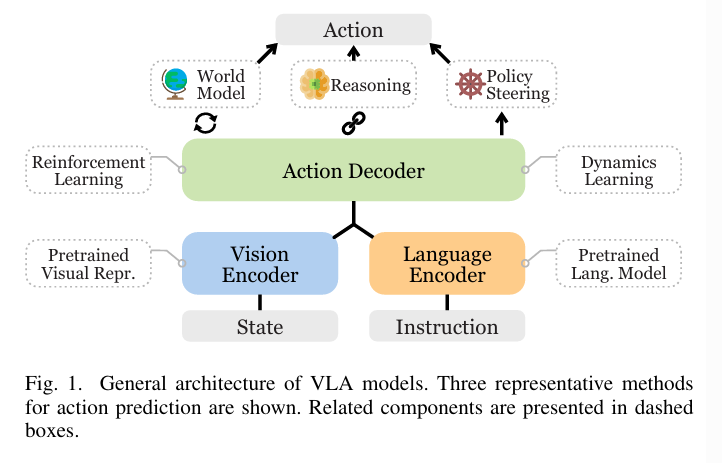

* Embodied AI는 실제 환경과 상호작용해야 하기 때문에, 단순히 텍스트나 이미지를 이해하는 것만으로는 충분하지 않다.
* 로봇은 사용자의 language instruction을 이해하고, vision을 통해 주변 환경과 객체를 인식하며, 그 결과를 실제 action으로 변환해야 한다.
* 이러한 흐름에서 Vision-Language-Action(VLA) 모델은 vision, language, action을 통합하는 embodied AI의 중요한 연구 방향으로 등장했다.
* 기존 LLM과 VLM이 언어 이해와 시각-언어 이해에서 큰 발전을 보였듯이, VLA도 다양한 task와 환경에 대응할 수 있는 versatile multitask policy를 목표로 한다.
* 다만 로봇은 실제 세계에서 움직이기 때문에, VLA는 model architecture뿐 아니라 data collection, action prediction, safety, evaluation 문제까지 함께 다뤄야 한다.

### A. Related Work

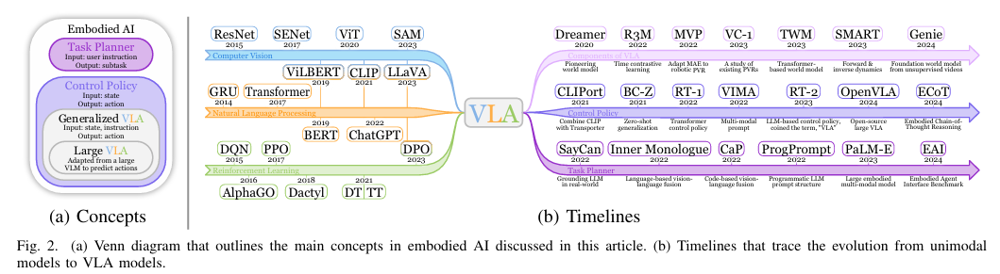

* 기존 연구들은 embodied AI, robot learning, multimodal learning, vision-language models, task planning 등 여러 관점에서 VLA와 관련된 흐름을 다뤄왔다.
* Robot learning은 전통적으로 RL, imitation learning, MDP/POMDP 관점에서 로봇의 policy 학습을 설명해왔다.
* Multimodal learning과 VLM 연구는 image captioning, VQA, text-to-video generation처럼 vision과 language를 연결하는 능력을 발전시켰다.
* VLA는 vision, language, action을 통합하여 embodied agent가 physical world와 상호작용하고 user instruction을 수행할 수 있도록 하는 모델이다.
* 이 논문은 VLA를 key components, control policies, task planners라는 세 가지 연구 흐름으로 나누어 정리한다.

### B. Contributions

* 이 survey는 VLA 분야를 체계적으로 정리하기 위해 taxonomy를 제시한다.
* 저자들은 VLA 연구를 key components, control policies, task planners라는 세 가지 주요 흐름으로 나누어 설명한다.
* 또한 각 흐름에 해당하는 model architectures, training strategies, individual modules를 분석하고 비교한다.
* 추가로 VLA를 학습하고 평가하는 데 필요한 datasets, simulators, benchmarks와 같은 essential resources를 정리한다.
* 마지막으로 VLA와 embodied AI 분야의 challenges와 future research directions를 논의한다.

---
## II. Background

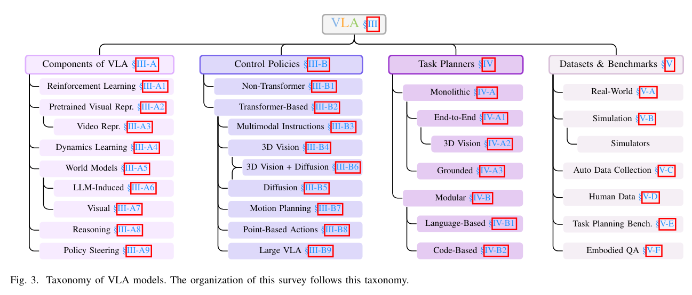

* VLA는 embodied AI, robot learning, multimodal learning의 흐름 위에서 발전한 vision-language-action 기반 모델이다.
* Embodied AI는 agent가 환경을 인식하고 행동하며, 물리적 또는 시뮬레이션 환경과 상호작용하는 문제를 다룬다.
* Robot learning에서는 로봇이 observation을 바탕으로 action을 선택하고, task 수행을 위한 policy를 학습한다.
* 기존 robot learning은 reinforcement learning과 imitation learning을 중심으로 발전했으며, Markov Decision Process(MDP)는 이러한 robot learning 문제를 표현하는 기본적인 수학적 틀로 사용된다.
* 이후 많은 multitask robot models는 수행할 task나 skill을 지정하기 위해 language instruction을 활용했으며, 이는 language-conditioned robot policy 연구로 이어졌다.
* Multimodal learning은 vision과 language 정보를 함께 처리하는 방향으로 발전해왔고, VLA는 이러한 multimodal understanding을 robot action generation과 연결한다.
* 따라서 VLA는 visual observation, language instruction, action generation을 함께 다루는 embodied AI 모델로 정리할 수 있다.

---


## III. Vision-Language-Action Models

* VLA는 embodied AI에서 vision, language, action 정보를 함께 처리하는 multimodal model이다.
* 이 장에서는 VLA를 구성하는 key components와 low-level control policies를 중심으로 정리한다.

---

### A. Components of VLA

#### 1. Reinforcement Learning

* Reinforcement Learning은 robot policy learning의 중요한 기반이며, robot learning 문제는 주로 Markov Decision Process(MDP) 관점에서 다루어져 왔다.
* RL trajectories는 states, actions, rewards로 이루어진 sequence이기 때문에 Transformer 기반 sequence modeling과 연결될 수 있다.
* Decision Transformer와 Trajectory Transformer는 trajectory를 sequence modeling 문제로 다루는 대표적인 예시이며, Gato는 이러한 흐름을 multimodal, multitask, multi-embodiment setting으로 확장한 사례이다.

#### 2. Pretrained Visual Representation

* Pretrained Visual Representation은 VLA에서 visual observation을 표현하기 위해 사용되는 vision encoder와 관련된다.
* Vision encoder는 object classes, locations, affordances 등 current state에 대한 중요한 정보를 제공하므로 VLA 성능에 직접적인 영향을 준다.
* CLIP과 R3M은 image-level information을 제공하는 데 유용하지만, depth, object position, segmentation task와 같은 pixel-level details에는 한계가 있을 수 있다.
* MAE, DINOv2, I-JEPA, Theia와 같은 방법은 이러한 pixel-level visual information을 보완하는 방향으로 활용된다.

#### 3. Video Representation

* Video representation은 image sequence를 활용하여 visual representation을 학습하는 흐름이다.
* Video는 시간에 따른 상태 변화와 행동 정보를 포함하므로 robot policy learning에 활용될 수 있다.
* 이 흐름은 NeRF, 3D representation, audio information 등 더 다양한 representation으로 확장된다.

#### 4. Dynamics Learning

* Dynamics learning은 forward dynamics와 inverse dynamics를 포함한다.
* Forward dynamics는 현재 상태와 현재 action을 바탕으로 다음 상태를 예측한다.
* Inverse dynamics는 현재 상태와 미래 상태를 바탕으로 그 사이에 필요한 action을 예측한다.
* 이러한 dynamics learning은 action label이 부족한 video data나 robot interaction data를 활용하는 데 중요하게 사용될 수 있다.

#### 5. World Models

* World model은 common-sense knowledge를 encode하고, 주어진 action에 따른 미래 상태를 예측하는 모델이다.
* World model은 forward dynamics와 유사하지만, 단순히 action decoder 학습을 보조하는 요소를 넘어 standalone module로 활용될 수 있다.
* Dreamer 계열, IRIS, TWM 등이 world model 기반 접근으로 언급된다.

#### 6. LLM-Induced World Models

* LLM-induced world model은 LLM을 활용하여 abstract world model, PDDL representation, search tree 등을 구성하는 접근이다.
* DECKARD, LLM-DM, RAP, LLM-MCTS와 같은 방법은 LLM의 reasoning 능력을 task planning과 decision making에 활용한다.
* 이 흐름은 language 또는 symbolic representation을 통해 가능한 상태 변화와 계획을 추론하는 방향으로 이해할 수 있다.

#### 7. Visual World Models

* Visual world model은 text 기반 world model과 달리 image, video, 3D scene과 같은 visual modality로 미래 상태를 예측하거나 생성한다.
* Sora, Genie, 3D-VLA, UniSim, E2WM 등이 visual world model 관련 흐름으로 언급된다.
* 이 접근은 실제 세계와 더 가까운 형태의 visual prediction을 활용하려는 방향이다.

#### 8. Reasoning

* Reasoning은 LLM의 Chain-of-Thought(CoT) 능력과 관련되며, decision-making process를 더 명시적으로 구성하기 위해 활용된다.
* ReAct는 reasoning traces와 actions를 결합해 action plan을 생성하고, commonsense knowledge와 exception handling을 포함할 수 있도록 한다.
* Tree-Planner, ECoT, CoT-VLA와 같은 방법은 reasoning을 task planning 또는 VLA의 action generation 과정에 활용하는 사례이다.
* 특히 long-horizon task에서는 단순히 action을 바로 출력하는 것보다, 중간 reasoning 과정을 통해 subgoal을 설정하고 실패 상황에서 replanning하는 능력이 중요하다.

#### 9. Policy Steering

* Policy steering은 costly retraining 없이 test-time에서 VLA performance를 개선하려는 접근이다.
* V-GPS는 learned value function을 사용해 generated actions를 re-rank한다.
* RoboMonkey는 VLM-based verifier를 사용해 optimal action을 선택한다.
* 생성된 action 후보를 value function이나 VLM-based verifier로 다시 평가하고, 그중 더 안전하거나 성공 가능성이 높은 action을 선택하는 방식으로 이해할 수 있다

.

#### 10. Strengths and Limitations

* CLIP이나 time contrastive learning 기반 representation은 image-level information을 제공하는 데 유용하지만, depth, object position, segmentation과 같은 pixel-level details에는 한계가 있다.
* Forward dynamics는 미래 상태를 예측해야 하므로 inverse dynamics보다 학습이 어려울 수 있지만, 성능 향상에 크게 기여할 수 있다.
* Inverse dynamics는 action label이 없는 video data에서 필요한 action을 추정하는 데 유용하다.
* World model은 low-level control policy와 high-level task planner 모두에 적용될 수 있지만, 주로 low-level action에 따른 즉각적인 다음 상태 생성을 다루기 때문에 low-level control policy와 더 밀접하게 연결된다.
* 반면 CoT-based reasoning methods는 text-based task plan과 thought chain을 사용하기 때문에 high-level task planning과 더 밀접하게 연결된다.

---


### B. Low-level Control Policies
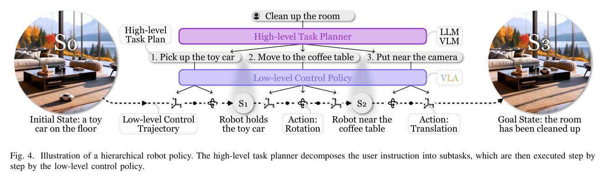
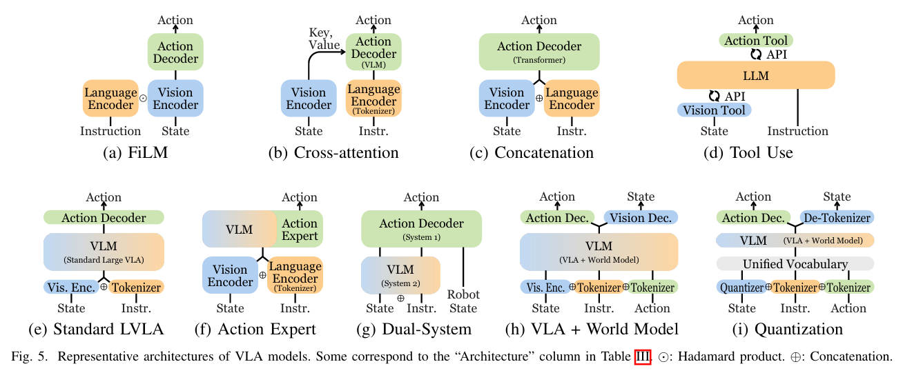

* Low-level control policy는 language instructions와 visual observations를 입력으로 받아 low-level actions를 생성하는 VLA의 한 축이다.
* 일반적으로 vision encoder와 language encoder가 입력 정보를 표현하고, action decoder가 이를 바탕으로 low-level action을 생성한다.
* VLA에서 control policy는 language instruction을 실행 가능한 robot action으로 변환하는 핵심 구성요소이며, low-level policy, low-level controller, action primitive 등으로도 불린다.

#### 1. Non-Transformer Control Policies

* Non-transformer control policies는 Transformer 기반 VLA가 본격적으로 등장하기 전의 language-conditioned robot policy 흐름이다.
* CLIPort는 CLIP과 Transporter Network를 결합한 two-stream architecture를 사용하여 RGB image의 semantic information과 RGB-D image의 spatial information을 함께 활용한다.
* BC-Z는 language instruction 또는 human demonstration video를 조건으로 받아 다양한 manipulation task를 수행하는 policy를 학습한다.
* MCIL, HULC, HULC++, UniPi 등도 Transformer 이전 또는 비-Transformer 중심의 control policy 흐름으로 언급된다.
* 이 시기의 모델들은 VLA가 본격적으로 대형화되기 전, language-conditioned robot policy의 기본 구조를 형성했다는 점에서 의미가 있다.

#### 2. Transformer-Based Control Policies

* Transformer-based control policies는 robot control policy에 Transformer 구조와 sequence modeling을 적용하는 흐름이다.
* Hiveformer는 language-conditioned policy에 Transformer 구조를 도입한 초기 사례 중 하나이다.
* Gato는 다양한 task의 입력과 출력을 unified tokenization으로 처리하여 Atari game, image captioning, block stacking 등을 하나의 모델에서 다룬다.
* RT-1은 EfficientNet 기반 vision encoder와 Transformer decoder를 사용하며, action을 discretized action token으로 출력한다.
* Q-Transformer, RT-Trajectory, Astra, RoboCat 등은 Transformer 기반 control policy를 확장한 사례로 정리된다.
* 이 흐름은 robot policy가 단일 이미지에만 반응하는 것이 아니라, 시간에 따른 관찰과 행동 맥락을 함께 고려하는 방향으로 발전했음을 보여준다.

#### 3. Control Policies for Multimodal Instructions

* Multimodal instruction은 task specification을 language instruction에만 제한하지 않고, demonstration, novel object naming, finger pointing, mouse click 등으로 확장한다.
* VIMA는 multimodal prompt를 활용하여 다양한 object manipulation task를 수행하는 대표적인 예시이다.
* MOO는 RT-1 backbone을 활용하여 multimodal instruction 기반 control policy를 구성한다.
* 이는 사용자가 로봇에게 작업을 지시하는 방식이 더 다양해질 수 있음을 보여준다.
* 따라서 VLA는 단순히 언어를 이해하는 것을 넘어, 여러 형태의 지시 신호를 action generation에 연결해야 한다.

#### 4. Control Policies with 3D Vision

* Control policies with 3D vision은 2D image보다 3D vision이 더 풍부한 공간 정보를 제공할 수 있다는 전제에서 출발한다.
* Point cloud, voxel, multi-view RGB-D와 같은 3D representation은 manipulation task에서 공간 구조를 더 명확하게 표현하는 데 활용된다.
* VER, PerAct, RoboUniView, Act3D, RVT, RVT-2 등이 3D vision 기반 control policy로 언급된다.
* 특히 manipulation task에서는 물체의 3D 구조와 주변 환경의 공간 관계를 이해하는 것이 중요하기 때문에, 3D vision은 low-level action prediction에 유용할 수 있다.

#### 5. Diffusion-Based Control Policies

* Diffusion-based control policies는 computer vision 분야에서 성공한 diffusion model을 robot action generation에 적용하는 흐름이다.
* Diffusion Policy는 robot policy를 DDPM 형태로 정식화하고, receding horizon control, visual conditioning, time-series diffusion Transformer 등을 결합한다.
* SUDD, Octo, MDT, RDT-1B 등이 diffusion-based control policy 흐름으로 언급된다.
* 특히 하나의 상황에서 가능한 행동이 여러 개 존재하는 manipulation task에서 diffusion 기반 policy가 강점을 가질 수 있다.

#### 6. Diffusion-Based Control Policies with 3D Vision

* Diffusion-based control policies with 3D vision은 diffusion 기반 action generation에 3D vision input을 결합하는 접근이다.
* DP3는 diffusion policy에 3D point cloud input을 도입한 대표적인 예시이다.
* 3D 정보는 객체의 위치와 형상을 더 정확히 제공하고, diffusion policy는 이를 바탕으로 더 정교한 action trajectory를 생성할 수 있다.
* 따라서 이 방향은 복잡한 manipulation task에서 공간 이해와 action generation을 함께 강화하려는 시도로 볼 수 있다.

#### 7. Control Policies for Motion Planning

* Control policies for motion planning은 movement task를 discrete waypoints로 분해하고, obstacle avoidance와 kinematic limits 같은 constraints를 만족하도록 계획하는 흐름이다.
* Natural language를 활용한 robot correction이나 human-in-the-loop control도 이 범주에서 다루어진다.
* VoxPoser는 별도의 training 없이 LLM과 VLM을 motion planning에 직접 연결하는 방법으로 소개된다.
* RoboTAP은 TAPIR algorithm을 사용해 source pose에서 target pose까지 관련 object를 추적하는 active points를 탐지한다.
* 언어 명령을 motion planning과 연결하면, 사용자의 자연어 지시를 실제 이동 경로나 조작 경로로 변환할 수 있다.

#### 8. Control Policies with Point-Based Actions

* Point-based action policy는 action을 직접 dense하게 예측하기보다 image 또는 3D space상의 point, keypoint, affordance point를 중심으로 action을 표현한다.
* PIVOT은 image 위의 keypoint를 반복적으로 refine하여 적절한 option을 선택한다.
* RoboPoint는 spatial affordance prediction task에 VLM을 fine-tuning한다.
* ReKep도 point-based action 흐름에서 함께 언급된다.
* VLM이 특정 물체의 중요한 위치나 조작 가능한 지점을 지정하고, control policy가 그 지점을 기준으로 action을 수행하는 구조로 이해할 수 있다.
* 이 방식은 action 표현이 비교적 단순하지만, zero-shot으로 중요한 조작 위치를 얻기 쉽다는 장점이 있다.

#### 9. Large VLA

* Large VLA는 LLM과 general language model의 구분과 유사하게, 일반 VLA보다 더 큰 foundation model 기반의 VLA를 의미한다.
* 일반적인 VLA보다 큰 모델과 대규모 데이터를 활용해 instruction following, semantic understanding, generalization 능력을 강화하려는 시도이다.
* RT-2는 Internet-scale VQA data와 robot data를 함께 학습하는 co-fine-tuning strategy를 사용한다.
* RT-X는 RT-1, RT-2, Open X-Embodiment data를 연결하는 흐름으로 볼 수 있다.
* OpenVLA는 RT-2-X의 open-source counterpart로 소개되며, LoRA와 model quantization 같은 efficient fine-tuning 방법과 함께 다루어진다.
* 이후 OpenVLA-OFT, TraceVLA, π0, RoboMamba, SpatialVLA, LAPA, TinyVLA, DexVLA, HybridVLA, GR00T N1, NORA-1.5, WorldVLA, UniVLA 등 다양한 LVLA 확장 모델이 등장한다.
* 다만 모델 크기가 커질수록 학습 비용, 추론 속도, 실시간 배포 문제가 함께 커진다.

#### 10. Strengths and Limitations

* Low-level control policy는 vision-language input을 실제 robot action으로 연결한다는 점에서 VLA의 핵심 구성요소이다.
* 이 절에서는 low-level control policy의 strengths and limitations를 architecture, action types and training objectives, RT series, LVLA vs. generalized VLA, scaling laws 관점에서 정리한다.

##### a) Architecture

* VLA architecture의 핵심은 vision, language, action 정보를 어떤 방식으로 결합하느냐이다.
* RT-1 계열은 FiLM을 사용하여 language instruction을 visual feature에 반영한다.
* Cross-attention은 modality 간 관계를 세밀하게 연결할 수 있어 작은 모델에서 효과적일 수 있다.
* Token concatenation은 구조가 단순하지만, 큰 모델에서는 충분히 좋은 성능을 낼 수 있다.
* Quantization은 image, language, action과 같은 multimodal information을 common token vocabulary로 통합하여 VLA와 world model을 연결하기 쉽게 만든다.
* LLM의 tool-use 방식도 robot task에 적용될 수 있는 architecture 방향으로 언급된다.

##### b) Action Types and Their Training Objectives

* VLA control policy의 training objective는 action representation에 따라 달라진다.
* Continuous action은 translation, rotation, joint command처럼 연속적인 값을 예측하며, expert action과 predicted action 사이의 numerical difference를 줄이기 위해 MSE objective를 사용할 수 있다.
* Discrete action은 action을 token prediction 문제로 다루며, cross-entropy objective를 사용할 수 있다.
* Diffusion-based action은 noisy action trajectory를 복원하는 방식으로 학습되며, DDPM objective를 사용한다.
* SE(2) action은 pick-and-place와 같은 tabletop manipulation에 적합할 수 있지만, pouring과 같은 복잡한 manipulation task에는 SE(3) action이 필요할 수 있다.
* Point-based action은 image 또는 3D space상의 keypoint나 affordance point를 중심으로 action을 표현한다.
* Point-based action은 상대적으로 coarse할 수 있지만, VLM으로부터 zero-shot으로 얻기 쉽다는 장점이 있다.

##### c) RT Series

* RT series는 VLA가 대규모 robot data와 internet-scale vision-language data를 함께 활용하는 방향으로 발전했음을 보여준다.
* RT-1은 language-conditioned robot trajectory data를 사용하여 instruction-following policy를 학습한다.
* RT-2는 internet-scale vision-language data와 robot data를 함께 학습하여 VLA의 generalization을 확장하려는 시도이다.
* RT-X는 cross-embodiment data를 활용하여 다양한 robot embodiments와 tasks에 대한 일반화를 목표로 한다.

##### d) LVLA vs. Generalized VLA

* LVLA는 대형 foundation model을 활용하기 때문에 user instruction을 더 잘 해석하고 instruction-following 및 generalization 능력을 높일 수 있다.
* 그러나 모델 크기가 커질수록 training cost와 inference latency 문제가 발생할 수 있다.
* 실제 로봇 환경에서는 inference가 늦어지면 환경 변화에 뒤처진 obsolete action이 생성될 수 있으므로 responsiveness와 efficiency가 중요한 한계로 작용한다.
* TinyVLA와 DeeR-VLA는 이러한 efficiency 문제를 다루는 사례로 언급된다.
* Generalized VLA는 다양한 robots, tasks, environments에 적용되는 범용성을 목표로 하지만, data inconsistency와 embodiment 차이가 여전히 중요한 한계로 남는다.

##### e) Scaling Laws

* Scaling laws는 model size, data size, task diversity가 커질수록 성능이 향상되는 경향을 설명한다.
* VLA에서도 scaling law와 유사한 경향이 관찰되지만, robot data는 수집 비용이 높고 embodiment 간 차이가 크다.
* 따라서 VLA는 NLP의 LLM처럼 단순히 model size와 data size를 키우는 방식만으로 scale up하기 어렵다.

---

## IV. Task Planners

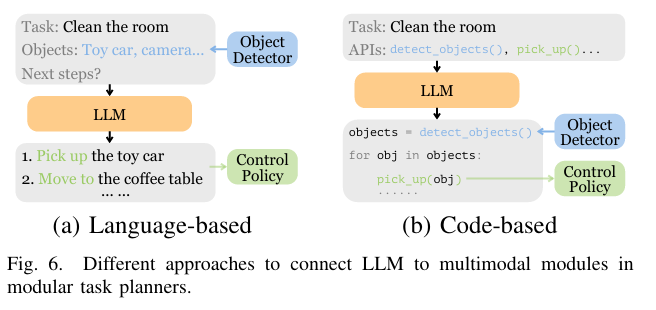

* High-level task planner는 complex long-horizon task를 여러 개의 subtask sequence로 분해하는 역할을 한다.
* 이 과정은 task decomposition 또는 subgoal decomposition으로 볼 수 있으며, low-level control policy가 한 번에 처리하기 어려운 긴 명령을 중간 단계로 나누는 데 사용된다.
* Task planner는 task의 순서 결정, high-level reasoning, failure handling, replanning과 관련된다.
* 이 흐름은 Task and Motion Planning(TAMP), embodied decision making과 연결된다.

### A. Monolithic Task Planner

* Monolithic task planner는 하나의 큰 MLLM 또는 VLM 기반 모델이 high-level embodied reasoning과 task planning을 직접 수행하는 방식이다.
* 이러한 접근은 perception, language understanding, reasoning, planning을 하나의 모델 안에서 처리하려는 방향으로 볼 수 있다.
* Monolithic planner는 end-to-end fine-tuning을 통해 specialized embodied data를 활용할 수 있지만, training cost와 model size가 커질 수 있다.

#### A-1. End-to-End Task Planners

* End-to-end task planner는 internet-scale knowledge와 visual input을 활용하여 high-level embodied reasoning task를 수행한다.
* PaLM-E는 multimodal input을 받아 text output을 생성하고, generated text plan을 low-level robotic policy에 전달하는 구조로 소개된다.
* 이 방식은 visual observation과 language instruction을 바탕으로 task-relevant plan을 생성하는 데 사용된다.
* 다만 generated plan이 실제 low-level control policy로 안정적으로 실행되기 위해서는 grounding과 execution 가능성이 함께 고려되어야 한다.

#### A-2. End-to-End Task Planners with 3D Vision

* End-to-end task planners with 3D vision은 2D image만으로 부족한 spatial information을 보완하기 위해 3D visual information을 task planning에 활용한다.
* 3D vision-language alignment와 3D vision-language-action instruction tuning은 객체 위치, 공간 관계, 장면 구조를 더 명확하게 반영하기 위한 방법으로 다루어진다.
* 이러한 접근은 manipulation, navigation, 3D question answering처럼 spatial understanding이 중요한 embodied task와 연결된다.

#### A-3. Grounded Task Planner

* Grounded task planner는 LLM이 생성한 high-level plan이 실제 환경에서 수행 가능한지를 함께 고려하는 방식이다.
* SayCan은 LLM의 language likelihood와 low-level policy의 affordance 또는 value function을 결합하여 다음 action을 선택하는 대표적인 예시이다.
* 이 방식은 자연어상 그럴듯한 plan뿐 아니라, 현재 환경에서 실행 가능한 action을 선택하는 데 초점을 둔다.
* Grounded task planner는 language-based planning과 executable robot action 사이의 연결을 강화하는 접근으로 정리된다.

### B. Modular Task Planner

* Modular task planner는 LLM, VLM, object detector, scene representation module, control policy 등 여러 module을 조합하여 task planning을 수행하는 방식이다.
* 이 방식은 기존에 학습된 off-the-shelf models를 활용할 수 있으므로, 하나의 큰 모델을 새로 학습하지 않아도 된다는 장점이 있다.
* 그러나 단순한 plug-and-play 방식은 아니며, 각 module의 input/output format을 맞추고 필요한 기능을 API나 text representation으로 연결해야 한다.
* 따라서 training cost는 줄일 수 있지만, system design과 module integration의 복잡도는 증가할 수 있다.

#### B-1. Language-based Task Planner

* Language-based task planner는 natural language description을 중심으로 planning과 feedback을 수행하는 방식이다.
* LLM은 natural language plan을 생성하고, object feedback, scene feedback, success feedback, human feedback 등을 text 형태로 받아 replanning에 활용할 수 있다.
* 이 방식은 LLM과 VLM이 natural language space에서 비교적 쉽게 연결될 수 있다는 장점이 있다.
* 하지만 generated subtask가 실제 low-level control policy로 실행 가능하지 않을 수 있다는 한계가 있다.

#### B-2. Code-based Task Planner

* Code-based task planner는 LLM이 API call이나 code/program 형태로 task plan을 생성하는 방식이다.
* Object detector, grasp API, move API, control policy 등을 function 형태로 준비해두고, LLM이 이를 호출하여 task를 수행한다.
* 이 방식은 natural language plan보다 structure가 명확하기 때문에 debugging과 controllability 측면에서 장점이 있다.
* 하지만 각 module을 사람이 미리 API로 wrapping해야 하며, API documentation과 input/output format이 명확해야 한다.
* Code-based planner의 성능은 LLM의 coding ability와 사전에 준비된 API의 품질에 영향을 받는다.

### C. Strengths and Limitations

* Monolithic task planner는 perception, reasoning, planning을 하나의 모델 안에 통합하고, end-to-end fine-tuning을 통해 specialized embodied task에 맞출 수 있다.
* 그러나 큰 model을 학습하거나 fine-tuning해야 하므로 training cost가 크고, LVLA와 유사한 large model 구조를 함께 사용할 경우 계산 비용과 역할 중복 문제가 발생할 수 있다.
* Modular task planner는 off-the-shelf LLM, VLM, detector, control policy를 활용할 수 있어 상대적으로 유연하게 구성할 수 있다.
* 하지만 language-based planner는 실행 불가능한 subtask를 생성할 수 있고, code-based planner는 각 module을 API로 미리 wrapping해야 하는 부담이 있다.
* 따라서 task planner의 중요한 한계는 high-level plan을 low-level executable action과 안정적으로 연결하는 문제이다.

---

## V. Datasets and Benchmarks

* VLA를 학습하고 평가하기 위해서는 robot datasets, simulators, benchmarks가 필요하다.
* 그러나 embodied AI에서는 실제 로봇 데이터 수집 비용, 다양한 robot embodiment, 평가 환경 재현성 등의 문제로 인해 데이터와 벤치마크 구성이 어렵다.
* 이 절에서는 real-world robot datasets, simulated datasets, automated dataset collection, human datasets, task planning benchmarks, embodied question answering benchmarks를 정리한다.

### A. Real-World Robot Datasets and Benchmarks

* Embodied AI는 real-world robot data가 부족하다는 data scarcity 문제를 가진다.
* 첫 번째 이유는 robot equipment를 준비하고, 실험 환경을 구성하며, expert policy 또는 human teleoperation을 통해 데이터를 수집하는 과정에 많은 비용과 시간이 필요하기 때문이다.
* 두 번째 이유는 robot의 종류와 configuration이 다양하기 때문에 sensory data, control mode, gripper type 등에서 inconsistency가 발생하기 때문이다.
* 세 번째 이유는 6D object pose를 정확히 측정하거나 실험 setup을 동일하게 재현하는 것이 어렵기 때문이다.
* 또한 real-world benchmark는 사람의 평가가 필요한 경우가 많아, 자동화된 평가와 공정한 비교가 어렵다.

### B. Simulators, Simulated Robot Datasets and Benchmarks

* Real-world data collection의 어려움을 줄이기 위해 많은 연구는 simulated environments를 활용한다.
* Simulation은 data collection을 확장하기 쉽고, 실험 setup을 재현할 수 있으며, 서로 다른 모델을 공정하게 비교하는 데 유용하다.
* 또한 simulated environments는 automated evaluation metrics를 제공할 수 있고, failure cases를 재현하거나 digital twins를 구성하는 데 도움을 줄 수 있다.
* 그러나 simulated data로 학습한 모델을 실제 환경에 적용할 때 sim-to-real gap이 발생할 수 있다.
* 이 gap은 unrealistic rendering quality, physics simulation의 부정확성, object properties의 차이, robot motion planner의 차이와 같은 domain shift에서 비롯된다.
* 특히 deformable objects나 liquids와 같은 대상은 simulation에서 정확히 다루기 어렵다.
* 또한 새로운 object를 simulator에 추가하려면 3D scanning, mesh editing과 같은 추가 작업이 필요할 수 있다.
* 따라서 simulation은 scalability와 reproducibility 측면에서 장점이 있지만, 실제 세계와의 차이를 줄이는 것이 중요한 과제로 남는다.

### C. Automated Dataset Collection

* Data scarcity 문제를 완화하기 위해 automated dataset collection을 활용하는 접근들이 제안되었다.
* RoboGen은 generative simulation paradigm을 사용하여 흥미로운 skills를 제안하고, 해당 environment를 simulation하며, 그 skill을 학습하기 위한 적절한 learning approach를 선택한다.
* AutoRT는 LLM 기반 robot orchestrator로 동작하며, task를 생성하고, affordance를 기준으로 filtering한 뒤, autonomous policy 또는 human teleoperator를 활용하여 데이터를 수집하고 평가한다.
* DIAL은 기존 dataset의 language instructions를 VLM을 활용해 확장한다.
* RoboPoint는 randomized 3D layouts, objects, camera viewpoints를 가진 scene을 procedural하게 생성한다.
* 이러한 automated dataset collection 방식은 데이터 수집 규모를 키우는 데 도움을 줄 수 있지만, 생성된 데이터의 품질과 실제 환경과의 차이는 여전히 고려해야 한다.

### D. Human Datasets

* Real-world robot data 부족을 해결하기 위한 또 다른 방법은 human data를 활용하는 것이다.
* Human data는 사람의 dexterity와 다양한 행동을 포함하기 때문에 robot policy 학습에 풍부한 guidance를 제공할 수 있다.
* 그러나 human hand와 body motion을 robot embodiment로 옮기는 것은 어렵다.
* 또한 human data는 egocentric perspective와 third-person perspective가 섞여 있는 등 data format과 viewpoint가 일관되지 않을 수 있다.
* 유용한 정보를 추출하기 위해 human data를 filtering하는 과정도 많은 노동을 요구할 수 있다.
* UMI는 hand-held gripper를 활용하여 human demonstration과 robot embodiment 사이의 차이를 줄이려는 방법으로 소개된다.

### E. Task Planning Benchmarks

* Task planning benchmark는 generated plan의 품질, 실행 가능성, replanning 능력 등을 평가하기 위해 사용된다.
* EgoPlan-Bench는 human annotations를 활용하여 real-world task planning을 benchmark하는 데 초점을 둔다.
* PlanBench는 cost optimality, plan verification, replanning 등 task planning ability의 여러 측면을 평가한다.
* LoTa-Bench는 generated plan을 simulator에서 실행하고 success rate를 계산하여 task planning을 평가한다.
* EAI, 즉 Embodied Agent Interface는 LLM-based module의 input-output을 decision making task에 맞게 formalize하여, success rate를 넘어서는 fine-grained metrics를 가능하게 한다.
* 따라서 task planning benchmark는 task 성공 여부뿐 아니라 plan의 검증 가능성, 비용 효율성, 실패 후 재계획 능력 등을 함께 평가하려는 방향으로 발전하고 있다.

### F. Embodied Question Answering Benchmarks

* Embodied Question Answering, 즉 EQA benchmark는 embodied AI의 spatial reasoning, physics understanding, world knowledge와 같은 능력을 평가한다.
* EQA는 manipulation이나 navigation 같은 robotic task를 직접 평가하기보다는, agent가 환경을 이해하고 질문에 답하는 능력을 평가한다.
* 전통적인 VQA benchmark와 유사하지만, EQA에서는 agent가 답변하기 전에 환경을 능동적으로 탐색할 수 있다는 차이가 있다.
* EmbodiedQA와 IQUAD는 이러한 benchmark를 초기에 제시한 대표적인 연구로 언급된다.
* MT-EQA는 여러 target이 포함된 complex questions에 초점을 둔다.
* MP3D-EQA는 기존 RGB input을 point cloud로 변환하여 3D perception 능력을 평가한다.
* 다만 active exploration을 위해 simulator 접근이 필요하므로, real-world data 활용에는 제한이 생길 수 있다.
* EgoVQA는 egocentric videos를 기반으로 VQA의 초점을 옮긴 benchmark이다.
* EgoTaskQA는 spatial, temporal, causal relationship reasoning을 강조한다.
* EQA-MX는 verbal utterances뿐 아니라 eye gaze, pointing과 같은 nonverbal gestures를 포함한 multimodal expressions를 다룬다.
* OpenEQA는 functional reasoning과 world knowledge를 포함한 여러 category를 평가한다.

---

## VI. Challenges and Future Directions

### a) Safety First

* VLA가 실제 로봇 행동으로 연결되기 위해서는 성능뿐 아니라 safety가 중요한 문제로 다루어진다.
* Evaluation without execution은 로봇이 실제 행동을 수행하기 전에 generated plan이나 action을 평가함으로써 safety risk를 낮추는 방법으로 제시된다.
* RLHF, safety validation, human feedback 등은 모델이 위험하거나 부적절한 action을 선택할 가능성을 줄이는 데 활용될 수 있다.
* 따라서 VLA의 safety 문제는 단순한 task success rate뿐 아니라, 실행 전 검증과 위험 행동 차단을 포함하는 방향으로 논의된다.

### b) Datasets and Benchmarks

* VLA 학습과 평가를 위해서는 다양한 skills, objects, embodiments, environments를 포괄하는 datasets와 benchmarks가 필요하다.
* 그러나 현재 benchmarks는 특정 환경이나 특정 task에 치우칠 수 있으며, 실제 환경에서의 generalization 능력을 충분히 평가하기 어렵다.
* Success rate만으로는 모델이 왜 실패했는지 세밀하게 파악하기 어렵기 때문에 fine-grained metrics가 필요하다.
* 특히 task planning에서는 plan verification, replanning, cost optimality, failure diagnosis와 같은 평가 기준이 함께 고려된다.

### c) Foundation Models and Generalization

* VLA foundation model 또는 robotic foundation model은 embodied AI에서 중요한 연구 방향이지만, 여전히 open research topic으로 남아 있다.
* VLA는 NLP 분야의 LLM처럼 강한 generalization capability를 아직 갖추지 못했다.
* 이는 robot embodiment, environment, task의 차이가 크고, 실제 robot data를 대규모로 수집하기 어렵기 때문이다.
* 따라서 VLA의 generalization 문제는 model size만 키우는 방식으로 해결되기 어렵고, 다양한 embodiments와 tasks를 포괄하는 data와 model design이 함께 필요하다.

### d) Multimodality

* VLA는 기본적으로 vision, language, action을 중심으로 하지만, embodied AI에서는 audio, haptics, gaze와 같은 추가 modality도 활용될 수 있다.
* Gaze data는 사람이 환경에서 중요하게 보는 위치를 제공할 수 있기 때문에, policy network의 성능을 높이는 데 사용될 수 있다.
* 하지만 여러 modality를 하나의 embedding space에 정렬하는 것만으로 충분한지는 여전히 논의가 필요하다.
* 추가 modality는 더 많은 정보를 제공할 수 있지만, 동시에 model design과 data processing의 complexity를 증가시킨다.

### e) Framework for Long-Horizon Tasks

* Long-horizon task에서는 high-level task planner와 low-level control policy를 나누는 hierarchical framework가 널리 사용된다.
* 그러나 hierarchical framework는 system complexity를 증가시키고, 여러 module 사이의 연결 지점이 많아지면서 failure point가 늘어날 수 있다.
* Task execution failure가 자주 발생하면 replanning이 반복되고, 이로 인해 latency가 커질 수 있다.
* 또한 monolithic task planner와 LVLA를 함께 사용하는 경우, 두 개의 large model을 동시에 사용하는 구조가 되어 computation cost와 role redundancy 문제가 발생할 수 있다.
* 따라서 long-horizon task를 low-level control signal로 직접 연결하는 unified framework는 앞으로 탐구할 가치가 있는 방향으로 제시된다.

### f) Real-Time Responsiveness

* 실제 로봇 환경에서는 주변 상황이 계속 변하기 때문에 VLA는 real-time decision-making 능력이 필요하다.
* Model inference time이 환경 변화 속도를 따라가지 못하면, 이미 낡은 정보에 기반한 obsolete action을 반복 생성할 수 있다.
* 특히 LVLA나 task planner처럼 큰 모델은 reasoning과 generalization에는 유리할 수 있지만, inference latency 측면에서는 한계가 생길 수 있다.
* 따라서 VLA는 model capacity와 inference speed 사이의 trade-off를 고려해야 하며, 실제 배포를 위해 responsiveness가 중요한 문제로 남는다.

### g) Multiagent Systems

* Cooperative multiagent system은 여러 agents가 협력하여 더 넓은 환경을 인식하고 작업을 분담할 수 있다는 장점이 있다.
* Distributed perception은 여러 agents가 각자 다른 위치에서 얻은 정보를 결합하여 환경을 더 넓게 이해하는 방식이다.
* Collaborative fault recovery는 한 agent가 실패했을 때 다른 agent가 이를 보완하거나 작업을 이어받는 구조이다.
* 그러나 multiagent system에서는 effective communication, coordinated dispatching, fleet heterogeneity, conflicting goals와 같은 문제가 발생할 수 있다.
* 따라서 multiagent VLA에서는 개별 agent의 성능뿐 아니라 agents 간 coordination과 collaboration이 중요한 과제로 다루어진다.

### h) Ethical and Societal Implications

* 로봇 기술은 실제 사회와 사람 주변에서 작동하기 때문에 ethical, societal, legal issues를 함께 고려해야 한다.
* Privacy 문제는 로봇이 camera, microphone, location information 등을 수집하면서 개인의 사생활을 침해할 수 있다는 점과 관련된다.
* Job displacement는 로봇이 사람의 노동을 일부 대체하면서 일자리 구조에 영향을 줄 수 있다는 문제이다.
* Decision-making bias는 AI나 로봇이 특정 사람이나 상황에 대해 편향된 판단을 내릴 가능성을 의미한다.
* 또한 로봇은 social norms와 human relationships에도 영향을 줄 수 있으므로, 기술적 성능뿐 아니라 사회적 수용성과 책임 문제도 함께 다루어져야 한다.

### i) Applications

* 현재 대부분의 VLA는 household settings와 industrial settings에 집중되어 있지만, 앞으로 더 넓은 application domain으로 확장될 수 있다.
* 가능한 응용 분야에는 virtual assistants, autonomous vehicles, agricultural robots, healthcare 등이 있다.
* 또한 dexterous hands, drones, quadruped robots, humanoid robots처럼 다양한 embodiments에 맞춘 specialized VLA가 필요할 수 있다.
* Healthcare는 surgical robots와 care robots를 포함하는 중요한 application domain으로 다루어진다.
* Healthcare에서는 사람의 생명과 민감한 정보를 다루기 때문에 높은 safety와 privacy standard가 요구된다.
* 이를 위해 human-in-the-loop control, federated learning, medical images에 특화된 specialized vision model 등이 활용될 수 있다.

---

## VII. Conclusion

* VLA models는 embodied agents가 physical world와 상호작용하고, user instructions를 수행할 수 있게 한다는 점에서 큰 가능성을 가진다.
* 이 논문은 LVLA와 generalized VLA를 함께 다루는 survey로, VLA 연구를 key components, control policies, task planners라는 세 가지 주요 흐름으로 분류하는 taxonomy를 제시한다.
* 또한 각 흐름의 technical details를 model architectures, training strategies, individual modules 관점에서 분석하고 비교한다.
* 추가로 VLA를 학습하고 평가하는 데 필요한 datasets, simulators, benchmarks와 같은 essential resources를 정리한다.
* 저자들은 이 survey가 빠르게 변화하는 embodied AI 분야의 흐름을 포착하고, future research에 참고가 되기를 기대한다고 마무리한다.

---

</details>


<details>
<summary><b>24. OpenVLA: An Open-Source Vision-Language-Action Model</b></summary>

## Basic Information

- **Title**: OpenVLA: An Open-Source Vision-Language-Action Model
- **Authors**: Moo Jin Kim, Karl Pertsch, Siddharth Karamcheti, Ted Xiao, Ashwin Balakrishna, Suraj Nair, Rafael Rafailov, Ethan Foster, Grace Lam, Pannag Sanketi, Quan Vuong, Thomas Kollar, Benjamin Burchfiel, Russ Tedrake, Dorsa Sadigh, Sergey Levine, Percy Liang, Chelsea Finn
- **Conference / Journal**: Conference on Robot Learning, CoRL
- **Year**: 2024

---

## Why I Read This Paper

이 논문을 읽는 이유는 OpenVLA가 open-source VLA 연구에서 중요한 출발점이 되는 모델이기 때문이다.

OpenVLA는 pretrained Vision-Language Model을 robot policy로 확장하는 대표적인 사례이다. 즉 image observation과 language instruction을 입력받아, language model이 robot action token을 예측하도록 fine-tuning하는 구조를 보여준다. 이를 통해 VLM에서 robot action까지 수행할 수 있는 VLA 모델의 배경지식 습득을 목표로 하였다.

---

## One-line Summary

* OpenVLA는 image observation과 language instruction을 입력받아 7D robot action을 출력하는 7B-parameter open-source Vision-Language-Action model이다.
* 기존 VLA 모델들이 대부분 closed-source였고 fine-tuning 방법이 충분히 다뤄지지 않았다는 문제를 해결하기 위해, Open X-Embodiment dataset의 970k robot demonstrations로 학습한 공개형 VLA 모델과 학습/배포 코드를 제시한다.

---

## Understanding the Structure

## 0. Abstract

* 이 논문은 Vision-Language-Action(VLA) 모델을 embodied AI 관점에서 정리한 survey이다.
* VLA는 vision, language, action을 통합해 로봇이 언어 명령을 이해하고, 시각적으로 환경을 인식하며, 실제 행동을 생성하도록 하는 모델이다.
* 저자들은 VLA를 components of VLA, low-level control policies, high-level task planners라는 큰 구조로 나누어 설명한다.
* 또한 VLA 학습과 평가에 필요한 datasets, simulators, benchmarks를 함께 정리하고, safety, generalization, multimodality, long-horizon tasks 같은 future directions를 제시한다.
* 따라서 이 논문은 개별 VLA 모델 하나를 깊게 분석하는 논문이라기보다, VLA 분야의 전체 taxonomy와 연구 흐름을 잡기 위한 survey로 볼 수 있다.

---

## I. Introduction

### a) Problem: 기존 robot manipulation policy의 일반화 한계

* 기존 learned policy의 핵심 약점은 학습 데이터 밖의 상황에 대한 일반화 능력이 부족하다는 점이다.
* 기존 policy는 object position이나 lighting 변화처럼 새로운 initial condition에는 어느 정도 행동을 extrapolate할 수 있다.
* 그러나 scene distractor가 있거나 novel object가 등장하는 경우에는 robust하지 못하다.
* 또한 학습 과정에서 보지 못한 task instruction을 수행하는 데 어려움을 겪는다.

### b) Opportunity: Vision-Language Foundation Model 활용 가능성

* CLIP, SigLIP, Llama 2와 같은 vision-language foundation model은 Internet-scale pretraining을 통해 높은 일반화 능력을 보인다.
* 이러한 모델들은 object, scene, task에 대한 prior를 학습하고 있다.
* 반면 robot manipulation dataset은 아직 Internet-scale 수준에 도달하지 못했다.
* 논문은 이 차이에서 기존 vision-language foundation model을 robot policy 학습의 핵심 구성요소로 활용할 가능성을 제시한다.

### c) Existing Direction: VLA를 통한 robot control

* 기존 연구들은 pretrained language model과 vision-language model을 robot representation learning, task planning, execution 등에 활용해왔다.
* 최근 연구들은 visually-conditioned language model을 직접 fine-tuning하여 robot control action을 생성하는 Vision-Language-Action model, VLA를 제안했다.
* VLA는 pretrained vision-language foundation model을 robot policy에 직접 연결하는 방식이다.
* RT-2와 같은 VLA는 novel object와 novel task에 대한 generalization을 보이며 generalist robot policy의 새로운 기준을 제시했다.

### d) Limitation of Prior VLA Models

* 기존 VLA 모델이 널리 활용되기 어려운 이유는 크게 두 가지이다.
* 첫째, 기존 VLA 모델들은 대부분 closed-source이다.
* 이로 인해 model architecture, training procedure, data mixture에 대한 접근성이 제한된다.
* 둘째, 기존 연구들은 VLA를 새로운 robot, environment, task에 배포하고 적응시키기 위한 best practice를 충분히 제공하지 않았다.
* 특히 consumer-grade GPU와 같은 일반적인 hardware 환경에서 VLA를 효율적으로 fine-tuning하는 방법은 충분히 다뤄지지 않았다.

### e) Proposal: OpenVLA


* 논문은 이러한 문제를 해결하기 위해 OpenVLA를 제안한다.
* OpenVLA는 7B-parameter open-source Vision-Language-Action model이다.
* OpenVLA는 pretrained visually-conditioned language model backbone을 기반으로 한다.
* OpenVLA는 Open X-Embodiment dataset에서 가져온 970k robot manipulation trajectories로 fine-tuning된다.
* 이 dataset은 다양한 robot embodiment, task, scene을 포함한다.

### f) Performance Claim

* OpenVLA는 generalist robot manipulation policy에서 새로운 state-of-the-art 성능을 보였다고 보고된다.
* OpenVLA는 WidowX와 Google Robot embodiment에서 29개 evaluation task를 기준으로 평가되었다.
* 이 평가에서 OpenVLA는 기존 state-of-the-art VLA인 RT-2-X보다 absolute success rate 기준 16.5%p 높은 성능을 보였다.
* OpenVLA는 RT-2-X보다 parameter 수가 약 7배 적다.

### g) Fine-Tuning Study

* 논문은 OpenVLA를 새로운 robot setup에 fine-tuning하는 방법도 함께 조사한다.
* fine-tuning 실험은 object pick-and-place부터 table cleaning까지 다양한 manipulation task를 포함한다.
* fine-tuned OpenVLA는 Octo와 같은 pretrained policy를 fine-tuning한 경우보다 높은 성능을 보였다.
* 또한 multiple objects가 포함되고 language grounding이 필요한 multi-task setting에서 Diffusion Policy와 같은 from-scratch imitation learning method보다 높은 성능을 보였다.

### h) Compute-Efficient Fine-Tuning and Inference

* 논문은 OpenVLA를 더 효율적으로 fine-tuning하고 inference하는 방법도 탐구한다.
* LoRA와 같은 low-rank adaptation 방법을 활용하여 consumer-grade GPU에서도 OpenVLA를 fine-tuning할 수 있음을 보인다.
* quantization을 활용하면 downstream success rate 저하 없이 더 효율적인 inference가 가능하다고 보고한다.

### i) Open-Source Release

* 논문은 OpenVLA model checkpoint를 공개한다.
* deployment notebook과 fine-tuning notebook을 공개한다.
* Open X-Embodiment dataset을 활용해 VLA를 scale 있게 학습할 수 있는 PyTorch codebase도 공개한다.
* 저자들은 이러한 공개 자료가 후속 VLA 연구와 adaptation 연구를 가능하게 하는 기반이 되기를 기대한다.


## 2. Related Work

### a) Visually-Conditioned Language Models

* Visually-conditioned language model, VLM은 image와 language prompt를 입력으로 받아 natural language를 생성하도록 Internet-scale data로 학습된 모델이다.
* VLM은 visual question answering, object localization 등 다양한 task에 활용되어 왔다.
* 일반적으로 VLM은 pretrained vision encoder에서 나온 visual feature와 pretrained language model을 연결하는 구조를 가진다.
* 초기 VLM 연구들은 vision feature와 language feature 사이의 cross-attention 구조를 다양하게 탐구했다.
* 최근 open-source VLM들은 더 단순한 patch-as-token 접근으로 수렴하고 있다.
* patch-as-token 방식에서는 pretrained visual transformer에서 나온 image patch feature를 token처럼 다룬다.
* 이후 이 patch feature들은 language model의 input space로 projection된다.
* 이러한 VLM 구조가 OpenVLA policy의 backbone을 구성한다.

### b) Generalist Robot Policies

* 최근 로보틱스 연구에서는 다양한 robot dataset을 활용하여 multi-task generalist robot policy를 학습하는 흐름이 나타나고 있다.
* 이러한 dataset은 다양한 robot embodiment를 포함한다.
* Octo는 여러 robot을 out-of-the-box로 제어할 수 있는 generalist policy를 학습한다.
* 또한 Octo는 새로운 robot setup에 대해 flexible fine-tuning을 지원한다.
* OpenVLA와 이러한 기존 generalist policy의 주요 차이는 model architecture에 있다.
* Octo와 같은 기존 연구들은 pretrained language embedding이나 visual encoder를 사용하고, 여기에 scratch에서 초기화된 추가 model component를 결합한다.
* 이 방식은 policy training 과정에서 pretrained component와 새로 추가된 component를 서로 맞춰 학습하는 구조이다.
* 논문은 이를 “stitch” together라고 표현한다.
* OpenVLA는 더 end-to-end한 접근을 사용한다.
* OpenVLA는 visually-conditioned language model을 직접 fine-tuning하여 robot action을 생성한다.
* 이때 robot action은 language model vocabulary 안의 token처럼 취급된다.
* 논문은 이러한 단순하고 scalable한 pipeline이 기존 generalist policy보다 performance와 generalization ability를 크게 향상시킨다고 설명한다.

### c) Vision-Language-Action Models

* 여러 연구들은 VLM을 로보틱스에 활용하는 방법을 탐구해왔다.
* VLM은 visual state representation, object detection, high-level planning, feedback signal 제공 등에 활용되었다.
* 다른 연구들은 VLM을 end-to-end visuomotor manipulation policy에 직접 통합했다.
* 그러나 이러한 연구들은 policy architecture 안에 상당한 구조를 추가하거나 calibrated camera를 필요로 했다.
* 여러 연구들은 large pretrained VLM을 robot action prediction에 직접 fine-tuning했다.
* 이러한 모델들은 robot control action을 VLM backbone 안에 직접 결합하기 때문에 Vision-Language-Action model, VLA라고 불린다.
* 기존 VLA 연구들은 single robot setup이나 simulation setup에서 학습 및 평가되어 generality가 부족한 경우가 있었다.
* 또는 closed-source이기 때문에 새로운 robot setup에 대한 efficient fine-tuning을 지원하지 않는 경우가 있었다.

### d) Comparison with RT-2-X

* OpenVLA와 가장 밀접하게 관련된 연구는 RT-2-X이다.
* RT-2-X는 Open X-Embodiment dataset을 사용해 55B-parameter VLA policy를 학습했다.
* RT-2-X는 state-of-the-art generalist manipulation policy 성능을 보였다.
* 그러나 OpenVLA는 RT-2-X와 여러 측면에서 다르다.
* 첫째, OpenVLA는 강한 open VLM backbone과 더 풍부한 robot pretraining dataset을 결합한다.
* 이를 통해 OpenVLA는 실험에서 RT-2-X와 비슷하거나 더 높은 성능을 보이면서도, 모델 크기는 약 7배 작다.
* 둘째, OpenVLA는 새로운 target setup에 대한 fine-tuning을 자세히 조사한다.
* 반면 RT-2-X는 fine-tuning setting을 조사하지 않았다.
* 셋째, OpenVLA는 VLA에 대해 parameter-efficient fine-tuning과 quantization approach의 효과를 보인다.
* 넷째, OpenVLA는 open-source generalist VLA로서 VLA training, data mixture, objective, inference에 대한 후속 연구를 지원한다.

## 3. The OpenVLA Model

* OpenVLA는 Open X-Embodiment dataset의 970k robot demonstrations로 학습된 7B-parameter Vision-Language-Action model이다.
* 이 section에서는 OpenVLA의 backbone이 되는 modern VLM의 기본 구조, OpenVLA training procedure, training dataset, 주요 design decisions를 설명한다.
* training과 inference에 사용된 infrastructure 세부 내용은 Appendix C에 제시되어 있다.
* codebase에 대한 설명은 Appendix D에 제시되어 있다.

---

## 3.1 Preliminaries: Vision-Language Models

### a) VLM의 기본 구조


* 최근 VLM architecture는 주로 세 가지 구성요소로 이루어진다.
* 첫째, image input을 image patch embedding으로 변환하는 visual encoder가 있다.
* 둘째, visual embedding을 large language model의 input space로 mapping하는 projector가 있다.
* 셋째, language model backbone이 있다.
* VLM training에서는 paired 또는 interleaved vision-language data를 사용한다.
* 이 data는 다양한 Internet source에서 수집된다.
* 모델은 end-to-end 방식으로 학습되며, next text token prediction objective를 사용한다.

### b) Prismatic-7B VLM

* OpenVLA는 Prismatic-7B VLM을 기반으로 한다.
* Prismatic은 위에서 설명한 standard VLM architecture를 따른다.
* Prismatic은 600M-parameter visual encoder, 작은 2-layer MLP projector, 7B-parameter Llama 2 language model backbone으로 구성된다.
* Prismatic의 visual encoder는 두 부분으로 구성된다.
* 하나는 pretrained SigLIP model이고, 다른 하나는 pretrained DinoV2 model이다.
* input image patch는 SigLIP encoder와 DinoV2 encoder를 각각 통과한다.
* 두 encoder에서 나온 feature vector는 channel-wise 방식으로 concatenation된다.
* CLIP이나 SigLIP-only encoder와 같은 일반적인 vision encoder와 달리, DinoV2 feature를 추가하는 것은 improved spatial reasoning에 도움이 되는 것으로 보고되었다.

---

## 3.2 OpenVLA Training Procedure

### a) Action Prediction as a Vision-Language Task

* OpenVLA를 학습하기 위해 저자들은 pretrained Prismatic-7B VLM backbone을 robot action prediction에 맞게 fine-tuning한다.
* OpenVLA는 action prediction 문제를 vision-language task로 구성한다.
* 입력은 observation image와 natural language task instruction이다.
* 출력은 predicted robot actions의 string이다.
* 즉 image와 language instruction을 입력받아 robot action을 예측하는 구조이다.

### b) Robot Action을 Token으로 표현

* VLM의 language model backbone이 robot action을 예측할 수 있도록, continuous robot action을 discrete token으로 변환한다.
* 이 discrete token은 language model tokenizer에서 사용하는 token 공간에 매핑된다.
* 각 robot action dimension은 256개의 bin 중 하나로 discretization된다.
* action dimension마다 training data에서 해당 action 값의 1st quantile과 99th quantile 사이 구간을 사용한다.
* 이 구간을 256개의 bin으로 균등하게 나눈다.
* min-max bound 대신 quantile을 사용하는 이유는 outlier action의 영향을 줄이기 위해서이다.
* outlier action이 discretization interval을 지나치게 넓히면 action discretization의 effective granularity가 낮아질 수 있다.

### c) Action Token Prediction Objective

* N-dimensional robot action은 discretization을 거쳐 `[0...255]` 범위의 N개 discrete integer로 변환된다.
* OpenVLA는 Llama tokenizer vocabulary에서 가장 적게 사용되는 256개 token을 action token으로 덮어쓴다.
* 이 token들은 Llama tokenizer vocabulary의 마지막 256개 token에 해당한다.
* OpenVLA는 standard next-token prediction objective로 학습된다.
* cross-entropy loss는 predicted action tokens에 대해서만 계산된다.

---

## 3.3 Training Data

### a) Dataset Construction Goal

* OpenVLA training dataset의 목표는 다양한 robot embodiment, scene, task를 포함하는 것이다.
* 이를 통해 최종 모델이 다양한 robot을 out-of-the-box로 제어할 수 있도록 한다.
* 또한 새로운 robot setup에 대해 efficient fine-tuning이 가능하도록 한다.
* 저자들은 Open X-Embodiment dataset, 즉 OpenX를 기반으로 training dataset을 구성한다.
* OpenX 전체 dataset은 논문 작성 시점 기준으로 70개 이상의 individual robot dataset을 포함한다.
* 또한 2M개 이상의 robot trajectories를 포함한다.
* 이 dataset들은 community effort를 통해 coherent하고 easy-to-use한 data format으로 통합되었다.
* 저자들은 이 raw dataset을 실제 학습에 사용하기 위해 여러 단계의 data curation을 적용한다.

### b) Data Curation Goals

* data curation의 첫 번째 목표는 모든 training dataset에서 coherent input and output space를 확보하는 것이다.
* 두 번째 목표는 최종 training mixture에서 embodiment, task, scene의 균형을 맞추는 것이다.
* 첫 번째 목표를 위해 저자들은 training dataset을 manipulation dataset으로 제한한다.
* 또한 최소 하나의 3rd person camera를 포함하고, single-arm end-effector control을 사용하는 dataset만 포함한다.
* 두 번째 목표를 위해 Octo의 data mixture weights를 활용한다.
* Octo는 다양성이 낮은 dataset을 down-weight하거나 제거한다.
* 반대로 task와 scene diversity가 큰 dataset은 up-weight한다.

### c) Additional Dataset and DROID Handling

* 저자들은 Octo release 이후 OpenX dataset에 추가된 여러 dataset도 training mixture에 포함한다.
* 여기에는 DROID dataset도 포함된다.
* 다만 DROID dataset은 conservative mixture weight인 10%로 포함된다.
* 실제 학습에서 DROID의 action token accuracy는 학습 내내 낮게 유지되었다.
* 이는 DROID를 fitting하기 위해 더 큰 mixture weight나 더 큰 model이 필요할 수 있음을 시사한다.
* 최종 모델의 품질을 저해하지 않기 위해, 저자들은 final third of training에서 DROID를 data mix에서 제거했다.
* 사용된 dataset과 mixture weight의 전체 목록은 Appendix A에 제시되어 있다.

---

## 3.4 OpenVLA Design Decisions

* 저자들은 최종 OpenVLA model training run을 시작하기 전에 smaller-scale experiment에서 여러 design decision을 탐구했다.
* 초기 실험에서는 full OpenX mixture 대신 BridgeData V2를 사용해 OpenVLA model을 학습하고 평가했다.
* 이는 iteration speed를 높이고 computational cost를 줄이기 위한 선택이다.
* 아래 항목들은 이러한 실험에서 얻은 key learnings이다.

### a) VLM Backbone

* 저자들은 처음에 여러 VLM backbone을 실험했다.
* Prismatic 외에도 IDEFICS-1과 LLaVA를 robot action prediction에 fine-tuning하는 실험을 수행했다.
* 초기 BridgeV2 evaluation에서는 세 모델 모두 VLA training에 적합한 backbone으로 나타났다.
* 세 모델은 비슷한 downstream performance를 보였다.
* 최종적으로는 SigLIP-DinoV2 backbone을 통한 improved spatial reasoning capability 때문에 Prismatic을 선택했다.

### b) Image Resolution

* input image resolution은 VLA training의 computational requirement에 큰 영향을 준다.
* higher-resolution image는 더 많은 image patch token을 만든다.
* 더 많은 image patch token은 더 긴 context length를 만든다.
* context length가 길어지면 training compute가 quadratic하게 증가한다.
* 저자들은 `224 × 224px` 입력과 `384 × 384px` 입력을 비교했다.
* 평가 결과 성능 차이는 확인되지 않았다.
* 반면 `384 × 384px` 입력은 학습 시간이 3배 더 오래 걸렸다.
* 따라서 최종 OpenVLA model은 `224 × 224px` resolution을 사용한다.
* 많은 VLM benchmark에서는 resolution 증가가 성능 향상으로 이어지는 경우가 있다.
* 그러나 저자들은 VLA에서는 아직 이러한 경향을 확인하지 못했다고 설명한다.

### c) Fine-Tuning Vision Encoder

* 기존 VLM 연구에서는 VLM training 중 vision encoder를 freeze하는 것이 일반적으로 더 높은 성능으로 이어진다고 보고되었다.
* 직관적으로, frozen vision encoder는 Internet-scale pretraining에서 학습한 robust feature를 더 잘 보존할 수 있다.
* 그러나 저자들은 VLA training 중 vision encoder를 fine-tuning하는 것이 좋은 VLA performance에 중요하다고 확인했다.
* 가능한 설명으로, pretrained vision backbone이 precise robotic control에 필요한 scene의 중요한 부분에 대한 fine-grained spatial detail을 충분히 포착하지 못할 수 있다고 제시한다.

### d) Training Epochs

* 일반적인 LLM 또는 VLM training run은 많아도 한두 epoch 정도를 수행한다.
* 반면 저자들은 VLA training에서는 training dataset을 훨씬 더 여러 번 반복하는 것이 중요하다고 확인했다.
* real robot performance는 training action token accuracy가 95%를 넘을 때까지 계속 증가했다.
* 최종 training run은 training dataset에 대해 27 epochs를 수행했다.

### e) Learning Rate

* 저자들은 VLA training에서 learning rate를 여러 order of magnitude에 걸쳐 실험했다.
* 가장 좋은 결과는 fixed learning rate `2e-5`를 사용했을 때 얻었다.
* 이 learning rate는 VLM pretraining에서 사용된 learning rate와 동일하다.
* learning rate warmup은 성능상 이점을 제공하지 않았다.

---
## 4. Experiments

* 실험 평가의 목표는 OpenVLA가 여러 robot을 대상으로 out-of-the-box control policy로 작동할 수 있는지 확인하는 것이다.
* 또한 OpenVLA가 새로운 robot task에 fine-tuning하기 좋은 initialization이 될 수 있는지도 평가한다.
* 논문은 구체적으로 세 가지 질문에 답하고자 한다.
* 첫째, OpenVLA가 여러 robot과 다양한 generalization setting에서 기존 generalist robot policy와 비교했을 때 어떤 성능을 보이는가.
* 둘째, OpenVLA가 새로운 robot setup과 task에 효과적으로 fine-tuning될 수 있는가.
* 또한 state-of-the-art data-efficient imitation learning approach와 비교했을 때 어떤 성능을 보이는가.
* 셋째, parameter-efficient fine-tuning과 quantization을 사용해 OpenVLA의 training 및 inference 계산 요구량을 줄일 수 있는가.
* 또한 이때 performance-compute trade-off가 어떻게 나타나는가를 평가한다.

---

## 4.1 Direct Evaluations on Multiple Robot Platforms

### a) Robot Setups and Tasks


* OpenVLA의 out-of-the-box 성능은 두 가지 robot platform에서 평가된다.
* 첫 번째는 Bridge Data V2 evaluation에서 사용된 WidowX robot이다.
* 두 번째는 RT-1과 RT-2 evaluation에서 사용된 mobile manipulator, 즉 Google robot이다.
* 각 환경에서 여러 generalization axis를 포함하는 evaluation task set을 정의한다.
* visual generalization은 unseen background, distractor object, object color 및 appearance 변화를 포함한다.
* motion generalization은 unseen object position과 orientation을 포함한다.
* physical generalization은 unseen object size와 shape을 포함한다.
* semantic generalization은 unseen target object, instruction, Internet concept을 포함한다.
* 또한 multiple distractor object가 있는 scene에서 language conditioning ability도 평가한다.
* 전체적으로 각 method는 Bridge V2에서 170 rollouts, Google robot에서 60 rollouts로 평가되었다.
* 모든 평가는 A/B evaluation 방식으로 수행되었다.

### b) Compared Methods


* OpenVLA는 기존 generalist manipulation policy 세 가지와 비교된다.
* 비교 대상은 RT-1-X, RT-2-X, Octo이다.
* RT-1-X는 35M parameter model이다.
* Octo는 93M parameter model이다.
* RT-1-X와 Octo는 OpenX dataset의 subset에서 scratch로 학습된 transformer policy이다.
* Octo는 open-source manipulation policy 중 state-of-the-art로 제시된다.
* RT-2-X는 55B parameter model이다.
* RT-2-X는 Internet-pretrained vision-language backbone을 활용하는 closed VLA이다.

### c) Bridge V2 and Google Robot Results

* Bridge V2 evaluation 결과는 Fig. 3에 요약되어 있다.
* Google robot evaluation 결과는 Fig. 4에 요약되어 있다.
* per-task breakdown은 Appendix의 Table 4와 Table 6에 제시되어 있다.
* RT-1-X와 Octo는 테스트된 task에서 어려움을 보였다.
* 특히 distractor가 있을 때 correct object를 조작하는 데 실패하는 경우가 많았다.
* RT-2-X는 RT-1-X와 Octo보다 명확히 높은 성능을 보였다.
* 이는 robotics에서 large pretrained VLM의 이점을 보여준다.
* OpenVLA는 Google robot evaluation에서 RT-2-X와 유사한 성능을 보였다.
* OpenVLA는 Bridge V2 evaluation에서 RT-2-X보다 유의미하게 높은 성능을 보였다.
* OpenVLA는 RT-2-X보다 약 7배 작은 모델이다.
* OpenVLA는 7B parameter이고, RT-2-X는 55B parameter이다.

### d) Qualitative Behavior

* 정성적으로 RT-2-X와 OpenVLA는 다른 테스트 모델보다 더 robust한 행동을 보였다.
* 예를 들어 distractor object가 있을 때도 correct object로 접근했다.
* target object의 orientation에 맞게 robot end-effector의 orientation을 조정했다.
* object를 insecurely grasping하는 실수에서도 회복하는 모습을 보였다.

### e) OpenVLA가 RT-2-X보다 높은 성능을 보인 가능한 요인

* 논문은 OpenVLA가 RT-2-X보다 높은 성능을 보인 이유를 여러 요인의 조합으로 설명한다.
* 첫째, OpenVLA는 RT-2-X보다 더 큰 training dataset을 사용했다.
* OpenVLA는 970k trajectories를 사용했고, RT-2-X는 350k trajectories를 사용했다.
* 둘째, OpenVLA는 training dataset을 더 careful하게 cleaning했다.
* 예를 들어 Bridge dataset에서 all-zero actions를 filtering했다.
* 셋째, OpenVLA는 pretrained semantic feature와 spatial feature를 결합한 fused vision encoder를 사용한다.
* 이러한 component에 대한 ablation analysis는 Appendix F에 제시되어 있다.

---

## 4.2 Data-Efficient Adaptation to New Robot Setups

### a) Motivation

* 기존 연구들은 주로 VLA를 out-of-the-box로 평가하는 데 초점을 두었다.
* 그러나 VLA를 새로운 task와 robot setup에 효과적으로 fine-tuning하는 문제는 충분히 탐구되지 않았다.
* 논문은 VLA의 폭넓은 활용을 위해 새로운 robot setup에 대한 effective fine-tuning이 중요하다고 설명한다.
* 이 section에서는 OpenVLA가 새로운 robot setup에 적응할 수 있는지 조사한다.

### b) Robot Setups and Tasks

* 저자들은 target task에 대해 10–100 demonstrations로 구성된 작은 dataset을 사용해 OpenVLA의 모든 parameter를 full fine-tuning한다.
* parameter-efficient fine-tuning approach는 Section 4.3에서 별도로 탐구한다.
* fine-tuning 실험은 두 가지 setup에서 수행된다.
* 첫 번째는 Franka-Tabletop이다.
* Franka-Tabletop은 table-mounted Franka Emika Panda 7-DoF robot arm이다.
* 두 번째는 Franka-DROID이다.
* Franka-DROID는 DROID dataset의 Franka setup이며, movable standing desk에 장착되어 있다.
* Franka robot arm은 robot learning community에서 널리 사용되므로 OpenVLA fine-tuning의 likely target으로 설정된다.

### c) Compared Methods

* OpenVLA는 Diffusion Policy와 비교된다.
* Diffusion Policy는 state-of-the-art data-efficient imitation learning approach이며 scratch로 학습된다.
* 또한 Diffusion Policy (matched)와도 비교된다.
* Diffusion Policy (matched)는 OpenVLA의 input 및 output specification과 맞춘 Diffusion Policy version이다.
* 구체적으로 no history, no action chunking 조건을 사용한다.
* target dataset에 fine-tuned된 Octo도 비교 대상에 포함된다.
* RT-2-X는 fine-tuning을 지원하지 않기 때문에 이 비교에는 포함되지 않는다.
* OpenVLA도 같은 target dataset에 fine-tuning되며, resulting policy는 OpenVLA로 표시된다.
* ablation으로 OpenVLA (scratch)도 비교한다.
* OpenVLA (scratch)는 OpenX pretraining을 생략하고, base Prismatic VLM을 target robot setup에 직접 fine-tuning한 모델이다.

### d) Fine-Tuning Results

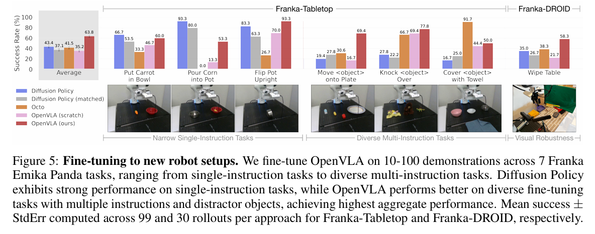

* 결과는 Fig. 5에 제시되어 있다.
* per-task breakdown은 Appendix Table 7에 제시되어 있다.
* Diffusion Policy 두 version은 “Put Carrot in Bowl”, “Pour Corn into Pot”과 같은 narrow single-instruction task에서 Octo 및 OpenVLA와 경쟁적이거나 더 높은 성능을 보였다.
* 그러나 scene에 multiple objects가 있고 language conditioning이 필요한 더 diverse한 fine-tuning task에서는 pretrained generalist policy가 더 좋은 성능을 보였다.
* Octo와 OpenVLA의 OpenX pretraining은 language grounding이 중요한 diverse task에 더 잘 적응하도록 돕는다.
* 이는 OpenVLA (scratch)의 낮은 성능에서 확인된다.

### e) Overall Findings

* 전체적으로 OpenVLA는 가장 높은 average performance를 달성했다.
* OpenVLA는 같은 robot data로 학습된 Octo보다 명확히 높은 성능을 보였다.
* 논문은 이를 Internet-scale pretraining의 이점을 보여주는 결과로 설명한다.
* 기존 방법들은 precise task 또는 diverse task 중 하나에서만 강한 성능을 보였다.
* 그 결과 task별 success rate가 크게 달라졌다.
* OpenVLA는 테스트된 모든 task에서 최소 50% 이상의 success rate를 달성한 유일한 approach이다.
* 논문은 OpenVLA가 imitation learning task에서 strong default option이 될 수 있다고 설명한다.
* 특히 다양한 language instruction을 포함하는 task에서 유용할 수 있다고 설명한다.
* 반면 narrower but highly dexterous task에서는 Diffusion Policy가 여전히 더 smooth하고 precise한 trajectory를 보였다.
* 논문은 Diffusion Policy에서 구현된 action chunking과 temporal smoothing을 OpenVLA에 통합하는 것이 dexterity 향상에 도움이 될 수 있으며, future work의 promising direction이라고 제시한다.

---

## 4.3 Efficient OpenVLA Fine-Tuning and Inference

### a) Parameter-Efficient Fine-Tuning Evaluation

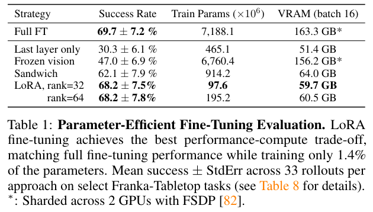

* 논문은 여러 Franka-Tabletop task에서 OpenVLA의 parameter-efficient fine-tuning approach를 테스트한다.
* 결과는 Table 1에 제시되어 있다.
* 비교한 fine-tuning strategy는 last layer only, frozen vision, sandwich, LoRA이다.
* last layer only는 OpenVLA transformer backbone의 마지막 layer와 token embedding matrix만 fine-tuning한다.
* frozen vision은 vision encoder를 freeze하고 나머지 weight를 fine-tuning한다.
* sandwich fine-tuning은 vision encoder, token embedding matrix, last layer를 unfreeze한다.
* LoRA는 Hu et al.의 low-rank adaptation technique을 사용한다.
* LoRA는 여러 rank value를 사용하며, model의 모든 linear layer에 적용된다.
* 실험 결과 vision encoder의 fine-tuning이 중요하다고 보고된다.
* 이는 sandwich와 LoRA 결과에서 확인된다.
* LoRA는 full fine-tuning과 유사한 성능을 보이면서 전체 parameter 중 1.4%만 fine-tuning한다.
* LoRA rank=32 설정은 single A100 GPU에서 새로운 task에 대해 OpenVLA를 10–15시간 내에 fine-tuning할 수 있게 한다.
* 이는 full fine-tuning 대비 8배 compute reduction에 해당한다.

### b) Quantized Inference

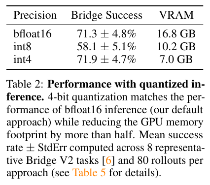

* 논문은 quantized inference를 통한 OpenVLA의 efficient serving도 테스트한다.
* 결과는 Table 2에 제시되어 있다.
* 8-bit quantization은 대부분의 GPU에서 quantization operation의 overhead 때문에 inference를 느리게 만들었다.
* 이로 인해 8개의 representative Bridge V2 task에서 성능이 감소했다.
* 논문은 느린 모델이 training data와 비교하여 system dynamics의 distribution shift를 겪기 때문이라고 설명한다.
* 반면 4-bit inference는 GPU memory transfer가 줄어들어 더 높은 throughput을 달성했다.
* 그 결과 original bfloat16 model의 성능을 회복했다.
* 동시에 4-bit inference는 GPU memory를 절반 이하로 요구했다.

---

## 5. Conclusion and Limitations

### a) Conclusion

* 논문은 OpenVLA를 state-of-the-art open-source Vision-Language-Action model로 제시한다.
* OpenVLA는 cross-embodiment robot control에서 강한 out-of-the-box 성능을 보인다.
* 또한 OpenVLA는 parameter-efficient fine-tuning technique을 통해 새로운 robot setup에 쉽게 적응할 수 있음을 보였다.

### b) Limitation 1: Single-Image Observation

* 현재 OpenVLA model은 single-image observation만 지원한다.
* OpenVLA가 multi-image input을 지원하도록 확장하는 것은 future work의 중요한 방향이다.
* 또한 proprioceptive input을 지원하도록 확장하는 것도 중요한 future work이다.

### c) Limitation 2: Low Control Frequency

* OpenVLA는 큰 모델 크기 때문에 상대적으로 낮은 control frequency로 동작한다.
* 따라서 OpenVLA의 inference throughput을 개선하는 것이 중요하다.
* 이는 ALOHA처럼 50Hz로 동작하는 high-frequency control setup에서 VLA control을 가능하게 하기 위해 필요하다.

### d) Limitation 3: Underexplored VLA Design Decisions

* compute limitation 때문에 많은 VLA design decision이 충분히 탐구되지 않았다.
* 예를 들어 base VLM size 변화에 대한 탐구가 남아 있다.
* robot action data와 Internet-scale VLM data를 함께 co-training하는 방식도 충분히 탐구되지 않았다.
* 다른 종류의 visual feature를 사용하는 방식도 추가 탐구가 필요하다.
* 저자들은 OpenVLA model과 codebase 공개가 이러한 design decision에 대한 후속 연구를 가능하게 하기를 기대한다.
---

<details>
<summary><b>Thoughts After Reading This Paper</b></summary>

## Thoughts After Reading This Paper

### 1) Single-Image Observation

**논문 한계**  
OpenVLA는 현재 single-image observation만 지원한다. 즉 현재 시점의 이미지 한 장과 language instruction을 입력으로 받아 action을 예측한다.

**내가 떠올린 확장 질문**  
현재 이미지 한 장만 본다면, 로봇이 놓칠 수 있는 정보는 무엇인가?

**생각해볼 수 있는 문제**  
이미지 한 장만으로는 물체 뒤에 가려진 목표 객체를 놓칠 수 있다. 또한 카메라 시야 밖의 정보나, 다른 각도에서만 보이는 물체 상태를 충분히 파악하기 어려울 수 있다.

또한 proprioceptive input이 추가된다면, 로봇은 자신의 팔 관절 상태, gripper 상태, end-effector 위치 등을 이미지가 아닌 내부 신호로 알 수 있다. 이 경우 로봇이 자기 몸 상태를 더 직접적으로 파악할 수 있으므로, 이미지 정보만으로 추론해야 하는 부담을 줄이고 제어 안정성이나 연산 효율 측면에서 도움이 될 수 있다.

**가능한 방향**  
multi-image input, wrist camera, multi-view camera, proprioceptive input 등을 함께 사용하면 single-image observation의 한계를 줄일 수 있다.

---

### 2) Low Control Frequency

**논문 한계**  
OpenVLA는 모델 크기가 크기 때문에 상대적으로 낮은 control frequency로 동작한다. 즉 로봇에게 action을 빠르고 자주 출력하기 어렵다.

**내가 떠올린 확장 질문**  
로봇이 action을 얼마나 자주 새로 받을 수 있어야 정밀하다고 말할 수 있을 만큼 움직일 수 있는가?

**생각해볼 수 있는 문제**  
정밀한 움직임의 기준은 task에 따라 달라질 수 있다. 빠르게 변화하는 환경이나 접촉이 중요한 작업에서는 높은 control frequency가 필요할 수 있다. 반대로 느리고 단순한 pick-and-place task에서는 상대적으로 낮은 control frequency로도 충분할 수 있다.

논문에서는 ALOHA가 50Hz로 동작하는 high-frequency control setup이라고 언급한다. 이를 기준으로 보면, OpenVLA처럼 큰 모델이 action을 빠르게 출력하지 못하면 고주파 제어가 필요한 작업에서 한계가 생길 수 있다.

**가능한 방향**  
inference throughput을 높이거나, 더 가벼운 모델 구조 등을 활용해 action 출력 속도를 개선할 필요가 있다.

---

### 3) Underexplored VLA Design Decisions

**논문 한계**  
OpenVLA가 좋은 성능을 보였지만, 어떤 설계 선택이 성능에 얼마나 중요한지는 아직 충분히 실험되지 않았다. 예를 들어 base VLM size, robot action data와 Internet-scale VLM data의 co-training, visual feature 종류 등의 선택이 충분히 탐구되지 않았다.

**내가 떠올린 확장 질문**  
robot action data만으로 물리적 위험, deformable object, 액체, 동적 환경까지 충분히 다룰 수 있을까?

#### a) 물체의 물리적 특성과 위험도

**생각해볼 수 있는 문제**  
예를 들어 물이 담긴 비싼 유리컵을 옮긴다고 가정하면, 유리컵 자체는 deformable object는 아니지만 깨질 경우 큰 손실이 발생할 수 있다. 이런 경우 단순히 image와 instruction을 바탕으로 action을 예측하는 것만으로는 부족할 수 있다.

로봇은 해당 객체가 깨지기 쉬운지, 비싼 물체인지, 내용물이 들어 있는지, 어느 정도 속도로 움직여야 안전한지 등을 고려해야 할 수 있다.

**가능한 방향**  
물체의 물리적 속성, 위험도, 내용물 상태, deformability 등을 반영한 데이터나 표현이 추가로 필요할 수 있다. OpenVLA는 현재 입력 이미지와 명령을 바탕으로 action을 예측하지만, 객체의 위험도나 물리적 특성에 따라 control frequency, manipulator 속도, force limit 등을 동적으로 조절하는 구조는 다루지 않는다.

#### b) 액체와 물리적 상태 변화

**생각해볼 수 있는 문제**  
유리컵을 빠르게 옮기면 컵 안의 물이 흘러넘칠 수 있다. 이 경우 먼저 컵 안에 물이 있는지 판단하는 것부터 어려울 수 있다. 설령 물이 있다고 판단하더라도, 물이 넘치지 않도록 manipulator를 어떻게 움직여야 하는지는 단순한 image-action mapping만으로 해결하기 어려울 수 있다.

**가능한 방향**  
액체, deformable object, 깨지기 쉬운 물체처럼 물리적 상태 변화가 중요한 task에서는 단순한 robot action data만으로는 부족할 수 있다. 물리 상태, dynamics, world model 기반 정보 등을 함께 고려해야 할 수 있다.

#### c) 빠르게 변하는 동적 환경

**생각해볼 수 있는 문제**  
자동화 공장에서 로봇이 부품을 옮기는 상황을 생각해볼 수 있다. 만약 사람이 작업 공간을 지나가는데 로봇이 이를 고려하지 않고 기존 trajectory만 따라 움직인다면 사고가 발생할 수 있다.

이 경우 action dataset에 예외적인 상황을 추가하는 것도 하나의 방법이 될 수 있지만, 데이터 추가만으로 모든 동적 상황을 다루기는 어렵다.

**가능한 방향**  
OpenVLA는 single-image observation과 낮은 control frequency 한계가 있기 때문에, 사람이 움직이는 동적 환경에서 빠른 상태 변화에 대응하기 어렵다. 따라서 dynamic scene에 대한 추가 데이터뿐 아니라 real-time perception, trajectory replanning, collision avoidance, safety constraint, emergency stop 같은 안전 구조를 함께 고려할 필요가 있다.

---
### 4) OpenVLA를 long-horizon 문제에 대입했을 때 활용할 수 있는 방안 혹은 야기될 문제점

**논문 한계**
OpenVLA는 객체를 선택하거나 행동을 결정하는 과정에서 reasoning이나 task planning 과정을 명시적으로 거치지 않고, image observation과 language instruction을 바탕으로 action token을 직접 예측한다.

**내가 떠올린 확장 질문**
language instruction으로 long-horizon task가 주어진다면 OpenVLA는 어떻게 action을 수행할 것인가?

**생각해볼 수 있는 문제**
OpenVLA는 pretrained VLM을 기반으로 하므로 language instruction 자체는 어느 정도 이해할 수 있을 것이다. 그러나 long-horizon instruction이 주어졌을 때, 전체 task를 여러 단계로 나누고 그에 맞는 action sequence를 안정적으로 출력하기는 어려울 수 있다.

**가능한 방향**
OpenVLA의 action을 여러 번 연속해서 수행하면 하나의 긴 trajectory를 만들 수 있다고 볼 수 있다. 다만 long-horizon task instruction이 들어왔을 때, 그 task를 여러 단계의 short-horizon instruction으로 나누어줄 planner가 필요할 수 있다. 이 경우 planner가 OpenVLA에 들어갈 language instruction을 단계별로 생성해주고, OpenVLA는 각 instruction에 맞는 action을 수행하는 방식으로 활용할 수 있을 것이다.
</details>

<details>
<summary><b>Summary</b></summary>

## OpenVLA

### One-line Summary

* OpenVLA는 pre-trained VLM backbone을 Open X-Embodiment robot demonstrations로 fine-tuning하여, image observation과 language instruction을 입력받고 robot action token을 출력하는 7B open-source Vision-Language-Action model이다.

---

### Structure

* OpenVLA의 핵심 구조는 pre-trained Vision-Language Model을 robot control policy로 확장한 것이다.

* 기존 LLM/VLM은 image와 language를 입력받아 text token을 출력하는 구조를 가진다.

* OpenVLA는 이 구조를 robot action prediction에 맞게 변형하여, text token이 아니라 robot action token을 출력하도록 fine-tuning한다.

* 입력은 현재 image observation과 language instruction이다.

* 출력은 robot arm이 실행할 수 있는 7D action이다.

* 즉, OpenVLA는 image와 instruction을 이해한 뒤, 다음 robot action을 token 형태로 예측하는 direct action prediction 방식의 VLA model이다.

---

### Model Architecture

* OpenVLA는 Prismatic-7B VLM을 backbone으로 사용한다.

* Prismatic-7B는 DINOv2와 SigLIP visual encoder, MLP projector, Llama 2 7B language model backbone으로 구성된다.

* Image observation은 DINOv2와 SigLIP visual encoder를 통해 visual feature로 변환된다.

* DINOv2는 spatial feature를 보강하고, SigLIP은 semantic feature를 제공하는 역할을 한다.

* 두 visual feature는 channel-wise concatenation 방식으로 결합된다.

* 결합된 visual feature는 MLP projector를 거쳐 Llama 2가 처리할 수 있는 embedding space로 변환된다.

* Language instruction은 Llama tokenizer를 통해 language token으로 변환된다.

* 이후 visual embedding과 language token이 Llama 2 backbone에 입력되고, Llama는 다음 token을 예측하는 방식으로 action token을 출력한다.

---

### Action Representation

* OpenVLA는 continuous robot action을 그대로 출력하지 않고, action token으로 변환하여 예측한다.

* Robot action은 7D action으로 표현된다.

* 7D action은 end-effector의 위치 변화, 회전 변화, gripper 동작 등을 포함한다.

* 각 action dimension은 256개의 bin으로 discretization된다.

* 이때 전체 action range를 그대로 사용하는 것이 아니라, training data의 1st quantile부터 99th quantile까지의 구간을 사용한다.

* 이는 outlier 때문에 action bin의 해상도가 떨어지는 문제를 줄이기 위한 것이다.

* 각 dimension의 continuous action value는 256개 bin 중 하나의 discrete integer로 변환된다.

* 최종적으로 7D action은 7개의 discrete action token으로 표현된다.

* OpenVLA는 Llama tokenizer vocabulary에서 가장 적게 사용되는 256개의 token을 action token으로 재정의한다.

* 이를 통해 Llama가 text token을 예측하듯이 robot action token을 autoregressive하게 예측할 수 있다.

---

### Training Data and Strategy

* OpenVLA는 Open X-Embodiment dataset에서 가져온 약 970k robot demonstrations로 학습된다.

* Open X-Embodiment dataset은 다양한 robot embodiment, scene, task, camera observation, language instruction, robot action trajectory를 포함하는 large-scale robot dataset이다.

* OpenVLA는 pre-trained Prismatic-7B VLM을 가져와 robot action prediction task에 맞게 fine-tuning한다.

* 학습 목표는 image observation과 language instruction이 주어졌을 때, expert demonstration의 action token을 맞히는 것이다.

* 학습 방식은 LLM의 standard next-token prediction objective를 그대로 활용한다.

* 다만 loss는 전체 text token에 대해 계산되는 것이 아니라, predicted action tokens에 대해서만 계산된다.

* 즉, OpenVLA는 기존 VLM의 vision-language knowledge를 활용하면서, robot demonstrations를 통해 action prediction 능력을 추가로 학습한다.

---

### Cross-Embodiment Evaluation

* OpenVLA는 여러 robot embodiment에서 out-of-the-box 성능을 평가했다.

* 여기서 embodiment는 robot의 몸체, 하드웨어 구성, 제어 방식 등을 의미한다.

* OpenVLA는 WidowX robot 기반의 Bridge V2 task와 Google robot 환경에서 평가되었다.

* 비교 대상은 RT-1-X, RT-2-X, Octo 등이다.

* RT-1-X와 Octo는 correct object를 선택하거나 language-conditioned manipulation을 수행하는 데 상대적으로 약한 모습을 보였다.

* RT-2-X와 OpenVLA는 distractor가 있는 상황에서도 target object를 더 잘 선택하고, object orientation에 맞춰 end-effector를 조정하며, insecure grasping 상황에서도 더 robust한 행동을 보였다.

* OpenVLA는 Google robot에서는 RT-2-X와 유사한 성능을 보였고, Bridge V2에서는 RT-2-X보다 더 높은 성능을 보였다.

* 특히 OpenVLA는 RT-2-X보다 약 7배 작은 7B 규모의 모델임에도 강한 cross-embodiment 성능을 보였다는 점에서 의미가 있다.

---

### Data-Efficient Adaptation

* OpenVLA는 새로운 robot setup과 task에 대해 data-efficient하게 fine-tuning될 수 있는지도 평가했다.

* 이를 위해 Franka-Tabletop과 Franka-DROID 환경에서 10~100개의 robot demonstrations를 사용해 fine-tuning을 수행했다.

* 비교 대상은 Diffusion Policy, Diffusion Policy matched version, Octo, OpenVLA scratch version 등이었다.

* Diffusion Policy는 single-instruction narrow task에서 강한 성능을 보였다.

* 반면 OpenVLA는 multiple objects, distractor objects, multiple instructions, language conditioning이 필요한 diverse task에서 더 강한 성능을 보였다.

* OpenVLA scratch는 OpenX robot data pretraining 없이 target setup에 바로 fine-tuning한 모델이다.

* OpenVLA scratch의 낮은 성능은 OpenX robot data로 학습한 generalist policy가 language-grounded manipulation task에 적응하는 데 도움이 된다는 점을 보여준다.

* 결과적으로 OpenVLA는 새로운 robot setup에 대해 fine-tuning 가능한 generalist VLA policy임을 보였다.

---

### Efficient Fine-Tuning

* OpenVLA는 full fine-tuning뿐 아니라 parameter-efficient fine-tuning도 평가했다.

* 대표적으로 LoRA를 활용한 fine-tuning이 수행되었다.

* LoRA는 큰 모델 전체 weight를 모두 업데이트하지 않고, 일부 low-rank adapter만 학습하는 방식이다.

* OpenVLA에서는 모든 linear layer에 LoRA를 적용했다.

* LoRA rank=32 설정은 전체 parameter 중 약 1.4%만 학습하면서도 full fine-tuning과 유사한 성능을 보였다.

* 이를 통해 OpenVLA는 single A100 GPU에서도 10~15시간 내에 새로운 task에 fine-tuning될 수 있음을 보였다.

* 논문은 이 방식이 full fine-tuning 대비 약 8배의 compute reduction을 제공한다고 설명한다.

---

### Quantized Inference

* OpenVLA는 inference 과정에서 bfloat16, int8, int4 precision을 비교했다.

- 이 실험의 목적은 OpenVLA가 robot action을 출력하는 inference 과정에서 GPU memory usage를 줄이고 throughput을 높일 수 있는지 확인하는 것이다.

* bfloat16은 높은 precision을 사용하지만 VRAM 사용량이 크다.

* int8은 VRAM을 줄였지만, quantization operation overhead 때문에 inference가 느려졌고 성능도 떨어졌다.

* 논문은 int8 inference가 느려지면서 robot control timing이 training data와 달라지고, 이로 인해 system dynamics의 distribution shift가 발생했을 가능성을 설명한다.

* 반면 int4는 GPU memory transfer를 줄여 throughput을 높였고, bfloat16과 유사한 성능을 유지하면서 VRAM 사용량을 크게 줄였다.

---

### Experimental Results

* OpenVLA는 multiple robot platforms에서 기존 generalist robot policy보다 강한 성능을 보였다.

* Bridge V2와 Google robot 환경에서 RT-1-X, Octo보다 높은 성능을 보였고, RT-2-X와 비교해도 경쟁력 있는 성능을 보였다.

* 특히 Bridge V2에서는 RT-2-X보다 높은 average success rate를 달성했다.

* Fine-tuning 실험에서는 Franka-Tabletop과 Franka-DROID 환경에서 새로운 task에 효과적으로 적응할 수 있음을 보였다.

* Diffusion Policy는 narrow single task에서 강했지만, 다양한 instruction과 object가 포함된 task에서는 OpenVLA가 더 안정적인 성능을 보였다.

* LoRA fine-tuning은 full fine-tuning과 비슷한 성능을 유지하면서 학습 parameter와 compute cost를 크게 줄였다.

* int4 quantized inference는 VRAM 사용량을 줄이면서도 bfloat16과 유사한 성능을 보였다.

---

### Limitations

* OpenVLA는 single-image observation만 지원한다.

* 즉, 현재 시점의 이미지 한 장과 language instruction만을 입력으로 사용한다.

* 이로 인해 multi-view camera, wrist camera, temporal image sequence, proprioceptive input 등을 활용하지 못한다.

* 또한 OpenVLA는 모델 크기가 크기 때문에 control frequency가 낮다.

* 이는 ALOHA와 같은 50Hz high-frequency control setup에서 활용하기 어렵다는 한계로 이어진다.

* OpenVLA는 action을 빠르게 자주 출력해야 하는 dexterous manipulation task에서 한계를 가질 수 있다.

* 또 다른 한계는 VLA design decisions가 충분히 탐구되지 않았다는 점이다.

* 예를 들어 base VLM size, visual feature 종류, robot action data와 Internet-scale VLM data의 co-training 등이 성능에 어떤 영향을 주는지는 충분히 분석되지 않았다.

* 마지막으로 OpenVLA는 reasoning, task planning, failure recovery를 명시적으로 다루지 않는다.

* image와 instruction을 받아 바로 action token을 예측하는 direct action prediction 구조이기 때문에, long-horizon task를 여러 subgoal로 나누거나 실패 상황에서 explicit replanning을 수행하는 구조는 포함되어 있지 않다.

---

### Key Takeaways

* OpenVLA는 7B 규모의 open-source generalist Vision-Language-Action model이다.

* 핵심 아이디어는 pre-trained VLM을 robot action token prediction policy로 fine-tuning하는 것이다.

* DINOv2와 SigLIP visual encoder를 결합하여 semantic feature와 spatial feature를 함께 활용한다.

* Continuous robot action을 256-bin discretization을 통해 action token으로 변환한다.

* Llama tokenizer vocabulary의 least-used 256 tokens를 action token으로 재정의하여, robot action을 language token처럼 예측한다.

* OpenVLA는 Open X-Embodiment dataset의 970k robot demonstrations를 활용해 학습된다.

* Multiple robot embodiment에서 RT-1-X, Octo보다 강한 성능을 보였고, RT-2-X보다 작은 모델 규모로 경쟁력 있는 성능을 달성했다.

* LoRA fine-tuning과 int4 quantized inference를 통해 제한된 compute 환경에서도 adaptation과 inference가 가능함을 보였다.

* 그러나 OpenVLA는 single-image observation, low control frequency, underexplored design decisions라는 한계를 가진다.

* 또한 explicit reasoning, task planning, failure recovery를 직접 다루지 않기 때문에 long-horizon task에서는 별도의 planner나 replanning module과 결합될 필요가 있다.

* 따라서 OpenVLA의 핵심 의미는 VLM을 robot policy로 확장하는 open-source 기준 모델을 제시했다는 점에 있으며, 이후 TinyVLA, OpenVLA-OFT, Hi Robot, CoT-VLA 같은 연구를 이해하기 위한 중요한 출발점이 된다.

</details>


</details>


<details>
<summary><b>25. TinyVLA: Towards Fast, Data-Efficient Vision-Language-Action Models for Robotic Manipulation</b></summary>

## Basic Information

- **Title**: TinyVLA: Towards Fast, Data-Efficient Vision-Language-Action Models for Robotic Manipulation
- **Authors**: Junjie Wen, Yichen Zhu, Jinming Li, Minjie Zhu, Kun Wu, Zhiyuan Xu, Ning Liu, Ran Cheng, Chaomin Shen, Yaxin Peng, Feifei Feng, Jian Tang
- **Conference / Journal**: IEEE Robotics and Automation Letters (RA-L)
- **Year**: 2025

---

## One-line Summary

* TinyVLA는 기존 VLA의 느린 inference와 대규모 robot data pretraining 의존성을 줄이기 위해, compact pre-trained multimodal model과 diffusion-based policy head를 결합하여 빠른 inference와 data-efficient하면서도 높은 generalization을 달성한 VLA model이다.

---

## Why I Read This Paper

* VLA를 robot task에 실제로 활용하기 위해서는 성능뿐 아니라 빠른 inference speed, 낮은 computational cost, data efficiency가 중요하다고 생각했다.
* 기존 VLA model은 large VLM과 large-scale robot data pretraining에 의존하는 경우가 많아, 실제 robot 환경에서 사용하기에는 resource 부담이 클 수 있다.
* TinyVLA는 compact multimodal backbone과 diffusion policy head를 결합하여 이러한 부담을 줄이면서도 robot manipulation 성능과 generalization을 확보하려는 모델이다.
* 따라서 이 논문을 통해 resource-efficient VLA 구조가 어떻게 설계되는지, 그리고 작은 모델이 실제 robot task에서 어느 정도 성능을 낼 수 있는지 확인하고자 했다.

---

## Understanding the Structure

## 0. Abstract

### a) Background: VLA model의 가능성

* Vision-Language-Action model, VLA는 end-to-end learning을 통해 visuomotor control과 instruction comprehension에서 높은 가능성을 보였다.
* 즉, 시각 정보와 언어 명령을 입력받아 로봇 행동으로 연결하는 방식이 robot manipulation에서 중요한 방향으로 주목받고 있다.

### b) Problem: 기존 VLA model의 한계

* 기존 VLA model은 두 가지 큰 문제를 가진다.
* 첫째, inference 속도가 느리다.
* 둘째, 많은 양의 robot data를 활용한 extensive pre-training이 필요하다.
* 이로 인해 기존 VLA model은 실제 환경에 배포하기 어렵다.

### c) Proposal: TinyVLA

* 논문은 이러한 문제를 해결하기 위해 TinyVLA라는 compact Vision-Language-Action model family를 제안한다.
* TinyVLA는 기존 VLA model에 비해 두 가지 장점을 가진다.
* 첫째, inference speed가 더 빠르다.
* 둘째, data efficiency가 높다.
* 특히 TinyVLA는 large-scale robot data에 대한 pre-training stage 없이도 학습이 가능하다는 점을 강조한다.

### d) Core Component 1: Robust and High-Speed Multimodal Model

* TinyVLA의 첫 번째 핵심 구성요소는 robust하고 high-speed인 multimodal model을 policy backbone으로 사용하는 것이다.
* 기존 VLA처럼 큰 vision-language model에 의존하는 대신, 더 작고 빠른 multimodal backbone을 사용한다.
* 이를 통해 inference latency를 줄이고 실제 robot control에 더 적합한 구조를 만든다.

### e) Core Component 2: Diffusion Policy Decoder

* TinyVLA의 두 번째 핵심 구성요소는 fine-tuning 과정에서 diffusion policy decoder를 통합하는 것이다.
* 기존 VLA처럼 action을 discrete token으로 auto-regressive하게 생성하는 방식이 아니다.
* 대신 diffusion policy decoder를 통해 precise robot action을 생성한다.
* 이 구조는 robot action을 더 효율적이고 직접적으로 출력하기 위한 설계로 볼 수 있다.

### f) Evaluation: Simulation and Real Robot

* 논문은 TinyVLA를 simulation과 real robot 환경 모두에서 평가했다.
* 실험 결과 TinyVLA는 OpenVLA보다 speed와 data efficiency 측면에서 더 우수한 성능을 보였다.
* 동시에 task performance는 OpenVLA와 비슷하거나 더 높은 수준을 달성했다.

### g) Generalization Capability

* TinyVLA는 다양한 조건에서 strong generalization capability를 보였다.
* 평가된 generalization 범위는 language instruction, novel object, unseen position, object appearance change, background variation, environment shift 등을 포함한다.
* 여러 경우에서 TinyVLA는 OpenVLA와 비슷하거나 더 높은 성능을 보였다.

---

## I. Introduction

### a) Problem: multitasking robot imitator 학습의 어려움

* 복잡하고 불확실한 환경에서 동작하는 multitasking robot imitator를 학습하는 것은 여전히 어려운 문제이다.
* 그 이유는 robot data가 제한적이고, physical motion 자체를 학습하는 것이 어렵기 때문이다.
* 기존 robot model은 새로운 scene이나 task에 적응하는 데 한계를 보인다.
* 또한 distractor, lighting condition, background change와 같은 환경 변화에 쉽게 영향을 받는다.

### b) Existing Direction: LLM과 predefined motion planner 활용

* 최근의 일부 방법들은 off-the-shelf Large Language Model, LLM을 활용한다.
* LLM은 scene description을 바탕으로 object affordance, object location, heatmap 등을 생성한다.
* 이후 predefined motion planner가 이를 이용해 실제 task를 수행한다.

### c) Existing Direction: Vision-Language-Action Models

* 최근에는 Vision-Language-Action model, VLA가 큰 주목을 받고 있다.
* VLA는 pretrained vision-language model을 robotics로 확장하는 방식이다.
* 이때 robot action을 next-token prediction 방식으로 생성한다.

### d) Limitation 1: 느린 inference speed
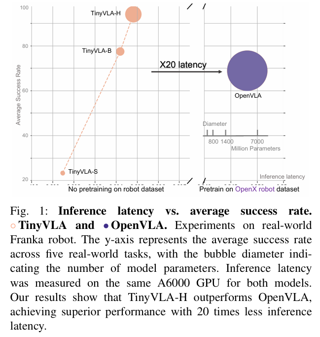


* 기존 VLA model의 핵심 한계는 inference speed가 매우 느리다는 점이다.
* 이는 주로 두 가지 이유에서 발생한다.
* 첫째, 기존 VLA는 large vision-language model에 의존한다.
* 둘째, robot action을 auto-regressive action token generation 방식으로 생성한다.
* auto-regressive 방식은 action token을 순차적으로 생성하기 때문에 반복적인 inference가 필요하다.

### e) Limitation 2: large-scale robot data pretraining 필요

* 기존 VLA model은 large-scale robotic dataset에 대한 extensive pre-training을 필요로 한다.
* 예를 들어 OpenVLA는 970K sample 규모의 OpenX dataset으로 pre-training되었다.
* 이러한 pre-training은 computational cost가 크고 resource-intensive하다.
* 결과적으로 기존 VLA model은 실제 환경에 배포하거나 새롭게 학습시키기 어렵다.

### f) Research Question

* 논문은 이러한 문제에서 다음 질문을 제기한다.
* 기존 VLA model의 장점은 유지하면서도, fast inference와 data efficiency를 동시에 만족하는 VLA model을 어떻게 만들 수 있는가?

### g) Proposal: TinyVLA

* 논문은 이를 해결하기 위해 TinyVLA를 제안한다.
* TinyVLA는 fast inference를 위해 설계된 compact Vision-Language-Action model이다.
* 저자들은 기존 VLA의 높은 inference latency를 만드는 핵심 요인을 두 가지로 분석한다.
* 첫째, 기존 VLA는 보통 7B parameter를 넘는 large vision-language model을 기반으로 한다.
* 둘째, discrete action token을 auto-regressive하게 생성하기 때문에 각 degree of freedom마다 반복적인 inference가 필요하다.

### h) Core Idea 1: Small Vision-Language Model 사용

* TinyVLA는 1B parameter 미만의 vision-language model family를 학습하고 사용한다.
* 이를 통해 기존 large VLM 기반 VLA보다 model size를 줄인다.

### i) Core Idea 2: Diffusion-Based Action Head 사용

* TinyVLA는 action을 next-token prediction 방식으로 생성하지 않는다.
* 대신 pretrained multimodal model에 diffusion-based head를 붙인다.
* 이 diffusion-based head는 robot action을 직접 출력한다.

### j) Expected Effect: 빠르고 data-efficient한 adaptation

* TinyVLA는 vision-language data pre-training에서 얻은 prior knowledge를 유지할 수 있다.
* 동시에 OpenX와 같은 large-scale robot dataset에 대한 pre-training 없이도 robot task에 적응할 수 있다.
* 논문은 이 조합이 TinyVLA를 new instruction에 효율적으로 적응시키고 다양한 setting에 대해 generalization할 수 있게 한다고 설명한다.

### k) Performance Claim

* TinyVLA는 simulation과 real-world setting 모두에서 baseline보다 우수한 multi-task learning 성능을 보였다.
* real-world experiment에서 TinyVLA-H는 OpenVLA보다 25.7% 높은 success rate를 달성했다.
* 동시에 TinyVLA-H는 OpenVLA보다 parameter 수가 5.5배 적다.
* bimanual real-robot experiment에서는 OpenVLA가 bimanual setting에서 어려움을 보였다.
* 논문은 그 이유를 OpenVLA가 의존하는 OpenX robot data pretraining이 single-arm data로만 구성되어 있기 때문이라고 설명한다.
* 반면 TinyVLA-H는 bimanual task에서 OpenVLA보다 훨씬 높은 성능을 보였다.

### l) Generalization Claim

* TinyVLA는 다양한 setting에서 generalization capability를 보였다.
* 논문은 TinyVLA가 observational generalization과 spatial generalization에서 좋은 성능을 보였다고 설명한다.
* 일부 경우에는 OpenVLA와 비슷하거나 더 높은 성능을 보였다.

### m) Contributions

* 논문의 contribution은 크게 세 가지이다.
* 첫째, lightweight vision-language model과 diffusion model을 결합한 새로운 VLA architecture를 제안한다.
* 둘째, simulation과 real-world setting 모두에서 extensive experiments를 수행했다.
* 셋째, large-scale robotic dataset 없이도 strong VLA model을 학습할 수 있음을 보였다.

### n) Overall Meaning

* TinyVLA는 기존 VLA의 느린 inference와 large-scale robot pretraining 의존성을 줄이기 위한 접근이다.
* 핵심 구조는 small pretrained VLM과 diffusion-based action head의 결합이다.
* 논문은 이를 통해 VLA model을 더 작고 빠르게 만들 수 있음을 보인다.

---

## II. Related Works

### a) Vision-Language Models

* Vision-Language Model(VLM)은 vision과 language를 연결하며, LLM의 reasoning 능력을 multimodal 입력으로 확장한 모델이다.
* 기존 Multimodal LLM은 7B~70B 규모로 매우 커서 inference 비용이 높고 접근성이 떨어진다.
* 이에 따라 최근에는 3B 이하의 경량화된 multimodal 모델을 통해 효율성과 실용성을 높이려는 연구가 진행되고 있다.

### b) Vision-Language Models for Robot Learning

* VLM은 robot learning에 도입되어 high-level planning, task decomposition, 그리고 end-to-end action prediction까지 다양한 방식으로 활용되고 있다.
* 특히 최근에는 VLM을 직접 robot action predictor로 사용하는 방향이 주목받고 있으며, 본 논문은 이를 더 가볍고 빠르게 만들고, 기존 autoregressive 방식 대신 diffusion 기반으로 대체하는 두 가지 관점을 탐구한다.

### c) Multi-Task Robot Learning

* Multi-task robot learning은 다양한 작업 수행과 새로운 상황에 대한 일반화를 목표로 발전해왔으며, 이를 위해 대규모 interaction 데이터를 활용하는 경우가 많다.
* RT-1은 task-agnostic 학습의 가능성을 보였고, RT-2는 robot data와 image-text 데이터를 결합했으며, PerAct와 Octo는 각각 language goal 활용과 cross-embodiment pretraining을 통해 성능을 향상시켰다.

### d) Limitation of Prior Directions

* 기존 연구들은 VLM을 다양한 방식으로 활용했지만, 여전히 모델 크기가 크고 inference가 느리며, multi-task 학습에는 많은 데이터가 필요하다는 한계를 가진다.
* 이러한 문제로 인해 실제 로봇 환경에서 빠르고 효율적으로 적용하기 어렵다.

### e) Position of TinyVLA

* TinyVLA는 lightweight VLM과 diffusion model을 결합한 새로운 Vision-Language-Action 모델로, 기존 autoregressive 방식 대신 diffusion 기반으로 action을 생성한다.
* 이를 통해 더 작고 빠르며 data-efficient한 robot action predictor를 구현하는 것을 목표로 한다.

---

## III. Method

### Overview

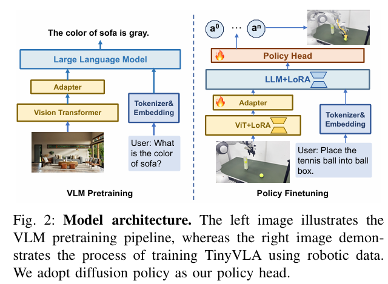
* 이 section은 TinyVLA의 전체 방법론을 설명한다.
* TinyVLA는 세 가지 핵심 설계 요소로 구성된다.
* 첫째, pre-trained VLM을 policy network의 초기 backbone으로 활용한다.
* 둘째, robot data 학습 과정에서 pre-trained 부분은 대부분 freeze하고, LoRA를 통해 parameter-efficient fine-tuning을 수행한다.
* 셋째, pre-trained multimodal model 뒤에 policy decoder를 추가하여 실행 가능한 robot action을 출력한다.
* 전체 구조는 Fig. 2에 제시되어 있다.
* Fig. 2의 왼쪽은 VLM pretraining pipeline을, 오른쪽은 robotic data를 이용한 TinyVLA policy fine-tuning 과정을 보여준다.

---

### A. Building TinyVLA with Efficient Vision-Language Models

* TinyVLA의 첫 단계는 pre-trained Vision-Language Model(VLM)을 구축하는 것이다.
* 기존 연구들은 일반적으로 3B 또는 7B 이상의 대형 VLM을 사용한다.
* 반면 TinyVLA는 70M에서 1.4B 규모의 compact VLM family를 학습한다.
* 이때 language model backend로 Pythia를 사용한다.
* 즉, Pythia는 TinyVLA VLM 내부에서 language model 역할을 수행한다.
* TinyVLA는 LLaVA의 training pipeline을 따라 vision-language dataset으로 compact VLM을 학습한다.
* 이후 robot data fine-tuning 단계에서도 기존 VLM의 구조를 유지한다.
* 유지되는 구성 요소에는 visual backbone과 vision-language alignment module이 포함된다.

---

### B. Robot Data Finetuning for Manipulation

* TinyVLA는 robot manipulation task 수행을 위해 robot data로 fine-tuning된다.
* 이 과정의 핵심은 pre-trained VLM의 지식을 유지하면서 robot action prediction에 적응하는 것이다.
* 이를 위해 두 가지 전략을 사용한다.
* 첫째, frozen weights와 LoRA를 활용한 parameter-efficient fine-tuning이다.
* 둘째, action tokenization 대신 diffusion policy decoder를 사용하여 action을 생성한다.

#### 1) Frozen weights and low-rank adaptation

* TinyVLA는 robot data fine-tuning 시 pre-trained VLM의 모든 weight를 업데이트하지 않는다.
* 대부분의 weight는 freeze하고, LoRA를 통해 일부 parameter만 학습한다.
* LoRA는 기존 weight 전체를 직접 수정하는 대신, weight의 변화량만 작은 두 행렬의 곱으로 표현하는 parameter-efficient 학습 방법이다.

```text
기존 방식:
기존 weight 전체를 직접 업데이트한다.

LoRA 방식:
기존 weight는 그대로 두고,
작은 행렬 A와 B만 학습해서 변화량을 만든다.
```

* LoRA의 핵심 관계는 다음과 같다.

```text
최종 weight = 기존 weight + 변화량
변화량 = B × A
따라서 최종 weight = 기존 weight + B × A
```

* 여기서 기존 weight는 pre-trained VLM이 원래 가지고 있던 weight이다.
* 변화량은 robot data fine-tuning 과정에서 새롭게 추가되는 조정값이다.
* B와 A는 LoRA에서 새로 학습하는 작은 행렬이다.

```text
B: d행 r열 행렬
A: r행 k열 행렬
B × A: d행 k열 행렬
```

* r은 d와 k보다 훨씬 작은 값이다.
* 따라서 전체 d행 k열 weight를 직접 학습하는 대신, 훨씬 작은 두 행렬 A와 B만 학습한다.
* TinyVLA는 attention mechanism의 Q, K, V weight에 LoRA를 적용한다.
* Transformer의 나머지 weight는 모두 freeze된다.

```text
TinyVLA에서의 의미:
pre-trained VLM의 대부분은 고정하고,
attention의 Q, K, V 일부만 LoRA로 조정한다.
```

* 논문에 따르면 trainable parameter는 전체 transformer parameter의 약 5.0% 수준이다.
* 이는 pre-trained VLM이 이미 가지고 있던 언어·시각 이해 능력을 크게 손상시키지 않고, robot task에 필요한 부분만 조정하기 위한 방식이다.
* 학습 이후에는 LoRA module을 기존 모델에 통합하는 re-parameterization을 수행하여 inference 속도를 향상시킨다.

#### 2) Learning action with diffusion policy decoder

* Robot 제어를 위해서는 action space를 효과적으로 표현해야 한다.
* 기존 방법 중 하나는 RT-2처럼 action을 discrete token으로 변환하는 방식이다.
* 그러나 continuous하거나 high-dimensional action을 tokenization하는 것은 학습이 어렵고 많은 데이터가 필요하다.
* 또한 single state로 converge되는 문제가 발생할 수 있다.
* 따라서 TinyVLA는 action을 token으로 변환하지 않는다.
* 대신 Diffusion Policy(DP)를 policy head로 사용한다.
* Diffusion Policy는 DDPM 기반으로 robot policy를 구성한다.
* 이 방식은 action을 직접 예측하는 대신 noise를 예측하여 action을 생성한다.

#### 3) TinyVLA action prediction pipeline

* TinyVLA의 action prediction pipeline은 image와 language instruction을 바로 action으로 바꾸는 과정이 아니다.
* 정확히는 image와 language instruction을 먼저 VLM이 이해하고, 그 결과를 robot state와 결합한 뒤, Diffusion Policy가 사용할 수 있는 조건 정보로 변환하는 과정이다.
* 논문은 이 pipeline을 세 단계로 설명한다.

---

##### Step 1. VLM backbone이 raw observation과 language instruction을 multimodal embedding으로 변환

* 첫 번째 단계에서는 VLM backbone이 raw observation과 language instruction을 입력받는다.
* 여기서 raw observation은 robot camera로 본 현재 장면이다.
* language instruction은 사람이 준 자연어 명령이다.
* 예를 들면 다음과 같다.

```text
raw observation:
테이블 위에 컵, 공, 상자가 보이는 이미지

language instruction:
"공을 상자 안에 넣어라"
```

* VLM backbone은 이 둘을 함께 처리하여 multimodal embedding vector를 만든다.
* 이 embedding은 단순한 이미지 feature가 아니다.
* image와 language instruction이 함께 반영된 표현이다.
* 즉, “현재 장면에 무엇이 있고, 명령에서 중요한 대상이 무엇인지”를 담은 벡터라고 볼 수 있다.

```text
카메라 이미지 + 언어 명령
        ↓
VLM backbone
        ↓
multimodal embedding
```

* 이 단계의 역할은 robot action을 바로 만드는 것이 아니라, 현재 장면과 명령을 이해한 feature를 만드는 것이다.

---

##### Step 2. Adaptive pooling과 layer normalization으로 feature를 정리

* VLM에서 나온 multimodal embedding은 입력에 따라 길이가 달라질 수 있다.
* 예를 들어 이미지 patch 수, text token 수, 입력 sequence 구성에 따라 feature sequence 길이가 달라질 수 있다.

```text
입력 A → feature 길이 100
입력 B → feature 길이 140
입력 C → feature 길이 120
```

* 하지만 뒤쪽의 MLP와 Diffusion Policy는 일정한 크기의 입력을 받는 것이 안정적이다.
* 그래서 adaptive pooling layer를 사용한다.
* adaptive pooling은 길이가 들쭉날쭉한 feature를 고정된 크기의 compact feature로 바꿔준다.

```text
길이가 다른 multimodal embedding
        ↓
adaptive pooling
        ↓
fixed-size compact feature
```

* 그 다음 layer normalization을 적용한다.
* layer normalization은 feature 값의 scale을 안정화하는 과정이다.
* 쉽게 말하면 feature 값들이 너무 크거나 작게 치우치지 않도록 정리해준다.

```text
adaptive pooling:
feature의 길이와 크기를 정리

layer normalization:
feature 값의 분포와 scale을 정리
```

* 따라서 이 단계는 VLM이 만든 embedding을 Diffusion Policy가 사용하기 좋은 형태로 정리하는 과정이다.

---

##### Step 3. Robot proprioceptive state와 결합

* VLM feature만으로는 robot action을 결정하기에 부족하다.
* VLM feature에는 장면과 명령에 대한 정보는 들어 있지만, robot 자신의 현재 상태 정보는 충분히 들어 있지 않다.
* 그래서 TinyVLA는 normalized feature에 robot proprioceptive state vector를 결합한다.
* proprioceptive state는 robot 자신의 내부 상태 정보이다.
* 예를 들면 다음과 같다.

```text
robot proprioceptive state:
- 현재 joint position
- 현재 gripper state
- robot arm의 현재 자세
```

* 즉, VLM feature가 “무엇을 해야 하는가”를 담고 있다면, proprioceptive state는 “현재 로봇이 어떤 상태인가”를 담고 있다.

```text
VLM feature:
"공을 상자에 넣어야 한다"

Robot proprioceptive state:
"현재 로봇 팔은 왼쪽에 있고, gripper는 열려 있다"
```

* 이 둘을 concatenate한다는 것은 두 벡터를 하나로 이어 붙인다는 뜻이다.

```text
normalized VLM feature
+
robot proprioceptive state vector
        ↓
combined representation
```

* 이 결합을 통해 TinyVLA는 장면, 명령, 로봇 자신의 상태를 모두 고려할 수 있게 된다.

---

##### Step 4. 3-layer MLP가 conditional embedding을 생성

* 결합된 representation은 바로 Diffusion Policy에 들어가는 것이 아니라, 3-layer MLP를 통과한다.
* MLP는 여러 개의 fully connected layer로 구성된 신경망이다.
* 여기서는 combined representation을 Diffusion Policy가 사용하기 좋은 conditional embedding으로 변환하는 역할을 한다.

```text
combined representation
        ↓
3-layer MLP
        ↓
conditional embedding
```

* 여기서 conditional embedding은 Diffusion Policy에게 주는 조건 정보이다.
* 쉽게 말하면 Diffusion Policy에게 다음과 같은 정보를 압축해서 전달하는 벡터이다.

```text
"현재 장면은 이렇고,
명령은 이것이며,
로봇의 현재 상태는 이러니,
이 조건에 맞는 action을 생성해라."
```

---

##### Step 5. Diffusion Policy가 conditional embedding을 바탕으로 action 생성

* 마지막 단계에서는 Diffusion Policy가 conditional embedding을 조건으로 받아 robot action을 생성한다.
* TinyVLA는 action을 discrete token으로 바꾸지 않는다.
* 대신 Diffusion Policy를 사용하여 continuous robot action을 생성한다.
* 즉, VLM이 직접 action token을 하나씩 뽑는 구조가 아니라, Diffusion Policy head가 action을 생성하는 구조이다.

```text
conditional embedding
        ↓
Diffusion Policy head
        ↓
robot action
```

* 최종 action은 robot arm을 실제로 움직이기 위한 값이다.
* 예를 들면 위치, 회전, gripper 상태 등이 포함될 수 있다.

```text
robot action:
- x, y, z 이동
- roll, pitch, yaw 회전
- gripper width
```

---

#### 4) Training strategy

* TinyVLA는 VLM과 Diffusion Policy head를 서로 다른 방식으로 학습한다.
* VLM은 LoRA를 사용하여 parameter-efficient하게 fine-tuning한다.
* Diffusion Policy head는 full-parameter training을 수행한다.
* 이를 통해 VLM의 vision-language knowledge는 유지하면서, action 생성 능력은 충분히 학습할 수 있도록 한다.

---
## IV. Experiments

### Overview

* 이 section은 TinyVLA의 실험 설계와 결과를 설명한다.
* 논문은 실험을 통해 다음 질문들을 확인하고자 한다.

#### 1) TinyVLA가 baseline보다 multi-task robotic manipulation에서 더 높은 success rate를 달성하는가?

* TinyVLA가 여러 task를 동시에 학습하는 multi-task setting에서 기존 방법보다 더 좋은 성능을 보이는지 확인한다.
* 비교 대상은 Diffusion Policy, Multimodal Diffusion, OpenVLA 등이다.

#### 2) TinyVLA가 novel instruction을 해석하고 따를 수 있는가?

* 학습 중 보지 못한 새로운 instruction이 들어왔을 때, TinyVLA가 이를 이해하고 적절한 action으로 연결할 수 있는지 확인한다.
* 이는 단순히 학습한 문장을 외우는 것이 아니라, language instruction에 대한 generalization이 가능한지를 보는 실험이다.

#### 3) TinyVLA가 unseen environment에 generalization할 수 있는가?

* 논문은 TinyVLA가 새로운 환경 조건에서도 robust하게 동작하는지 확인한다.
* 평가 범위에는 new background, lighting condition, camera view change, novel distractor 등이 포함된다.
* 즉, 학습 환경과 다른 시각적 조건에서도 task를 수행할 수 있는지 보는 것이다.

#### 4) TinyVLA가 scaling law를 따르는가?

* 논문은 모델 크기가 커질수록 performance와 generalization이 향상되는지 확인한다.
* 여기서 scaling law는 모델 parameter 규모가 커질수록 일반적으로 성능이 좋아지는 경향을 의미한다.
* TinyVLA는 TinyVLA-S, TinyVLA-B, TinyVLA-H로 model size를 나누어 이 경향을 평가한다.

---

### A. Experimental Setup

* 이 subsection은 TinyVLA의 실험 환경, 모델 크기 구분, simulation benchmark, real robot setup, task 구성, data collection, baseline 설정을 설명한다.

#### 1) TinyVLA model size

* 논문은 multimodal model의 크기에 따라 TinyVLA를 세 가지로 구분한다.

```text
TinyVLA-S = Small
TinyVLA-B = Base
TinyVLA-H = Huge
```

* 이 구분은 TinyVLA가 model size에 따라 성능이 어떻게 달라지는지 보기 위한 설정이다.
* 즉 scaling law를 확인하기 위한 실험 설계와 연결된다.

---

#### 2) Simulation Benchmark

* Simulation benchmark에서는 MetaWorld를 사용한다.
* MetaWorld는 robot manipulation task를 평가하기 위한 benchmark이다.
* 논문에서는 MetaWorld의 50개 task를 사용한다.
* 이 50개 task는 난이도에 따라 easy, medium, hard, very hard로 나뉜다.

```text
MetaWorld 50 tasks
- Easy
- Medium
- Hard
- Very Hard
```

* simulation 실험에서는 TinyVLA와 Diffusion Policy를 비교한다.
* 모든 방법은 50 demonstrations를 사용해 multi-task learning 방식으로 학습된다.
* 즉 task별로 따로 모델을 학습하는 것이 아니라, 여러 task를 하나의 policy가 함께 학습하는 설정이다.

##### 3 seeds와 five different iterations의 의미

* 실험은 3 seeds로 평가된다.
* seed는 랜덤 조건을 다르게 한 독립 실험 반복을 의미한다.
* 예를 들어 model initialization, data shuffle, batch 구성 등이 seed에 따라 달라질 수 있다.
* 각 seed마다 success rate는 five different iterations에 대해 평균된다.
* 여기서 iteration은 학습 또는 평가 과정에서의 반복 평가 지점이다.

```text
Seed 1 → iteration 1~5 success rate 평균
Seed 2 → iteration 1~5 success rate 평균
Seed 3 → iteration 1~5 success rate 평균
```

* 이렇게 하는 이유는 특정 랜덤 조건이나 특정 평가 시점에서 우연히 좋거나 나쁜 결과가 나오는 것을 줄이기 위해서이다.

---

#### 3) Real Robot Setup

* Real robot experiment는 single-arm setup과 bimanual setup 두 가지로 진행된다.

##### Single-arm setup

* single-arm setting에서는 Franka Panda 7-DoF robot arm을 사용한다.
* 7-DoF는 robot arm이 7개의 자유도를 가진다는 뜻이다.
* scene은 robot 양쪽에 고정된 두 대의 ZED 2 stereo camera로 관찰된다.

```text
Single-arm setup
- Robot: Franka Panda 7-DoF
- Cameras: two external ZED 2 stereo cameras
- Camera position: robot 양쪽에 고정
```

##### Bimanual setup

* bimanual setting에서는 두 개의 UR5 robot arm을 사용한다.
* bimanual은 두 팔을 함께 사용하는 robot setup을 의미한다.
* scene은 wrist camera 두 대와 top camera 한 대로 관찰된다.
* 이 카메라는 Realsense D435i를 사용한다.

```text
Bimanual setup
- Robot: two UR5 robotic arms
- Cameras: two wrist cameras + one top camera
- Camera model: Realsense D435i
```

---

#### 4) Tasks

##### Single-arm tasks

* single-arm setting에는 총 5개의 task가 있다.

```text
1. CloseDrawer
   = drawer 닫기

2. StackCubes
   = pink cube를 blue cube 위에 쌓기

3. OpenBox
   = box의 lid 열기

4. PlaceTennis
   = tennis ball을 ball box 안에 넣기

5. FlipMug
   = tipped-over mug를 upright하게 세우기
```

* 여기서 FlipMug는 넘어진 머그컵을 다시 바로 세우는 task이다.

##### Bimanual tasks

* bimanual robot experiment에는 총 3개의 task가 있다.
* 이 task들은 두 robot arm 사이의 cooperation이 필요하다.

```text
1. PlaceBread / TransferBread
   = bread를 plate 위로 옮기기

2. PlaceTennisBag
   = bag의 zipper를 열고 tennis ball을 bag 안에 넣기

3. StackCubes
   = cubes를 plate 위에 쌓기
```

##### Task별 action space 차이

* 논문은 task마다 action space가 상당히 다르다는 점을 강조한다.
* action space는 robot이 선택해야 하는 행동의 범위나 형태를 의미한다.
* 예를 들어 FlipMug는 mug 안쪽으로 gripper를 측면에서 넣기 위해 큰 rotation이 필요하다.
* 반면 StackCubes는 pick-and-place 형태의 task이다.
* 즉 FlipMug와 StackCubes는 필요한 action의 형태가 크게 다르다.


##### 같은 task 안에서도 trajectory 길이가 다름

* 같은 task 안에서도 trajectory의 길이는 크게 달라질 수 있다.
* 예를 들어 StackCubes task의 trajectory length는 100에서 300까지 다양하다.
* 여기서 trajectory length는 task를 수행하는 동안의 step 수로 이해할 수 있다.

```text
StackCubes trajectory length
= 100 ~ 300 steps
```

* 이는 TinyVLA가 단순히 고정된 길이의 행동 패턴을 외우는 것이 아니라, task마다 다른 action space와 trajectory variation을 학습해야 한다는 의미이다.
* 따라서 이러한 task 구성은 TinyVLA에게 더 어려운 학습 조건을 제공한다.

---

#### 5) Data collection

* 데이터는 teleoperation을 통해 수집된다.
* teleoperation은 사람이 원격으로 robot을 조작하면서 demonstration을 만드는 방식이다.
* 논문은 robot control 과정 전체에서 RGB camera stream과 robot state를 기록한다.

```text
Recorded data
- RGB stream from two camera views
- robot state
- joint position
- gripper width
```

* robot gripper width는 0에서 1 사이의 값으로 기록된다.

```text
gripper width = 0
→ fully closed

gripper width = 1
→ fully open
```

* TinyVLA는 7-dimensional action을 예측한다.

```text
TinyVLA action output
- position: x, y, z
- rotation: roll, pitch, yaw
- gripper width
```

* 즉 TinyVLA의 최종 출력은 자연어 문장이 아니라, robot arm을 실제로 움직이기 위한 연속적인 action 값이다.

##### Distractor 설정

* 대부분의 task에서는 additional distractor를 넣지 않는다.
* 예외적으로 remove the lid of the box task에서는 distractor를 추가한다.
* 이는 distractor에 대한 model의 generalization capability를 더 잘 평가하기 위한 설정이다.

```text
대부분 task
→ additional distractor 없음

remove the lid of the box task
→ additional distractor 있음
```

* 여기서 additional distractor는 task 수행에 직접 필요하지 않지만, robot이나 model을 헷갈리게 할 수 있는 방해 물체를 의미한다.

##### Trajectory 수

* 논문은 각 task마다 100 trajectories를 수집한다.
* 이는 5개 task 간 data distribution을 균형 있게 맞추기 위한 것이다.

---

#### 6) Baseline

* 논문은 TinyVLA를 세 가지 baseline과 비교한다.

```text
1. Diffusion Policy, DP
2. Multimodal Diffusion
3. OpenVLA
```

* 공정한 비교를 위해 baseline에 몇 가지 수정을 적용한다.

##### OpenVLA baseline 수정

* vanilla OpenVLA는 single view로 fine-tuning된 모델이다.
* 반면 TinyVLA의 real robot setting은 multi-view camera input을 사용한다.
* 따라서 OpenVLA를 그대로 사용하면 입력 조건이 맞지 않아 비교가 불공정해진다.
* 이를 해결하기 위해 논문은 각 view의 image를 shared visual backbone에 따로 통과시킨다.
* 그 후 각 view에서 나온 visual token을 concatenate하여 language model에 입력한다.

```text
view 1 image → shared visual backbone → visual tokens 1
view 2 image → shared visual backbone → visual tokens 2

visual tokens 1 + visual tokens 2
        ↓ concatenate
language model에 입력
        ↓
action token 예측
```

* 중요한 점은 각 view마다 따로 action을 예측하는 것이 아니다.
* 각 view에서 visual token을 뽑은 뒤, 이를 합쳐 하나의 action prediction을 수행하는 것이다.

##### Diffusion Policy baseline 수정

* vanilla Diffusion Policy는 language instruction을 포함하지 않는다.
* 즉 기본 DP는 image observation과 robot state를 보고 action을 생성하지만, “무엇을 하라”는 자연어 명령을 직접 입력으로 쓰지 않는다.

```text
Vanilla DP
image observation + robot state
        ↓
action
```

* 그러나 TinyVLA는 image, language instruction, robot state를 모두 사용한다.
* 따라서 DP도 language instruction을 활용할 수 있도록 수정해야 공정한 비교가 된다.
* 논문은 RT-1과 YAY를 따라 FiLM을 사용해 language information을 visual backbone에 통합한다.

```text
Language instruction
        ↓
FiLM
        ↓
visual feature 조절
        ↓
language-conditioned visual feature
```

* FiLM은 언어 정보를 이용해 visual feature를 조절하는 방식이다.
* 예를 들어 “red cube를 집어라”라는 명령이 들어오면, visual feature 안에서 red cube와 관련된 정보를 더 중요하게 반영하도록 조절할 수 있다.

---

### B. Experimental Results on Multi-Task Learning

* 이 subsection은 TinyVLA가 multi-task learning setting에서 baseline보다 높은 success rate를 보이는지 평가한다.
* 결과는 simulation experiment와 real-world experiment로 나뉜다.

#### 1) Simulation experimental results


* simulation 실험 결과는 Table I에 제시된다.
* TinyVLA-H를 method로 사용한다.
* 비교 대상은 Diffusion Policy이다.
* 모든 방법은 multi-task setting에서 학습된다.

##### Table I 결과 요약

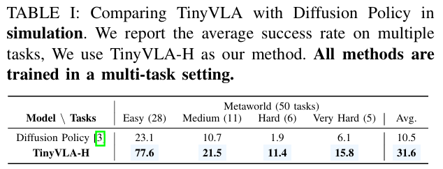

* Table I은 simulation benchmark인 MetaWorld에서 TinyVLA-H와 Diffusion Policy를 비교한 결과이다.
* 모든 방법은 multi-task setting에서 학습되었고, 평균 success rate를 기준으로 성능을 비교한다.
* 논문은 TinyVLA의 average success rate가 Diffusion Policy보다 21.5% 높다고 설명한다.

```text
Diffusion Policy Avg. = 10.5
TinyVLA-H Avg. = 31.6
```

* 특히 task 난이도가 높아질수록 두 모델의 성능 차이가 더 커진다.
* 예를 들어 MetaWorld Hard scenario에서 TinyVLA-H는 Diffusion Policy보다 약 6배 높은 성능을 보인다.

```text
MetaWorld Hard
Diffusion Policy = 1.9
TinyVLA-H = 11.4

11.4 / 1.9 = 6
```

* 즉, TinyVLA-H는 쉬운 task뿐 아니라 더 복잡한 manipulation task에서도 Diffusion Policy보다 우수한 성능을 보인다.
* 논문은 이 결과를 TinyVLA 방식의 우수성을 보여주는 근거로 제시한다.

> 참고: Table I에 표시된 반올림 값만 기준으로 계산하면 평균 차이는 31.6 - 10.5 = 21.1 percentage points이다. 논문 본문의 21.5%는 원본 비반올림 값 기준이거나 표기상 차이일 수 있다.


#### 2) Real-world experimental results

* real-world 실험 결과는 Table II에 제시된다.
* single-arm setting에서는 각 model을 task마다 20 trials로 평가한다.
* 논문은 3 checkpoints에 대한 success rate의 평균과 표준편차를 보고한다.

##### 20 trials의 의미

* 20 trials는 각 task에 대해 robot이 실제로 task를 20번 수행했다는 뜻이다.
* 예를 들어 FlipMug task에서 20번 시도하여 성공한 횟수를 바탕으로 success rate를 계산한다.

##### 3 checkpoints의 의미

* checkpoint는 학습 중 특정 시점에 저장된 모델 상태이다.
* 3 checkpoints는 학습 과정에서 저장된 서로 다른 모델 3개를 평가했다는 뜻이다.
* 논문은 이 3개 checkpoint에서 나온 success rate의 평균과 표준편차를 보고한다.

```text
checkpoint 1 → success rate
checkpoint 2 → success rate
checkpoint 3 → success rate

평균 ± 표준편차
```

* 이를 통해 특정 checkpoint 하나가 우연히 좋거나 나쁜 결과를 내는 문제를 줄일 수 있다.

##### Table II 주요 결과

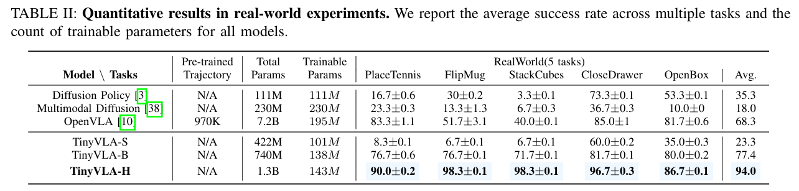

* TinyVLA-H는 real-world single-arm task에서 가장 높은 평균 success rate를 보인다.

```text
TinyVLA-H Avg. = 94.0
OpenVLA Avg. = 68.3
Diffusion Policy Avg. = 35.3
Multimodal Diffusion Avg. = 18.0
```

* TinyVLA-H는 FlipMug와 StackCubes에서 98.3% success rate를 달성한다.
* PlaceTennis에서는 90.0% success rate를 달성한다.

```text
TinyVLA-H
- PlaceTennis: 90.0
- FlipMug: 98.3
- StackCubes: 98.3
- CloseDrawer: 96.7
- OpenBox: 86.7
- Avg.: 94.0
```

##### Scaling law 관점

* Table II에서 TinyVLA-S, TinyVLA-B, TinyVLA-H의 성능은 모델 크기가 커질수록 크게 증가한다.

```text
TinyVLA-S Avg. = 23.3
TinyVLA-B Avg. = 77.4
TinyVLA-H Avg. = 94.0
```

* 이는 TinyVLA가 model size 증가에 따라 성능이 향상되는 scaling law 경향을 보인다는 근거로 제시된다.
* 즉 TinyVLA에서는 더 큰 multimodal model을 사용할수록 real-world robot task 성능이 좋아지는 경향이 나타난다.

##### OpenVLA 대비 성능 차이

* TinyVLA-H의 평균 success rate는 OpenVLA보다 25.7 percentage points 높다.

```text
TinyVLA-H Avg. = 94.0
OpenVLA Avg. = 68.3

94.0 - 68.3 = 25.7
```

* 이 결과는 TinyVLA가 OpenVLA보다 훨씬 작은 trainable parameter 수를 사용하면서도 더 높은 real-world task 성능을 달성했다는 점에서 중요하다.

```text
OpenVLA
- Total Params: 7.2B
- Trainable Params: 195M
- Avg.: 68.3

TinyVLA-H
- Total Params: 1.3B
- Trainable Params: 143M
- Avg.: 94.0
```

* 즉 TinyVLA-H는 OpenVLA보다 전체 모델 크기가 작고 trainable parameter도 적지만, 평균 success rate는 더 높다.
---

### C. Generalization to Unseen Instructions

* 이 subsection은 TinyVLA-H가 학습 중 보지 못한 instruction에 대해 generalization할 수 있는지 평가한다.
* TinyVLA-H를 사용한 이유는 simulation과 real-world experiment 모두에서 가장 좋은 성능을 보였기 때문이다.
* TinyVLA는 pre-trained multimodal model을 backbone으로 사용한다.
* 논문은 이 pre-trained multimodal model 안에 저장된 rich world knowledge가 TinyVLA의 embodied capability에 도움을 준다고 본다.
* 중요한 점은 TinyVLA가 RT-2처럼 question-answering pair로 학습된 것은 아니라는 점이다.
* 그럼에도 불구하고 pre-trained multimodal backbone 덕분에 새로운 instruction을 어느 정도 이해하고 실행할 수 있음을 보인다.

#### 1) Evaluation setting

* 논문은 instruction generalization을 평가하기 위해 고정된 instruction template을 사용한다.
* 예시는 다음과 같다.

```text
"Pick the [object]"
```

* 여기서 `[object]`에는 training data에서 보지 못한 randomized object가 들어간다.
* Figure 4에서는 object를 줄여서 `obj.`라고 표기한다.
* 실험에는 세 가지 object가 사용된다.

```text
1. mug
2. toy car
3. pink cube
```

* 이 실험의 목적은 TinyVLA가 단순히 학습된 문장을 외운 것이 아니라, instruction 안의 object description을 실제 물체와 연결할 수 있는지 확인하는 것이다.

---

#### 2) Level 1: unseen color 이해

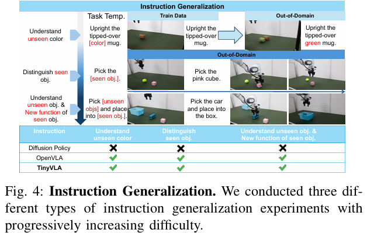
* 첫 번째 level은 TinyVLA가 seen color와 unseen color를 구분할 수 있는지 평가한다.
* 실험에서는 table 위에 두 개의 mug를 놓는다.
* 하나는 training data에서 본 색상이고, 다른 하나는 training data에서 보지 못한 색상이다.
* 모델에게는 green mug를 flip하라는 instruction이 주어진다.
* 여기서 green color는 training data에 없던 색상이다.

```text
Instruction:
"Upright the tipped-over green mug."
```

* TinyVLA는 이 task를 성공적으로 수행했다.
* 이는 TinyVLA가 색상이라는 object attribute를 어느 정도 이해하고, unseen color가 포함된 instruction도 실제 object와 연결할 수 있음을 보여준다.

```text
핵심 의미:
TinyVLA는 학습 때 보지 못한 색상 표현도
pre-trained multimodal knowledge를 바탕으로 해석할 수 있다.
```

---

#### 3) Level 2: seen object 구분 및 grasping

* 두 번째 level은 모델이 instruction에 나온 object를 실제 장면 속 object와 연결해 grasp할 수 있는지 평가한다.
* 이 실험에서는 제시된 object들이 training data에 포함되어 있었던 object이다.
* 모델에게는 다음과 같은 instruction이 주어진다.

```text
Instruction:
"Pick the cube."
```

* 환경과 instruction 자체는 training data에 없었지만, TinyVLA는 cube를 성공적으로 집었다.
* 이는 TinyVLA가 text description을 physical object에 mapping할 수 있음을 보여준다.

```text
핵심 의미:
TinyVLA는 "cube"라는 언어 표현을
실제 장면 속 cube object와 연결할 수 있다.
```

---

#### 4) Level 3: unseen object와 새로운 skill-object combination

* 세 번째 level은 난이도를 더 높인 실험이다.
* 모델은 toy car를 집어서 box 안에 넣으라는 instruction을 받는다.
* toy car는 training data에 없던 object이다.

```text
Instruction:
"Pick a toy car and place it into the box."
```

* 실험 환경에는 toy car 옆에 pink cube도 함께 배치된다.
* 이는 모델이 instruction을 제대로 이해하는지 확인하기 위한 설정이다.
* 즉 모델이 단순히 눈에 잘 띄는 object나 익숙한 object를 고르는 것이 아니라, instruction에 나온 toy car를 선택해야 한다.

```text
Scene:
toy car + pink cube

Target:
toy car
```

* 또한 “place into the box”는 새로운 skill-object combination을 만든다.
* box라는 object는 익숙할 수 있지만, 해당 object를 사용하는 방식이나 기능 조합은 training data와 다를 수 있다.
* 따라서 이 실험은 두 가지 generalization을 동시에 확인한다.

```text
1. unseen object recognition
   = training data에 없던 toy car를 인식할 수 있는가?

2. new functionality of familiar object
   = 익숙한 object인 box를 새로운 방식으로 사용할 수 있는가?
```

* TinyVLA가 이 task를 성공하면, 새로운 object를 인식하고 익숙한 object의 새로운 기능적 역할까지 이해할 수 있음을 의미한다.

---

#### 5) Overall Meaning

* C절의 핵심은 TinyVLA-H가 unseen instruction에 대해 어느 정도 generalization할 수 있음을 보이는 것이다.
* TinyVLA는 question-answering pair로 학습된 RT-2류 모델은 아니지만, pre-trained multimodal backbone을 사용하기 때문에 object attribute, object name, instruction-object mapping을 활용할 수 있다.
* 실험은 난이도를 세 단계로 올리며 진행된다.

```text
Level 1:
unseen color 이해

Level 2:
seen object를 instruction에 따라 구분하고 grasp

Level 3:
unseen object 인식 + familiar object의 새로운 기능 조합 이해
```

* 결과적으로 TinyVLA는 학습한 task를 반복하는 것이 아니라, 새로운 언어 표현과 새로운 object 조합에도 어느 정도 대응할 수 있음을 보여준다.

---

### D. More Real-World Experiments: Bimanual Robot

* 이 subsection은 TinyVLA-H를 bimanual UR5 robot setup에 적용한 추가 real-world experiment를 설명한다.
* bimanual robot은 두 개의 robot arm을 함께 사용하는 setup이다.
* 이 실험은 single-arm task보다 더 어렵다.
* 그 이유는 두 팔의 coordination이 필요하고, task duration과 required skills가 task마다 크게 다르기 때문이다.

---

#### 1) Bimanual task 구성

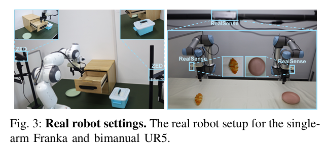
* 논문은 bimanual UR5 robot에서 세 가지 task를 수행한다.

```text
1. PlaceBread
   = bread를 plate 위로 옮기기

2. StackCube
   = cube를 쌓기

3. PlaceTennisBag
   = bag을 열고 tennis ball을 넣기
```

* 이 task들은 duration과 필요한 skill이 크게 다르다.
* 따라서 하나의 multi-task policy model이 이들을 모두 학습하기 어렵다.

* 특히 PlaceTennisBag는 두 팔의 협력과 조작 순서가 중요할 가능성이 높다.
* 따라서 bimanual setting은 TinyVLA가 single-arm 환경을 넘어 더 복잡한 robot manipulation에도 적용될 수 있는지 확인하는 실험이다.

---

#### 2) Quantitative results

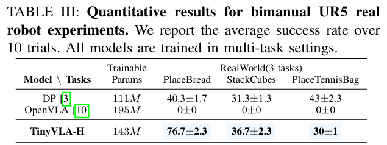

* 결과는 Table III에 제시된다.
* 모든 모델은 multi-task setting에서 학습된다.
* Table III은 각 task에 대해 10 trials의 평균 success rate를 보고한다.
* 비교 대상은 Diffusion Policy, OpenVLA, TinyVLA-H이다.

```text
Diffusion Policy Avg. = 38.2
OpenVLA Avg. = 0.0
TinyVLA-H Avg. = 44.5
```

* TinyVLA-H는 평균 success rate 44.5%를 달성하여 Diffusion Policy의 38.2%보다 높다.
* 즉 bimanual robot setting에서도 TinyVLA-H가 전체 평균 기준으로 Diffusion Policy를 surpass한다.

---

#### 3) OpenVLA failure

* 논문에서 주목하는 점은 OpenVLA가 모든 trial에서 실패했다는 것이다.
* OpenVLA의 success rate는 모든 bimanual task에서 0%로 나타난다.
* 논문은 그 이유를 OpenVLA의 pre-training data 특성에서 찾는다.
* OpenVLA는 OpenX dataset으로 pre-trained되었는데, 이 dataset은 single-arm robot data로 구성되어 있다.
* 따라서 bimanual robot에 적용했을 때 효과적으로 동작하지 못했을 가능성이 있다고 설명한다.

```text
OpenVLA pretraining:
single-arm robot data 중심

Bimanual task:
two-arm coordination 필요

결과:
OpenVLA가 bimanual setting에 적응하지 못함
```

* 즉 OpenVLA의 실패는 model 자체의 문제라기보다는, pre-training data와 target robot setup 사이의 mismatch 때문일 수 있다.

---

#### 4) Overall Meaning

* D절의 핵심은 TinyVLA-H가 single-arm setting뿐 아니라 bimanual robot setting에서도 일정 수준의 성능을 보인다는 것이다.
* bimanual task는 두 팔의 협력, 긴 trajectory, 다양한 skill 조합이 필요하기 때문에 multi-task policy 학습이 더 어렵다.
* 그럼에도 TinyVLA-H는 Diffusion Policy보다 높은 평균 success rate를 달성했다.
* 반면 OpenVLA는 single-arm data 중심의 pretraining 때문에 bimanual setting에서 실패했다.


---

### E. Experiments on Generalization

* 이 subsection은 TinyVLA가 다양한 환경 변화에 대해 generalization할 수 있는지 평가한다.
* TinyVLA의 구조는 pre-trained multimodal model과 Diffusion Policy head의 결합이다.
* 논문은 이 결합이 robot action output을 최적화할 뿐 아니라, 다양한 환경에서의 adaptability를 높인다고 설명한다.
* 모든 generalization experiment에서는 각 setting마다 trial을 수행하고, DP3를 따라 동일한 evaluation metric을 사용한다.
* 결과 표기에서는 cross mark를 failure, checkmark를 successful task completion으로 사용한다.

```text
Generalization experiment의 핵심 질문:
학습 때 보지 못한 시점, 배경, 조명, distractor, 위치, 외형 변화가 있어도
TinyVLA가 task를 수행할 수 있는가?
```

---

#### 1) Generalization to new views

* view generalization은 학습 때 본 camera view와 다른 camera view에서도 task를 수행할 수 있는지 평가하는 실험이다.
* imitation learning은 제한된 camera view에서 학습하면, camera viewpoint가 조금만 달라져도 성능이 크게 떨어질 수 있다.
* 이는 모델이 object와 action의 관계를 학습했다기보다, 학습 때 본 image pattern이나 camera geometry에 과적합했을 가능성이 있기 때문이다.

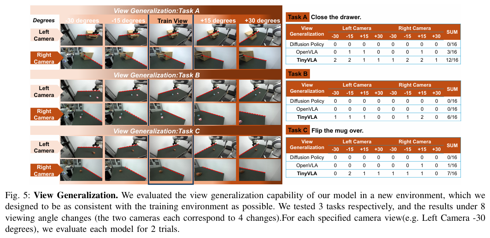

* Figure 5에서는 TinyVLA, Diffusion Policy, OpenVLA의 view generalization 성능을 비교한다.
* Diffusion Policy는 viewpoint 변화에 매우 민감하다.
* 논문은 약간의 viewpoint shift만 있어도 Diffusion Policy가 쉽게 실패한다고 설명한다.
* 반면 TinyVLA는 camera view가 바뀌어도 어느 정도 robust하게 task를 수행한다.
* 특히 Task B인 StackCube와 Task C인 FlipMug는 object manipulation precision이 중요한 task이다.
* StackCube는 cube를 정확히 집고 다른 cube 위에 올려야 한다.
* FlipMug는 넘어진 mug를 회전시켜 바로 세워야 한다.
* 이런 task에서는 camera view가 바뀌면 object 위치, 깊이감, gripper 접근 방향이 달라 보이기 때문에 난이도가 높아진다.
* 논문은 TinyVLA가 이러한 정밀 조작 task에서도 좌우 최대 30도 camera view shift를 어느 정도 처리할 수 있다고 설명한다.
* TinyVLA가 항상 성공하는 것은 아니지만, Diffusion Policy와 OpenVLA보다 훨씬 강한 view generalization을 보인다.
* 논문은 이를 diffusion-based policy head 사용의 이점으로 해석한다.

```text
정리:
Diffusion Policy
→ viewpoint 변화에 매우 취약

OpenVLA
→ 일부 성공하지만 제한적

TinyVLA
→ 완벽하지는 않지만, view shift 상황에서 가장 robust
```

---

#### 2) Background generalization

* background generalization은 학습 때 본 배경과 다른 배경에서도 task를 수행할 수 있는지 평가하는 실험이다.
* 논문은 tablecloth의 색상과 재질을 바꾸어 총 6가지 background style을 만든다.
* 예시로 wooden tabletop, mouse pad, deskmat 등이 사용된다.

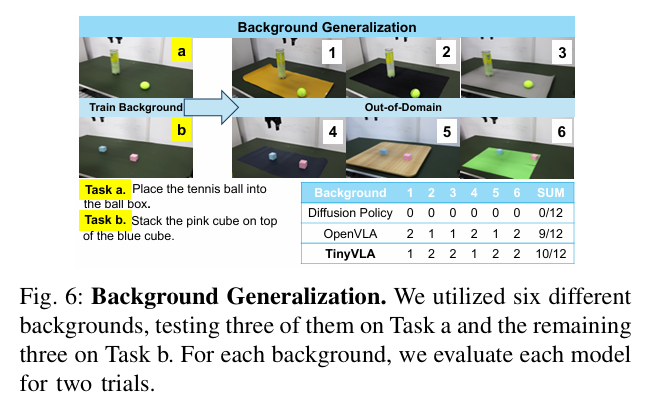

* Figure 6에서는 6개의 다른 background에서 task를 평가한다.
* 그중 3개 background는 Task A에 사용하고, 나머지 3개 background는 Task B에 사용한다.

```text
Task A:
Place the tennis ball into the ball box.

Task B:
Stack the pink cube on top of the blue cube.
```

* 이 실험의 목적은 모델이 배경 색이나 테이블 질감을 외운 것이 아니라, task-relevant object를 제대로 찾고 행동할 수 있는지 확인하는 것이다.
* 결과적으로 TinyVLA는 다양한 background에서도 object를 정확히 locate하고 task를 수행한다.
* 특히 PlaceTennis처럼 object 위치가 중요한 task에서도 성능을 보인다.
* 논문은 TinyVLA가 OpenVLA와 comparable한 background generalization 성능을 보인다고 설명한다.

---

#### 3) Generalization to different light conditions

* 이 실험은 조명 조건이 달라졌을 때 모델이 task를 수행할 수 있는지 평가한다.
* 일반적인 policy network는 lighting variation에 민감할 수 있다.
* 조명이 바뀌면 image의 밝기, 그림자, object contrast가 달라지기 때문이다.
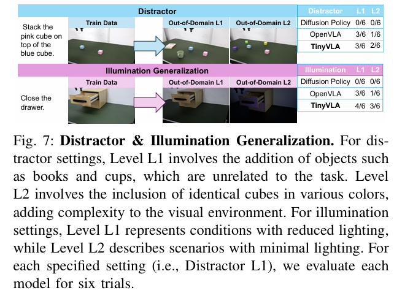


* Figure 7의 bottom 부분은 세 가지 lighting scenario를 비교한다.

```text
Training condition:
학습 데이터의 기본 조명

Out-of-Domain L1:
overhead lights를 끈 상태

Out-of-Domain L2:
모든 lights를 끈 상태에 가까운 매우 어두운 조건
```

* 논문은 TinyVLA가 이러한 lighting variation에 크게 영향을 받지 않는다고 설명한다.
* 반면 OpenVLA는 low-light condition에서 task completion에 실패한다.
* 이 결과는 TinyVLA가 background lighting 변화에 대해 robust하다는 앞선 결과를 강화한다.

---

#### 4) Generalization to distractor

* distractor generalization은 task와 직접 관련 없는 물체가 추가되었을 때 모델이 task를 수행할 수 있는지 평가한다.
* diffusion policy는 일반적으로 distractor에 민감한 것으로 알려져 있다.
* 즉 collected data에 없던 object가 scene에 등장하면, policy가 task를 실패할 수 있다.
* 강한 data augmentation을 사용하면 이 문제를 완화할 수 있지만, 논문은 data augmentation 없이도 distractor에 robust한지 확인하고자 한다.


* Figure 7의 top 부분은 StackCube task에서 additional distractor를 넣은 실험을 보여준다.
* distractor 난이도는 두 단계로 구성된다.

```text
Level L1:
book, cup처럼 task와 무관한 object를 추가

Level L2:
다양한 색상의 동일한 cube들을 추가하여 visual complexity를 높임
```

* L1은 단순히 task와 관계없는 object가 추가된 상황이다.
* L2는 task object와 비슷한 형태의 object가 여러 색상으로 추가되기 때문에 더 어렵다.
* TinyVLA는 두 distractor difficulty level 모두에서 상대적으로 잘 대응한다.
* 반면 Diffusion Policy는 distractor가 있는 상황에서 어려움을 보인다.
* OpenVLA는 L1에서는 TinyVLA와 같은 3/6을 기록했지만, L2에서는 1/6으로 성능이 낮아졌다.
* TinyVLA는 L1에서 3/6, L2에서 2/6을 기록하며 두 distractor level 모두에서 상대적으로 더 안정적인 성능을 보였다.
* 논문은 이를 바탕으로 Diffusion Policy와 OpenVLA가 distractor 상황에서 어려움을 보인다고 설명한다.
* 논문은 pre-trained multimodal model을 사용하는 것이 distractor가 있는 환경에서 generalization capability를 크게 향상시킨다고 해석한다.

---

### F. Spatial Generalization

* spatial generalization은 같은 task 안에서 object 위치가 학습 때와 달라졌을 때에도 task를 수행할 수 있는지 평가하는 것이다.
* 논문은 spatial generalization을 “unseen setup of object locations”에 대한 generalization으로 설명한다.
* 즉 object 자체는 같더라도, object가 놓인 위치가 training data와 다르면 모델이 이를 처리할 수 있는지 보는 실험이다.
* 이 능력은 단순한 이미지 암기보다 물리적 공간과 object에 대한 physical common sense를 요구한다.

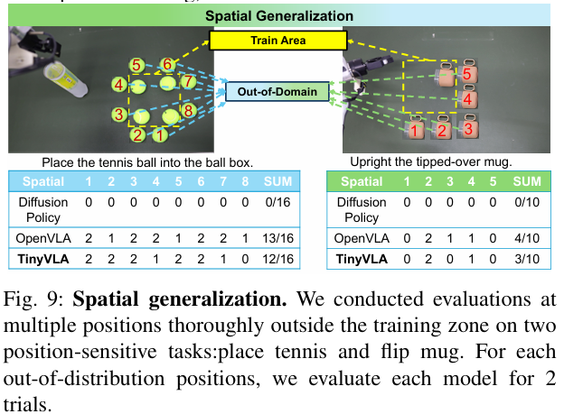


* Figure 9에서는 position-sensitive task에서 spatial generalization을 평가한다.
* 평가 task는 PlaceTennis와 FlipMug이다.

```text
PlaceTennis:
tennis ball을 ball box 안에 넣기

FlipMug:
넘어진 mug를 바로 세우기
```

* 논문은 training zone 밖에 있는 여러 위치에서 평가를 수행한다.
* 각 out-of-distribution position에 대해 모델별로 2 trials를 수행한다.
* TinyVLA는 training dataset에 없던 object location에서도 task를 성공적으로 수행한다.

* 다만 이 실험에서는 OpenVLA가 TinyVLA보다 약간 더 좋은 성능을 보인다.
* 논문은 OpenVLA가 TinyVLA보다 spatial generalization에서 약간 더 좋은 이유를, OpenVLA가 large-scale robotic data로 pre-training되어 더 다양한 robot action을 보았기 때문일 가능성이 있다고 설명한다.
* 추가적으로 OpenVLA의 Prismatic backbone에는 SigLIP-DINOv2 visual encoder가 포함되어 spatial reasoning에 유리할 수 있지만, TinyVLA 논문 본문은 Spatial Generalization 결과의 직접 원인으로 DINOv2를 언급하지는 않는다.
* OpenVLA는 pretraining 과정에서 더 다양한 robot action을 보았기 때문에, 공간 위치 변화에 조금 더 유리할 수 있다.
* 반면 Diffusion Policy는 TinyVLA와 같은 data로 학습되었지만, 테스트된 위치들에서 지속적으로 spatial generalization에 실패한다.

```text
결과 해석:
OpenVLA
→ large-scale robot pretraining 덕분에 spatial generalization에서 약간 유리

TinyVLA
→ large-scale robot pretraining 없이도 상당한 spatial generalization 가능

Diffusion Policy
→ 같은 data로 학습했지만 spatial shift에 취약
```

---

### G. Visual Generalization

* visual generalization은 새로운 visual texture나 visual appearance 변화에 적응하는 능력을 의미한다.
* robotic manipulation에서는 background color, object texture, ambient lighting 변화가 여기에 해당한다.
* 이러한 visual change는 task의 근본 구조를 바꾸지는 않는다.
* 예를 들어 object의 위치나 목표는 그대로인데, 색상이나 질감만 바뀌는 경우이다.
* 따라서 robot은 visual cue가 바뀌더라도 그 semantic meaning을 정확히 해석해야 한다.

---

#### 1) Appearance generalization

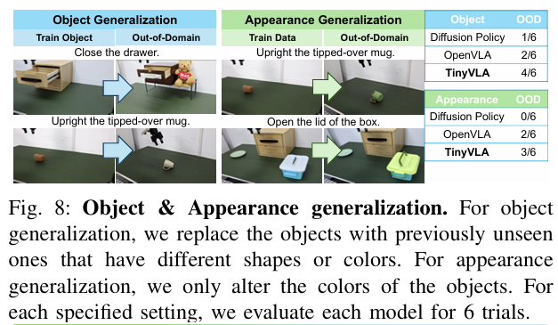

* appearance generalization은 target object의 외형, 특히 색상 변화에 대한 generalization을 평가한다.
* Figure 8의 right 부분에서 target object의 color를 변경한다.
* 원래 training data에서 mug는 brown이고, lid는 white였다.
* 이후 평가에서는 이 object들의 색상을 바꾼다.

```text
Train Data:
brown mug
white lid

Out-of-Domain:
색상이 바뀐 mug
색상이 바뀐 lid
```

* TinyVLA는 색상이 달라진 object에 대해서도 task를 수행한다.
* 논문은 TinyVLA가 OpenVLA와 유사한 수준의 appearance generalization을 보인다고 설명한다.
* 중요한 점은 TinyVLA가 training 과정에서 data augmentation에 의존하지 않고도 appearance generalization을 달성했다는 것이다.
* 논문은 이 generalization capability가 pre-trained vision-language data에서 비롯된다고 해석한다.

---

#### 2) Object generalization


* Figure 8의 left 부분은 object generalization을 보여준다.
* object generalization은 기존 training data에 없던 새로운 object가 등장했을 때 task를 수행할 수 있는지 평가하는 것이다.
* 이때 object는 모양이나 색상이 training object와 다를 수 있다.

* Fig. 8에서는 target object를 이전에 보지 못한 object로 교체한다.
* Diffusion Policy는 object generalization에서 낮은 성능을 보인다.
* OpenVLA는 일부 성공하지만 제한적이다.
* TinyVLA는 세 모델 중 가장 높은 성공률을 보인다.

```text
Object Generalization 결과:
Diffusion Policy = 1/6
OpenVLA = 2/6
TinyVLA = 4/6
```

* 이는 TinyVLA가 pre-trained multimodal backbone을 통해 새로운 object의 시각적·언어적 의미를 어느 정도 활용할 수 있음을 보여준다.

---

#### 3) Overall Meaning

* E, F, G절의 generalization 실험은 TinyVLA가 다양한 out-of-domain condition에 대해 얼마나 robust한지 확인한다.
* 평가된 변화는 다음과 같다.

```text
1. View change
   = camera viewpoint 변화

2. Background change
   = tablecloth, texture, material 변화

3. Illumination change
   = lighting condition 변화

4. Distractor
   = task와 무관한 object 추가

5. Spatial change
   = object 위치 변화

6. Object / Appearance change
   = 새로운 object 또는 object color 변화
```

* 전체적으로 TinyVLA는 Diffusion Policy보다 훨씬 강한 generalization 성능을 보인다.
* OpenVLA와 비교하면 일부 setting에서는 OpenVLA가 비슷하거나 더 좋고, 일부 setting에서는 TinyVLA가 더 좋다.
* 논문은 TinyVLA의 generalization 성능이 pre-trained multimodal model의 world knowledge와 diffusion-based policy head의 결합에서 나온다고 해석한다.

---

## V. Ablation Study

### Overview

* 이 section은 TinyVLA의 성능과 속도에 영향을 주는 요소를 분리해서 분석한다.
* 즉 TinyVLA가 좋은 성능을 보이는 이유가 단순히 model size 때문인지, diffusion policy head 때문인지, 또는 autoregressive action generation을 피했기 때문인지 확인한다.
* 논문은 세 가지 ablation question을 다룬다.

```text
1. VLM size가 커지면 TinyVLA 성능이 왜 좋아지는가?

2. policy head로 diffusion model을 쓰는 것이 정말 중요한가?

3. TinyVLA가 OpenVLA보다 빠른 이유는 작은 VLM 때문인가,
   아니면 action prediction 방식 때문인가?
```

---

### A. Trade-off between size of VLM and TinyVLA’s Performance

* 이 subsection은 TinyVLA의 model size와 performance 사이의 관계를 분석한다.
* 앞선 main experiment인 Table II와 Table III에서는 TinyVLA가 scaling law를 따르는 경향을 보였다.
* 즉 model size가 커질수록 여러 task에서 평균 success rate가 향상되었다.
* 이 subsection에서는 단순히 “큰 모델이 더 좋다”에서 끝내지 않고, 왜 큰 모델이 더 좋은지 failure case analysis를 통해 확인한다.

#### 1) 비교한 TinyVLA variants

* 논문은 세 가지 TinyVLA variant를 비교한다.

```text
TinyVLA-0.4B
TinyVLA-1.3B
TinyVLA-3B
```

* TinyVLA-0.4B와 TinyVLA-1.3B는 main experiment에서도 사용된 모델이다.
* TinyVLA-3B는 pre-trained PaliGemma model을 사용한 variant이다.

#### 2) 평가 task

* 각 모델은 네 가지 task 중 하나에 대해 평가된다.

```text
1. PlaceTennis
   = tennis ball을 box 안에 넣기

2. FlipMug
   = 넘어진 mug를 바로 세우기

3. StackCubes
   = cube를 쌓기

4. PlaceTennisBag
   = bimanual robot에서 tennis ball을 bag 안에 넣기
```

* PlaceTennis, FlipMug, StackCubes는 Franka robot에서 수행된다.
* PlaceTennisBag는 bimanual robot에서 수행된다.
* 각 task는 6번 평가되고, 전체 failure 횟수를 기록한다.
* 결과는 Figure 10에 제시된다.

#### 3) Failure case analysis의 의미

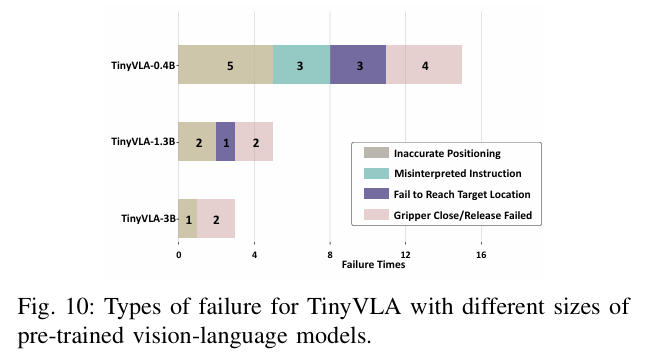

* 분석 결과, VLM size는 task success에 큰 영향을 준다.
* TinyVLA-0.4B는 instruction을 잘못 해석하여 3번 실패했다.
* 논문은 그 이유를 작은 VLM의 제한적인 language comprehension capability로 설명한다.
* 즉 모델 크기가 너무 작으면 instruction을 제대로 이해하지 못할 수 있다.

* 이 문제는 model size를 1.3B로 키웠을 때 해결되었다.
* 또한 model size를 키우면 inaccurate positioning이나 wrong target location으로 인한 실패도 줄어든다.
* 즉 큰 모델은 단순히 언어 이해만 좋아지는 것이 아니라, object localization 능력도 향상될 수 있다.

#### 4) PaliGemma를 쓴 TinyVLA-3B의 의미

* TinyVLA-3B는 PaliGemma 기반 모델을 사용한다.
* 논문은 PaliGemma가 localization data로 학습되어 있고, 더 풍부한 visual feature representation을 갖기 때문에 localization ability가 좋아진다고 설명한다.
* 따라서 model size 증가와 더 나은 pre-trained VLM backbone은 object 위치 파악과 target reaching 성능을 개선할 수 있다.

```text
모델 크기 증가의 효과:
1. instruction 이해 능력 향상
2. object localization 능력 향상
3. wrong target reaching 감소
4. task success rate 증가
```
---

### B. Choice of Policy Model

* 이 subsection은 TinyVLA에서 diffusion model이 정말 필요한지 확인한다.
* TinyVLA의 좋은 성능은 pre-trained VLM과 diffusion model을 결합한 구조에서 나온다.
* 하지만 여기서 중요한 질문은 다음과 같다.

```text
Diffusion model이 필수적인가?
다른 policy network를 붙여도 비슷한 성능이 나오는가?
```

* 이를 확인하기 위해 논문은 TinyVLA-H를 base model로 두고, policy head만 바꿔 비교한다.

#### 1) 비교한 policy head

* 논문은 세 가지 policy head를 비교한다.

```text
1. Multi-Layer Perceptron, MLP

2. Action Chunking Transformer, ACT

3. Diffusion Model
```

* MLP는 behavior cloning에서 흔히 쓰이는 단순한 policy head이다.
* ACT는 stable and smooth action을 생성하는 데 사용되는 action chunking transformer이다.
* Diffusion Model은 TinyVLA의 기본 policy head이다.

#### 2) Table V 결과

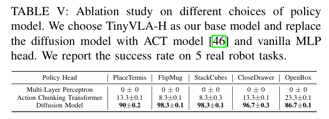

* Table V는 5개 real robot task에 대한 success rate를 보여준다.

* MLP 기반 방식은 모든 task에서 완전히 실패했다.
* 논문은 그 이유를 MLP layer의 limited capacity로 설명한다.
* 즉 VLM이 만든 복잡한 multimodal feature를 단순 MLP head가 충분히 action으로 변환하지 못했을 가능성이 크다.
* ACT는 일부 성공했지만, 전체적으로 성능이 낮다.
* 반면 Diffusion Model은 모든 task에서 훨씬 높은 success rate를 보인다.

#### 3) Diffusion model이 중요한 이유

* 이 결과는 TinyVLA에서 policy head 선택이 매우 중요하다는 것을 보여준다.
* 단순히 pre-trained VLM만 붙인다고 높은 robot manipulation 성능이 나오는 것이 아니다.
* VLM이 만든 feature를 실제 continuous robot action으로 잘 변환할 수 있는 policy decoder가 필요하다.
* 논문은 diffusion model이 MLP나 ACT보다 훨씬 효과적인 policy head라고 주장한다.

---

### C. Which Part of TinyVLA makes it Fast?


* 이 subsection은 TinyVLA가 왜 OpenVLA보다 빠른지 분석한다.
* TinyVLA의 장점은 lightweight design과 빠른 inference speed이다.
* Figure 1에 따르면 TinyVLA-H는 OpenVLA보다 평균 success rate가 높으면서도 parameter 수는 5.5배 적고, 동작 속도는 20배 빠르다.
* 논문은 이 속도 차이가 어디서 나오는지 확인한다.

#### 1) 실험 질문

* TinyVLA가 빠른 이유는 두 가지로 나눠 생각할 수 있다.

```text
가능성 1:
VLM backbone이 작기 때문에 빠르다.

가능성 2:
action prediction을 diffusion model로 하기 때문에 빠르다.
즉 autoregressive action token generation을 피하기 때문에 빠르다.
```

* 논문은 이를 구분하기 위해 OpenVLA의 Prismatic-7B VLM backbone을 TinyVLA와 같은 규모의 architecture로 교체한다.
* 즉 OpenVLA도 1B급 backbone을 쓰게 만들어 비교한다.

#### 2) Table IV 결과

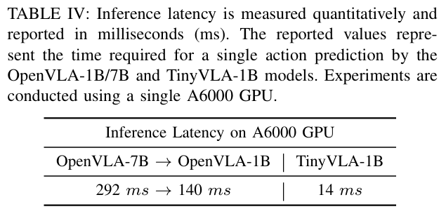
* Table IV는 single A6000 GPU에서 single action prediction에 걸리는 inference latency를 비교한다.
* OpenVLA의 backbone을 7B에서 1B로 줄이면 inference latency는 292 ms에서 140 ms로 감소한다.
* 이는 약 2배 정도 빨라진 것이다.
* 하지만 OpenVLA-1B는 여전히 TinyVLA-1B보다 약 10배 느리다.


#### 3) 이 결과가 의미하는 것

* 이 결과는 TinyVLA의 빠른 속도가 단순히 작은 VLM 때문만은 아니라는 것을 보여준다.
* OpenVLA도 VLM backbone을 작게 만들면 어느 정도 빨라지지만, 여전히 TinyVLA보다 훨씬 느리다.
* 중요한 차이는 action prediction 방식이다.

```text
OpenVLA:
autoregressive action token generation
→ action token을 하나씩 생성
→ 모델 forward가 반복적으로 필요
→ inference latency 증가

TinyVLA:
diffusion model로 action prediction
→ action token을 하나씩 생성하지 않음
→ test-time speed 향상
```

* 즉 TinyVLA는 작은 VLM을 사용하는 동시에, computationally expensive한 autoregressive action token generation을 피한다.
* 이 두 요소가 결합되어 높은 inference speed를 만든다.

---

## VI. Conclusion

* 이 논문은 pre-trained multimodal model을 robotic manipulation에 활용하는 가능성을 탐구한다.
* 기존 VLA model은 large-scale robot data pretraining, 큰 model size, 느린 inference라는 한계를 가진다.
* TinyVLA는 이러한 한계를 줄이기 위해 compact multimodal backbone과 Diffusion Policy head를 결합한다.
* 이를 통해 fast inference와 data-efficient training을 동시에 목표로 한다.

```text
TinyVLA의 핵심 구조:
pre-trained compact multimodal model
+
Diffusion Policy head
```

* 논문은 simulation과 real-world experiment를 통해 TinyVLA의 효과를 보인다.
* TinyVLA는 baseline보다 높은 success rate를 보였고, 다양한 generalization setting에서도 robust한 성능을 보였다.
* 또한 ablation study를 통해 다음을 확인했다.

```text
1. VLM size가 커질수록 성능이 좋아지는 scaling law 경향이 나타난다.

2. Diffusion model policy head가 MLP나 ACT보다 훨씬 효과적이다.

3. TinyVLA의 빠른 inference는 작은 VLM뿐 아니라,
   autoregressive action token generation을 피하는 구조 덕분이다.
```

* 결론적으로 TinyVLA는 빠르고 data-efficient한 VLA model을 구축하기 위한 새로운 접근으로 제안된다.
* 논문의 핵심 주장은 다음과 같이 정리할 수 있다.

```text
대규모 robot dataset pretraining 없이도,
pre-trained multimodal model과 diffusion policy를 잘 결합하면
빠르고 효율적인 VLA robot policy를 만들 수 있다.
```
---

<details>
<summary><b>Thoughts After Reading This Paper</b></summary>

## Thoughts After Reading This Paper

### 1. Fast inference와 action debugging 사이의 trade-off

**논문 한계**  
TinyVLA는 기존 VLA에서 사용하던 autoregressive action token generation을 피하고, diffusion policy head를 통해 continuous robot action을 생성한다. 이 구조는 action token을 순차적으로 생성하지 않기 때문에 inference speed 측면에서 장점을 가진다. 다만 action이 discrete token sequence로 명시적으로 드러나지 않기 때문에, 실패 상황에서 어느 시점의 action generation이 문제였는지 분석하기 어려울 수 있다.

**내가 떠올린 확장 질문**  
Autoregressive 방식은 action token을 순차적으로 생성하므로, action sequence 안에서 특정 token 전환 지점을 추적할 수 있다. 그렇다면 TinyVLA처럼 continuous action을 생성하는 방식에서는 action 결과가 이상하게 나왔을 때, 실패한 시점이나 원인을 어떻게 찾을 수 있을까?

**생각해볼 수 있는 문제**  
예를 들어 autoregressive 방식에서 action token sequence가 `a1 → a2 → a3 → b1 → b2`처럼 생성되었고, `a3 → b1` 구간에서 행동이 갑자기 이상해졌다면, 사람이 해당 전환 지점을 중심으로 왜 action의 속성이 바뀌었는지 분석해볼 수 있을 것이다. 반면 diffusion-based continuous action generation에서는 action이 discrete token 단위로 명확히 나뉘어 드러나지 않는다. 따라서 실패가 발생했을 때, 그 원인이 특정 action token의 문제인지, 조건 embedding의 문제인지, diffusion policy가 생성한 trajectory의 문제인지 바로 구분하기 어려울 수 있다. 즉 TinyVLA의 fast inference 구조는 실제 robot control에서는 실용적이지만, action-level debugging 관점에서는 해석이 더 어려워질 가능성이 있다.

**가능한 방향**  
이 부분은 아직 명확한 해결 방향을 떠올리지는 못했다. 다만 autoregressive 방식처럼 특정 action token 전환 지점을 추적하는 방식과, TinyVLA의 continuous action generation에서 실패 구간을 분석하는 방식이 어떻게 달라지는지 비교해볼 필요가 있다고 생각했다. 특히 action 결과가 이상하게 나왔을 때, continuous action에서도 특정 시점의 변화나 실패 구간을 사람이 지목할 수 있는지 확인해볼 수 있을 것 같다.

**가능한 방향 (Hi Robot 논문을 읽은 뒤)**

Hi Robot은 전체 policy를 high-level inference와 low-level policy로 나누어 구성한다. High-level에서는 현재 vision observation과 language prompt, 그리고 사용자 feedback을 바탕으로 low-level language command를 생성한다. 이후 low-level VLA는 이 command와 현재 robot state를 입력으로 받아 continuous action을 chunk 단위로 출력한다.

이 구조에서 중요한 점은 사용자의 interjection이 들어왔을 때 high-level inference가 다시 실행된다는 것이다. 예를 들어 사용자가 “that’s not trash” 또는 “leave it alone”처럼 task 수행 중간에 피드백을 주면, high-level policy는 현재 이미지와 사용자 발화를 함께 해석하여 low-level command를 다시 계산한다. 그러면 low-level VLA는 갱신된 command를 바탕으로 새로운 continuous action chunk를 생성할 수 있다.

따라서 Hi Robot의 방향은 continuous action sequence 자체를 직접 해석하거나 수정하는 것보다는, action을 생성하게 만드는 상위 명령을 high-level inference가 상황에 맞게 갱신하는 방식에 가깝다. 이 구조를 활용하면 돌발적인 사용자 피드백이나 상황 변화가 발생했을 때, low-level action을 직접 조작하기보다 high-level command를 다시 생성하여 행동 흐름을 바꾸는 방향을 생각해볼 수 있다.


### OpenVLA vs TinyVLA Comparison

| 비교 항목 | OpenVLA | TinyVLA |
|---|---|---|
| Pre-training 방식 | OpenX 기반 large-scale robot data pre-training | Pythia 기반 compact VLM을 LLaVA-style vision-language data로 pre-training |
| Fine-tuning 방식 | robot data로 autoregressive action token prediction 학습 | VLM 대부분 freeze + LoRA fine-tuning + diffusion policy head 학습 |
| Inference 속도 | 느림. large VLM과 autoregressive action token generation 때문 | 빠름. compact VLM과 diffusion-based policy head로 action을 생성하기 때문 |
| Model size | 7B급 | 70M~1.4B compact VLM family |
| Action 출력 방식 | discretized action tokens를 autoregressive하게 예측한 뒤 action으로 변환 | diffusion policy decoder가 continuous robot action을 생성 |
| Language model backend | LLaMA 계열 language model | Pythia language model backend |
| Camera view 차이 | vanilla는 single-view 기반, 논문 비교에서는 multi-view 입력에 맞게 수정 | real robot setting에서 multi-view camera input 사용 |

</details>

<details>
<summary><b>Summary</b></summary>

## TinyVLA

### One-line Summary

* TinyVLA는 기존 VLA의 느린 inference와 large-scale robot data pretraining 의존성을 줄이기 위해, compact pre-trained multimodal model과 diffusion policy head를 결합하여 빠르고 data-efficient한 robot manipulation을 목표로 한 VLA model이다.

---

### Structure

* TinyVLA의 핵심 구조는 compact VLM backbone과 diffusion-based policy head의 결합이다.

* 기존 VLA model은 large VLM을 기반으로 하고, robot action을 autoregressive action token generation 방식으로 생성하는 경우가 많다.

* 반면 TinyVLA는 작은 규모의 pre-trained multimodal model을 사용하고, action tokenization 대신 diffusion policy decoder를 통해 continuous robot action을 생성한다.

* 즉, TinyVLA는 image와 language instruction을 먼저 multimodal feature로 변환한 뒤, robot proprioceptive state와 결합하여 action generation에 필요한 conditional embedding을 만든다.

* 이후 diffusion policy head가 이 conditional embedding을 바탕으로 robot arm이 실행할 수 있는 continuous action을 생성한다.

---

### Model Architecture

* TinyVLA는 pre-trained VLM을 policy backbone으로 사용한다.

* VLM은 image observation과 language instruction을 입력받아 multimodal embedding을 생성한다.

* 이 embedding은 adaptive pooling과 layer normalization을 거쳐 고정된 크기의 feature로 정리된다.

* 이후 robot proprioceptive state vector와 concatenate되고, 3-layer MLP를 통해 diffusion policy가 사용할 conditional embedding으로 변환된다.

* Diffusion policy head는 이 conditional embedding을 조건으로 받아 continuous robot action을 생성한다.

* 최종 action은 position, rotation, gripper width와 같은 robot control 값을 포함한다.

---

### Better Data Efficiency

* TinyVLA는 OpenX와 같은 large-scale robot dataset에 대한 pretraining stage 없이 학습하는 것을 목표로 한다.

* 이를 위해 robot data로 모든 것을 새로 학습하지 않고, vision-language data로 pre-trained된 multimodal model의 knowledge를 활용한다.

* Robot data fine-tuning 과정에서는 pre-trained VLM의 대부분 weight를 freeze한다.

* 대신 attention mechanism의 Q, K, V weight에 LoRA를 적용하여 일부 parameter만 효율적으로 조정한다.

* 이 방식은 기존 vision-language knowledge를 크게 손상시키지 않으면서, robot task에 필요한 object, language, spatial feature에 더 잘 attention하도록 조정하는 역할을 한다.

* Diffusion policy head는 full-parameter training을 통해 robot action generation을 학습한다.

* 따라서 TinyVLA의 data efficiency는 pre-trained VLM knowledge 활용, LoRA 기반 parameter-efficient fine-tuning, 그리고 action tokenization을 피한 diffusion policy decoder의 조합에서 나온다.

---

### Fast Inference

* TinyVLA는 inference speed를 높이기 위해 두 가지 방향을 사용한다.

* 첫째, 기존 7B급 large VLM 대신 70M~1.4B 규모의 compact VLM family를 사용한다.

* 둘째, autoregressive action token generation을 사용하지 않는다.

* OpenVLA와 같은 autoregressive 방식은 action token을 하나씩 생성하기 때문에 여러 번의 model forward가 필요하다.

* 반면 TinyVLA는 diffusion policy head를 통해 action을 token sequence로 나누지 않고 continuous action으로 생성한다.

* Table IV에서 OpenVLA-7B는 292ms, OpenVLA-1B는 140ms의 latency를 보인 반면, TinyVLA-1B는 14ms의 latency를 보인다.

* 이는 TinyVLA의 빠른 속도가 단순히 작은 VLM 때문만이 아니라, autoregressive action token generation을 피하는 구조에서도 나온다는 점을 보여준다.

---

### Experimental Results

* Simulation에서는 MetaWorld 50개 task를 사용하여 TinyVLA-H와 Diffusion Policy를 비교했다.

* TinyVLA-H는 Diffusion Policy보다 높은 average success rate를 보였고, 특히 hard scenario에서 더 큰 성능 차이를 보였다.

* Real-world single-arm experiment에서는 Franka Panda robot을 사용하여 PlaceTennis, FlipMug, StackCubes, CloseDrawer, OpenBox task를 평가했다.

* TinyVLA-H는 평균 success rate 94.0%를 달성하여 OpenVLA의 68.3%보다 25.7 percentage points 높은 성능을 보였다.

* Model size가 TinyVLA-S, TinyVLA-B, TinyVLA-H로 커질수록 성능이 향상되어 scaling law 경향도 확인되었다.

* Bimanual UR5 robot experiment에서는 PlaceBread, StackCube, PlaceTennisBag task를 평가했다.

* TinyVLA-H는 평균 success rate 44.5%를 보였고, OpenVLA는 모든 bimanual task에서 0% success rate를 보였다.

* 논문은 OpenVLA가 single-arm robot data 중심의 OpenX dataset으로 pre-trained되었기 때문에 bimanual robot에 효과적으로 적용되지 못했을 가능성이 있다고 설명한다.

---

### Generalization

* TinyVLA는 unseen instruction, new camera view, background change, lighting condition, distractor, spatial shift, object appearance change에 대한 generalization을 평가했다.

* Unseen instruction 실험에서는 training data에 없던 color, object, skill-object combination에 대해 어느 정도 대응할 수 있음을 보였다.

* View generalization에서는 camera viewpoint가 바뀌어도 Diffusion Policy보다 robust한 성능을 보였다.

* Background와 lighting 변화에서도 TinyVLA는 task-relevant object를 찾아 task를 수행하는 모습을 보였다.

* Distractor 실험에서는 task와 무관한 object나 유사한 cube들이 추가되었을 때도 Diffusion Policy보다 안정적인 성능을 보였다.

* Spatial generalization에서는 object 위치가 training zone 밖으로 벗어난 경우를 평가했다.

* 이 실험에서는 OpenVLA가 TinyVLA보다 약간 더 좋은 성능을 보였는데, 논문은 OpenVLA가 large-scale robot data pretraining을 통해 더 다양한 robot action을 보았기 때문일 가능성이 있다고 설명한다.

* Visual generalization에서는 object color나 appearance가 바뀐 상황에서도 TinyVLA가 OpenVLA와 유사하거나 더 나은 성능을 보였다.

---

### Ablation Study

* Ablation study에서는 TinyVLA의 성능과 속도에 영향을 주는 요소를 분리해서 분석했다.

* VLM size가 커질수록 instruction understanding과 object localization 능력이 향상되어 failure case가 줄어드는 경향을 보였다.

* TinyVLA-3B는 PaliGemma 기반 VLM을 사용하며, 논문은 PaliGemma의 localization data와 richer visual feature representation이 object localization에 도움이 된다고 설명한다.

* Policy head 비교에서는 MLP, ACT, Diffusion Model을 비교했다.

* MLP는 모든 task에서 실패했고, ACT는 일부 성공했지만 낮은 성능을 보였다.

* 반면 Diffusion Model은 모든 real robot task에서 높은 success rate를 기록했다.

* 이는 TinyVLA의 성능이 pre-trained VLM만으로 나오는 것이 아니라, continuous robot action을 효과적으로 생성하는 diffusion policy head와 결합될 때 나타난다는 점을 보여준다.

* Inference latency ablation에서는 OpenVLA의 backbone을 7B에서 1B로 줄여도 TinyVLA-1B보다 여전히 약 10배 느렸다.

* 따라서 TinyVLA의 fast inference는 compact VLM뿐 아니라 autoregressive action token generation을 피하는 action prediction 방식에서 나온다.

---

### Key Takeaways

* TinyVLA는 compact VLM과 diffusion policy head를 결합한 fast, data-efficient VLA model이다.

* 기존 VLA의 large-scale robot data pretraining 의존성과 느린 autoregressive action generation 문제를 줄이는 것을 목표로 한다.

* Pre-trained VLM의 대부분 weight를 freeze하고, Q, K, V attention weight에 LoRA를 적용하여 robot task에 필요한 부분만 효율적으로 조정한다.

* Action tokenization 대신 diffusion policy decoder를 사용하여 continuous robot action을 생성한다.

* 실험 결과 TinyVLA-H는 real-world single-arm task에서 OpenVLA보다 높은 average success rate와 더 빠른 inference speed를 보였다.

* Generalization 실험에서는 view, background, lighting, distractor, object, appearance 변화에 대해 Diffusion Policy보다 robust한 성능을 보였다.

* 다만 TinyVLA는 high-level task planning이나 long-horizon reasoning을 직접 다루는 모델이라기보다는, language-conditioned manipulation instruction을 빠르고 효율적으로 action으로 변환하는 low-level policy module에 가깝다.

* 따라서 TinyVLA의 핵심 의미는 VLA를 더 작고 빠르게 만들면서도, pre-trained multimodal knowledge와 diffusion policy를 결합해 실용적인 robot manipulation 성능을 확보하려는 접근에 있다.

</details>

</details>


<details>
<summary><b>26. Hi Robot: Open-Ended Instruction Following with Hierarchical Vision-Language-Action Models</b></summary>

## Basic Information
* **Title**: Hi Robot: Open-Ended Instruction Following with Hierarchical Vision-Language-Action Models
* **Authors**: Lucy Xiaoyang Shi, Brian Ichter, Michael Equi, Liyiming Ke, Karl Pertsch, Quan Vuong, James Tanner, Anna Walling, Haohuan Wang, Niccolo Fusai, Adrian Li-Bell, Danny Driess, Lachy Groom, Sergey Levine, Chelsea Finn
* **Conference / Journal**: Proceedings of the 42nd International Conference on Machine Learning (ICML), PMLR 267
* **Year**: 2025

---

## One-line Summary

- Hi Robot은 synthetic data를 활용해 complex prompt와 user feedback에 대한 대응을 학습하고, hierarchical decomposition을 통해 high-level VLM이 complex prompt와 user feedback을 low-level command로 분해한 뒤 low-level VLA가 continuous action chunk로 실행하도록 만든 hierarchical VLA system이다

---

## Why I Read This Paper
- long-horizon 혹은 ambiguous instructions 상황 속에서 reasoning 이나 hierarchical decomposition을 활용하면 상황을 어떻게 풀 수 있을지 알고자 읽어보았음.

## Understanding the Structure


## Abstract

### a) Problem: open-world generalist robot의 요구사항

* Open-world 환경에서 다양한 task를 수행하는 generalist robot은 단순히 행동을 실행하는 능력만으로는 부족하다.
* 로봇은 목표를 달성하기 위한 단계들을 reasoning할 수 있어야 한다.
* 또한 복잡한 instruction, prompt, 그리고 task execution 중 들어오는 feedback까지 처리할 수 있어야 한다.
* 예를 들어 “채식 샌드위치를 만들어줘” 또는 “나는 저건 싫어”와 같은 명령은 단순한 물리적 조작만 요구하지 않는다.
* 이러한 명령은 사용자의 의도와 feedback을 현재 물리적 환경 속 객체·상황과 연결하여 이해하는 능력을 요구한다.

### b) Proposal: hierarchical structure

* 논문은 vision-language model을 hierarchical structure로 사용하는 시스템을 제안한다.
* 먼저 high-level model이 complex prompt와 user feedback을 해석한다.
* 이 과정에서 task를 수행하기 위해 가장 적절한 다음 단계를 결정한다.
* 이후 low-level policy가 해당 단계를 실제 robot action으로 수행한다.
* 즉, 복잡한 명령을 바로 action으로 바꾸는 것이 아니라, 먼저 “다음에 무엇을 해야 하는가”를 판단한 뒤 실제 행동으로 연결한다.

### c) Difference from direct instruction following

* 기존 direct instruction following 방식은 “pick up the cup”처럼 단순한 command를 수행하는 데 초점이 있다.
* 반면 Hi Robot은 “that’s not trash”처럼 task 수행 중 들어오는 situated feedback을 반영할 수 있다.
* 따라서 이 논문의 초점은 단순한 instruction following이 아니라, 복잡한 prompt와 real-time feedback을 현재 상황에 맞게 해석하고 행동으로 연결하는 것이다.

### d) Evaluation

* 논문은 Hi Robot을 세 가지 robotic platform에서 평가한다.

  * single-arm robot
  * dual-arm robot
  * dual-arm mobile robot
* 평가 task는 다음과 같은 long-horizon task를 포함한다.

  * messy table cleaning
  * sandwich making
  * grocery shopping
* 이를 통해 Hi Robot이 복잡한 instruction과 feedback을 처리하면서 실제 robot task를 수행할 수 있음을 보인다.

---

## 1. Introduction

### a) Motivation: flexibility as intelligence
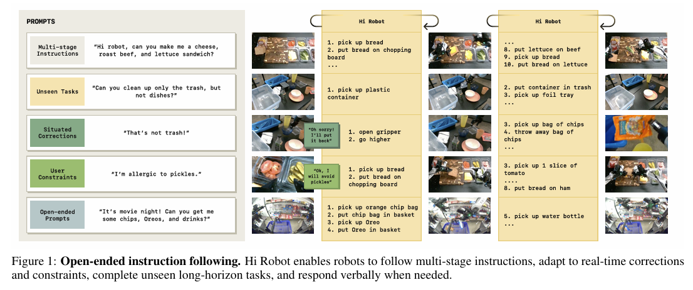

* 논문은 intelligence의 중요한 특징을 flexibility로 본다.

* 사람은 복잡한 task를 수행할 뿐만 아니라, 새로운 상황에 적응하고, 행동을 실시간으로 수정하며, 다양한 입력·수정·피드백에 반응할 수 있다.

* 로봇이 open-ended, human-centric environment에서 동작하려면 이러한 유연성이 필요하다.

* 예를 들어 식사 후 테이블을 정리하는 robot을 생각할 수 있다.

* 이 robot은 정해진 순서대로 물건을 치우는 것만으로는 충분하지 않다.

* “아직 식사 중인 사람의 접시는 치우지 마라”와 같은 dynamic prompt를 해석해야 한다.

* “그건 그대로 둬라”와 같은 correction에도 반응해야 한다.

* 조심스럽게 다뤄야 하는 낯선 물체가 등장하면, 그에 맞게 행동 방식을 바꿀 수 있어야 한다.

* 논문은 robot이 다양한 natural language command, feedback, correction을 해석하고 행동으로 옮길 수 있게 하는 것을 목표로 한다.

* 이러한 능력이 가능해지면, 사용자는 robot에게 새로운 task를 지시하고, task 수행 중 실시간으로 robot을 교정할 수 있다.

### b) Limitation of prior instruction-following policies

* 기존 language-conditioned imitation learning은 simple, atomic instruction을 수행하는 데에는 효과적이다.

* 예를 들어 “pick up the coke can”과 같은 명령은 기존 policy로도 수행할 수 있다.

* 하지만 실제 환경에서 사용자가 주는 명령은 이보다 훨씬 복잡하다.

* 예를 들어 다음과 같은 prompt가 있다.

  * “채식 샌드위치를 만들어줘.”
  * “토마토는 빼줘.”
  * “햄이나 로스트비프가 있으면 친구용 샌드위치도 따로 만들어줘.”

* 이 명령은 단일 행동으로 해결되지 않는다.

* 로봇은 언어를 이해하는 것뿐 아니라, 현재 환경 속 재료와 객체 상태를 파악해야 한다.

* 또한 기존 skill들을 조합하여 새로운 task를 수행해야 한다.

* task 수행 중 feedback이 들어오는 경우도 있다.

* 예를 들어 “그렇게 하면 안 되고 더 낮게 내려가야 해”와 같은 correction이 들어오면, robot은 이를 execution 과정에 동적으로 반영해야 한다.

* 따라서 단순히 instruction을 action으로 바로 변환하는 방식만으로는 실제 human-robot interaction을 충분히 다루기 어렵다.

### c) System 1 and System 2 analogy

* 논문은 이 문제를 Kahneman의 System 1과 System 2 cognitive process에 비유한다.

* **System 1**

  * 빠르고 자동적인 실행 과정에 해당한다.
  * robot 관점에서는 straightforward command를 수행하는 policy와 대응된다.
  * 예를 들어 pre-learned skill을 사용하여 “pick up the cup”과 같은 명령을 바로 실행하는 방식이다.

* **System 2**

  * 더 신중한 high-level reasoning 과정에 해당한다.
  * robot 관점에서는 complex long-horizon task를 해석하고, feedback을 이해하며, 적절한 행동 방향을 결정하는 과정이다.
  * 복잡한 instruction을 parsing하고, 현재 상황에 맞는 다음 행동을 선택하는 역할에 가깝다.

* 논문은 기존 robotic instruction following 연구가 대부분 atomic instruction을 수행하는 System 1 수준의 behavior에 집중해왔다고 본다.

* Hi Robot은 여기에 System 2에 해당하는 high-level reasoning을 추가하려는 접근으로 볼 수 있다.

### d) Proposal: hierarchical reasoning system for robotic control

* 논문은 complex prompt와 feedback을 처리하기 위해 VLM 기반 hierarchical reasoning system을 제안한다.

* 이 시스템에서 robot은 VLM을 사용하여 다음 정보를 해석한다.

  * current observation
  * user utterance

* high-level VLM은 이를 바탕으로 다음 두 가지를 생성한다.

  * 적절한 verbal response
  * low-level policy에 전달할 atomic command

* 예를 들어 복잡한 사용자 명령이 들어오면, high-level VLM은 이를 “grasp the cup”과 같은 단순한 command로 바꾼다.

* 이후 low-level policy가 이 command를 실제 robot action으로 실행한다.

* 이 low-level policy는 robot action을 생성하도록 fine-tuning된 vision-language model이다.

* 논문에서는 이를 vision-language-action model, 즉 VLA model로 설명한다.

* 정리하면 Hi Robot의 구조는 다음과 같다.

  * high-level VLM: 복잡한 prompt와 feedback을 해석하고 atomic command를 생성
  * low-level VLA policy: atomic command를 실제 robot action으로 실행

### e) Synthetic data generation for high-level policy

* 논문은 atomic command가 달린 robot demonstration만으로는 high-level model을 학습하기에 충분하지 않다고 본다.

* 그 이유는 high-level model이 complex, open-ended prompt를 처리하려면, 단순한 atomic command 이상의 학습 예시가 필요하기 때문이다.

* 즉, “어떤 행동을 했는가”뿐 아니라, “그 행동이 어떤 복잡한 prompt나 human interaction에서 비롯되었는가”를 학습해야 한다.

* 이를 위해 논문은 synthetic labeling 방식을 제안한다.

* robot observation과 action으로 구성된 dataset에 대해, 해당 상황에서 plausibly 발생했을 법한 prompt와 human interjection을 생성한다.

* 구체적인 방식은 다음과 같다.

  * state-of-the-art VLM에 robot observation과 target atomic command를 제공한다.
  * VLM에게 그 observation과 command가 나오기 전에 어떤 prompt나 human interaction이 있었을 수 있는지 생성하게 한다.
  * 이렇게 생성된 situated example을 high-level policy training에 사용한다.

* 논문은 이 방식이 다양한 prompt와 interjection에 대한 generalization을 가능하게 한다고 본다.

* 동시에 robot의 실제 capability와 연결된 training example을 만들 수 있다고 주장한다.

### f) Main contribution: Hi Robot

* 논문의 주요 기여는 hierarchical interactive robot learning system인 Hi Robot이다.

* Hi Robot은 VLM을 다음 두 단계 모두에 사용한다.

  * high-level reasoning
  * low-level task execution

* 이 framework는 기존 end-to-end instruction following system보다 복잡한 prompt를 처리할 수 있다.

* 또한 task 수행 중 들어오는 feedback을 반영할 수 있다.

* 논문은 low-level VLA policy와 같은 개별 구성요소는 기존 연구에서도 다뤄졌다고 설명한다.

* 그러나 다음 요소들을 결합한 전체 구조가 이 논문의 새로운 점이다.

  * high-level VLM
  * low-level VLA policy
  * synthetic data generation scheme

### g) Evaluation and claim

* 논문은 Hi Robot을 다양한 robot platform에서 평가한다.

  * single-arm robot
  * dual-arm robot
  * mobile robot

* 평가 task는 다음과 같은 scenario를 포함한다.

  * messy table cleaning
  * sandwich making
  * grocery shopping

* 이 task들은 training 중 본 skill들의 새로운 조합을 요구한다.

* 실험 결과, 논문은 Hi Robot이 여러 prior approach보다 더 좋은 성능을 보였다고 주장한다.

* 비교 대상에는 API-based VLM과 flat VLA policy가 포함된다.

* 성능 비교 기준은 다음 두 가지이다.

  * human intent alignment
  * task success


## 2. Related Work

### a) VLMs for robotic control

* 논문은 VLM을 robotic control에 활용한 기존 연구를 크게 두 가지 흐름으로 나눈다.

#### 1) VLM을 직접 robot control model로 fine-tuning하는 방식

* 첫 번째 흐름은 VLM을 fine-tuning하여 image와 language command를 입력받고, robot control action을 직접 출력하도록 만드는 방식이다.
* 이러한 방법들은 generalization과 instruction-following 측면에서 좋은 성능을 보였다.
* 하지만 주로 “put the cup on the plate”처럼 비교적 단순하고 명확한 command를 대상으로 한다.
* 즉, 복잡한 prompt, 사용자와의 상호작용, task 수행 중 들어오는 feedback을 반영하는 데에는 한계가 있다.
* Hi Robot은 이와 달리 복잡한 prompt와 human interaction이 포함된 task를 다루며, 현재 관측에 기반한 situated reasoning을 요구하는 상황을 목표로 한다.

#### 2) VLM/LLM을 pre-defined robot skill과 결합하는 방식

* 두 번째 흐름은 LLM이나 VLM을 사용하여 robot observation과 command를 해석하고, multi-stage task를 low-level controller가 수행할 수 있는 단순한 step으로 나누는 방식이다.

* 초기 연구들은 language model을 learned skill 또는 hand-designed skill과 결합하였다.

* 하지만 이러한 방식은 image observation처럼 복잡한 visual context를 reasoning 과정에 충분히 반영하기 어렵다는 한계가 있었다.

* 이후 연구들은 VLM을 사용하여 pre-defined robotic skill의 parameter를 출력하도록 하였다.

* 이 방식은 language command를 visual observation과 연결할 수 있기 때문에, 이전보다 복잡한 명령을 처리할 수 있다.

* 그러나 논문은 이 계열의 방법들이 여전히 physical dexterity가 제한적이고, 인간과의 real-time language interaction을 반영하는 능력도 제한적이라고 본다.

* Hi Robot은 이 두 흐름과 달리 VLM을 high-level reasoning과 low-level control 양쪽에 모두 사용한다.

* 또한 high-level model과 low-level policy 사이를 flexible language interface로 연결한다.

* 논문은 이러한 구조와 synthetic data generation scheme을 통해, 기존 연구들이 충분히 달성하지 못한 detailed promptability와 physical dexterity를 함께 확보하고자 한다.

---

### b) Robotic language interaction with users

* 사용자와 자연어로 상호작용하는 robot을 만들기 위한 연구들도 Hi Robot과 관련된다.
* 기존 연구들은 크게 model-based system과 learning-based method로 나눌 수 있다.

#### 1) Model-based system

* 초기 model-based system들은 language instruction과 feedback을 parsing한 뒤, 이를 scene의 symbolic representation에 grounding하는 방식으로 동작했다.
* 즉, 사용자의 말을 symbolic scene representation과 연결하여 robot behavior를 결정하는 방식이다.
* 하지만 이러한 방식은 복잡한 실제 환경이나 다양한 사용자 feedback을 유연하게 처리하는 데 한계가 있다.

#### 2) Learning-based hierarchical method

* 최근에는 user feedback을 직접 처리하는 learning-based method들이 제안되었다.
* 이 계열의 방법들은 대체로 hierarchical architecture를 사용한다.
* Hi Robot도 이 흐름에 속한다.
* 구체적으로 high-level policy가 user feedback을 반영하고, low-level policy가 수행할 수 있는 atomic command를 생성하는 구조를 따른다.

#### 3) Prior methods와 Hi Robot의 차이

* **OLAF**

  * OLAF는 LLM을 사용하여 robot trajectory를 수정한다.
  * 반면 Hi Robot은 robot observation을 기반으로 situated correction을 반영할 수 있다.
  * 또한 correction에 real time으로 응답하고, dexterous manipulation task를 포함한 복잡한 prompt를 처리할 수 있다.

* **YAY Robot**

  * YAY Robot은 situated real-time correction을 다룰 수 있다.
  * 하지만 하나의 prompt와 human-written data에 포함된 correction에 제한된다.
  * 반면 Hi Robot은 VLM과 synthetic data generation scheme을 활용하여 더 다양한 prompt와 open-ended correction을 다루고자 한다.

* **RACER**

  * RACER도 situated correction을 반영할 수 있다.
  * 하지만 recovery behavior를 만들기 위해 physics simulator에 의존한다.
  * 반면 Hi Robot은 intentional perturbation이나 correction이 포함되지 않은 real robot demonstration만 사용한다.
  * 또한 open-ended prompt에도 적용될 수 있다고 설명한다.

---

## 3. Preliminaries and Problem Statement

### a) Robot policy and action chunk

* 논문은 먼저 robot policy를 다음과 같이 정의한다.

* Learned policy는 현재 observation을 입력으로 받아 robot action을 출력한다.

* 현재 시점의 observation은 (o_t)로 표기한다.

* policy가 출력하는 action은 (A_t)로 표기한다.

* 여기서 (A_t)는 단일 action 하나가 아니라, 다음 (H)개의 action을 묶은 action chunk이다.

* 즉, (A_t = [a_t, a_{t+1}, ..., a_{t+H-1}])로 표현된다.

* 이는 로봇이 한 번에 다음 한 step의 action만 예측하는 것이 아니라, 앞으로 실행할 여러 action sequence를 묶어서 예측한다는 뜻이다.

* 이 논문에서 robot observation (o_t)는 다음 요소들로 구성된다.

  * 여러 camera image: (I_t^1, ..., I_t^n)
  * language prompt: (ℓ_t)
  * robot configuration: (q_t)

* 여기서 (q_t)는 robot의 joint position과 gripper position을 의미한다.

* 따라서 observation은 다음과 같이 정리된다.

* (o_t = [I_t^1, ..., I_t^n, ℓ_t, q_t])

* policy는 이 observation이 주어졌을 때 action chunk (A_t)를 출력하는 분포 (p(A_t|o_t))로 표현된다.

---

### b) Why VLA is needed

* 이 논문의 관심은 단순한 robot control이 아니라 complex, multi-stage task이다.

* 이러한 task에서는 로봇이 복잡한 prompt를 해석해야 한다.

* 또한 task 수행 중 들어오는 dynamic user feedback도 처리해야 한다.

* 따라서 policy는 단순히 image를 보고 action을 출력하는 수준을 넘어서야 한다.

* 로봇은 language를 해석하고, 그 의미를 현재 environment observation에 grounding할 수 있어야 한다.

* 이를 위해 논문은 VLA model이 적합한 접근이라고 본다.

---

### c) VLM as the basis of VLA

* VLA model은 VLM pre-training을 사용하여 robot policy (p(A_t|o_t))를 초기화한다.

* 여기서 VLM은 image input도 처리할 수 있도록 학습된 language model이다.

* VLM은 기본적으로 다음과 같은 분포로 표현된다.

* (p(ℓ' | I, ℓ))

* 각 기호의 의미는 다음과 같다.

  * (I): image
  * (ℓ): language prefix, 즉 입력 prompt
  * (ℓ'): language suffix, 즉 모델이 생성하는 답변 또는 이어지는 문장

* 즉, (p(ℓ'|I,ℓ))은 image (I)와 prompt (ℓ)이 주어졌을 때, 그 뒤에 이어질 language output (ℓ')이 나올 확률을 의미한다.

* 예를 들어 image와 visual question이 주어졌을 때, VLM이 그에 대한 answer를 생성하는 구조라고 보면 된다.

---

### d) Autoregressive token generation

* 일반적인 VLM은 * (p(ℓ' | I, ℓ))을 autoregressive decoder-only Transformer로 표현한다.

* 여기서 autoregressive는 이전 token들을 보고 다음 token을 하나씩 생성하는 방식을 의미한다.

* 이를 token 단위로 쓰면 다음과 같다.

* (p(x_{t+1}|x_1,...,x_t,I))

* 여기서 (x_t)는 t번째 language token이다.

* 이때 t는 robot의 physical time step이 아니라, 문장 안에서 token이 몇 번째인지 나타내는 index이다.

* prompt와 output은 token sequence로 나뉜다.

  * (ℓ = [x_1, ..., x_{t_p}])
  * (ℓ' = [x_{t_p+1}, ..., x_{t_p+t_s}])

* 여기서 (t_p)는 prefix의 길이이고, (t_s)는 suffix의 길이이다.

* 즉, 앞부분 token들은 prompt이고, 그 뒤 token들은 모델이 생성하는 output이다.

* 다만 논문은 VLM의 autoregressive 구조 자체를 수정하지 않는다.

* 그래서 이후 논의에서는 복잡한 token-level notation 대신, VLM을 간단히 (p(ℓ'|I,ℓ))로 표기한다.

---

### e) Standard VLA from VLM fine-tuning

* Standard VLA는 VLM (p(ℓ'|I,ℓ))을 fine-tuning하여 만든다.

* 기존 VLM은 image와 prompt를 보고 language suffix를 출력한다.

* VLA에서는 이 suffix (ℓ') 안에 robot action (A_t)가 표현되도록 만든다.

* 일반적으로는 robot action을 token으로 바꿔서 VLM이 출력할 수 있게 한다.

* 예를 들어 continuous action을 discretization하여 action token으로 변환하는 방식이 사용된다.

* 이렇게 하면 VLM은 언어 token을 생성하던 방식과 유사하게 robot action token을 출력할 수 있다.

* 따라서 standard VLA는 다음과 같이 이해할 수 있다.

  * 기존 VLM: image + prompt → language output
  * VLA: observation + prompt → robot action

---

### f) π0 VLA used in Hi Robot

### f) π0 VLA used in Hi Robot

* Hi Robot은 low-level policy로 π0 VLA를 사용한다.

* 앞에서 설명한 standard VLA는 보통 VLM을 fine-tuning하여 robot action을 language suffix 안의 token처럼 출력하도록 만든다.

* 이때 continuous action을 그대로 출력하기보다는, action을 discretization하여 action token으로 바꾸는 방식이 자주 사용된다.

* 반면 π0는 action을 discrete token으로만 다루지 않고, continuous action chunk distribution을 출력하도록 VLM을 수정한 VLA이다.

* π0는 입력으로 다음 정보를 처리한다.

  * multiple camera images
  * low-level language command
  * continuous robot state observation (q_t)

* 여기서 (q_t)는 robot의 joint position과 gripper position 같은 robot configuration을 의미한다.

* π0가 출력하는 (A_t)는 단일 action이 아니라, 다음 여러 step의 action을 묶은 action chunk이다.

* 즉, low-level policy는 매 순간 하나의 action만 출력하는 것이 아니라, 앞으로 실행할 짧은 action sequence를 chunk 단위로 생성한다.

* 또한 이 action은 discrete token이 아니라 continuous value이다.

* 예를 들어 robot arm의 이동량, 회전, gripper open/close 값처럼 연속적인 실수값 action을 의미한다.

* π0는 이러한 continuous action chunk를 생성하기 위해 flow-matching objective를 사용한다.

* 이 논문을 읽는 단계에서는 flow matching을 “노이즈 상태의 action을 실제 demonstration action 쪽으로 이동시키는 흐름을 학습하여 continuous action sequence를 생성하는 방식” 정도로 이해하면 된다.

* 따라서 π0는 Hi Robot에서 high-level VLM이 만든 low-level language command를 실제 robot action으로 변환하는 실행기 역할을 한다.

* 다만 π0가 standard VLA와 완전히 다른 문제를 푸는 것은 아니다.

* 출력 방식이 continuous action chunk로 확장되었을 뿐, 기본 원리는 여전히 vision-language 기반 policy가 observation과 language command를 보고 robot action을 생성한다는 점에서 기존 VLA와 같다.

* 정리하면, Hi Robot의 high-level policy는 “무엇을 해야 하는가”를 low-level command로 정하고, π0 low-level policy는 그 command를 바탕으로 “어떻게 움직일 것인가”를 continuous action chunk로 생성한다.


---

### g) Limitation of standard VLA

* 기존 VLA model은 다양한 language prompt를 따를 수 있다.

* 하지만 단독으로 사용할 경우, 보통 simple and atomic command에 제한된다.

* 여기서 simple command는 짧고 명확한 명령을 의미한다.

  * 예: “pick up the cup”
  * 예: “put the cup on the plate”

* atomic command는 하나의 low-level skill로 수행할 수 있는 단일 행동 단위에 가깝다.

  * 예: 컵 집기
  * 예: 접시 위에 놓기
  * 예: 서랍 열기

* 반면 이 논문이 다루는 prompt는 더 복잡하다.

* 사용자의 선호, 조건, task 순서, real-time feedback이 포함될 수 있다.

* 예를 들어 샌드위치를 만들되 특정 재료를 빼거나, task 수행 중 “그건 치우지 마라”와 같은 feedback을 반영해야 하는 상황이다.

* 따라서 기존 VLA만으로는 complex prompt와 feedback을 충분히 처리하기 어렵다.

* 이 한계 때문에 Hi Robot은 high-level VLM과 low-level VLA를 분리한 hierarchical structure를 사용한다.

* high-level VLM은 complex prompt와 feedback을 해석하고, low-level VLA가 실행할 수 있는 atomic command로 바꾼다.

* low-level VLA는 그 atomic command를 실제 robot action으로 실행한다.
---

## 4. Hi Robot

### a) Overall structure

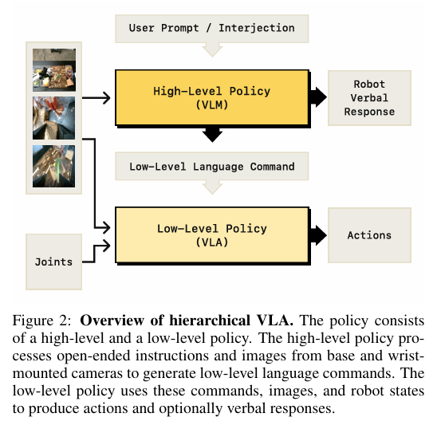

* Hi Robot은 전체 policy (p(A_t|o_t))를 하나의 모델로 처리하지 않고, 두 단계로 나눈다.

  * high-level inference process
  * low-level inference process

* low-level policy는 VLA로 구성된다.

* low-level VLA는 단순한 low-level language command를 입력받고, 실제 robot action chunk (A_t)를 출력한다.

* high-level policy는 VLM으로 구성된다.

* high-level VLM은 open-ended task prompt와 user feedback을 처리하고, low-level VLA가 실행할 수 있는 low-level language command를 생성한다.

* 즉, Hi Robot의 전체 흐름은 다음과 같다.

  * 사용자 prompt / feedback 입력
  * high-level VLM이 현재 이미지와 언어를 해석
  * low-level language command 생성
  * low-level VLA가 command와 robot state를 바탕으로 action chunk 출력
  * robot action 실행

* 두 process는 서로 다른 속도로 실행된다.

  * low-level process: 높은 주파수로 action chunk를 계속 생성
  * high-level process: 더 낮은 주파수로 실행되며, 일정 시간이 지나거나 새로운 user feedback이 들어올 때 다시 실행

* 따라서 high-level process는 low-level process에게 복잡한 prompt와 interaction을 작고 실행 가능한 bite-sized command로 바꿔주는 역할을 한다.

---

## 4.1. Hierarchical Inference with VLAs

### a) High-level policy

* high-level policy는 다음과 같이 표현된다.

* φ_hi(ℓ̂_t | I_t^1, ..., I_t^n, ℓ_t)

* 입력은 다음과 같다.

  * 여러 camera image: I_t^1, ..., I_t^n
  * open-ended prompt: ℓ_t

* 출력은 low-level language command이다.

  * ℓ̂_t

* 여기서 ℓ̂_t는 low-level VLA가 이해하고 실행할 수 있는 단순한 command이다.

* 예를 들어 사용자가 “테이블을 정리해줘. 단, 접시는 건드리지 마”라고 하면, high-level policy는 이를 “pick up the trash” 또는 “leave the plate alone” 같은 command로 바꿀 수 있다.

### b) Low-level policy

* low-level policy는 다음과 같이 표현된다.

* p_lo(A_t | I_t^1, ..., I_t^n, ℓ̂_t, q_t)

* 입력은 다음과 같다.

  * 여러 camera image: I_t^1, ..., I_t^n
  * high-level policy가 생성한 low-level command: ℓ̂_t
  * robot configuration: q_t

* 출력은 action chunk A_t이다.

* 기존 standard VLA와 비슷하지만, 차이점은 language command ℓ_t 대신 high-level policy가 만든 ℓ̂ _t를 사용한다는 점이다.

### c) Role of high-level and low-level

* System 1 / System 2 비유로 보면 다음과 같다.

* high-level policy는 System 2에 가깝다.

  * 전체 task prompt를 해석한다.
  * user interaction을 반영한다.
  * 현재 image context를 바탕으로 지금 해야 할 적절한 task를 결정한다.
* low-level policy가 이해할 수 있는 command ℓ̂_t로 바꾼다.

* low-level policy는 System 1에 가깝다.

  * 주어진 command를 빠르게 실행한다.
  * 실제 robot action chunk를 생성한다.

* 단순하고 익숙한 task라면 high-level inference가 꼭 필요하지 않을 수 있다.

* 예를 들어 low-level policy가 이미 직접 학습한 command라면, ℓ̂_t = ℓ_t로 두고 기존 VLA처럼 바로 실행할 수 있다.

* 하지만 다음 상황에서는 hierarchical inference가 필요하다.

  * prompt가 low-level policy가 바로 해석하기에 너무 복잡한 경우
  * robot data에서 익숙하지 않은 표현이 들어온 경우
  * 사용자와의 세밀한 interaction이 포함된 경우

### d) Frequency of high-level inference

* high-level inference는 low-level control보다 느리다.

* 하지만 high-level은 빠른 환경 변화에 매 순간 반응해야 하는 역할은 아니다.

* 따라서 high-level inference는 낮은 주파수로 실행해도 된다.

* 더 정교한 방식으로는 현재 command ℓ̂_t가 완료되었는지 감지한 뒤, 다음 command를 추론할 수도 있다.

* 그러나 이 논문에서는 단순한 전략을 사용한다.

* high-level inference를 다시 실행하고 ℓ̂_t를 다시 계산하는 경우는 두 가지이다.

  * 1초가 지났을 때
  * 새로운 user interaction이 들어왔을 때

* 이 방식은 단순하면서도, 사용자가 feedback이나 correction을 줄 때 robot이 반응적으로 행동할 수 있게 한다.

---

## 4.2. Incorporating User Interaction

### a) User intervention

* 사용자는 policy execution 중 언제든지 개입할 수 있다.

* 사용자는 다음과 같은 정보를 줄 수 있다.

  * 추가 정보
  * feedback
  * correction
  * task 변경

* prototype에서는 user intervention이 text command 또는 spoken language 형태로 들어온다.

* spoken language는 text로 변환된 뒤 처리된다.

* user intervention이 들어오면 high-level inference가 즉시 실행된다.

* 이때 ℓ̂_t가 다시 계산된다.

### b) Verbal utterance (u_t)

* high-level policy는 ℓ̂_t 안에 verbal utterance (u_t)를 포함할 수 있다.

* (u_t)는 robot이 사용자에게 말하는 confirmation 또는 clarification이다.

* 예를 들어 다음과 같은 말이 될 수 있다.

  * “Sure thing.”
  * “Whoops, sorry.”
  * “Got it.”
  * “Do you mean this one?”

* (u_t)가 포함된 경우, system은 text-to-speech를 사용하여 사용자에게 해당 문장을 들려준다.

* 이후 low-level policy에 넘기기 전에 (ℓ̂_t)에서 (u_t)를 제거한다.

* 이유는 low-level policy에는 robot이 말할 문장이 아니라, 실제로 실행할 command만 들어가야 하기 때문이다.

### c) Interjection and returning to previous command

* 사용자가 “leave it alone” 같은 interjection을 줄 수 있다.

* interjection은 task 수행 중간에 사용자가 끼어들어 주는 짧은 피드백이나 correction이다.

* 이 interjection이 처리되면, 사용자는 robot에게 이전 command로 돌아가 task execution을 계속해도 된다고 신호를 줄 수 있다.

* 즉, Hi Robot은 중간 피드백 때문에 전체 task를 완전히 중단하는 것이 아니라, 피드백을 반영한 뒤 이전 task 흐름으로 복귀할 수 있다.

### d) Contextual response

* high-level policy의 응답은 contextual하다.

* 그 이유는 high-level policy가 language prompt (ℓ_t)만 보는 것이 아니라, 현재 image observation도 함께 보기 때문이다.

* 따라서 “that’s not trash” 같은 feedback을 올바르게 grounding할 수 있다.

* language-only system은 “that”이 무엇을 가리키는지 알기 어렵다.

* 반면 Hi Robot은 현재 image observation을 함께 보므로, 사용자가 말한 “that”이 지금 로봇이 잡으려는 object라는 것을 파악할 수 있다.

* 이 점이 user feedback을 실제 robot behavior에 반영할 수 있게 만드는 핵심이다.

---

## 4.3. Data Collection and Training Hi Robot
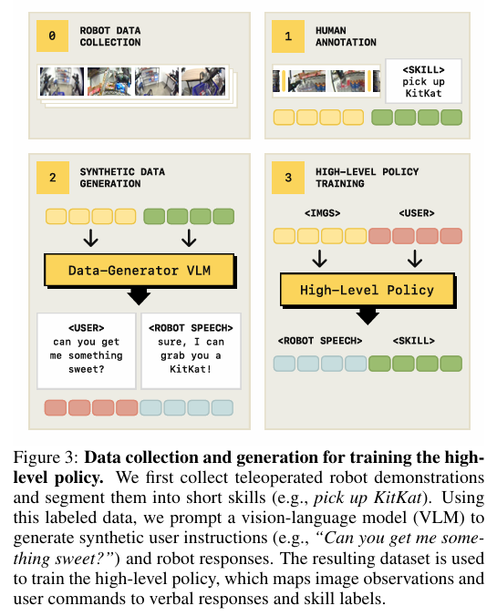


### a) Overall training strategy

* Hi Robot을 scalable하게 학습시키기 위해 논문은 두 종류의 interaction data를 사용한다.

  * human-labeled data
  * synthetically generated interaction data

* 전체 과정은 다음 흐름으로 진행된다.

  * robot demonstration data 수집
  * demonstration을 short skill로 segment
  * human annotation 또는 heuristic으로 skill label 생성
  * VLM을 사용해 synthetic user prompt와 robot response 생성
  * high-level policy와 low-level policy 학습

### b) Robot demonstration data (D_{demo})

* 먼저 teleoperation을 통해 robot demonstration data (D_{demo})를 수집한다.

* 이 데이터는 전체 task trajectory를 포함한다.

* 각 trajectory에는 전체 goal에 대한 coarse language annotation이 붙어 있다.

* 예를 들어 “make a sandwich” 같은 전체 목표 annotation이 있다.

### c) Segmenting demonstrations into short skills

* 전체 demonstration episode를 짧은 skill 단위로 나눈다.

* 각 short skill은 (ℓ̂_t)로 표현된다.

* 예를 들어 다음과 같은 skill label이 있다.

  * “pick up one piece of lettuce”
  * “pick up KitKat”
  * “move the right arm to the left”

* 이러한 short skill은 보통 1~3초 정도 지속된다.

* 또한 raw robot action에서 작은 corrective motion 같은 basic movement primitive도 heuristic하게 추출한다.

### d) Labeled dataset (D_{labeled})

* 이 과정을 통해 (D_{labeled})가 만들어진다.

* (D_{labeled})는 다음 형태의 tuple들을 포함한다.

* ((ℓ̂_t, I_t^1, ..., I_t^n))

* 여기서 각 tuple은 특정 robot skill을 설명하는 하나의 데이터 샘플이다.

* (ℓ̂_t)는 skill label이고, (I_t^1, ..., I_t^n)은 여러 camera image이다.

* 즉, “이 이미지 상황에서 이 skill command가 해당 robot behavior를 설명한다”는 묶음이다.

### e) Synthetic data generation

* 다음으로 data-generator VLM p_gen을 사용하여 synthetic user prompt와 interjection을 생성한다.

* 입력으로는 다음이 사용된다.

  * visual context: I_t^1, ..., I_t^n
  * skill label: ℓ̂_t

* p_gen은 해당 skill이 실제 user interaction에서 어떤 prompt로부터 나왔을 수 있는지 생성한다.

* 예를 들어 skill label이 “pick up the lettuce”라면, p_gen은 다음과 같은 user prompt를 생성할 수 있다.

  * “Can you add some lettuce for me?”

* 동시에 robot의 verbal response나 clarification u_t도 생성한다.

* 예를 들어 다음과 같은 response가 생성될 수 있다.

  * “Sure, I can add some lettuce.”

* 이렇게 생성된 synthetic data는 high-level policy가 다양한 open-ended prompt와 user interjection을 학습하는 데 사용된다.

### f) Training high-level policy

* high-level policy는 다음 분포로 표현된다.

* φ_hi(ℓ̂_t | I_t^1, ..., I_t^n, ℓ_t)

* 학습 데이터는 다음을 함께 사용한다.

  * (D_{syn})
  * (D_{labeled})

* 학습 방식은 next-token prediction을 위한 cross-entropy loss이다.

* 즉, high-level VLM이 image와 user prompt를 보고 적절한 low-level command (ℓ̂_t)를 생성하도록 학습한다.

### g) Training low-level policy

* low-level policy는 다음 분포로 표현된다.

* (p_{lo}(A_t | I_t^1, ..., I_t^n, ℓ̂_t, q_t))

* 학습 데이터는 다음을 함께 사용한다.
  * (D_{demo}): 실제 로봇 시연 전체 데이터
  * (D_{labeled}): 그 시연을 짧은 skill로 나누고, 각 skill에 command label을 붙인 데이터

* 학습 방식은 flow-matching objective이다.

* 이는 low-level policy가 image, low-level command, robot state를 보고 continuous action chunk (A_t)를 생성하도록 학습하기 위한 방식이다.

---

## 4.4. Model Architecture and Implementation

### a) Base VLM

* low-level policy와 high-level policy는 같은 base VLM에서 출발한다.

* 논문 구현에서는 PaliGemma-3B VLM을 사용한다.

* 즉, high-level과 low-level 모두 image-language 이해 능력을 가진 VLM을 기반으로 한다.

### b) Low-level policy: π0 VLA

* low-level policy는 π0 VLA이다.

* π0는 PaliGemma-3B를 fine-tuning하여 만든다.

* 여기에 flow matching action expert를 추가하여 continuous action을 출력하도록 한다.

* 즉, low-level policy는 low-level language command와 image, robot state를 입력받고, continuous action chunk를 생성한다.

### c) High-level policy

* high-level policy는 Section 4.3에서 만든 image-language tuple을 사용해 fine-tuning된다.

* 목표는 image observation과 user command를 보고 low-level command를 예측하는 것이다.

* 즉, high-level policy는 complex prompt와 feedback을 low-level VLA가 실행 가능한 command로 변환하는 역할을 한다.

### d) Modularity

* 논문 실험에서는 low-level policy로 π0를 사용한다.

* 하지만 Hi Robot framework가 π0에만 의존하는 것은 아니다.

* 구조 자체는 modular하다.

* 따라서 필요하다면 다른 language-conditioned policy를 low-level policy로 통합할 수 있다.

* 중요한 조건은 해당 policy가 language command를 입력받고 robot action을 출력할 수 있어야 한다는 점이다.

---

## 5. Experiments

### a) Experimental focus

* 실험에서는 physical interaction과 complex user interaction이 결합된 문제들을 평가한다.

* 실험 task는 단순한 instruction following이 아니라, 다음 요소들을 포함한다.

  * multi-stage instruction
  * task 중간의 live user feedback
  * novel task variation을 설명하는 prompt
  * 복잡한 object manipulation

### b) Experimental aims

* 논문은 실험의 목적을 세 가지로 제시한다.

#### 1) Complex prompt와 live feedback 수행 능력 평가

* Hi Robot이 다양한 complex textual prompt를 따를 수 있는지 평가한다.

* 또한 task 수행 중 들어오는 live user feedback에 반응할 수 있는지 평가한다.

#### 2) Prior approach와 비교

* Hi Robot을 기존 방식들과 비교한다.

* 비교 대상은 다음과 같다.

  * flat instruction-following VLA policy
  * foundation model을 out-of-the-box high-level reasoning에 사용하는 방식

#### 3) Synthetic data와 hierarchy의 중요성 평가

* synthetic data가 task performance와 language following에 얼마나 중요한지 평가한다.

* 또한 hierarchical structure가 실제 성능 향상에 기여하는지 확인한다.

---

## 5.1. Tasks and Baseline Methods

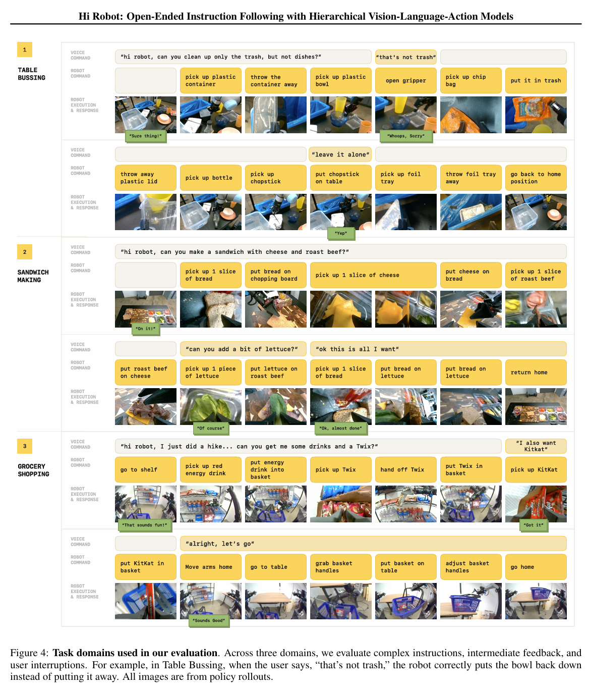

### a) Task domains

* 논문은 세 가지 complex problem domain에서 평가를 수행한다.

  * Table Bussing
  * Sandwich Making
  * Grocery Shopping

---

### b) Table Bussing

* Table Bussing은 테이블을 정리하는 task이다.

* robot은 다음과 같이 object를 분류해서 처리해야 한다.

  * dishes and utensils → bussing bin
  * trash items → trash bin

* training data는 full table cleaning episode로 구성된다.

* 이 task는 physical manipulation 측면에서 어렵다.

* 이유는 다음과 같다.

  * plate edge를 잡는 것처럼 섬세한 grasping strategy가 필요하다.
  * 서로 다른 object를 집고 분리해야 한다.
  * 어떤 경우에는 한 object를 이용해 다른 object를 조작해야 한다.
  * 예를 들어 쓰레기가 올라간 plate를 집어 기울여서 trash bin에 버리는 행동이 필요할 수 있다.

* evaluation에서는 기본 table cleaning과 다른 prompt가 주어진다.

* 예시는 다음과 같다.

  * “can you clean up only the trash, but not dishes?”
  * “can you clean up only the dishes, but not trash?”
  * “bus all the yellowish things”

* 이 task에서는 high-level model이 각 object가 무엇인지 판단해야 한다.

* 예를 들어 reusable plastic cup은 dish로 볼 수 있고, paper cup은 trash로 볼 수 있다.

* 또한 robot의 default behavior인 “모든 물건을 치우기”를 prompt에 맞게 수정해야 한다.

* 특히 중요한 점은 robot이 해야 할 것뿐 아니라, 하지 말아야 할 것도 이해해야 한다는 것이다.

* 예를 들어 “only trash”라고 했을 때 dishes는 건드리지 않아야 한다.

* task 중간에 contextual feedback이 들어올 수도 있다.

  * “this is not trash”
  * “leave the rest”
  * “leave it alone”

* robot은 이러한 interjection을 현재 image context와 연결해서 해석하고 행동을 수정해야 한다.

---

### c) Sandwich Making

* Sandwich Making은 robot이 bread와 최대 여섯 가지 ingredient를 사용해 sandwich를 만드는 task이다.

* 이 task는 physical manipulation 측면에서 어렵다.

* 이유는 다음과 같다.

  * ingredient가 deformable하다.
  * ingredient가 delicate하기 때문에 조심스럽게 잡아야 한다.
  * 재료를 정확한 위치에 놓아야 한다.

* training data에는 여러 종류의 sandwich example이 포함된다.

* 각 segment에는 다음과 같은 label이 붙어 있다.

  * “pick up one slice of bread”
  * “pick up one slice of cheese”
  * “put cheese on bread”

* 평가에서는 complex prompt와 live correction을 본다.

* 예시는 다음과 같다.

  * “hi robot, can you make me a sandwich with cheese, roast beef, and lettuce?”
  * “can you make me a vegetarian sandwich? I’m allergic to pickles”
  * “that’s all, no more”

* 이 task에서는 robot이 사용자의 ingredient 조건, 선호, 알레르기 정보, 중간 correction을 반영해야 한다.

---

### d) Grocery Shopping

* Grocery Shopping은 grocery shelf에서 요청된 물건들을 집어 basket에 넣고, basket을 가까운 table 위에 올려놓는 task이다.

* 이 task는 bimanual mobile manipulator를 제어해야 한다.

* 즉, 양팔과 mobile base를 함께 사용하는 robot task이다.

* 이 task에서는 variable number of objects와 nuanced semantics를 해석해야 한다.

* 예를 들어 사용자가 정확한 상품명을 말하지 않고 목적이나 상황 중심으로 요청할 수 있다.

* prompt 예시는 다음과 같다.

  * “hey robot, can you get me some chips? I’m preparing for a movie night”
  * “can you get me something sweet?”
  * “can you grab me something to drink?”
  * “hey robot, can you get me some Twix and Skittles?”

* task 중간에 interjection이 들어올 수도 있다.

  * “I also want some KitKat”

* 따라서 robot은 현재 shopping context를 유지하면서 새로운 요청을 추가로 반영해야 한다.

---

### e) Comparisons and ablations

* 논문은 Hi Robot의 full method를 여러 alternative approach와 비교한다.

* 비교 대상은 크게 두 종류이다.

  * 다른 high-level strategy를 사용하는 방법
  * hierarchical structure를 사용하지 않는 방법

---

### f) Expert human high level

* Expert human high level은 oracle baseline이다.

* high-level model 대신 expert human이 직접 low-level language command를 입력한다.

* expert human은 task 성공 가능성이 가장 높다고 판단되는 low-level behavior command를 수동으로 입력한다.

* 이 baseline의 목적은 low-level policy 자체의 한계를 파악하는 것이다.

* 즉, high-level command가 이상적으로 주어졌을 때 low-level policy가 얼마나 잘 수행할 수 있는지를 보기 위한 비교 대상이다.

---

### g) GPT-4o high-level model

* 이 baseline은 Hi Robot과 같은 high-level / low-level decomposition을 사용한다.

* 하지만 high-level policy로 논문에서 fine-tuning한 VLM 대신 GPT-4o API model을 사용한다.

* low-level policy는 Hi Robot과 동일한 것을 사용한다.

* GPT-4o는 논문에서 사용하는 high-level VLM보다 훨씬 큰 VLM이다.

* 하지만 Hi Robot의 real dataset과 synthetic dataset으로 fine-tuning된 모델은 아니다.

* 이 비교는 out-of-the-box foundation model을 high-level policy로 사용할 때의 성능을 보기 위한 것이다.

* 논문은 이 방식을 SayCan의 발전된 형태와 유사하게 본다.

* 차이점은 SayCan은 LLM을 high-level policy로 사용한 반면, 이 baseline은 VLM을 사용한다는 점이다.

* GPT-4o가 robot affordance에 맞게 command를 고르도록 하기 위해, 연구진은 prompt engineering을 수행한다.

* 구체적으로 human-annotated dataset에서 가장 흔한 skill label들을 ranking하고, GPT-4o가 그중에서 low-level policy가 수행할 수 있는 command를 고르도록 한다.

---

### h) Flat VLA

* Flat VLA는 Hi Robot에서 사용하는 것과 같은 π0 low-level policy를 직접 사용하는 비교 방법이다.

* 하지만 high-level model을 사용하지 않는다.

* synthetic data도 사용하지 않는다.

* 즉, 사용자 prompt를 VLA가 직접 받아 action으로 변환하는 flat instruction-following VLA policy이다.

* 이 baseline은 기존 state-of-the-art instruction following 방식과 비교하기 위한 것이다.

---

### i) Flat VLA with synthetic data

* 이 ablation은 π0 low-level policy를 단독으로 사용한다.

* high-level model은 없다.

* 하지만 low-level policy 학습에 synthetic data를 포함한다.

* 목적은 complex prompt를 직접 처리할 수 있도록 low-level policy를 학습시키는 것이다.

* 이 baseline은 hierarchy의 효과와 synthetic data의 효과를 분리해서 보기 위한 비교이다.

* 즉, synthetic data를 추가하면 high-level / low-level 구조가 없어도 충분한지 확인하는 역할을 한다.

---

### j) Hi Robot without synthetic data

* 이 ablation은 Hi Robot 구조를 유지하되, synthetic training data를 사용하지 않는 방식이다.

* 목적은 synthetically generated prompt가 성능에 얼마나 중요한지 평가하는 것이다.

* 이 baseline은 VLM 기반의 발전된 YAY Robot 형태로 볼 수 있다.

* 즉, high-level model이 low-level model을 위한 language command를 예측하는 구조는 유지하지만, 다양한 synthetic prompt를 학습하지 않았을 때 성능이 어떻게 되는지 확인한다.
---


## 5.2. Metrics and Evaluation Protocol

### a) Evaluation setup

* 논문은 두 가지 complementary metric을 사용하여 성능을 평가한다.

  * Instruction Accuracy
  * Task Progress

* 평가는 human evaluator가 수행한다.

* 이 evaluator는 어떤 method가 실행되고 있는지 모르는 상태에서 평가한다.

* 각 평가는 task별, method별로 20 trials로 구성된다.

---

### b) Instruction Accuracy (IA)

* Instruction Accuracy는 high-level policy가 예측한 instruction이 human intent와 얼마나 잘 맞는지를 측정한다.

* 이 지표는 단순히 언어만 보는 것이 아니라, 현재 환경과 prompt를 함께 이해해야 한다.

* 즉, 다음 두 가지와 prediction이 일치해야 correct로 평가된다.

  * user command
  * current observation

* 예를 들어 사용자가 “쓰레기만 치워줘”라고 했고, 현재 이미지에서 로봇이 쓰레기 물체를 집으려 한다면 correct prediction으로 평가될 수 있다.

* 반대로 사용자가 “접시는 건드리지 마”라고 했는데 high-level command가 접시를 집으라고 하면 incorrect prediction으로 평가된다.

* 한 trial의 Instruction Accuracy는 다음과 같이 계산된다.

* 전체 prediction 중 correct prediction이 차지하는 비율이다.

* 즉, correct predictions / total predictions로 계산된다.

* flat baseline은 해석 가능한 language prediction을 출력하지 않는다.

* 따라서 flat baseline의 경우 evaluator가 로봇의 실제 행동을 보고, 그 행동이 어떤 의도를 가진 것으로 보이는지 해석하여 점수를 매긴다.

---

### c) Task Progress (TP)

* Task Progress는 long-horizon task가 얼마나 진행되었는지를 측정하는 지표이다.

* 이 논문에서 평가하는 task들은 복잡하고 여러 단계로 이루어져 있기 때문에, 단순한 success/failure만으로는 세부 성능을 보기 어렵다.

* 따라서 Task Progress는 robot이 intended goal에 얼마나 가까이 도달했는지를 더 granular하게 평가한다.

* 계산은 correct location 또는 correct configuration에 성공적으로 놓인 object의 비율로 한다.

* 예를 들어 5개의 물체 중 4개가 올바른 위치에 놓였다면, Task Progress는 80%로 볼 수 있다.

---

## 5.3. Core Results

### a) Overall result

* 논문은 Hi Robot을 두 가지 주요 baseline과 비교한다.

  * GPT-4o high-level policy
  * flat VLA method

* 정량 결과는 Figure 5에 제시된다.

* 정성적 command 비교는 Figure 6에 제시된다.

* 핵심적으로 Hi Robot은 모든 task에서 Instruction Accuracy와 Task Progress가 더 높게 나타난다.

---

### b) Result 1: Hi Robot performs well on open-ended instruction following

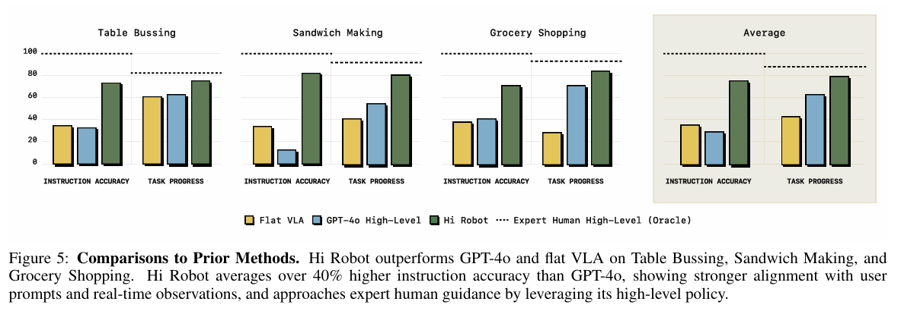

* Hi Robot은 open-ended instruction following에서 강한 성능을 보인다.

* Table Bussing, Sandwich Making, Grocery Shopping 전반에서 GPT-4o와 flat baseline보다 높은 Instruction Accuracy와 Task Progress를 보인다.

* Hi Robot은 사용자의 prompt에 맞게 올바른 object를 식별하고, 집고, 적절한 위치에 놓을 수 있다.

* 특히 다음과 같은 조건이 포함된 prompt에서도 잘 작동한다.

  * 특정 object만 처리하기
  * 특정 ingredient 제외하기
  * 사용자 제약 반영하기

* 예를 들어 “I’m allergic to pickles”라는 prompt가 있으면, Hi Robot은 pickles를 sandwich에 넣지 않아야 한다.

* 반면 GPT-4o는 physical interaction이 시작된 뒤 context를 잃는 경우가 많다.

* 그 결과 현재 환경과 맞지 않는 nonsensical command를 내기도 한다.

  * 예: “pick up bermuda triangle”

* 또는 여러 object를 모두 “plate”나 “spoon”처럼 잘못 label하여 long-horizon planning을 방해하기도 한다.

---

### c) Result 2: Hi Robot shows situated reasoning and adapts to feedback

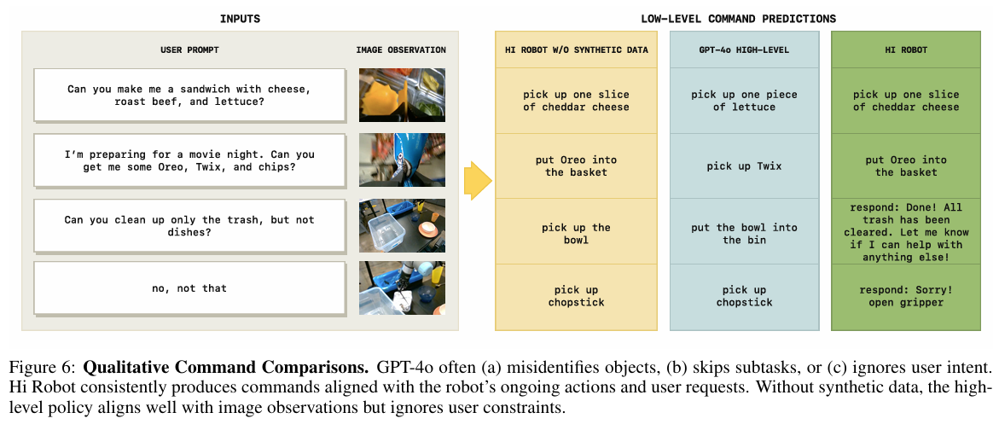

* Hi Robot은 현재 상황에 기반한 situated reasoning과 feedback adaptation에서 강점을 보인다.

* 사용자가 task 중간에 요청을 수정하면, Hi Robot은 low-level command를 그에 맞게 갱신한다.

* 예시는 다음과 같다.

  * “leave the rest”
  * “I also want a KitKat”

* 이런 feedback이 들어오면 high-level policy가 다시 현재 observation과 사용자 발화를 해석하고, 새로운 low-level command를 만든다.

* 반면 GPT-4o는 coherent internal state를 유지하지 못하는 경우가 있다.

* 예를 들어 gripper가 이미 물체를 잡고 있는데도 새로운 object를 집으라는 command를 내거나, task를 너무 일찍 전환하는 문제가 생긴다.

* flat baseline은 real-time feedback에 반응하지 못한다.

* 이는 flat baseline에 high-level reasoning이나 interaction handling 구조가 없기 때문이다.

---

### d) Result 3: Hi Robot works across diverse tasks, robots, and constraints

* Hi Robot은 다양한 task와 robot platform에서 효과적으로 작동한다.

* 평가에는 다음 platform들이 포함된다.

  * single-arm robot
  * dual-arm robot
  * mobile bimanual platform

* Hi Robot은 fragile cheese slice, tall bottle 등 다양한 object를 조작할 수 있다.

* 또한 dynamic constraint도 반영할 수 있다.

  * “bus only yellowish items”
  * “don’t add tomatoes”

* 반면 flat baseline과 GPT-4o는 prompt가 episode 중간에 바뀌면 default behavior로 돌아가는 경향이 있다.

* 예를 들어 Table Bussing에서는 눈앞의 모든 object를 치우려 하고, Sandwich Making에서는 거의 모든 ingredient를 넣으려 할 수 있다.

---

### e) Result 4: Human high-level guidance shows the importance of reasoning

* expert human high-level baseline은 low-level policy의 능력을 확인하기 위한 oracle baseline이다.

* 사람이 high-level command를 이상적으로 입력하면, low-level policy는 거의 완벽하게 실행한다.

* 이는 많은 실패가 low-level actuation 자체보다는 high-level reasoning에서 발생한다는 점을 보여준다.

* 즉, robot arm이 물체를 못 집어서 실패하는 것보다, 무엇을 집어야 하는지 또는 무엇을 하지 말아야 하는지를 잘못 판단해서 실패하는 경우가 더 중요하다는 의미이다.

* 하지만 사람이 매번 high-level command를 입력하는 방식은 scalable하지 않다.

* Hi Robot은 이 gap을 high-level VLM으로 메우려 한다.

* high-level VLM은 user prompt와 real-time observation을 반영하여 low-level command를 생성한다.

* 반면 GPT-4o는 physical grounding이 부족하고, flat baseline은 high-level reasoning 구조가 없어서 성능이 제한된다.

---

## 5.4. Ablation Studies

### a) Purpose of ablation

* 논문은 두 가지 요소의 기여를 분리해서 보기 위해 ablation study를 수행한다.

  * high-level reasoning을 위한 synthetic data의 효과
  * hierarchical decomposition의 효과

* 즉, Hi Robot이 잘 작동하는 이유가 단순히 데이터 때문인지, 구조 때문인지, 또는 둘 다 때문인지 확인한다.

---

### b) Ablation A: Synthetic data is critical for open-ended instruction following

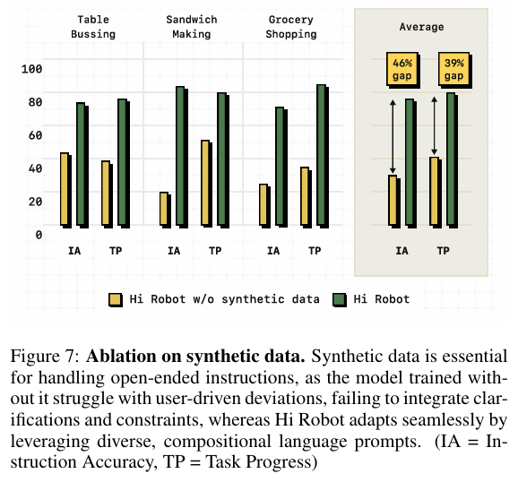
* 첫 번째 ablation은 synthetic data의 중요성을 평가한다.

* 비교 대상은 다음 두 모델이다.

  * Hi Robot: human-labeled data + synthetic data로 학습
  * Hi Robot without synthetic data: human-labeled data만 사용

* 결과적으로 synthetic data를 사용한 Hi Robot이 더 높은 성능을 보인다.

* synthetic data가 없는 모델은 language flexibility가 떨어진다.

* 특히 다음과 같은 사용자 feedback이나 constraint를 잘 반영하지 못한다.

  * “this is not trash”
  * “I’m allergic to pickles”

* 예를 들어 synthetic data가 없는 모델은 “this is not trash” 같은 clarification을 무시하거나, 금지된 ingredient인 pickles를 포함할 수 있다.

* 반면 Hi Robot은 다양한 synthetic prompt를 통해 compositional language를 더 폭넓게 학습했기 때문에, open-ended instruction과 feedback에 더 잘 적응한다.

* Figure 7은 synthetic data가 Instruction Accuracy와 Task Progress 모두에 중요하다는 점을 보여준다.

---

### c) Ablation B: Hierarchical structure outperforms a flat policy
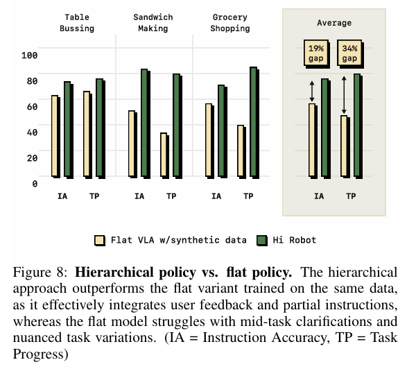

* 두 번째 ablation은 hierarchical structure의 효과를 평가한다.

* 비교 대상은 다음 두 모델이다.

  * Hi Robot
  * Flat VLA with synthetic data

* 두 모델 모두 synthetic data를 사용하지만, 구조가 다르다.

* Flat VLA with synthetic data는 high-level reasoning step 없이 하나의 flat policy가 complex prompt를 직접 action으로 처리한다.

* 반면 Hi Robot은 high-level policy가 complex prompt를 해석하고, low-level policy가 실행 가능한 command로 나누어 처리한다.

* 결과적으로 Hi Robot이 flat policy보다 더 좋은 성능을 보인다.

* flat model은 다음과 같은 문제를 보인다.

  * 모든 object를 치우는 default behavior로 돌아감
  * “bus only the yellowish things” 같은 partial instruction을 제대로 처리하지 못함
  * task 중간 clarification에 약함
  * nuanced task variation을 반영하기 어려움

* Hi Robot은 각 high-level step에서 prompt를 다시 확인하고, mid-task update에 맞게 coherent하게 반응한다.

---
## 6. Discussion and Future Work

### a) Summary of Hi Robot

* 논문은 Hi Robot을 complex prompt, user feedback, language interaction을 처리하기 위한 hierarchical VLM system으로 제안한다.

* Hi Robot은 복잡한 명령을 바로 robot action으로 바꾸지 않는다.

* 먼저 high-level VLM이 다음 정보를 해석한다.

  * complex prompt
  * user feedback
  * language interaction
  * current image observation

* 이를 바탕으로 task를 수행하기 위해 가장 적절한 다음 step을 추론한다.

* 이후 low-level VLA가 그 step을 실제 robot action command로 실행한다.

* 즉, Hi Robot의 핵심 구조는 다음과 같다.

  * high-level VLM: 무엇을 해야 하는지 판단
  * low-level VLA: 그 판단을 실제 action으로 실행

---

### b) System 1 / System 2 interpretation

* 논문은 Hi Robot을 Kahneman의 System 1 / System 2 구조의 VLM 기반 구현으로 볼 수 있다고 설명한다.

#### System 2: high-level VLM policy

* System 2는 신중하고 deliberative한 reasoning layer에 해당한다.

* Hi Robot에서는 high-level VLM policy가 이 역할을 한다.

* high-level VLM은 web-scale pre-training을 통해 얻은 semantic knowledge와 visual knowledge를 활용한다.

* 이를 바탕으로 복잡한 prompt와 user interaction을 해석하고, 현재 상황에서 적절한 다음 행동 단계를 결정한다.

#### System 1: low-level VLA policy

* System 1은 physical하고 reactive한 execution layer에 해당한다.

* Hi Robot에서는 low-level VLA policy가 이 역할을 한다.

* low-level policy도 VLM 기반이지만, 더 단순한 command를 입력받아 robot action을 직접 출력하도록 학습된다.

* 즉, low-level policy는 “pick up the cup”처럼 atomic behavior를 설명하는 command를 실제 action으로 바꾸는 역할을 한다.

---

### c) Similar architecture between high-level and low-level VLMs

* high-level policy와 low-level policy는 거의 동일한 VLM architecture를 사용한다.

* 두 모델의 큰 차이는 low-level policy가 action을 출력하기 위해 flow matching을 사용한다는 점이다.

* 즉, high-level VLM은 language command를 출력하고, low-level VLA는 continuous robot action을 출력한다.

* 하지만 두 모델이 완전히 다른 종류의 모델인 것은 아니다.

* 논문은 이러한 역할 분리가 model architecture 수준에서 반드시 필수적인 것은 아니라고 본다.

---

### d) Future direction 1: One model with System 1 / System 2 distinction at inference time

* 향후 연구에서는 high-level model과 low-level model을 하나의 모델로 결합할 수 있다고 제안한다.

* 현재 Hi Robot은 high-level VLM과 low-level VLA를 분리된 모델로 사용한다.

* 하지만 미래에는 하나의 모델 안에서 System 1과 System 2 역할을 나눌 수 있다.

* 즉, 모델 자체를 두 개로 분리하는 대신, inference 과정에서 어떤 때는 high-level reasoning을 하고, 어떤 때는 low-level execution을 하는 방식으로 확장할 수 있다는 뜻이다.

---

### e) Future direction 2: More intricate interleaving of high-level and low-level processing

* 현재 Hi Robot은 high-level inference를 낮은 고정 주파수로 실행한다.

* 예를 들어 1초가 지나거나 user interaction이 들어오면 high-level inference를 다시 실행한다.

* 이 방식은 단순하고 잘 작동하지만, high-level과 low-level 처리가 정교하게 얽혀 있는 구조는 아니다.

* 논문은 future work로 high-level과 low-level processing을 더 복잡하게 interleave할 수 있다고 말한다.

* 여기서 interleave는 high-level reasoning과 low-level control을 더 촘촘하게 섞어 실행한다는 의미이다.

* 예를 들어 adaptive system은 다음 정보를 여러 abstraction level에서 동시에, 비동기적으로 처리할 수 있다.

  * visual input
  * robot state
  * language prompt
  * user feedback
  * task progress

* 이렇게 되면 high-level과 low-level이 각자 정해진 주기로만 도는 것이 아니라, 상황에 따라 필요한 level의 reasoning이 유동적으로 실행될 수 있다.

* 이는 더 flexible한 multi-level reasoning procedure로 이어질 수 있다.

---

### f) Limitation 1: Synthetic data generation relies on prompt engineering

* Hi Robot의 high-level policy는 complex command를 low-level step으로 잘 나눌 수 있다.

* 하지만 이 high-level model을 학습시키는 과정은 어느 정도 prompt engineering에 의존한다.

* 특히 synthetic training example을 만들 때, VLM이 원하는 형태의 user prompt와 robot response를 생성하도록 prompt를 설계해야 한다.

* 따라서 high-level behavior가 완전히 자동으로 생긴다기보다는, synthetic data를 어떻게 만들었는지에 영향을 받는다.

---

### g) Limitation 2: High-level and low-level models are decoupled during training

* 현재 학습 과정에서는 high-level model과 low-level model이 분리되어 있다.

* 즉, 두 모델이 end-to-end로 함께 학습되는 것이 아니다.

* 이 때문에 두 모델은 서로의 capability를 직접 알지 못한다.

* high-level model은 low-level model이 어떤 command를 잘 수행할 수 있는지 명시적으로 알고 있는 것이 아니다.

* low-level model도 high-level model이 어떤 복잡한 의도를 가지고 command를 생성했는지 직접 이해하는 구조는 아니다.

* 두 모델은 training examples를 통해서만 서로의 능력을 간접적으로 맞춘다.

* 예를 들어 high-level model은 학습 데이터에 자주 등장한 skill label을 보고, “이런 command는 low-level이 수행할 수 있겠구나” 정도를 학습한다.

* 하지만 low-level이 실제로 어떤 상황에서 실패하는지, 어떤 object를 잘 못 잡는지, 어떤 command가 실행 가능한지까지 명시적으로 모델링하지는 않는다.

---

### h) Future direction 3: More direct coupling between high-level and low-level

* 논문은 high-level과 low-level을 더 직접적으로 연결하는 것이 future work가 될 수 있다고 말한다.

* 예를 들어 high-level policy가 low-level policy의 command 수행 성공 여부를 더 잘 알 수 있게 만들 수 있다.

* 이렇게 되면 high-level policy는 단순히 “해야 할 일”만 고르는 것이 아니라, low-level policy가 실제로 수행 가능한 command를 더 잘 선택할 수 있다.

* 예를 들어 low-level이 특정 object grasping에 반복적으로 실패한다면, high-level이 다른 접근 방식이나 다른 command를 선택할 수 있다.

* 이는 high-level reasoning과 low-level execution이 서로의 상태와 한계를 더 잘 반영하는 구조로 발전할 가능성을 의미한다.

---

### i) Final outlook

* 논문은 high-level reasoning과 low-level reasoning을 모두 VLM 기반으로 구현했다는 점을 중요하게 본다.

* 이 구조는 앞으로 두 구성요소를 더 정교하게 통합할 수 있는 가능성을 연다.

* 미래의 robotic VLA model은 다음 요소들을 동적으로 함께 reasoning할 수 있을 것이다.

  * current input
  * user feedback
  * task context
  * robot’s own capabilities
  * physical execution result

* 이를 통해 복잡한 open-world setting에서 더 적절한 situated response를 생성하는 robot system으로 확장될 수 있다.

---

<details>
<summary><b>Thoughts After Reading This Paper</b></summary>

## Thoughts After Reading This Paper

### 1. synthetic data generation 방식을 VLM로 하는 것이 적절한 방법인가?

**논문 한계**  
- VLM에게 observation과 command를 제공함. 그리고 observation과 command가 나오기 전에 어떤 prompt나 interjection이 있을 수 있었는지 생성하게 됨. 그리고 생성된 example로 high-level policy training에 사용함.

**내가 떠올린 확장 질문**  
- 근데 이러면 생성된 example이 결국 VLM이 만들어낸거니깐, hallucination이나 bias가 포함된 퀄리티낮은 dataset이 생성되는 거 아닐까?
- 극단적인 상황의 경우(학습 데이터셋에서 표준편차가 3시그마 이상의 값들)는 모델이 학습조차 못했을 수 있지 않을까?

**생각해볼 수 있는 문제**  
- Foundation models의 경우 hallucination과 bias 현상을 해결하기 위해 지금까지 활용되었던 방법들을 활용하면 generalibity를 높힐 수 있는 dataset을 만들 수 있을 것이라 생각한다.   
- 여러 VLA 논문을 읽으면서 내가 반복적으로 주목하는 지점은 “모델이 정상적인 instruction을 따르는가”보다, ambiguous instruction, user feedback, distribution shift, unexpected situation이 발생했을 때 행동을 어떻게 수정할 수 있는가에 가까운 것 같다. 단순히 edge case를 찾는 수준에 머무르지 않으려면, 이러한 예외 상황을 어떤 구조로 다룰 것인지까지 구체화할 필요가 있다. Hi Robot에서는 high-level inference가 complex prompt와 interjection을 low-level command로 다시 변환하는 방식이 그 한 예시로 보인다.


**가능한 방향**  
- 1. dataset의 퀄리티를 체크할 수 있는 benchmark가 있고 그것을 활용한다면 dataset의 퀄리티에 대한 개선책을 마련할 수 있을 것이라고 떠올렸다.
- 2. 로봇 관련 dataset이 vision(image)과 같은 다른 dataset에 비해 얻기가 어렵고 적용하기도 어려운 것으로 알고 있다. 저자의 이러한 방법은 Vision과 Language 데이터셋만으로 기존의 control policy을 개선할 수 있는 방법이 있지 않을까? High-level에서 V,L데이터만 가지고 action command만 잘 내려보낼수 있으면 action데이터의 의존성을 낮출 수 있지 않을까?
- => CoTVLA를 읽던 중, subgoal image generation을 통해 action annotation이 없는 video data를 통해 visual reasoning과 understanding을 향상시킬 수 있다는 점을 확인할 수 있었다.
- 3. edge case를 감지할 수 있는 방법은 무엇이 있지?
---

### 1. VLM 기반 synthetic data generation은 적절한 방법인가? (지피티 정리)

**논문 한계**

* Hi Robot은 high-level policy를 학습시키기 위해 synthetic data generation 방식을 사용한다.
* 구체적으로 VLM에게 현재 observation과 low-level command를 제공하고, 그 command가 나오기 전에 어떤 user prompt나 interjection이 있었을 수 있는지를 생성하게 한다.
* 이렇게 생성된 synthetic example은 high-level policy가 complex prompt와 user feedback을 low-level command로 변환하도록 학습하는 데 사용된다.
* 하지만 이 과정은 synthetic example을 생성하는 VLM과 prompt engineering 방식에 어느 정도 의존한다는 한계가 있다.

**내가 떠올린 확장 질문**

* 생성된 example이 실제 human-robot interaction에서 수집된 데이터가 아니라 VLM이 만들어낸 데이터라면, hallucination이나 bias가 포함될 가능성은 없을까?
* VLM이 그럴듯해 보이지만 실제 로봇 환경에서는 부적절한 prompt, interjection, robot response를 생성할 수도 있지 않을까?
* 또한 학습 데이터에서 거의 등장하지 않는 long-tail situation이나 OOD 상황의 경우, synthetic data만으로 충분히 대응할 수 있을까?
* 예를 들어 일반적인 상황에서는 잘 작동하더라도, 사용자 피드백이 애매하거나 물체 조합이 드물거나 환경 조건이 특이한 경우에는 high-level policy가 적절한 low-level command를 생성하지 못할 가능성이 있다.

**생각해볼 수 있는 문제**

* 이 논문의 synthetic data generation 방식은 다양한 language variation을 확보하는 데에는 효과적일 수 있다.
* 하지만 dataset의 다양성이 늘어나는 것과 dataset의 신뢰성이 높아지는 것은 별개의 문제일 수 있다.
* VLM이 생성한 data를 그대로 high-level policy 학습에 사용하는 경우, hallucination, bias, 비현실적인 interaction이 학습 데이터에 섞일 가능성이 있다.
* 따라서 synthetic data를 사용할 때는 단순히 양을 늘리는 것보다, 생성된 example이 실제 로봇 환경과 사용자 의도에 얼마나 잘 맞는지 검증하는 과정이 필요해 보인다.
* 여러 VLA 논문을 읽으면서 내가 반복적으로 주목하는 지점은 “모델이 정상적인 instruction을 잘 따르는가”보다, ambiguous instruction, user feedback, distribution shift, unexpected situation이 발생했을 때 행동을 어떻게 수정할 수 있는가에 가까운 것 같다.
* 단순히 edge case를 찾는 수준에 머무르지 않으려면, 이러한 예외 상황을 어떤 구조로 감지하고 처리할 것인지까지 구체화할 필요가 있다.
* Hi Robot에서는 high-level inference가 complex prompt와 interjection을 다시 해석하여 low-level command를 갱신하는 방식이 그 한 예시로 보인다.

**가능한 방향**

* Synthetic data의 품질을 평가할 수 있는 benchmark나 validation protocol을 활용하면, 생성된 dataset의 신뢰성을 점검하고 개선할 수 있을 것이라고 생각했다.
* 로봇 관련 dataset은 language, vision-only dataset에 비해 수집 비용이 크고 실제 환경 적용도 어렵다. 이런 관점에서 Hi Robot의 synthetic data generation 방식은 vision-language data를 활용해 control policy의 high-level reasoning 능력을 보완하려는 시도로 볼 수 있다.
* 다만 앞으로는 synthetic data를 단순히 생성하는 것을 넘어, hallucination이나 bias를 줄이고 long-tail / OOD 상황을 더 잘 포함하도록 dataset을 검증하고 필터링하는 방식이 필요해 보인다.
* 추가로 생각해볼 질문은 “edge case를 어떻게 감지할 수 있는가?”이다. 예를 들어 high-level policy가 자신의 command에 대한 uncertainty를 추정하거나, low-level policy의 실패 가능성을 반영하거나, 사용자에게 clarification을 요청하는 구조를 함께 고려할 수 있을 것 같다.

--- 

</details>

<details>
<summary><b>Summary</b></summary>
## Hi Robot

### One-line Summary

* Hi Robot은 synthetic data를 활용해 complex prompt와 user feedback에 대한 high-level reasoning을 학습하고, hierarchical decomposition을 통해 high-level VLM이 low-level command를 생성하면 low-level VLA가 이를 continuous action chunk로 실행하는 hierarchical VLA system이다.

---

### Structure

* Hi Robot의 핵심 구조는 high-level reasoning과 low-level task execution을 분리한 hierarchical structure이다.

* High-level model은 complex prompt, user feedback, current observation을 해석하여 현재 수행해야 할 subtask를 결정한다.

* 이후 high-level model은 이 subtask를 low-level policy가 실행 가능한 low-level language command로 변환한다.

* Low-level policy는 high-level model이 생성한 low-level language command와 현재 robot state를 입력받아 실제 robot action chunk를 생성하고 실행한다.

* 즉, Hi Robot은 사용자의 복잡한 명령을 바로 action으로 변환하지 않고, 먼저 high-level command로 분해한 뒤 low-level VLA가 이를 실행하는 방식이다.

---

### Model Architecture

* Hi Robot은 high-level policy와 low-level policy를 분리하여 사용한다.

* Low-level policy는 PaliGemma-3B를 기반으로 한 π0 VLA를 fine-tuning하여 사용한다.

* Low-level policy는 visual observation, low-level language command, robot state를 입력으로 받아 continuous action chunk를 출력한다.

* High-level policy 역시 PaliGemma-3B 기반 VLM을 사용하며, image-language tuple을 바탕으로 fine-tuning된다.

* High-level policy의 역할은 직접 action을 생성하는 것이 아니라, 현재 상황과 사용자 명령을 해석하여 low-level policy가 수행할 수 있는 language command를 생성하는 것이다.

---

### Synthetic Data Generation

* Hi Robot은 high-level policy를 학습시키기 위해 synthetic data generation scheme을 사용한다.

* VLM에게 현재 observation과 low-level command를 제공하고, 해당 command가 나오기 전에 어떤 user prompt나 interjection이 있었을 수 있는지를 생성하게 한다.

* 이렇게 생성된 synthetic examples는 high-level policy가 complex prompt와 user feedback을 low-level command로 변환하는 능력을 학습하는 데 사용된다.

* 논문에서는 synthetic data가 없을 경우 language flexibility가 떨어진다고 보고한다.

* Figure 7은 synthetic data가 Instruction Accuracy와 Task Progress 모두에 중요하다는 점을 보여준다.

---

### Effect of Hierarchical Decomposition

* Hi Robot의 또 다른 핵심은 hierarchical decomposition이다.

* Flat VLA처럼 사용자 명령을 바로 action으로 변환하는 것이 아니라, high-level policy가 먼저 complex prompt와 user feedback을 해석한다.

* 이후 high-level policy가 현재 상황에 맞는 low-level command를 생성하고, low-level policy가 이를 실제 action으로 실행한다.

* 이 구조 덕분에 Hi Robot은 mid-task update나 user interjection이 들어왔을 때도 기존 task 흐름을 유지하면서 coherent하게 반응할 수 있다.

* 즉, hierarchical structure는 complex prompt와 real-time feedback을 현재 observation에 맞게 해석하고 행동으로 연결하는 데 중요한 역할을 한다.

---

### Key Takeaways

* Hi Robot은 high-level reasoning과 low-level action execution을 분리한 hierarchical VLA system이다.

* High-level model은 complex prompt, user feedback, current observation을 바탕으로 현재 수행해야 할 subtask를 결정한다.

* Low-level policy는 high-level model이 생성한 low-level language command를 실제 continuous action chunk로 변환한다.

* Synthetic data generation은 high-level policy가 다양한 prompt와 feedback에 대응하도록 학습하는 데 사용된다.

* Ablation 결과는 synthetic data와 hierarchical decomposition이 Hi Robot의 성능에 모두 중요하다는 점을 보여준다.

* 따라서 Hi Robot의 핵심은 단순히 VLA의 action 생성 성능을 높이는 것이 아니라, 복잡한 사용자 명령과 실시간 feedback을 high-level reasoning을 통해 해석하고, 이를 low-level control로 연결하는 구조에 있다.
</details>

</details>


<details>
<summary><b>27. CoT-VLA: Visual Chain-of-Thought Reasoning for Vision-Language-Action Models</b></summary>

## Basic Information

- **Title**: CoT-VLA: Visual Chain-of-Thought Reasoning for Vision-Language-Action Models
- **Authors**: Qingqing Zhao, Yao Lu, Moo Jin Kim, Zipeng Fu, Zhuoyang Zhang, Yecheng Wu, Zhaoshuo Li, Qianli Ma, Song Han, Chelsea Finn, Ankur Handa, Ming-Yu Liu, Donglai Xiang, Gordon Wetzstein, Tsung-Yi Lin
- **Conference / Journal**: CVPR 2025
- **Year**: 2025

---

## One-line Summary

* CoT-VLA는 기존 VLA가 현재 image와 language instruction에서 바로 action을 예측하는 한계를 보완하기 위해, action 생성 전에 future subgoal image를 먼저 생성하는 visual chain-of-thought reasoning을 도입한 VLA model이다.

---

## Understanding the Structure

## 0. Abstract

### a) Background: VLA model의 가능성

* Vision-Language-Action model, VLA는 pretrained vision-language model, VLM과 다양한 robot demonstration을 활용하여 generalizable sensorimotor control을 학습할 수 있는 가능성을 보여주었다.

* 즉, VLA는 시각 정보와 언어 명령을 입력받아 로봇 행동으로 연결하는 방식이며, VLM의 vision-language 이해 능력과 robot demonstration data를 결합하는 방향이다.

* 이러한 paradigm은 robotic data뿐 아니라 non-robotic data까지 포함한 large-scale data를 효과적으로 활용할 수 있다는 장점을 가진다.

---

### b) Problem: 기존 VLA model의 한계

* 기존 VLA model은 주로 direct input-output mapping에 집중한다.

* 즉, 현재 관측과 언어 명령을 입력받은 뒤, 중간 reasoning step 없이 곧바로 robot action을 예측하는 구조가 많다.

* 하지만 복잡한 manipulation task에서는 intermediate reasoning step이 중요하다.

* 기존 VLA는 이러한 중간 추론 단계가 부족하기 때문에 temporal planning이나 reasoning capability가 부족하다는 한계를 가진다.

---

### c) Proposal: Visual Chain-of-Thought Reasoning

* 논문은 VLA에 explicit visual chain-of-thought, CoT reasoning을 포함하는 방법을 제안한다.

* 핵심 아이디어는 robot action을 바로 생성하지 않고, 먼저 future image frame을 autoregressive하게 예측하는 것이다.

* 이때 예측된 future image frame은 visual goal로 사용된다.

* 이후 모델은 이 visual goal을 달성하기 위한 short action sequence를 생성한다.

```text
기존 VLA:
current observation + language instruction
        ↓
robot action

CoT-VLA:
current observation + language instruction
        ↓
future image frame / visual goal
        ↓
short action sequence
```

---

### d) Model: CoT-VLA

* 논문은 CoT-VLA라는 7B 규모의 VLA model을 제안한다.

* CoT-VLA는 visual token과 action token을 모두 이해하고 생성할 수 있는 model이다.

* 즉, 단순히 image와 language를 이해하는 것에 그치지 않고, visual reasoning을 위한 image generation과 robot execution을 위한 action generation을 함께 수행한다.

---

### e) Evaluation: Real-world and Simulation

* 논문은 CoT-VLA를 real-world manipulation task와 simulation benchmark에서 평가한다.

* 실험 결과 CoT-VLA는 strong performance를 보였다.

* CoT-VLA는 real-world manipulation task에서 기존 state-of-the-art VLA model보다 17% 높은 성능을 보였다.

* 또한 simulation benchmark에서는 기존 state-of-the-art VLA model보다 6% 높은 성능을 보였다.

---

### f) Overall Meaning

* CoT-VLA의 핵심은 VLA가 행동을 예측하기 전에 먼저 시각적인 중간 목표를 생성하도록 만드는 것이다.

* 기존 VLA가 current observation과 language instruction에서 바로 action을 생성했다면, CoT-VLA는 future image frame을 visual goal로 먼저 생성한다.

* 이후 이 visual goal을 조건으로 삼아 짧은 action sequence를 생성한다.

* 따라서 CoT-VLA는 visual subgoal image를 intermediate reasoning step으로 사용하는 VLA model이라고 정리할 수 있다.

---

## I. Introduction

### a) Background: robot learning과 VLA model의 발전

* 최근 robot learning 연구는 다양한 task와 environment에서 동작할 수 있는 policy를 학습하는 방향으로 발전해왔다.

* 그중 하나의 유망한 방향이 Vision-Language-Action model, VLA이다.

* VLA는 pretrained vision-language model, VLM의 풍부한 이해 능력을 활용한다.

* VLA는 natural language instruction과 visual observation을 robot action으로 mapping한다.

* VLM을 robot demonstration data로 학습시키면, VLA는 VLM이 가지고 있던 다양한 scene, object, natural language instruction 이해 능력을 이어받을 수 있다.

* 이를 통해 downstream testing scenario에서 더 나은 generalization capability를 얻을 수 있다.

---

### b) Problem: direct observation-to-action mapping의 한계

* 기존 VLA 접근들은 좋은 성능을 보였지만, 대부분 observation에서 action으로 직접 mapping하는 구조를 가진다.

* 즉, current observation과 language instruction을 보고 바로 robot action을 예측한다.

* 이러한 방식은 explicit intermediate reasoning step이 부족하다.

* 논문은 intermediate reasoning step이 interpretability와 performance를 개선할 가능성이 있다고 본다.

* 따라서 기존 VLA는 행동을 생성하기 전에 “어떤 상태를 목표로 해야 하는가”를 명시적으로 생성하거나 reasoning하는 과정이 부족하다는 문제가 있다.

---

### c) Motivation: Chain-of-Thought reasoning의 robotics 적용

* Language domain에서는 Chain-of-Thought, CoT prompting이 LLM의 reasoning capability를 향상시키는 방법으로 사용되어왔다.

* CoT는 모델이 최종 답을 바로 내는 것이 아니라, step-by-step thinking을 거치도록 유도한다.

* 논문은 이러한 CoT 개념을 robotics에 적용할 수 있다고 본다.

* Robotics에서 CoT를 적용하면 reasoning을 text, visual observation, physical action에 grounding할 수 있다.

* 즉, 로봇이 행동하기 전에 중간 reasoning step을 생성하고, 이를 바탕으로 실제 action을 결정하는 방향으로 확장할 수 있다.

---

### d) Prior Direction: 기존 robotics reasoning 중간 표현

* 기존 연구들도 robotics에 intermediate reasoning step을 넣으려는 시도를 해왔다.

* 사용된 중간 표현에는 다음과 같은 것들이 있다.

```text
1. language description
2. keypoint
3. bounding box
```

* 이러한 중간 표현들은 scene, object, task의 abstracted state를 표현한다.

* 하지만 이러한 방식은 종종 추가적인 pre-processing pipeline을 필요로 한다.

* 즉, keypoint나 bounding box를 만들기 위해 별도의 annotation, detector, preprocessing 과정이 필요할 수 있다.

---

### e) Proposal: subgoal image as intermediate reasoning step

* 본 논문은 action generation 전에 subgoal image를 intermediate reasoning step으로 사용하는 방법을 탐구한다.

* subgoal image는 모델의 reasoning process가 만들어낸 상태를 시각적으로 표현한다.

* 또한 subgoal image는 robot demonstration dataset 안에 자연스럽게 존재한다.

* 예를 들어 robot demonstration은 시간에 따른 image sequence를 포함하므로, 현재 image 이후의 future frame을 subgoal image로 사용할 수 있다.

* 논문은 prior work에서 subgoal generation이나 goal-conditioned imitation learning이 연구된 적은 있지만, 이를 VLA의 intermediate chain-of-thought reasoning step으로 통합한 것은 본 접근이 처음이라고 설명한다.

---

### f) Core Idea: visual chain-of-thought reasoning for VLAs

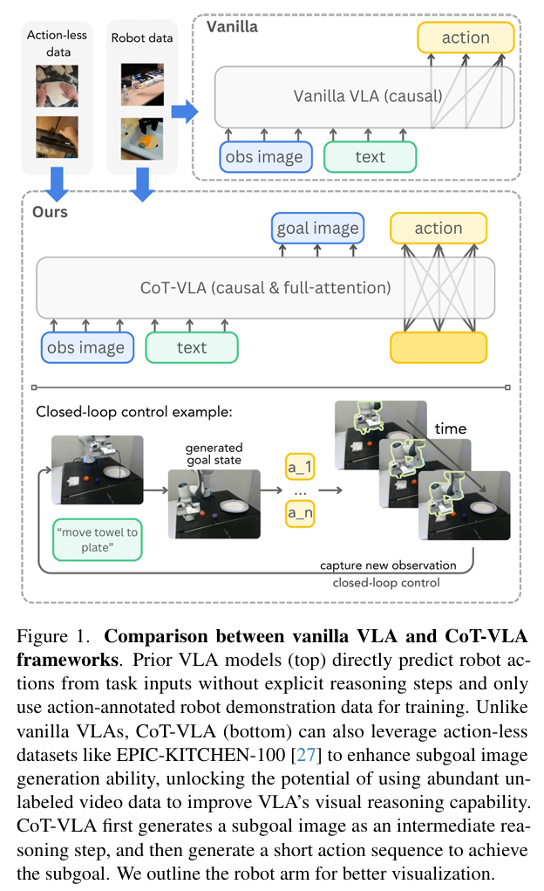
* 논문은 VLA를 위한 visual chain-of-thought reasoning을 제안한다.

* 이 방법은 robotic task에서 subgoal image generation을 chain-of-thought reasoning의 한 형태로 사용한다.

* 기존 방식처럼 action을 바로 예측하는 대신, 먼저 robot의 planned state를 pixel space에서 나타내는 subgoal image를 생성한다.

* 이후 모델은 current observation과 generated subgoal image를 모두 조건으로 사용하여 action을 생성한다.

```text
current observation
+
language instruction
        ↓
generated subgoal image
        ↓
current observation + generated subgoal image 기반 action prediction
```

* 이를 통해 모델은 행동하기 전에 task를 어떻게 수행할지 visual하게 reasoning할 수 있다.

* 논문은 이를 “think visually” before acting이라고 표현한다.

---

### g) Advantage 1: robot demonstration data 안의 정보를 활용

* subgoal image는 robot manipulation data 안에 이미 존재하는 정보를 활용한다.

* 따라서 별도의 복잡한 annotation이나 preprocessing이 상대적으로 적게 필요하다.

* 예를 들어 keypoint나 bounding box처럼 사람이 따로 표시하거나 별도 모델로 추출해야 하는 중간 표현과 달리, future image frame은 demonstration video에서 직접 얻을 수 있다.

---

### h) Advantage 2: action-less video data 활용 가능성

* subgoal image generation은 action annotation을 필요로 하지 않는다.

* 따라서 robot action label이 없는 video data도 visual reasoning 학습에 활용할 수 있다.

* 이는 abundant video data를 사용하여 VLA의 visual reasoning과 understanding capability를 개선할 가능성을 연다.

* Figure 1에서도 기존 vanilla VLA는 action-annotated robot demonstration data만 사용하지만, CoT-VLA는 EPIC-KITCHEN-100 같은 action-less dataset도 활용할 수 있다고 설명한다.

---

### i) System: unified multimodal foundation model 기반 CoT-VLA

* 논문은 text와 image를 모두 이해하고 생성할 수 있는 unified multimodal foundation model의 발전을 바탕으로 CoT-VLA system을 구축한다.

* CoT-VLA의 base model은 Open X-Embodiment dataset과 action-less video dataset으로 학습된다.

* 이후 downstream robot setup에서 수집한 task demonstration으로 fine-tuning된다.

* 즉, CoT-VLA는 robot data와 action-less video data를 모두 활용한 뒤, 실제 배포 및 평가에 사용되는 robot setup의 demonstration으로 추가 학습된다.

---

### j) Architecture: hybrid attention mechanism

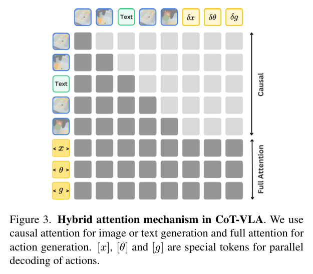
* 논문은 CoT-VLA를 위해 hybrid attention mechanism을 설계한다.

* text와 image generation에는 causal attention과 next-token prediction을 사용한다.

* 반면 action prediction에는 full attention을 사용하여 모든 action dimension을 한 번에 예측한다.

```text
Text / Image generation:
causal attention + next-token prediction

Action prediction:
full attention + all action dimensions at once
```

* 이는 image나 text처럼 순차적으로 생성해야 하는 modality와, action dimension을 동시에 예측해야 하는 robot control output의 차이를 반영한 구조이다.

---

### k) Action Chunking

* CoT-VLA는 매 timestep마다 단일 action만 예측하지 않는다.

* 논문은 최근 robot learning 연구에서 영감을 받아 action chunking을 사용한다.

* 즉, 하나의 action이 아니라 action sequence를 예측한다.

* 이를 통해 robot은 한 번의 prediction에서 짧은 구간의 행동들을 생성할 수 있다.

---

### l) Performance Claim

* 논문은 action chunking과 hybrid attention mechanism이 모두 모델 성능을 향상시킨다고 설명한다.

* 또한 simulation benchmark와 real-world experiment를 통해 visual chain-of-thought reasoning이 기존 VLA 접근보다 policy performance를 개선함을 보인다.

* CoT-VLA는 여러 robot platform과 task에서 state-of-the-art performance를 달성한다.

---

### m) Contributions

* 논문의 contribution은 크게 세 가지이다.

* 첫째, subgoal image generation을 robotic control을 위한 intermediate reasoning step으로 사용하는 visual chain-of-thought reasoning 방법을 제안한다.

* 둘째, visual chain-of-thought reasoning을 포함하는 CoT-VLA system을 제안한다.

* 이 system은 pixel과 text generation을 위한 causal attention과 action prediction을 위한 full attention을 결합한 hybrid attention mechanism을 포함한다.

* 셋째, simulation과 real-world setting 모두에서 comprehensive evaluation을 수행한다.

* 이를 통해 visual chain-of-thought reasoning이 VLA performance를 개선하고, CoT-VLA가 multiple robot platform과 task에서 state-of-the-art performance를 달성함을 보인다.

---

### n) Overall Meaning

* Introduction의 핵심은 기존 VLA의 direct observation-to-action 구조에 visual reasoning step을 추가하는 것이다.

* CoT-VLA는 행동을 바로 예측하지 않고, 먼저 future image frame을 subgoal image로 생성한다.

* 이 subgoal image는 robot이 도달해야 할 planned state를 pixel space에서 나타낸다.

* 이후 모델은 current observation과 generated subgoal image를 조건으로 action sequence를 생성한다.

* 따라서 CoT-VLA는 “언어적 CoT”를 그대로 로봇에 적용하는 것이 아니라, 로봇 조작에 맞게 “시각적 CoT”를 subgoal image 형태로 구현한 VLA model이다.

---

## III. CoT-VLA

### Overview

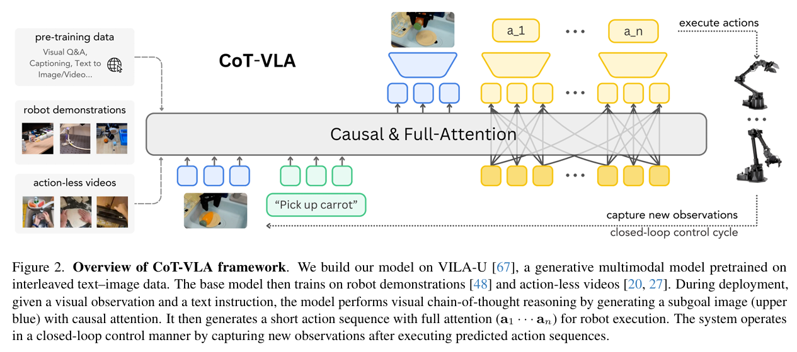
* 이 section은 CoT-VLA의 visual chain-of-thought reasoning framework를 설명한다.
* 논문은 먼저 CoT-VLA의 기본 formulation을 제시하고, 이후 base model인 VILA-U, training procedure, downstream deployment 방식을 설명한다.

```text
Section 3 구성

3.1 Visual Chain-of-Thought Reasoning
3.2 The Base Vision-Language Model
3.3 Training Procedures
Algorithm 1. Test-time closed-loop control
```

---

## 3.1. Visual Chain-of-Thought Reasoning

### a) Training data

* CoT-VLA는 VLA pretraining을 위해 두 종류의 데이터를 사용한다.

```text
D_r = robot demonstrations
D_v = action-less videos
```

* Robot demonstration dataset (D_r)은 다음과 같이 표현된다.

```text
D_r = {(l, a_{1...T}, s_{1...T})}
```

```text
l
= natural language instruction

a_{1...T}
= robot action sequence

s_{1...T}
= image observation sequence
```

* Action-less video dataset (D_v)은 다음과 같이 표현된다.

```text
D_v = {(l, s_{1...T})}
```

* (D_v)에는 language description과 image sequence는 있지만, robot action annotation은 없다.
* 따라서 (D_v)는 action generation 학습에는 직접 사용할 수 없고, subgoal image generation 학습에 사용된다.

---

### b) Vanilla VLA

* 기존 vanilla VLA는 pretrained VLM (P_\theta)를 robot demonstration dataset (D_r)로 fine-tuning한다.
* 현재 observation (s_t)와 language instruction (l)을 보고 action을 직접 예측한다.

```text
Vanilla VLA:

current observation s_t
+
language instruction l
        ↓
action \hat{a}_t
```

```text
\hat{a}_t \sim P_\theta(a_t | s_t, l)
```

* 즉 vanilla VLA는 intermediate reasoning step 없이 observation과 instruction에서 바로 action을 생성한다.

---

### c) CoT-VLA formulation

* CoT-VLA의 핵심은 action generation 전에 visual reasoning step을 넣는 것이다.
* CoT-VLA는 두 단계로 동작한다.

#### Step 1. Subgoal image generation

```text
\hat{s}_{t+n} \sim P_\theta(s_{t+n} | s_t, l)
```

* 현재 observation (s_t)와 language instruction (l)을 보고, (n) frame 뒤의 future image를 예측한다.
* 이 예측된 future image (\hat{s}_{t+n})가 subgoal image이다.
* subgoal image는 action을 생성하기 전에 모델이 도달해야 할 미래 상태를 visual하게 예측한 것이다.

#### Step 2. Action sequence generation

```text
{\hat{a}_t, ..., \hat{a}_{t+m}}
\sim P_\theta({a_t, ..., a_{t+m}} | s_t, l, s_{t+n})
```

* 모델은 현재 observation, language instruction, subgoal image를 조건으로 action sequence를 생성한다.
* 즉 CoT-VLA는 먼저 future state를 image로 reasoning하고, 이후 그 상태를 달성하기 위한 action을 생성한다.

```text
CoT-VLA:

current observation s_t
+
language instruction l
        ↓
subgoal image \hat{s}_{t+n}
        ↓
action sequence {\hat{a}_t, ..., \hat{a}_{t+m}}
```

---

### d) Data usage for each step

* Visual reasoning step은 (D_r)와 (D_v) 모두에서 학습된다.

```text
Visual reasoning:
(l, s_t) → s_{t+n}

필요한 데이터:
image sequence
```

* Action generation step은 (D_r)에서만 학습된다.

```text
Action generation:
(l, s_t, s_{t+n}) → a_t, ..., a_{t+m}

필요한 데이터:
robot action annotation
```

* 따라서 CoT-VLA는 action annotation이 없는 video data도 subgoal image generation 학습에 활용할 수 있다.

---

## 3.2. The Base Vision-Language Model

### a) Why VILA-U is used

* CoT-VLA가 subgoal image를 생성하려면 image와 text를 이해할 뿐 아니라 image token을 생성할 수 있는 model이 필요하다.
* 이를 위해 논문은 VILA-U를 base model로 사용한다.
* VILA-U는 image, text, video token을 모두 이해하고 생성할 수 있는 unified multimodal foundation model이다.

```text
VILA-U의 역할:

image understanding
+
text understanding
+
image/video generation
```

---

### b) VILA-U structure

* VILA-U는 video, image, language를 autoregressive next-token prediction framework로 통합한다.
* unified vision tower는 visual input을 discrete visual token으로 encoding한다.
* 이 visual token들은 textual information과 align되어 LLM backbone에서 처리된다.

```text
image / video
        ↓
unified vision tower
        ↓
discrete visual tokens
        ↓
projector
        ↓
LLM backbone
```

* 이를 통해 VILA-U는 image/video understanding뿐 아니라 autoregressive image/video generation도 수행할 수 있다.

---

### c) Discrete visual token and residual quantization

* VILA-U는 이미지를 pixel 그대로 처리하지 않고 discrete visual token으로 표현한다.
* 이때 visual token 하나만으로는 시각 정보를 충분히 표현하기 어렵기 때문에 residual quantization을 사용한다.

```text
residual
= 현재 token 표현으로 아직 설명하지 못한 남은 시각 정보
```

* VILA-U는 residual token을 여러 단계로 예측하여 visual feature의 표현 능력을 높인다.
* 이 residual token들을 점진적으로 예측하기 위해 depth transformer를 사용한다.

```text
visual token
+
residual token 1
+
residual token 2
+
...
```

* 논문에서 사용하는 VILA-U는 256 × 256 image를 다음과 같이 encoding한다.

```text
16 × 16 × 4 tokens
```

```text
16 × 16
= visual position 수

4
= residual depth
```

* 즉 image 하나는 총 (16 \times 16 \times 4 = 1024)개의 visual token으로 표현된다.

---

### d) Multimodal training pairs

* VILA-U의 base model은 다음과 같은 multimodal pair로 학습된다.

```text
[image, text]
[text, image]
[video, text]
[text, video]
```

* 이 구조 덕분에 CoT-VLA는 현재 image와 instruction을 보고 future subgoal image를 생성할 수 있다.

---

## 3.3. Training Procedures

### a) Training setup

* CoT-VLA는 7B VILA-U model을 robot demonstrations (D_r)와 action-less videos (D_v)로 pretrain한다.
* 학습 시 optimize하는 구성요소는 다음과 같다.

```text
Optimize:
LLM backbone
projector
depth transformer

Freeze:
vision tower
```

* Training objective는 두 가지이다.

```text
1. subgoal image generation with causal attention

2. action generation with full attention
```

---

## Visual Tokens Prediction

### b) Visual token training sequence

* Subgoal image generation을 위한 training sequence는 다음 형태이다.

```text
(l, s_t, s_{t+n})
```

```text
l
= language instruction

s_t
= current image

s_{t+n}
= future image / target subgoal image
```

* 모델은 (l)과 (s_t)를 조건으로 (s_{t+n})을 생성하도록 학습된다.

---

### c) Visual loss

* 각 visual position (j)에서 depth transformer (P_\delta)는 (D)개의 residual token을 autoregressive하게 예측한다.

```text
k_{j1}, ..., k_{jD}
```

```text
j
= visual position index

D
= residual depth

k_{jd}
= j번째 visual position의 d번째 residual token
```

* Visual token prediction loss는 다음과 같다.

```text
L_visual = - Σ_j Σ_d log P_δ(k_{jd} | k_{j,<d})
```

* 의미는 다음과 같다.

```text
L_visual
= generated subgoal image token이
  정답 future image token과 얼마나 다른지 측정하는 loss
```

---

## Action Tokens Prediction

### d) Action token training sequence

* Action prediction을 위한 training sequence는 다음 형태이다.

```text
(l, s_t, s_{t+n}, a_t, ..., a_{t+m})
```

* 모델은 language instruction, current image, subgoal image를 조건으로 action sequence를 예측한다.

```text
입력:
l + s_t + s_{t+n}

정답:
a_t, ..., a_{t+m}
```

---

### e) Action representation

* 각 action (a_i)는 7개의 token으로 표현된다.
* 각 action dimension은 독립적으로 discretize된다.

```text
a_i = 7 action tokens
```

* 각 continuous action dimension은 256개의 discrete bin으로 변환된다.
* bin width는 training data action distribution의 1st percentile과 99th percentile 사이를 균등하게 나누어 결정한다.
* 논문은 text tokenizer vocabulary에서 가장 적게 사용되는 256개 token을 action bin token으로 재사용한다.

```text
continuous action value
        ↓
256 discrete bins
        ↓
action token
```

---

### f) Full attention for action prediction

* CoT-VLA는 action token 예측에 full attention을 사용한다.
* 이 방식은 모든 action token이 서로 상호작용할 수 있게 한다.

```text
Action token 1 ↔ Action token 2 ↔ ... ↔ Action token 7
```

* 반면 image/text generation에는 causal attention을 사용한다.

```text
Image/Text generation:
causal attention

Action generation:
full attention
```

* 따라서 CoT-VLA의 attention 구조는 hybrid attention mechanism이다.

---

### g) Action loss and total loss

* Action prediction loss는 다음과 같다.

```text
L_action = - Σ_i log P_θ(a_t...a_{t+m} | l, s_t, s_{t+n})
```

* 의미는 다음과 같다.

```text
L_action
= predicted action sequence가
  정답 action sequence와 얼마나 다른지 측정하는 loss
```

* 전체 training objective는 visual loss와 action loss를 더한 것이다.

```text
L = L_action + L_visual
```

```text
전체 학습 목표
=
subgoal image를 잘 생성하기
+
action sequence를 잘 생성하기
```

---

## Pretraining Phase

### h) Pretraining data

* CoT-VLA는 (D_r)와 (D_v)를 함께 사용하여 pretraining된다.
* Robot demonstration data로는 Open X-Embodiment dataset, OpenX의 subset을 사용한다.
* 논문은 OpenVLA의 preprocessing pipeline을 따라, third-person camera view와 single-arm end-effector control, 7-DoF action을 가진 dataset을 선택한다.

```text
Robot demonstrations:
OpenX subset
third-person camera view
single-arm end-effector control
7-DoF action
```

* Action-less video data로는 다음 두 dataset을 사용한다.

```text
EPIC-KITCHENS
Something-Something V2
```

* 모든 image는 256 × 256 resolution으로 처리된다.

---

### i) Future timestep and action chunk

* Visual reasoning 학습에서 subgoal image는 future timestep (n)에서 가져온다.
* (n)은 dataset-specific range ([n_l, n_u])에서 uniform sampling된다.

```text
n ~ Uniform([n_l, n_u])
```

* 논문은 action chunk size를 10으로 설정한다.

```text
action chunk size = 10
```

---

## Adaptation Phase for Downstream Closed-Loop Deployment

### j) Downstream adaptation

* Pretraining 이후 CoT-VLA는 downstream task에 맞게 fine-tuning된다.
* 이때 target robot setup에서 수집한 task-specific robot demonstration data (D_r)를 사용한다.

```text
pretrained CoT-VLA
        ↓
target robot setup의 task-specific demonstrations로 fine-tuning
        ↓
downstream manipulation task 수행
```

* Adaptation phase에서도 pretraining과 동일하게 LLM backbone, projector, depth transformer를 optimize하고 vision tower는 frozen 상태로 유지한다.

---

## Algorithm 1. Test-time Closed-Loop Control

### k) Test-time procedure

* Algorithm 1은 CoT-VLA가 test time에서 robot을 제어하는 절차를 설명한다.

* 입력은 학습된 CoT-VLA model (P_\theta), initial observation (s_0^{obs}), language instruction (l)이다.

* 절차는 다음과 같다.

```text
1. 현재 observation s_t^{obs}와 instruction l을 입력받는다.

2. subgoal image \hat{s}_{t+n}를 생성한다.

   \hat{s}_{t+n} ∼ P_θ(s_{t+n} | l, s_t^{obs})

3. 생성된 subgoal image를 조건으로 action chunk를 생성한다.

   [\hat{a}_t, ..., \hat{a}_{t+m}]
   ∼ P_θ(a_t, ..., a_{t+m} | l, s_t^{obs}, \hat{s}_{t+n})

4. action chunk를 순서대로 실행한다.

5. 새로운 robot observation을 받는다.

6. 같은 과정을 반복한다.
```

* 이 방식은 closed-loop control이다.
* 즉 전체 task를 한 번에 끝까지 실행하는 것이 아니라, action chunk를 실행한 뒤 다시 관측하고 다시 subgoal과 action을 생성한다.

```text
관측
→ subgoal image 생성
→ action chunk 생성
→ 실행
→ 다시 관측
→ 반복
```

---

## III. Overall Meaning

* III절의 핵심은 CoT-VLA가 기존 VLA의 direct action prediction 구조를 visual reasoning이 포함된 two-stage 구조로 바꾼다는 것이다.

```text
Vanilla VLA:
current image + instruction
        ↓
action
```

```text
CoT-VLA:
current image + instruction
        ↓
subgoal image
        ↓
action sequence
```

* 이를 위해 CoT-VLA는 image/text/video를 token으로 이해하고 생성할 수 있는 VILA-U를 base model로 사용한다.
* 학습은 (L_{visual})과 (L_{action})을 함께 최소화하는 방식으로 진행된다.
* Robot demonstration data는 subgoal image generation과 action generation 모두에 사용된다.
* Action-less video data는 action annotation이 없기 때문에 subgoal image generation에 사용된다.
* Test time에서는 현재 관측을 보고 subgoal image와 action chunk를 생성한 뒤, 다시 관측하는 closed-loop 방식으로 동작한다.

```text
최종 정리:

CoT-VLA는 action을 바로 예측하지 않고,
먼저 future subgoal image를 생성한 뒤
그 subgoal을 달성하기 위한 action sequence를 생성하는 VLA model이다.

이 구조는 action annotation이 없는 video data도
visual reasoning 학습에 활용할 수 있게 한다.
```

---

## IV. Experiments

### Overview

* 이 section은 CoT-VLA의 효과를 simulation benchmark와 real-world robot manipulation task에서 평가한다.

* 실험은 크게 세 가지 질문을 다룬다.

```text
1. CoT-VLA는 여러 benchmark와 robot embodiment에서
   state-of-the-art baseline들과 비교해 어떤 성능을 보이는가?

2. Pretraining, visual chain-of-thought reasoning,
   hybrid attention이 task performance에 어떤 영향을 주는가?

3. Visual reasoning의 generalization이 좋아지면
   action prediction capability도 향상되는가?
```

---

## 4.1. Experimental Setup

### a) Evaluation settings

* 논문은 세 가지 setting에서 CoT-VLA를 평가한다.

```text
1. LIBERO simulation benchmark

2. Bridge-V2 real-robot platform

3. Franka-Tabletop real-robot setup
```

* 각 setting은 서로 다른 목적을 가진다.

```text
LIBERO
= simulation 환경에서 다양한 task suite 평가

Bridge-V2
= 대규모 real-robot demonstration dataset 기반 평가

Franka-Tabletop
= pretraining에서 보지 않은 새로운 robot setup에 대한 adaptation 평가
```

---

### b) LIBERO simulation benchmark

* LIBERO는 simulation 기반 robot manipulation benchmark이다.

* 논문은 LIBERO의 네 가지 task suite에서 평가한다.

```text
1. LIBERO-Spatial
2. LIBERO-Object
3. LIBERO-Goal
4. LIBERO-Long
```

* 각 suite는 10개의 다양한 task를 포함한다.

* 각 task에는 50개의 human-teleoperated demonstration이 제공된다.

* LIBERO는 다음 능력들을 평가하기 위한 benchmark이다.

```text
Spatial relationship 이해
Object interaction 이해
Task-specific objective 수행
Long-horizon manipulation 수행
```

* 논문은 OpenVLA와 동일한 preprocessing pipeline을 따른다.

```text
1. trajectory에서 pause interval 제거

2. image resolution을 256 × 256으로 표준화

3. 모든 image에 180-degree rotation 적용
```

---

### c) Bridge-V2 real-robot experiments

* Bridge-V2 실험은 6-DoF WidowX robotic arm을 사용한다.

* 학습 데이터는 Bridge-V2 dataset의 45k language-annotated trajectories이다.

* 이 dataset은 다양한 manipulation task를 포함한다.

* Bridge-V2 data는 pretraining phase에서 OpenX와 함께 사용된다.

* 이후 Bridge-V2 task에 대해 task-specific fine-tuning을 추가로 수행한다.

* Fine-tuning은 training action prediction accuracy가 95%에 도달할 때까지 진행된다.

* 평가는 OpenVLA에서 설계한 네 가지 generalization category를 따른다.

```text
1. Visual robustness
   = distractor가 있는 cluttered environment에서 수행

2. Motion generalization
   = object position이나 높이 변화에 대한 일반화

3. Semantic generalization
   = unseen language instruction에 대한 일반화

4. Language grounding
   = instruction에 맞는 object/action을 수행하는 능력
```

---

### d) Franka-Tabletop real-robot experiments
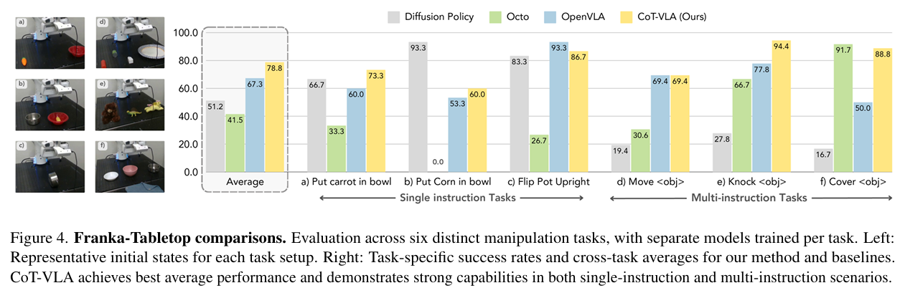

* Franka-Tabletop은 stationary, table-mounted Franka Emika Panda 7-DoF robot arm setup이다.

* 이 setup은 pretraining stage에서 사용되지 않은 새로운 robot setup이다.

* 따라서 이 실험은 CoT-VLA가 새로운 real-world environment와 robot embodiment에 적응할 수 있는지를 평가한다.

* 각 testing scenario에는 10개에서 150개 사이의 robot demonstration만 제공된다.

* 논문은 총 6개의 task를 평가한다.

```text
3 narrow-domain single-instruction tasks

3 diverse multi-instruction tasks
```

* 이 setting은 적은 demonstration만으로 downstream robot setup에 adaptation할 수 있는지를 확인하는 실험이다.

---

### e) Baselines

* 논문은 CoT-VLA를 네 가지 baseline과 비교한다.

```text
1. Diffusion Policy

2. OpenVLA

3. Octo

4. SUSIE
```

---

### f) Diffusion Policy

* Diffusion Policy는 state-of-the-art imitation learning algorithm이다.

* LIBERO와 Franka-Tabletop 실험에서는 각 test scenario마다 scratch부터 학습된다.

* 논문 구현에서는 다음 요소들을 포함한다.

```text
action chunking
proprioception
DistilBERT language embedding conditioning
```

* 즉 Diffusion Policy는 VLA model은 아니지만, robot manipulation에서 강한 imitation learning baseline으로 사용된다.

---

### g) OpenVLA and Octo

* OpenVLA는 pretrained vision-language model을 OpenX dataset으로 fine-tuning한 open-source VLA model이다.

* Octo는 OpenX로 pretraining된 generalist robot model이지만, VLM initialization을 사용하지 않는다.

* Bridge-V2 평가에서는 OpenVLA와 Octo의 published checkpoint를 사용한다.

* LIBERO와 Franka-Tabletop 실험에서는 해당 benchmark/task에 맞게 fine-tuning한다.

---

### h) SUSIE

* SUSIE는 two-stage approach이다.

* 첫 번째 단계에서는 instruction-guided image editing으로 goal image를 생성한다.

* 두 번째 단계에서는 goal-conditioned policy가 해당 goal image를 바탕으로 action을 생성한다.

```text
SUSIE:

instruction-guided image editing
        ↓
goal image generation
        ↓
goal-conditioned policy
        ↓
action generation
```

* Bridge-V2 평가에서는 SUSIE의 published checkpoint를 사용한다.

---

## 4.2. Evaluation Results

### a) LIBERO results

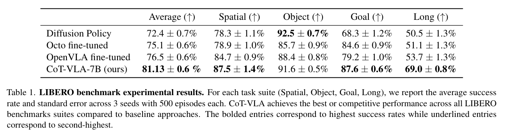
* LIBERO 결과는 Table 1에 제시된다.

* 각 method는 task suite마다 500 trials로 평가된다.

* 결과는 3 random seeds에 대한 mean success rate와 standard error로 보고된다.

```text
Evaluation protocol:

500 trials per task suite
3 random seeds
mean success rate ± standard error
```

* CoT-VLA는 LIBERO simulation environment에서 baseline 대비 best 또는 competitive performance를 달성한다.

* 논문은 failure rollout video를 분석한 결과, baseline methods가 때때로 visual cue에 과적합하고 language instruction을 무시하는 경우가 있다고 설명한다.

* 특히 LIBERO-Spatial처럼 initial state가 task 간에 시각적으로 유사한 경우, baseline은 주어진 command와 다른 task를 수행하는 episode가 나타난다.

* CoT-VLA는 language-grounded subgoal generation을 통해 먼저 desired action을 visual하게 reasoning하고, 이후 goal을 달성하기 위한 action을 예측한다.

* 논문은 이 구조가 instruction following ability를 개선한다고 설명한다.

```text
LIBERO에서의 핵심 해석:

baseline methods
→ visual cue에 과적합하여 instruction을 놓칠 수 있음

CoT-VLA
→ instruction 기반 subgoal image를 먼저 생성
→ 이후 관련 action을 예측
→ instruction following이 개선됨
```

---

### b) Bridge-V2 results
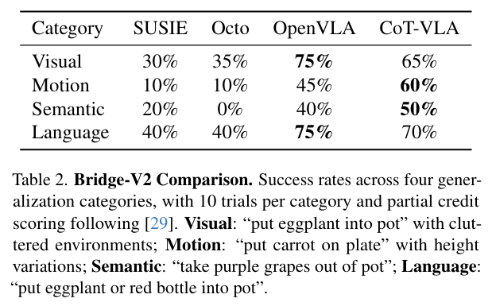

* Bridge-V2에서는 네 가지 generalization category를 평가한다.

```text
1. Visual generalization
   예: cluttered environment에서 “put eggplant into pot”

2. Motion generalization
   예: height variation이 있는 “put carrot on plate”

3. Semantic generalization
   예: “take purple grapes out of pot”

4. Language grounding
   예: “put eggplant or red bottle into pot”
```

* 정량 결과는 Table 2에 제시된다.

* 각 task는 10 trials로 평가된다.

* SUSIE는 diffusion prior를 사용하기 때문에 visually higher-quality goal image를 생성한다.

* 그러나 novel object가 포함되거나 complex language grounding이 필요한 task에서는 낮은 success rate를 보인다.

* CoT-VLA는 OpenVLA와 비교했을 때 visual generalization과 language generalization task에서 약간 낮은 success rate를 보인다.

* 논문은 이 차이가 visual reasoning error보다는 action chunking으로 인한 grasping failure 때문이라고 설명한다.

* 전체적으로 CoT-VLA는 네 가지 generalization category 전반에서 baseline과 comparable하거나 더 나은 성능을 보인다.

```text
Bridge-V2에서의 핵심 해석:

SUSIE
→ goal image quality는 높지만,
   novel object / complex grounding에서 낮은 성공률

OpenVLA
→ 일부 category에서 CoT-VLA보다 높음

CoT-VLA
→ action chunking으로 인한 grasping failure가 일부 존재
→ 그러나 전체적으로 competitive performance 달성
```

---

### c) Franka-Tabletop results

* Franka-Tabletop 결과는 Table 4와 Figure 5에 제시된다.

* 이 실험에서는 비교적 적은 수의 demonstration으로 각 model을 fine-tuning한다.

* Diffusion Policy는 single-instruction task에서는 높은 성능을 보인다.

* 예를 들어 “put corn in bowl”과 같은 단일 명령 task에서는 강한 성능을 보인다.

* 그러나 다양한 object와 복잡한 language instruction이 포함된 multi-instruction task에서는 성능이 감소한다.

* OpenX dataset으로 pretrained된 Octo, OpenVLA, CoT-VLA는 multi-instruction task에서 더 좋은 adaptation과 performance를 보인다.

* 이는 language grounding이 중요한 task에서 pretraining의 효과가 나타난다는 것을 의미한다.

* 전체 평균 기준으로 CoT-VLA는 baseline들보다 가장 높은 성능을 달성한다.

* 논문은 CoT-VLA가 single-instruction과 multi-instruction scenario 모두에서 개선을 보였다고 설명한다.

```text
Franka-Tabletop에서의 핵심 해석:

Diffusion Policy
→ single-instruction task에서는 강함
→ multi-instruction task에서는 성능 저하

Octo / OpenVLA / CoT-VLA
→ OpenX pretraining 덕분에 multi-instruction task에서 더 잘 적응

CoT-VLA
→ 전체 평균에서 가장 높은 성능
```

---

### d) Figure 5: task execution examples
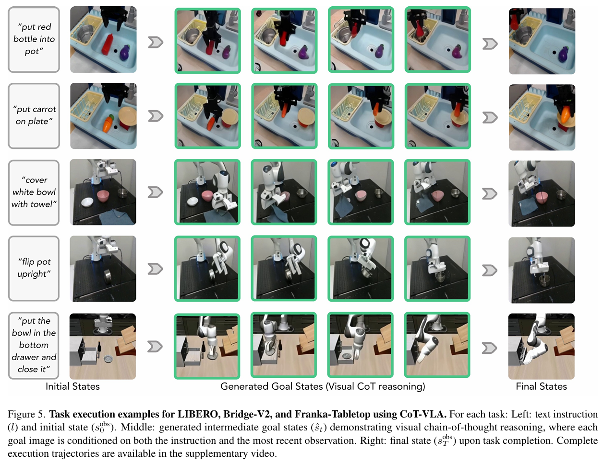

* Figure 5는 LIBERO, Bridge-V2, Franka-Tabletop에서 CoT-VLA의 task execution example을 보여준다.

* 각 task example은 세 부분으로 구성된다.

```text
Left:
text instruction l
+
initial state s_0^{obs}

Middle:
generated intermediate goal states \hat{s}_t

Right:
final state s_T^{obs}
```

* Middle의 generated intermediate goal states는 CoT-VLA의 visual chain-of-thought reasoning을 보여준다.

* 각 goal image는 instruction과 가장 최근 observation을 조건으로 생성된다.

* 즉 CoT-VLA는 test time에서 한 번의 goal image만 생성하는 것이 아니라, closed-loop 방식으로 observation이 갱신될 때마다 intermediate goal state를 생성할 수 있다.

---

## 4.1–4.2 Overall Meaning

* 4.1절은 CoT-VLA의 평가 환경을 설명한다.

```text
LIBERO
= simulation benchmark

Bridge-V2
= 45k real-robot demonstration 기반 real-robot benchmark

Franka-Tabletop
= pretraining에서 보지 않은 새로운 robot setup에 대한 adaptation 평가
```

* 4.2절은 세 setting에서의 정량·정성 결과를 설명한다.

* CoT-VLA는 LIBERO에서 best 또는 competitive performance를 보였다.

* Bridge-V2에서는 일부 category에서 OpenVLA보다 낮은 성능도 있었지만, 전체적으로 comparable하거나 더 나은 결과를 보였다.

* Franka-Tabletop에서는 적은 demonstration으로 fine-tuning한 상황에서도 가장 높은 평균 성능을 달성했다.

* 논문은 CoT-VLA의 성능 향상이 language-grounded subgoal generation과 visual chain-of-thought reasoning에서 비롯된다고 설명한다.

```text
핵심 정리:

CoT-VLA는 여러 simulation / real-robot setting에서 평가되었고,
visual subgoal을 먼저 생성한 뒤 action을 예측하는 구조가
instruction following, multi-instruction adaptation,
long-horizon manipulation에서 성능 향상에 기여함을 보인다.
```
---

## 4.3. Ablation Study

### a) Purpose of ablation study

* 이 subsection은 CoT-VLA의 성능 향상에 어떤 구성요소가 기여하는지 확인한다.

* 논문은 두 가지 방향의 ablation study를 수행한다.

```text id="y4crz5"
1. Visual CoT, hybrid attention, action chunking의 효과 분석

2. Pretraining stage의 효과 분석
```

---

## Visual CoT, Hybrid Attention, and Action Chunking

### b) Evaluation setting

* 논문은 LIBERO benchmark의 두 task suite에서 ablation study를 수행한다.

```text id="s87qqk"
1. LIBERO-Spatial
2. LIBERO-Goal
```

* 이 실험의 목적은 CoT-VLA의 세 가지 핵심 구성요소가 task performance에 어떤 영향을 주는지 확인하는 것이다.

```text id="o9e2be"
핵심 구성요소:

1. Action chunking
2. Hybrid attention
3. Visual chain-of-thought reasoning
```

---

### c) Compared model variants

* 논문은 네 가지 model variant를 비교한다.

```text id="dz4xxz"
1. VLA
2. + action chunking
3. + hybrid attention
4. + CoT (ours)
```

---

### d) Variant 1: VLA

* VLA는 standard VLA framework를 따르는 baseline이다.

* CoT-VLA와 같은 VILA-U backbone을 사용한다.

* 하지만 두 가지 요소가 없다.

```text id="st8vao"
없음:

1. chain-of-thought reasoning
2. action chunking
```

* 즉 현재 observation과 language instruction에서 action을 직접 예측하는 기본 VLA 구조이다.

```text id="vrsfzj"
VLA:

current image + instruction
        ↓
single action prediction
```

---

### e) Variant 2: + action chunking

* 이 variant는 vanilla VLA를 확장하여 action sequence를 예측하도록 만든다.

* 즉 단일 action이 아니라 길이 (m)의 action sequence를 예측한다.

```text id="l0u6fw"
single-action prediction:

a_t
```

```text id="8z6kmt"
action chunking:

a_t, a_{t+1}, ..., a_{t+m}
```

* 이 실험은 action chunking 자체가 성능에 기여하는지 확인하기 위한 것이다.

---

### f) Variant 3: + hybrid attention

* 이 variant는 action chunking에 full attention mechanism을 추가한다.

* action sequence prediction 과정에서 action token들이 서로 상호작용할 수 있게 한다.

```text id="tl29a3"
action tokens
        ↓
full attention
        ↓
action sequence prediction
```

* 이는 Figure 3에서 설명한 hybrid attention mechanism과 연결된다.

```text id="tkm901"
image/text generation
= causal attention

action generation
= full attention
```

---

### g) Variant 4: + CoT (ours)

* * CoT는 논문의 complete approach이다.

* 이 모델은 hybrid attention mechanism과 visual chain-of-thought reasoning을 모두 포함한다.

```text id="54wogg"
CoT-VLA:

current image + instruction
        ↓
subgoal image generation
        ↓
action sequence generation
```

---

### h) Results

* Figure 6의 결과에 따르면, 두 LIBERO benchmark suite 모두에서 action sequence prediction은 single-action prediction보다 consistently better performance를 보인다.

* 즉 action chunking을 추가하면 성능이 향상된다.

* 여기에 hybrid attention mechanism을 추가하면 성능이 더 향상된다.

* 최종적으로 visual chain-of-thought reasoning을 포함한 CoT-VLA가 가장 좋은 결과를 달성한다.

```text id="jj5eef"
성능 향상 흐름:

VLA
        ↓
+ action chunking
        ↓
+ hybrid attention
        ↓
+ CoT
```

---

### i) Meaning of ablation result

* 이 결과는 CoT-VLA의 성능 향상이 단일 요소 하나에서만 나온 것이 아님을 보여준다.

* Action chunking은 single-action prediction보다 안정적인 action sequence prediction을 가능하게 한다.

* Hybrid attention은 action token들이 서로 상호작용하도록 하여 action sequence prediction 성능을 개선한다.

* Visual CoT는 action을 생성하기 전에 subgoal image를 통해 desired future state를 reasoning하도록 만든다.

* 논문은 이 결과를 통해 visual chain-of-thought reasoning이 VLA task에 효과적임을 검증한다고 설명한다.

---

## Pretraining

### j) Purpose of pretraining ablation

* 논문은 CoT-VLA의 training pipeline이 두 단계로 구성된다고 설명한다.

```text id="jk3rkz"
1. Pretraining
   = OpenX dataset + action-less video data로 VILA-U pretraining

2. Task-specific post-training
   = robot demonstration data로 downstream task fine-tuning
```

* Pretraining ablation의 목적은 pretraining stage가 downstream task adaptation에 얼마나 중요한지 확인하는 것이다.

---

### k) Evaluation setting

* Pretraining ablation은 Franka-Tabletop setup에서 수행된다.

* 비교는 다음과 같은 방향으로 이루어진다.

```text id="s1cnyc"
1. base VILA-U model을 Franka-Tabletop demonstration에 바로 fine-tuning

2. OpenX + action-less video data로 pretraining한 CoT-VLA를
   Franka-Tabletop demonstration에 fine-tuning
```

---

### l) Results
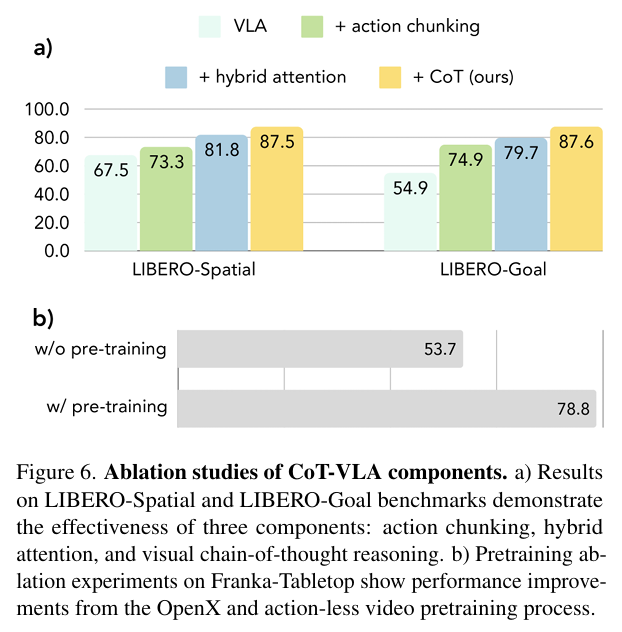
* Figure 6의 결과에 따르면, pretraining stage를 포함한 CoT-VLA는 base VILA-U를 직접 fine-tuning한 경우보다 더 높은 성능을 보인다.

* 수치상으로는 53.7%에서 78.8%로 향상된다.

```text id="ibdmrd"
Without pretraining:
53.7%

With pretraining:
78.8%
```

* 논문은 이를 46.7% relative improvement로 보고한다.

* 이 결과는 OpenX와 action-less video data를 사용한 pretraining이 downstream task adaptation을 개선함을 보여준다.

---

### m) Meaning of pretraining result

* Pretraining stage는 CoT-VLA가 target robot setup에서 적은 demonstration만으로도 더 잘 적응하는 데 도움을 준다.

* Robot demonstration data는 action generation 능력 학습에 기여한다.

* Action-less video data는 subgoal image generation과 visual reasoning 능력 학습에 기여한다.

* 따라서 pretraining은 downstream real-world task adaptation을 위한 기반 능력을 제공한다.

---

## 4.4. Better Visual Reasoning Helps

### a) Main question

* 이 subsection은 visual reasoning 능력이 좋아지면 robot action performance도 좋아지는지를 확인한다.

* CoT-VLA는 기존 VLA와 달리 robot demonstration data (D_r)뿐 아니라 action-less video data (D_v)도 활용한다.

* (D_v)는 action annotation이 없지만, intermediate visual chain-of-thought reasoning step을 통해 pretraining에 사용될 수 있다.

```text id="d23kfb"
Action-less video data D_v:

image sequence
+
caption / language description
+
action annotation 없음

사용 가능 영역:
subgoal image generation / visual reasoning 학습
```

---

### b) Motivation

* 논문은 captioned video만으로도 dynamics와 instruction following을 학습할 수 있다고 설명한다.

* 이러한 video data는 robot demonstration보다 훨씬 풍부하게 존재한다.

* 따라서 action-less video data를 통해 visual reasoning 능력을 강화하면 robot task performance에도 도움이 될 수 있는지 확인하려 한다.

---

### c) Evaluation setting

* 실험은 Franka-Tabletop setup에서 수행된다.

* 논문은 out-of-distribution generalization이 어려운 novel long-horizon task를 설계한다.

* 각 task는 training 중 보지 못한 두 개의 subtask를 결합한다.

```text id="xsch49"
Task 1:
move the green scallion to the apple-covered book

Task 2:
move the green cauliflower to the bear-covered book
```

* 이 task들은 모델의 out-of-distribution generalization을 평가하기 위한 difficult task이다.

---

### d) Generated goal image vs ground-truth goal image

* 각 task에 대해 논문은 하나의 demonstration trajectory를 수집한다.

* 이 demonstration trajectory에서 ground-truth goal image를 얻는다.

* 각 task는 5 trials로 평가된다.

* 비교 조건은 두 가지이다.

```text id="1r5155"
Condition 1:
CoT-VLA using generated goal images

Condition 2:
CoT-VLA using ground-truth goal images
```

* Generated goal image는 CoT-VLA가 직접 생성한 goal image이다.

* Ground-truth goal image는 수집된 demonstration에서 가져온 실제 정답 goal image이다.

---

### e) Results

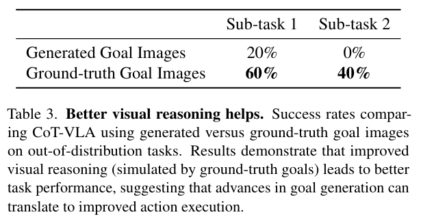
* Table 3의 결과는 다음과 같다.

```text id="miu6sm"
Sub-task 1:

Generated Goal Images
= 20%

Ground-truth Goal Images
= 60%
```

```text id="z27yda"
Sub-task 2:

Generated Goal Images
= 0%

Ground-truth Goal Images
= 40%
```

* 두 task 모두에서 ground-truth goal image를 사용하면 absolute success rate가 40% 향상된다.

```text id="izbgyh"
Sub-task 1:
60% - 20% = 40%

Sub-task 2:
40% - 0% = 40%
```

---

### f) Interpretation

* 이 결과는 goal image의 품질이 action execution performance에 직접적인 영향을 줄 수 있음을 보여준다.

* Generated goal image보다 ground-truth goal image를 사용했을 때 성능이 크게 좋아진다.

* 이는 action policy가 goal image를 잘 받으면 out-of-distribution task에서도 더 잘 수행할 수 있음을 의미한다.

* 따라서 현재 CoT-VLA의 실패 원인 중 일부는 action generation 자체보다 goal image generation, 즉 visual reasoning 품질의 한계에서 비롯될 수 있다.

---

### g) Relation to action-less video data

* Table 3은 action-less video data의 직접 효과를 비교한 표는 아니다.

* 이 표의 직접 결론은 “더 좋은 goal image를 주면 task success가 올라간다”는 것이다.

* 그러나 이 결과는 action-less video data 활용 가능성과 연결된다.

* CoT-VLA는 action-less video data를 통해 subgoal image generation을 학습할 수 있다.

* 따라서 visual reasoning과 goal image generation 능력이 향상되면, downstream robot action execution도 함께 좋아질 수 있음을 시사한다.

```text id="pu2xhu"
직접 결론:
좋은 goal image → 높은 task success

확장된 의미:
video data 등을 통해 goal image generation을 개선하면
robot task performance도 향상될 가능성이 있음
```

---

### h) Limitation noted in the paper

* 논문은 CoT-VLA가 여전히 out-of-distribution subgoal generation에서 어려움을 겪는다고 설명한다.

* 하지만 large-scale video and image generation model의 발전은 visual reasoning capability를 개선할 수 있는 promising direction으로 제시된다.

* 즉 향후 더 좋은 goal generation model이 개발되면, CoT-VLA와 같은 구조의 action execution 성능도 향상될 가능성이 있다.

---

## 4.3–4.4 Overall Meaning

* 4.3절은 CoT-VLA의 구성요소별 기여도를 확인한다.

```text id="u2g9jt"
Action chunking
→ single-action prediction보다 높은 성능

Hybrid attention
→ action token interaction을 통해 추가 성능 향상

Visual CoT
→ subgoal image generation을 통한 최종 성능 향상
```

* Pretraining ablation은 OpenX와 action-less video data를 활용한 pretraining이 downstream adaptation에 중요함을 보여준다.

* 4.4절은 visual reasoning과 goal image generation의 품질이 robot action performance에 영향을 준다는 점을 보여준다.

* Ground-truth goal image를 사용했을 때 out-of-distribution task success rate가 향상되었고, 이는 더 좋은 visual reasoning이 더 나은 action execution으로 이어질 수 있음을 시사한다.

```text id="jbrvws"
핵심 정리:

CoT-VLA의 성능은
action chunking, hybrid attention, visual CoT,
그리고 OpenX/action-less video pretraining의 조합에서 나온다.

또한 goal image generation이 좋아질수록
out-of-distribution robot task execution 성능도 향상될 가능성이 있다.
```
---
## V. Conclusion, Limitations and Future Work

### a) Summary of CoT-VLA

* 이 논문은 CoT-VLA를 제안한다.

* CoT-VLA는 Vision-Language-Action model, VLA에 chain-of-thought reasoning을 결합하려는 접근이다.

* 다만 기존 language CoT처럼 중간 reasoning을 문장으로 생성하는 것이 아니라, intermediate visual goal을 생성한다.

```text id="3w2pdq"
CoT-VLA:

current image + language instruction
        ↓
intermediate visual goal / subgoal image
        ↓
action sequence
```

* 즉 CoT-VLA는 action을 바로 예측하지 않고, 먼저 subgoal image를 explicit reasoning step으로 사용한다.

---

### b) Difference from previous intermediate representations

* 논문은 bounding box나 keypoint 같은 abstract representation 대신 subgoal image를 사용한다.

* Bounding box나 keypoint는 task에 필요한 일부 정보만 추상적으로 표현한다.

* 반면 subgoal image는 로봇이 도달해야 할 미래 상태를 image 형태로 직접 표현한다.

```text id="02x706"
기존 중간 표현:
bounding box
keypoint
language description

CoT-VLA의 중간 표현:
subgoal image
```

* 이 subgoal image는 video에서 sampling할 수 있기 때문에, robot demonstration뿐 아니라 action-less video data도 visual reasoning 학습에 활용할 수 있다.

---

### c) System basis: VILA-U

* CoT-VLA는 VILA-U를 기반으로 구축된다.

* VILA-U는 image, text, video token을 이해하고 생성할 수 있는 unified multimodal model이다.

* CoT-VLA는 이 능력을 활용해 현재 observation과 instruction으로부터 future subgoal image를 생성한다.

* 이후 생성된 subgoal image를 조건으로 robot action sequence를 예측한다.

```text id="bpfgnr"
VILA-U의 역할:

image/text/video token understanding
+
image generation
+
CoT-VLA의 visual goal generation 기반
```

---

### d) Main empirical claim

* 논문은 CoT-VLA가 다양한 robotic manipulation task에서 strong performance를 보인다고 설명한다.

* 평가 환경은 simulation과 real-world robot setup을 모두 포함한다.

```text id="ozjbu8"
Evaluation settings:

LIBERO simulation benchmark
Bridge-V2 real robot
Franka-Tabletop real robot
```

* CoT-VLA는 여러 benchmark와 task에서 baseline 대비 best 또는 competitive performance를 달성한다.

---

## Limitations

### e) Limitation 1: inference overhead

* 첫 번째 한계는 inference 과정에서 computational overhead가 크다는 점이다.

* CoT-VLA는 direct action generation 방식과 달리, action token을 생성하기 전에 intermediate image token을 생성해야 한다.

* 논문은 CoT-VLA가 action token 전에 256개의 image token을 생성해야 한다고 설명한다.

* 이로 인해 action chunk size 10 기준 평균적으로 7× slowdown이 발생한다.

```text id="c8pzuy"
Direct action generation:
observation → action

CoT-VLA:
observation → image tokens → action tokens
```

* Action chunking과 parallel decoding은 inference speed를 개선하지만, image generation이 여전히 주요 bottleneck이다.

* 논문은 fast image generation이나 fast LLM inference 기술이 throughput 개선에 도움이 될 수 있다고 제안한다.

---

### f) Limitation 2: autoregressive image generation quality

* 두 번째 한계는 CoT-VLA의 autoregressive image generation 품질이다.

* 논문은 autoregressive image generation이 state-of-the-art diffusion-based model보다 낮은 visual quality를 보인다고 설명한다.

```text id="j6nxv3"
CoT-VLA:
autoregressive image generation

Diffusion-based image generation:
더 높은 visual quality 가능
```

* 따라서 더 발전된 unified multimodal model이나 image generation model을 활용하면 subgoal image quality를 개선할 수 있다.

---

### g) Limitation 3: action chunking의 불연속성

* 세 번째 한계는 action chunking에서 발생할 수 있는 discontinuous action 문제이다.

* CoT-VLA는 한 번에 action chunk를 예측하고 실행한다.

* 하지만 chunk와 chunk 사이에서 action이 불연속적으로 이어질 수 있다.

```text id="drn3jl"
chunk 1:
a_t, ..., a_{t+m}

chunk 2:
a_{t+m+1}, ..., a_{t+2m}
```

* 두 chunk 사이의 연결이 부드럽지 않으면 robot motion이 불안정해질 수 있다.

* 또한 chunk 실행 중에는 high-frequency feedback을 충분히 반영하기 어렵다.

* 논문은 temporal smoothing technique이나 per-step prediction approach가 이러한 문제를 완화할 수 있다고 설명한다.

---

### h) Limitation 4: visual-reasoning generalization for entirely new tasks

* 네 번째 한계는 entirely new task에 대한 visual reasoning generalization이다.

* CoT-VLA는 action-less video data를 pretraining에 활용하지만, 현재 computational constraints 때문에 완전히 새로운 task에 대한 visual reasoning generalization은 제한적이다.

* 즉 action-less video data를 사용한다고 해서 모든 unseen task에서 안정적으로 subgoal image를 생성할 수 있는 것은 아니다.

```text id="5kt6fh"
현재 한계:

action-less video data 활용 가능
하지만 entirely new task에 대한 subgoal generation은 여전히 어려움
```

* 이는 4.4절의 out-of-distribution task 실험과 연결된다.

* Ground-truth goal image를 사용하면 성능이 올라갔지만, generated goal image를 사용할 때는 여전히 낮은 성공률을 보였다.

---

## Future Work

### i) Future direction 1: faster image generation and inference

* CoT-VLA의 큰 병목은 subgoal image token generation이다.

* 따라서 향후 연구에서는 fast image generation 또는 fast LLM inference 기술을 통합하여 inference overhead를 줄이는 방향이 가능하다.

```text id="ml0evz"
목표:

subgoal image generation 속도 개선
        ↓
test-time robot control latency 감소
```

---

### j) Future direction 2: better unified multimodal models

* 더 발전된 unified multimodal model은 CoT-VLA의 image generation quality를 개선할 수 있다.

* 특히 subgoal image의 품질이 좋아지면, action execution 성능도 향상될 가능성이 있다.

```text id="twga3g"
better image/video generation model
        ↓
better subgoal image
        ↓
better action execution
```

---

### k) Future direction 3: smoother action execution

* Action chunking은 inference efficiency를 높이는 장점이 있지만, chunk 사이의 discontinuity 문제가 있다.

* 향후 연구에서는 temporal smoothing이나 per-step feedback을 활용하여 action execution을 더 부드럽게 만들 수 있다.

```text id="1gec3s"
현재:
chunk 단위 action execution

개선 방향:
temporal smoothing
per-step prediction
high-frequency feedback
```

---

### l) Future direction 4: video/image generation and world models

* 논문은 video/image generation과 world model의 발전이 CoT-VLA의 generalization을 개선할 수 있다고 본다.

* World model은 현재 상태와 행동 또는 조건을 바탕으로 미래 상태를 예측하는 모델이다.

* CoT-VLA의 subgoal image generation은 미래 상태 예측과 연결되므로, world model 발전과 자연스럽게 관련된다.

```text id="48ckmj"
video/image generation 발전
+
world model 발전
        ↓
better visual reasoning
+
better predictive modeling
        ↓
improved generalization
```

---

## V. Overall Meaning

* Conclusion의 핵심은 CoT-VLA가 VLA에 visual chain-of-thought reasoning을 결합한 모델이라는 점이다.

* CoT-VLA는 bounding box나 keypoint 같은 추상적 중간 표현 대신, video에서 얻을 수 있는 subgoal image를 intermediate reasoning step으로 사용한다.

* 이를 통해 action-less video data를 visual reasoning 학습에 활용할 수 있다.

* 하지만 이 구조는 image token generation으로 인해 inference overhead가 크고, autoregressive image generation의 visual quality가 diffusion-based model보다 낮다는 한계를 가진다.

* 또한 action chunking은 빠른 action generation에 도움을 주지만, chunk 사이의 action discontinuity와 high-frequency feedback 부족 문제를 만들 수 있다.

* 마지막으로, action-less video data를 사용하더라도 entirely new task에 대한 visual reasoning generalization은 아직 제한적이다.

```text id="8w8y7a"
핵심 정리:

CoT-VLA는 action 전에 subgoal image를 생성하는 visual CoT 기반 VLA이다.

장점:
- action-less video data 활용 가능
- visual reasoning step을 통한 action prediction 개선
- simulation과 real-world task에서 strong performance

한계:
- image token generation으로 inference 느림
- autoregressive image generation 품질 한계
- action chunk 사이의 불연속성
- 완전히 새로운 task에 대한 visual reasoning generalization 한계

향후 방향:
- faster image generation
- better unified multimodal models
- smoother action execution
- video/world model 기반 visual reasoning 개선
```

---

<details>
<summary><b>Thoughts After Reading This Paper</b></summary>

## Thoughts After Reading This Paper

### 1. 이 논문은 생각이 나질 않는다

**논문 한계**  


**내가 떠올린 확장 질문**  


**생각해볼 수 있는 문제**  


**가능한 방향**  


</details>

<details>
<summary><b>Summary</b></summary>

## CoT-VLA

### One-line Summary

* CoT-VLA는 기존 VLA가 현재 image와 language instruction에서 바로 action을 예측하는 한계를 보완하기 위해, action 생성 전에 future subgoal image를 먼저 생성하는 visual chain-of-thought reasoning을 도입한 VLA model이다.

---

### Structure

* CoT-VLA의 핵심 구조는 **subgoal image generation + action sequence generation**의 two-stage 구조이다.

* 기존 vanilla VLA는 current observation과 language instruction을 입력받아 robot action을 직접 예측한다.

```text
Vanilla VLA:
current image + language instruction
        ↓
robot action
```

* 반면 CoT-VLA는 먼저 future image frame을 subgoal image로 생성한다.

* 이후 current observation, language instruction, generated subgoal image를 조건으로 action sequence를 생성한다.

```text
CoT-VLA:
current image + language instruction
        ↓
subgoal image generation
        ↓
action sequence generation
```

* 이 subgoal image는 모델이 행동하기 전에 “어떤 미래 상태를 만들어야 하는가”를 image 형태로 reasoning한 intermediate visual goal이다.

* 따라서 CoT-VLA는 language CoT를 그대로 로봇에 적용한 것이 아니라, robot manipulation에 맞게 **visual CoT**를 subgoal image 형태로 구현한 모델이다.

---

### Visual Chain-of-Thought Reasoning

* CoT-VLA는 action을 바로 생성하지 않고, 먼저 미래 목표 상태에 해당하는 subgoal image를 생성한다.

<pre>
현재 observation + language instruction
                ↓
        generated subgoal image
</pre>

* generated subgoal image는 모델이 예측한 미래 목표 상태 이미지이다.

* 이후 CoT-VLA는 현재 observation, language instruction, generated subgoal image를 함께 사용하여 action sequence를 생성한다.

<pre>
현재 observation
+ language instruction
+ generated subgoal image
                ↓
      predicted action sequence
</pre>

* 전체 흐름은 다음과 같다.

<pre>
현재 observation + language instruction
                ↓
        generated subgoal image
                ↓
현재 observation + language instruction + generated subgoal image
                ↓
      predicted action sequence
</pre>

* 이 구조는 모델이 action을 바로 예측하는 대신, 먼저 desired future state를 visual하게 예측하고 그 상태를 달성하기 위한 action을 생성하도록 만든다.

* 논문은 이를 “think visually before acting”으로 설명한다.

---

### Data Usage

* CoT-VLA는 두 종류의 training data를 사용한다.

```text
D_r = robot demonstrations
D_v = action-less videos
```

* Robot demonstration dataset (D_r)은 language instruction, image sequence, robot action sequence를 포함한다.

```text
D_r = {(l, a_{1...T}, s_{1...T})}
```

* Action-less video dataset (D_v)은 language description과 image sequence는 포함하지만 robot action annotation은 없다.

```text
D_v = {(l, s_{1...T})}
```

* Subgoal image generation은 action annotation 없이도 학습할 수 있다.

* 따라서 (D_r)뿐 아니라 (D_v)도 visual reasoning 학습에 사용할 수 있다.

* 반면 action generation은 정답 robot action sequence가 필요하기 때문에 (D_r)에서만 학습된다.

```text
Visual reasoning:
(l, s_t) → s_{t+n}
robot demonstrations + action-less videos 사용 가능

Action generation:
(l, s_t, s_{t+n}) → a_t, ..., a_{t+m}
robot demonstrations만 사용 가능
```

* 이 점이 CoT-VLA의 중요한 의미이다. 기존 VLA가 action-annotated robot data에 크게 의존했다면, CoT-VLA는 action-less video data를 visual reasoning 학습에 활용할 수 있다.

---

### Model Architecture

* CoT-VLA는 VILA-U를 base model로 사용한다.

* VILA-U는 image, text, video token을 모두 이해하고 생성할 수 있는 unified multimodal foundation model이다.

* VILA-U는 image, text, video를 unified token space에서 다루는 multimodal model이며, CoT-VLA는 이 구조를 활용해 future subgoal image를 생성한다.


* CoT-VLA가 subgoal image를 생성하려면 image를 이해하는 능력뿐 아니라 image token을 생성하는 능력이 필요하기 때문에 VILA-U를 사용한다.

```text
current image + instruction
        ↓
VILA-U 기반 visual token generation
        ↓
future subgoal image
```

* VILA-U는 visual input을 discrete visual token으로 encoding한다.

* 논문에서 사용하는 VILA-U는 256 × 256 image를 (16 × 16 × 4) token으로 표현한다.

```text
16 × 16
= visual position 수

4
= residual depth

16 × 16 × 4
= image 하나당 1024 visual tokens
```

* Residual token은 한 번의 token 표현으로 설명하지 못한 남은 시각 정보를 보정하기 위한 token이다.

* Depth transformer는 각 visual position에서 residual token들을 점진적으로 예측하는 역할을 한다.

---

### Training

* CoT-VLA는 7B VILA-U model을 robot demonstrations와 action-less videos로 pretrain한다.

<pre>
image observation
        ↓
vision tower
        ↓
visual feature
        ↓
projector
        ↓
LLM backbone
        ↓
text token / image token / action token 생성
</pre>

* 학습 중 optimize하는 구성요소는 LLM backbone, projector, depth transformer이다.

* Vision tower는 frozen 상태로 유지한다.

```text
Optimize:
LLM backbone
projector
depth transformer

Freeze:
vision tower
```

* Training objective는 두 가지이다.

```text
1. Visual token prediction
   = subgoal image generation 학습

2. Action token prediction
   = action sequence generation 학습
```

* Visual token prediction에서는 language instruction과 current image를 보고 future image (s_{t+n})를 생성하도록 학습한다.

```text
(l, s_t) → s_{t+n}
```

* Action token prediction에서는 language instruction, current image, subgoal image를 보고 action sequence를 생성하도록 학습한다.

```text
(l, s_t, s_{t+n}) → a_t, ..., a_{t+m}
```

* 전체 loss는 visual loss와 action loss를 더한 것이다.

```text
L = L_action + L_visual
```

* 즉 CoT-VLA는 subgoal image를 잘 생성하는 능력과, 그 subgoal을 달성하는 action sequence를 생성하는 능력을 동시에 학습한다.

---

### Action Generation

* CoT-VLA의 action 생성은 TinyVLA처럼 continuous action을 diffusion policy로 직접 생성하는 방식이 아니다.

* CoT-VLA는 OpenVLA처럼 continuous robot action을 discrete action token으로 변환한 뒤 token prediction 방식으로 생성한다.

* 각 action (a_i)는 7개의 token으로 표현된다.

```text
a_i = 7 action tokens
```

* 각 action dimension은 256개의 discrete bin으로 나뉜다.

* 즉 continuous action 값을 256개 구간 중 하나로 discretize하고, 해당 bin을 action token으로 사용한다.

```text
continuous action value
        ↓
256 discrete bins
        ↓
action token
```

* 논문은 text tokenizer vocabulary에서 가장 적게 사용되는 256개 token을 action bin token으로 재사용한다.

* CoT-VLA는 action sequence를 예측하며, action chunk size는 10으로 설정된다.

---

### Hybrid Attention

* CoT-VLA는 image/text generation과 action generation에 서로 다른 attention 방식을 사용한다.

```text
Image/Text generation:
causal attention

Action generation:
full attention
```

* Causal attention은 앞 token만 보고 다음 token을 순차적으로 생성하는 방식이다.

* 따라서 text generation이나 image token generation처럼 autoregressive generation이 필요한 경우에 사용된다.

* Full attention은 token들이 서로 모두 참고할 수 있는 방식이다.

* Action token들은 position, rotation, gripper 등 서로 맞아야 하는 control dimension이므로, full attention을 통해 action token들이 서로 상호작용하도록 한다.

* 이처럼 CoT-VLA는 causal attention과 full attention을 함께 사용하기 때문에 hybrid attention mechanism이라고 부른다.

---

### Pretraining and Downstream Adaptation

* Pretraining에서는 robot demonstrations와 action-less videos를 함께 사용한다.

* Robot demonstration data로는 Open X-Embodiment dataset, OpenX의 subset을 사용한다.

* 논문은 OpenVLA의 preprocessing pipeline을 따라 third-person camera view와 single-arm end-effector control, 7-DoF action을 가진 dataset을 선택한다.

* Action-less video data로는 EPIC-KITCHENS와 Something-Something V2를 사용한다.

```text
Robot demonstrations:
OpenX subset

Action-less videos:
EPIC-KITCHENS
Something-Something V2
```

* Pretraining 이후에는 downstream task에 맞게 target robot setup에서 수집한 task-specific robot demonstrations로 fine-tuning한다.

* Test time에서는 closed-loop control 방식으로 동작한다.

```text
현재 observation + instruction
        ↓
subgoal image 생성
        ↓
action chunk 생성
        ↓
action 실행
        ↓
새로운 observation
        ↓
반복
```

* 즉 CoT-VLA는 전체 task를 한 번에 open-loop로 실행하지 않고, action chunk를 실행한 뒤 다시 관측하고 다시 subgoal과 action을 생성한다.

---

### Experimental Setup

* CoT-VLA는 simulation benchmark와 real-world robot manipulation task에서 평가된다.

* 평가 setting은 세 가지이다.

```text
1. LIBERO simulation benchmark
2. Bridge-V2 real-robot platform
3. Franka-Tabletop real-robot setup
```

* LIBERO는 네 가지 task suite를 포함한다.

```text
LIBERO-Spatial
LIBERO-Object
LIBERO-Goal
LIBERO-Long
```

* Bridge-V2는 6-DoF WidowX robot arm을 사용하며, 45k language-annotated trajectories를 포함한다.

* Franka-Tabletop은 stationary table-mounted Franka Emika Panda 7-DoF robot arm setup이다.

* Franka-Tabletop은 pretraining stage에서 보지 않은 새로운 robot setup이므로, downstream adaptation 능력을 평가하기 위한 setting이다.

* Baseline으로는 Diffusion Policy, OpenVLA, Octo, SUSIE를 사용한다.

---

### Experimental Results

* LIBERO에서는 CoT-VLA가 baseline 대비 best 또는 competitive performance를 달성했다.

* 특히 LIBERO-Long에서 CoT-VLA는 69.0% success rate를 보이며 OpenVLA의 53.7%보다 높은 성능을 보였다.

* 논문은 baseline method들이 일부 경우 visual cue에 과적합하여 language instruction을 무시하는 경우가 있다고 분석한다.

* CoT-VLA는 language-grounded subgoal image를 먼저 생성하기 때문에 instruction following ability가 개선된다고 설명한다.

* Bridge-V2에서는 visual, motion, semantic, language grounding의 네 가지 generalization category를 평가했다.

* CoT-VLA는 OpenVLA보다 visual과 language category에서 약간 낮은 성능을 보였는데, 논문은 이를 visual reasoning error보다는 action chunking으로 인한 grasping failure 때문이라고 설명한다.

* 전체적으로 CoT-VLA는 Bridge-V2에서 baseline과 comparable하거나 더 나은 성능을 보였다.

* Franka-Tabletop에서는 적은 수의 demonstrations만으로 fine-tuning한 상황에서 CoT-VLA가 가장 높은 average performance를 달성했다.

* Diffusion Policy는 single-instruction task에서는 강했지만, diverse object와 complex language instruction이 포함된 multi-instruction task에서는 성능이 떨어졌다.

* Octo, OpenVLA, CoT-VLA처럼 OpenX로 pretraining된 모델들은 language grounding이 중요한 multi-instruction task에서 더 좋은 adaptation을 보였다.

---

### Ablation Study

* Ablation study에서는 CoT-VLA의 성능 향상에 기여하는 요소를 분리해서 분석했다.

* 비교한 구성은 네 가지이다.

```text
1. VLA
   = 같은 VILA-U backbone을 사용하지만 CoT reasoning과 action chunking이 없는 기본 baseline

2. VLA + action chunking
   = 기본 VLA에 action chunking을 추가하여 single action이 아니라 action sequence를 예측

3. VLA + action chunking + hybrid attention
   = action sequence prediction에 full attention mechanism을 추가

4. VLA + action chunking + hybrid attention + visual CoT
   = visual chain-of-thought reasoning까지 포함한 최종 CoT-VLA
```

* LIBERO-Spatial과 LIBERO-Goal에서 action sequence prediction은 single-action prediction보다 consistently better performance를 보였다.

* Hybrid attention을 추가하면 성능이 더 향상되었다.

* 최종적으로 visual CoT를 포함한 CoT-VLA가 가장 좋은 결과를 보였다.

* Pretraining ablation에서는 OpenX와 action-less video data를 사용한 pretraining이 downstream adaptation에 중요함을 보였다.

* Franka-Tabletop에서 base VILA-U를 바로 fine-tuning한 경우 53.7%였고, CoT-VLA pretraining을 거친 경우 78.8%를 기록했다.

* 이는 46.7% relative improvement에 해당한다.

---

### Better Visual Reasoning Helps

* 논문은 visual reasoning이 좋아지면 action execution 성능도 향상될 수 있는지 확인한다.

* 이를 위해 Franka-Tabletop에서 out-of-distribution long-horizon task를 설계했다.

```text
Task 1:
move the green scallion to the apple-covered book

Task 2:
move the green cauliflower to the bear-covered book
```

* 각 task에 대해 generated goal image를 사용한 경우와 ground-truth goal image를 사용한 경우를 비교했다.

* Generated goal image는 CoT-VLA가 직접 생성한 goal image이다.

* Ground-truth goal image는 demonstration trajectory에서 가져온 정답 goal image이다.

```text
Sub-task 1:
Generated Goal Images = 20%
Ground-truth Goal Images = 60%

Sub-task 2:
Generated Goal Images = 0%
Ground-truth Goal Images = 40%
```

* Ground-truth goal image를 사용하면 두 task 모두에서 absolute success rate가 40% 향상되었다.

* 이는 action policy가 좋은 goal image를 받으면 out-of-distribution task에서도 더 잘 수행할 수 있음을 보여준다.

* 따라서 CoT-VLA의 실패 원인 중 일부는 action generation 자체보다 goal image generation, 즉 visual reasoning의 품질에서 비롯될 수 있다.

* 이 결과는 action-less video data 등을 활용해 visual reasoning과 goal image generation을 개선하면, downstream robot action execution도 향상될 가능성이 있음을 시사한다.

---

### Limitations

* CoT-VLA의 첫 번째 한계는 inference overhead이다.

* CoT-VLA는 action token을 생성하기 전에 intermediate image token을 생성해야 한다.

* 논문은 action token 전에 256개의 image token을 생성해야 하며, action chunk size 10 기준 평균 7× slowdown이 발생한다고 설명한다.

* 두 번째 한계는 autoregressive image generation의 visual quality이다.

* CoT-VLA의 autoregressive image generation은 state-of-the-art diffusion-based image generation model보다 visual quality가 낮다.

* 세 번째 한계는 action chunking의 discontinuity이다.

* Action chunk를 한 번에 예측하고 실행하기 때문에 chunk 사이의 action이 불연속적으로 이어질 수 있고, execution 중 high-frequency feedback을 충분히 반영하기 어렵다.

* 네 번째 한계는 entirely new task에 대한 visual reasoning generalization이다.

* CoT-VLA는 action-less video data를 활용하지만, 완전히 새로운 task에 대한 subgoal generation은 여전히 어렵다.

---

### Key Takeaways

* CoT-VLA는 기존 VLA의 direct action prediction 구조에 visual reasoning step을 추가한 모델이다.

* 핵심은 current image와 language instruction에서 바로 action을 예측하지 않고, 먼저 future subgoal image를 생성한 뒤 action sequence를 생성하는 것이다.

* Subgoal image generation은 action annotation 없이도 학습할 수 있기 때문에, CoT-VLA는 action-less video data를 visual reasoning 학습에 활용할 수 있다.

* Base model로는 image, text, video token을 이해하고 생성할 수 있는 VILA-U를 사용한다.

* Action generation은 OpenVLA처럼 continuous action을 discrete action token으로 변환하여 예측하는 방식이다.

* Image/text generation에는 causal attention을 사용하고, action generation에는 full attention을 사용한다.

* 실험 결과 CoT-VLA는 LIBERO, Bridge-V2, Franka-Tabletop에서 baseline 대비 best 또는 competitive performance를 보였다.

* Ablation study는 action chunking, hybrid attention, visual CoT, pretraining이 모두 성능 향상에 기여함을 보여준다.

* Ground-truth goal image를 사용했을 때 out-of-distribution task 성공률이 크게 상승한 것은 goal image generation의 품질이 action execution 성능에 중요하다는 점을 보여준다.

* 다만 CoT-VLA는 image token generation으로 인해 inference가 느리고, autoregressive image generation의 품질 한계와 action chunking의 불연속성 문제를 가진다.

* 따라서 CoT-VLA의 핵심 의미는 VLA가 행동을 생성하기 전에 visual subgoal을 먼저 생성하게 하여, action 없는 video data까지 활용 가능한 visual reasoning 기반 VLA 구조를 제안했다는 점에 있다.

</details>


</details>


